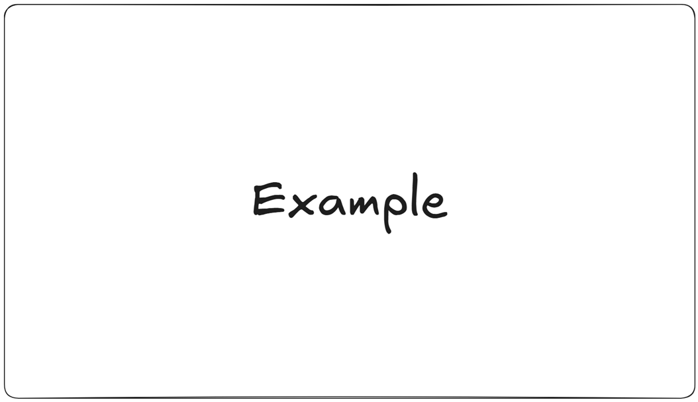

<h1 align="center"> Apache Camel </h1>

1. [Chapter 1: Introduction to Enterprise Integration and Apache Camel with Spring Boot](#chapter1)
    - [Chapter 1 - Part 1: Understanding Enterprise Integration Patterns (EIPs)](#chapter1part1)
      - [Chapter 1 - Part 1.1: What is Enterprise Integration?](#chapter1part1.1)
      - [Chapter 1 - Part 1.2: The Genesis of Enterprise Integration Patterns (EIPs)](#chapter1part1.2)
      - [Chapter 1 - Part 1.3: Core Concepts and Benefits of EIPs](#chapter1part1.3)
      - [Chapter 1 - Part 1.4: Categories of Enterprise Integration Problems Solved by EIPs](#chapter1part1.4)
    - [Chapter 1 - Part 2: What is Apache Camel and its Role in Integration](#chapter1part2)
      - [Chapter 1 - Part 2.1: What is Apache Camel?](#chapter1part2.1)
      - [Chapter 1 - Part 2.2: The Core Role of Apache Camel in Integration](#chapter1part2.2)
      - [Chapter 1 - Part 2.3: Fundamental Concepts of Apache Camel](#chapter1part2.3)
      - [Chapter 1 - Part 2.4: Practical Application Scenarios](#chapter1part2.4)
    - [Chapter 1 - Part 3: Introduction to Spring Boot for Microservices and Integration](#chapter1part3)
      - [Chapter 1 - Part 3.1: Understanding the Microservices Architecture](#chapter1part3.1)
      - [Chapter 1 - Part 3.2: Why Spring Boot for Microservices?](#chapter1part3.2)
      - [Chapter 1 - Part 3.3: Spring Boot and Integration](#chapter1part3.3)
      - [Chapter 1 - Part 3.4: Core Concepts of a Spring Boot Application](#chapter1part3.4)
      - [Chapter 1 - Part 3.5: Practical Examples and Demonstrations](#chapter1part3.5)
    - [Chapter 1 - Part 4: Setting Up Your Development Environment for Camel Spring Boot](#chapter1part4)
      - [Chapter 1 - Part 4.1: Essential Development Tools Overview](#chapter1part4.1)
      - [Chapter 1 - Part 4.2: Java Development Kit (JDK) Installation and Configuration](#chapter1part4.2)
      - [Chapter 1 - Part 4.3: Build Automation Tool Setup: Apache Maven](#chapter1part4.3)
      - [Chapter 1 - Part 4.4: Integrated Development Environment (IDE) Selection and Setup](#chapter1part4.4)
      - [Chapter 1 - Part 4.5: Version Control System: Git](#chapter1part4.5)
      - [Chapter 1 - Part 4.6: Practical Demonstrations and Verification](#chapter1part4.6)
    - [Chapter 1 - Part 5: Your First Camel Spring Boot Application: A "Hello World" Route](#chapter1part5)
      - [Chapter 1 - Part 5.1: Setting Up the Project](#chapter1part5.1)
      - [Chapter 1 - Part 5.2: Crafting Your First Camel Route](#chapter1part5.2)
      - [Chapter 1 - Part 5.3: Running Your Camel Spring Boot Application](#chapter1part5.3)
    - [Chapter 1 - Part 6: Introducing the "E-commerce Order Processing" Case Study](#chapter1part6)
      - [Chapter 1 - Part 6.1: The Importance of a Practical Case Study](#chapter1part6.1)
      - [Chapter 1 - Part 6.2: Introducing the E-commerce Order Processing Case Study](#chapter1part6.2)
      - [Chapter 1 - Part 6.3: Practical Examples: Illustrating the Order Flow](#chapter1part6.3)
2. [Chapter 2: Apache Camel Core Concepts and Route Building](#chapter2)
    - [Chapter 2 - Part 1: Defining Routes: Java DSL vs. XML Configuration](#chapter2part1)
      - [Chapter 2 - Part 1.1: Java DSL for Route Definition](#chapter2part1.1)
      - [Chapter 2 - Part 1.2: XML Configuration for Route Definition](#chapter2part1.2)
      - [Chapter 2 - Part 1.3: Key Differences and Considerations](#chapter2part1.3)
      - [Chapter 2 - Part 1.4: Practical Examples and Demonstrations](#chapter2part1.4)
    - [Chapter 2 - Part 2: Understanding Endpoints, Producers, and Consumers](#chapter2part2)
      - [Chapter 2 - Part 2.1: Understanding the Core Abstractions: Endpoints, Producers, and Consumers](#chapter2part2.1)
      - [Chapter 2 - Part 2.2: The Interplay in a Camel Route](#chapter2part2.2)
      - [Chapter 2 - Part 2.3: Practical Examples and Demonstrations](#chapter2part2.3)
    - [Chapter 2 - Part 3: Working with Exchanges, Messages, and Headers](#chapter2part3)
      - [Chapter 2 - Part 3.1: The Apache Camel Exchange: The Heart of Integration](#chapter2part3.1)
      - [Chapter 2 - Part 3.2: Messages: The Data Carriers](#chapter2part3.2)
      - [Chapter 2 - Part 3.3: Headers: Message Metadata](#chapter2part3.3)
      - [Chapter 2 - Part 3.4: Practical Examples: Exchanges, Messages, and Headers in Action](#chapter2part3.4)
    - [Chapter 2 - Part 4: Building Basic Routing Logic: `from()`, `to()`, `log()`](#chapter2part4)
      - [Chapter 2 - Part 4.1: The from() Endpoint: Initiating a Route](#chapter2part4.1)
      - [Chapter 2 - Part 4.2: The to() Endpoint: Directing Messages](#chapter2part4.2)
      - [Chapter 2 - Part 4.3: The log() Processor: Observability and Debugging](#chapter2part4.3)
      - [Chapter 2 - Part 4.4: Practical Examples and Demonstrations](#chapter2part4.4)
    - [Chapter 2 - Part 5: Using Processors for Custom Logic and Message Transformation](#chapter2part5)
      - [Chapter 2 - Part 5.1: Understanding the Camel Processor](#chapter2part5.1)
      - [Chapter 2 - Part 5.2: Implementing Custom Logic with Processors](#chapter2part5.2)
      - [Chapter 2 - Part 5.3: Message Transformation with Processors](#chapter2part5.3)
      - [Chapter 2 - Part 5.4: Practical Examples and Demonstrations: E-commerce Order Processing Case Study](#chapter2part5.4)
    - [Chapter 2 - Part 6: Implementing Basic Order Ingestion for the Case Study](#chapter2part6)
      - [Chapter 2 - Part 6.1: Defining the Order Data Model](#chapter2part6.1)
      - [Chapter 2 - Part 6.2: Implementing Basic Order Ingestion with a Timer](#chapter2part6.2)
      - [Chapter 2 - Part 6.3: Practical Example: Running the Basic Order Ingestion](#chapter2part6.3)
3. [Chapter 3: Essential Camel Components and EIPs in Practice](#chapter3)
   - [Chapter 3 - Part 1: Integrating with File Systems: `file` component for order imports](#chapter3part1)
      - [Chapter 3 - Part 1.1: The file Component: Core Concepts and Configuration](#chapter3part1.1)
      - [Chapter 3 - Part 1.2: Practical Order Import Examples with file Component](#chapter3part1.2)
   - [Chapter 3 - Part 2: Messaging with JMS/ActiveMQ: `jms` component for asynchronous processing](#chapter3part2)
      - [Chapter 3 - Part 2.1: Understanding Asynchronous Messaging with JMS and ActiveMQ](#chapter3part2.1)
      - [Chapter 3 - Part 2.2: Integrating with JMS/ActiveMQ using Camel's jms Component](#chapter3part2.2)
      - [Chapter 3 - Part 2.3: Case Study: E-commerce Order Processing with Asynchronous Messaging](#chapter3part2.3)
   - [Chapter 3 - Part 3: Consuming and Producing REST APIs: `http` and `rest` components for external services](#chapter3part3)
      - [Chapter 3 - Part 3.1: Understanding HTTP Communication in Apache Camel](#chapter3part3.1)
      - [Chapter 3 - Part 3.2: Practical Examples and Demonstrations](#chapter3part3.2)
   - [Chapter 3 - Part 4: Database Integration with `jdbc` component for order persistence](#chapter3part4)
      - [Chapter 3 - Part 4.1: Understanding the jdbc Component](#chapter3part4.1)
      - [Chapter 3 - Part 4.2: Interacting with Databases via Camel jdbc](#chapter3part4.2)
      - [Chapter 3 - Part 4.3: Practical Examples and Demonstrations](#chapter3part4.3)
   - [Chapter 3 - Part 5: Content-Based Router (CBR) for conditional order processing](#chapter3part5)
      - [Chapter 3 - Part 5.1: Understanding the Content-Based Router EIP](#chapter3part5.1)
      - [Chapter 3 - Part 5.2: Practical Examples and Demonstrations](#chapter3part5.2)
   - [Chapter 3 - Part 6: Recipient List for fanning out order notifications](#chapter3part6)
      - [Chapter 3 - Part 6.1: Understanding the Recipient List EIP](#chapter3part6.1)
      - [Chapter 3 - Part 6.2: Implementing Recipient List in Apache Camel](#chapter3part6.2)
      - [Chapter 3 - Part 6.3: Case Study: Fanning Out Order Notifications](#chapter3part6.3)
4. [Chapter 4: Advanced Camel EIPs, Error Handling, and Testing Strategies](#chapter4)
   - [Chapter 4 - Part 1: Aggregator and Splitter Patterns for batch order processing](#chapter4part1)
      - [Chapter 4 - Part 1.1: The Splitter Pattern: Deconstructing Messages](#chapter4part1.1)
      - [Chapter 4 - Part 1.2: The Aggregator Pattern: Consolidating Messages](#chapter4part1.2)
      - [Chapter 4 - Part 1.3: Practical Examples and Demonstrations](#chapter4part1.3)
   - [Chapter 4 - Part 2: Dead Letter Channel for robust error recovery in order workflows](#chapter4part2)
      - [Chapter 4 - Part 2.1: Understanding the Dead Letter Channel (DLC)](#chapter4part2.1)
      - [Chapter 4 - Part 2.2: Practical Examples and Demonstrations](#chapter4part2.2)
   - [Chapter 4 - Part 3: On Exception and Try-Catch-Finally for granular error handling](#chapter4part3)
      - [Chapter 4 - Part 3.1: Understanding Granular Error Handling with onException](#chapter4part3.1)
      - [Chapter 4 - Part 3.2: Granular Localized Handling with doTry-doCatch-doFinally](#chapter4part3.2)
   - [Chapter 4 - Part 4: Transaction Management with Camel and Spring for atomicity](#chapter4part4)
      - [Chapter 4 - Part 4.1: Understanding Transactions and Atomicity](#chapter4part4.1)
      - [Chapter 4 - Part 4.2: Spring's Transaction Management Foundation](#chapter4part4.2)
      - [Chapter 4 - Part 4.3: Camel Transaction Support](#chapter4part4.3)
      - [Chapter 4 - Part 4.4: Practical Implementation with Camel and Spring Boot](#chapter4part4.4)
   - [Chapter 4 - Part 5: Unit Testing Camel Routes with `camel-test-spring-junit5`](#chapter4part5)
      - [Chapter 4 - Part 5.1: Understanding camel-test-spring-junit5](#chapter4part5.1)
      - [Chapter 4 - Part 5.2: Practical Examples: E-commerce Order Processing Case Study](#chapter4part5.2)
   - [Chapter 4 - Part 6: Integration Testing Camel Applications with Spring Boot Test Framework](#chapter4part6)
      - [Chapter 4 - Part 6.1: Understanding Integration Testing for Camel Applications](#chapter4part6.1)
      - [Chapter 4 - Part 6.2: Setting Up Your Spring Boot Integration Tests](#chapter4part6.2)
      - [Chapter 4 - Part 6.3: Modifying Routes with AdviceWith for Integration Tests](#chapter4part6.3)
      - [Chapter 4 - Part 6.4: Practical Integration Testing Examples: E-commerce Order Processing](#chapter4part6.4)
5. [Chapter 5: Spring Boot Integration, Configuration, and Monitoring](#chapter5)
   - [Chapter 5 - Part 1: Auto-Configuration and Camel Spring Boot Starters Deep Dive](#chapter5part1)
      - [Chapter 5 - Part 1.1: Understanding Spring Boot Auto-Configuration](#chapter5part1.1)
      - [Chapter 5 - Part 1.2: Apache Camel Spring Boot Starters Deep Dive](#chapter5part1.2)
      - [Chapter 5 - Part 1.3: Practical Examples: E-commerce Order Processing](#chapter5part1.3)
   - [Chapter 5 - Part 2: Externalizing Configuration with `application.properties` and YAML](#chapter5part2)
      - [Chapter 5 - Part 2.1: Understanding Spring Boot's Configuration Mechanism](#chapter5part2.1)
      - [Chapter 5 - Part 2.2: Accessing Externalized Properties in Spring Boot and Camel](#chapter5part2.2)
      - [Chapter 5 - Part 2.3: Configuration Profiles for Environment-Specific Settings](#chapter5part2.3)
      - [Chapter 5 - Part 2.4: Property Overriding and Precedence](#chapter5part2.4)
      - [Chapter 5 - Part 2.5: Practical Examples and Demonstrations](#chapter5part2.5)
   - [Chapter 5 - Part 3: Using Spring Beans and Services within Camel Routes](#chapter5part3)
      - [Chapter 5 - Part 3.1: The Synergy of Spring and Camel](#chapter5part3.1)
      - [Chapter 5 - Part 3.2: Invoking Spring Beans using the bean EIP](#chapter5part3.2)
      - [Chapter 5 - Part 3.3: Integrating Spring Services with the process EIP](#chapter5part3.3)
      - [Chapter 5 - Part 3.4: Direct Injection of Spring Beans into Route Builder](#chapter5part3.4)
      - [Chapter 5 - Part 3.5: Case Study: E-commerce Order Processing](#chapter5part3.5)
   - [Chapter 5 - Part 4: Monitoring Camel Routes with Spring Boot Actuator and JMX](#chapter5part4)
      - [Chapter 5 - Part 4.1: Spring Boot Actuator for Camel Route Monitoring](#chapter5part4.1)
      - [Chapter 5 - Part 4.2: JMX for Real-time Camel Management and Monitoring](#chapter5part4.2)
      - [Chapter 5 - Part 4.3: Practical Examples and Demonstrations](#chapter5part4.3)
   - [Chapter 5 - Part 5: Distributed Tracing with OpenTelemetry for observing order flows](#chapter5part5)
      - [Chapter 5 - Part 5.1: Understanding Distributed Tracing Fundamentals](#chapter5part5.1)
      - [Chapter 5 - Part 5.2: Introduction to OpenTelemetry](#chapter5part5.2)
      - [Chapter 5 - Part 5.3: Integrating OpenTelemetry with Spring Boot and Apache Camel](#chapter5part5.3)
      - [Chapter 5 - Part 5.4: Configuring OpenTelemetry for Exporting Traces](#chapter5part5.4)
      - [Chapter 5 - Part 5.5: Practical Example: Observing Order Flows with OpenTelemetry](#chapter5part5.5)
   - [Chapter 5 - Part 6: Customizing Camel Context and Component Settings Programmatically](#chapter5part6)
      - [Chapter 5 - Part 6.1: Understanding the Camel Context and its Programmatic Customization](#chapter5part6.1)
      - [Chapter 5 - Part 6.2: Programmatic Configuration of Camel Components](#chapter5part6.2)
      - [Chapter 5 - Part 6.3: Practical Examples and Demonstrations: E-commerce Order Processing](#chapter5part6.3)
6. [Chapter 6: Advanced Scenarios, Security, and Deployment](#chapter6)
   - [Chapter 6 - Part 1: Working with Data Formats: JSON, XML, and CSV transformations](#chapter6part1)
      - [Chapter 6 - Part 1.1: Understanding Data Format Transformations in Apache Camel](#chapter6part1.1)
      - [Chapter 6 - Part 1.2: JSON Transformations with Jackson](#chapter6part1.2)
      - [Chapter 6 - Part 1.3: XML Transformations with JAXB and XSLT](#chapter6part1.3)
      - [Chapter 6 - Part 1.4: CSV Transformations with Bindy](#chapter6part1.4)
      - [Chapter 6 - Part 1.5: Exhaustive Practical Examples and Demonstrations](#chapter6part1.5)
   - [Chapter 6 - Part 2: Securing Camel Routes with Spring Security and SSL/TLS](#chapter6part2)
      - [Chapter 6 - Part 2.1: Understanding Security Threats and Countermeasures in Integration](#chapter6part2.1)
      - [Chapter 6 - Part 2.2: Securing Camel Routes with Spring Security](#chapter6part2.2)
      - [Chapter 6 - Part 2.3: Implementing SSL/TLS for Secure Communication](#chapter6part2.3)
   - [Chapter 6 - Part 3: Deploying Camel Spring Boot Applications as Docker Containers](#chapter6part3)
      - [Chapter 6 - Part 3.1: Understanding Docker Fundamentals for Application Deployment](#chapter6part3.1)
      - [Chapter 6 - Part 3.2: Preparing Your Camel Spring Boot Application for Docker](#chapter6part3.2)
      - [Chapter 6 - Part 3.3: Creating a Dockerfile for Your Camel Spring Boot Application](#chapter6part3.3)
      - [Chapter 6 - Part 3.4: Building and Running Your Docker Container](#chapter6part3.4)
      - [Chapter 6 - Part 3.5: Externalizing Configuration with Docker Environment Variables](#chapter6part3.5)
   - [Chapter 6 - Part 4: Introduction to Camel K for Kubernetes-Native Integrations](#chapter6part4)
      - [Chapter 6 - Part 4.1: Understanding Kubernetes-Native Integrations and the Need for Camel K](#chapter6part4.1)
      - [Chapter 6 - Part 4.2: Practical Examples and Demonstrations: E-commerce Order Processing with Camel K](#chapter6part4.2)
   - [Chapter 6 - Part 5: Performance Tuning and Optimization for high-volume order processing](#chapter6part5)
      - [Chapter 6 - Part 5.1: Understanding Performance Bottlenecks and Metrics](#chapter6part5.1)
      - [Chapter 6 - Part 5.2: Apache Camel Specific Optimizations](#chapter6part5.2)
      - [Chapter 6 - Part 5.3: Spring Boot and JVM Optimizations](#chapter6part5.3)
      - [Chapter 6 - Part 5.4: Practical Examples and Demonstrations](#chapter6part5.4)
   - [Chapter 6 - Part 6: Scaling the "E-commerce Order Processing" System for Production](#chapter6part6)
      - [Chapter 6 - Part 6.1: Understanding Scaling Dimensions and Principles](#chapter6part6.1)
      - [Chapter 6 - Part 6.2: Key Enablers for Scalable Integration Architectures](#chapter6part6.2)
      - [Chapter 6 - Part 6.3: Practical Examples and Demonstrations: Scaling the Order Processing System](#chapter6part6.3)

<div align="center"><br><sub>Example - (<a href='https://github.com/vitorstabile'>Work by Vitor Garcia</a>) </sub></div>

|               |                 |                 |                 |                 |                 |                 |                 |                 | 
| :-----------: | :-------------: | :-------------: | :-------------: | :-------------: | :-------------: | :-------------: | :-------------: | :-------------: |
|               |                 |                 |                 |                 |                 |                 |                 |                 |
|               |                 |                 |                 |                 |                 |                 |                 |                 |
|               |                 |                 |                 |                 |                 |                 |                 |                 |
|               |                 |                 |                 |                 |                 |                 |                 |                 |


## <a name="chapter1"></a>Chapter 1: Introduction to Enterprise Integration and Apache Camel with Spring Boot

#### <a name="chapter1part1"></a>Chapter 1 - Part 1: Understanding Enterprise Integration Patterns (EIPs)

Enterprise Integration is a critical discipline in modern software architecture, focusing on connecting disparate applications, systems, and data sources within an organization and with external partners. As businesses grow and adopt diverse technologies, the challenge of making these systems communicate seamlessly and reliably becomes paramount. This is where Enterprise Integration Patterns (EIPs) emerge as a foundational concept. EIPs provide a common language and a catalog of proven solutions for addressing the recurring problems encountered when designing integration solutions. Understanding these patterns is not just about memorizing definitions; it's about internalizing the best practices for building robust, scalable, and maintainable integration architectures, regardless of the specific technology stack used to implement them.

#### <a name="chapter1part1.1"></a>Chapter 1 - Part 1.1: What is Enterprise Integration?

At its core, enterprise integration is the process of enabling different computer systems within an enterprise to work together, exchanging data and invoking functions seamlessly. In today's complex business landscape, organizations rarely rely on a single, monolithic application. Instead, they typically employ a diverse ecosystem of specialized systems: Customer Relationship Management (CRM), Enterprise Resource Planning (ERP), inventory management, payment gateways, legacy mainframes, cloud-based microservices, and more.

The primary goal of enterprise integration is to bridge the communication gaps between these systems, ensuring that information flows accurately and efficiently across the organization. This isn't merely about moving data; it's about orchestrating business processes that span multiple applications, transforming data formats to be compatible, and ensuring the reliability and scalability of these interactions.

**Challenges in Enterprise Integration:**

- **Heterogeneous Systems**: Different systems often use varying programming languages, operating systems, databases, and communication protocols (e.g., REST, SOAP, FTP, messaging queues).
- **Data Format Mismatches**: Data representing the same logical entity might be structured differently across systems (e.g., XML in one, JSON in another, CSV in a third).
- **Scalability and Performance**: Integration solutions must handle increasing volumes of data and requests without compromising performance.
- **Reliability and Fault Tolerance**: Failures in one system should not cascade and bring down the entire integration flow. Messages must not be lost.
- **Security**: Data in transit and at rest must be secured, and access controls must be enforced.
- **Monitoring and Management**: Understanding the state of integration flows, identifying bottlenecks, and troubleshooting issues are crucial.

**Real-World Example 1**: An E-commerce Platform Consider an online retail company. When a customer places an order, several systems need to interact:

- The website/frontend application receives the order.
- The order management system processes the order details.
- The inventory system updates stock levels.
- The payment gateway processes the transaction.
- The shipping carrier system receives dispatch instructions.
- The customer notification system sends confirmation emails or SMS.
- The CRM system updates customer purchase history.

Each of these systems might be developed by different vendors or teams, use different technologies, and communicate using distinct methods. Enterprise integration ensures that the order flows smoothly through all these stages, handling data transformations, error scenarios (e.g., payment failure, out-of-stock items), and ensuring timely delivery of notifications.

**Real-World Example 2**: Healthcare System Integration In a hospital, various systems need to communicate to provide patient care:

- Electronic Health Record (EHR) system: Stores patient medical history, diagnoses, and treatments.
- Laboratory Information System (LIS): Manages lab test orders and results.
- Picture Archiving and Communication System (PACS): Stores medical images (X-rays, MRIs).
- Pharmacy system: Dispenses medications.
- Billing system: Handles patient invoicing and insurance claims.

When a doctor orders a lab test for a patient, the EHR system needs to send the order to the LIS. Once results are available, the LIS sends them back to the EHR. If a prescription is written, the EHR communicates with the pharmacy system. Enterprise integration facilitates this complex choreography, ensuring patient data consistency, efficient workflows, and timely access to critical information across the entire healthcare ecosystem.

#### <a name="chapter1part1.2"></a>Chapter 1 - Part 1.2: The Genesis of Enterprise Integration Patterns (EIPs)

The concept of "patterns" in software development gained prominence with the "Gang of Four" book, Design Patterns: Elements of Reusable Object-Oriented Software, which cataloged common solutions to recurring problems in object-oriented design. This idea was extended to the more specialized domain of enterprise integration with the seminal book, Enterprise Integration Patterns: Designing, Building, and Deploying Messaging Solutions by Gregor Hohpe and Bobby Woolf.

This book identified and documented a comprehensive set of patterns specifically for messaging-based integration. Before EIPs, developers often reinvented solutions for common integration problems, leading to inconsistent, fragile, and hard-to-maintain systems. EIPs provided:

- **A Common Vocabulary**: Developers and architects could discuss integration challenges and solutions using standardized terms, reducing ambiguity and improving communication within teams and across projects.
- **Proven Solutions**: Each pattern represents a proven approach to a specific integration problem, derived from years of collective industry experience. This minimizes the risk of introducing design flaws and accelerates development by providing ready-made blueprints.
- **Reduced Complexity**: By abstracting complex integration logic into manageable, well-understood patterns, the overall complexity of integration solutions is reduced. This makes systems easier to design, implement, test, and maintain.
- **Increased Interoperability**: Adhering to these patterns encourages the development of more interoperable systems, as they follow widely accepted communication paradigms.

Just as an architect uses blueprints and established building techniques to construct a house, software architects use EIPs to design robust and scalable integration solutions, leveraging collective wisdom rather than starting from scratch every time.

#### <a name="chapter1part1.3"></a>Chapter 1 - Part 1.3: Core Concepts and Benefits of EIPs

An Enterprise Integration Pattern is a general, reusable solution to a commonly occurring problem within the context of enterprise integration. They are abstractions that describe the "what" and "why" of a solution, rather than the "how" (which is left to specific technologies like Apache Camel).

**Key Principles Embodied by EIPs:**

- **Loose Coupling**: Systems should interact without knowing too much about each other's internal workings. Changes in one system should ideally not require extensive changes in others. Messaging, a common underlying mechanism for EIPs, naturally promotes loose coupling by decoupling senders from receivers.
- **Asynchronous Communication**: Many integration scenarios benefit from not waiting for an immediate response. Messages can be sent and processed later, improving system responsiveness and resilience.
- **Reliability**: Integration solutions must ensure that messages are delivered without loss, even in the face of system failures. This includes concepts like guaranteed delivery and idempotent processing.
- **Scalability**: The integration layer should be able to handle increasing loads by adding more resources without redesigning the entire system.
- **Flexibility**: Integration solutions should be adaptable to changes in business requirements, new systems, or evolving data formats.

**Benefits of Adopting EIPs:**

- **Improved Communication and Design Clarity**: EIPs provide a shared language for discussing integration challenges and solutions. This clarity improves communication among team members and stakeholders, leading to better-designed systems. For instance, instead of saying "we need to split the incoming order into individual item messages and send them to the inventory system separately," you might say, "we need to apply a Splitter pattern to the order message."
- **Accelerated Development**: By using proven patterns, developers can avoid reinventing the wheel and focus on implementing business logic rather than grappling with fundamental integration mechanics. This leads to faster development cycles and reduced time to market.
- **Enhanced Reliability and Robustness**: EIPs often incorporate strategies for error handling, retries, and guaranteed delivery, which are essential for building reliable systems. Solutions built with EIPs are inherently more resilient to failures and unexpected conditions.
- **Increased Maintainability**: Systems built with well-understood patterns are easier to comprehend, debug, and modify. New team members can quickly grasp the logic by recognizing familiar patterns.
- **Better Scalability**: Many EIPs are designed to leverage asynchronous messaging, which naturally supports horizontal scaling. By distributing workloads across multiple instances, systems can handle higher throughput.
- **Flexibility and Adaptability**: EIPs promote modularity. When business requirements change or new systems are introduced, it's often easier to adapt or replace specific pattern implementations without disrupting the entire integration landscape.

Hypothetical Scenario: A Smart City Transportation System Imagine a smart city project aiming to optimize traffic flow, public transport, and emergency services. This system needs to integrate:

- Real-time data from traffic sensors and cameras.
- GPS data from public buses and emergency vehicles.
- Weather forecast services.
- Event schedules from various venues.
- User requests from a mobile app (e.g., "find fastest route").

Without EIPs, connecting these diverse data sources and services would result in a tangled web of point-to-point integrations, each custom-built and fragile. If the city adds a new type of sensor or changes its weather provider, significant code changes would be needed across multiple integrations.

By applying EIPs conceptually, the city architects could design a solution where:

- Sensor data is standardized into common message formats (using Message Transformation patterns).
- Messages are directed to specific analytics engines or traffic light controllers based on their content (using Message Routing patterns).
- Notifications about severe traffic or emergencies are fanned out to multiple display boards, apps, and emergency services (using Messaging Channel patterns like Publish-Subscribe).
- System failures (e.g., a sensor going offline) are handled gracefully without data loss (using Error Handling patterns).

This approach provides a flexible, scalable, and resilient integration backbone for the smart city, allowing it to adapt to new technologies and services over time.

#### <a name="chapter1part1.4"></a>Chapter 1 - Part 1.4: Categories of Enterprise Integration Problems Solved by EIPs

While we won't delve into specific EIP implementations yet (as they're covered in later modules), it's important to understand the broad categories of integration challenges that EIPs address. These categories help us frame integration problems and choose the right conceptual tools.

- **Messaging Systems**: These patterns deal with the fundamental aspects of messaging itself – how messages are structured, how they flow, and how systems interact asynchronously.
  - **Problem**: How do systems communicate without being directly aware of each other? How is data packaged for transfer?
  - **Conceptual Solution**: Define clear "channels" where messages travel, and standardize the "messages" themselves (envelopes, headers, payload). This fosters loose coupling.
  - **Real-World Analogy**: Think of a postal service. Letters (messages) are put into envelopes (message structures), addressed (headers), and travel through postal routes (channels) to their destination. The sender doesn't know exactly how the post office will deliver it, just that it will arrive.
 
- **Messaging Endpoints**: These patterns describe how applications connect to the messaging system to send or receive messages.
  - **Problem**: How does an existing business application interact with a messaging system? How does it receive messages it's interested in?
  - **Conceptual Solution**: Provide standard interfaces or adapters that allow applications to act as "senders" or "receivers" from the messaging channels. This might involve translating application-specific data into message format.
 
- **Message Routing**: These patterns describe how messages are directed from a sender to the correct receiver(s) within an integration flow.
  - **Problem**: A message arrives, but based on its content or some external criteria, it needs to go to different destinations or follow different paths.
  - **Conceptual Solution**: Implement logic that inspects message properties and forwards it accordingly. For example, an order message for electronics goes to the "electronics warehouse" system, while an order for books goes to the "book distributor" system.
  - **Example Idea**: A financial transaction system might route credit card payments to one processing service and direct debit payments to another based on the payment type embedded in the message.

- **Message Transformation**: These patterns address the need to convert the content or format of a message to be compatible with a different system.
  - **Problem**: System A sends data in XML format, but System B expects JSON with different field names. How do we bridge this gap?
  - **Conceptual Solution**: Introduce components that translate message structures, enrich messages with additional data, or filter out irrelevant information.
  - **Example Idea**: An integration layer might receive customer data from an old CRM system with fields like F_NAME and L_NAME, and transform it into a format suitable for a new ERP system that expects firstName and lastName.

- **Messaging Channels**: These patterns define how messages are transported between systems.
  - **Problem**: How do messages reliably get from one point to another? How can multiple subscribers receive the same message?
  - **Conceptual Solution**: Utilize different types of channels – "Point-to-Point Channels" for one-to-one delivery (like a private conversation) or "Publish-Subscribe Channels" for one-to-many delivery (like a broadcast).
  - **Real-World Analogy**: Point-to-Point is like sending a direct email to one person. Publish-Subscribe is like posting an update on a company-wide announcement board that everyone interested can read.

- **System Management**: These patterns focus on how to monitor, control, and administer the integration solution itself.
  - **Problem**: How do we know if our integration flows are working correctly? How can we troubleshoot issues or reprocess failed messages?
  - **Conceptual Solution**: Incorporate mechanisms for auditing, logging, and potentially a "Control Bus" to manage and observe the integration components.
 
Understanding these categories helps in recognizing the specific integration challenges faced and then thinking about which patterns (to be explored in later modules) would offer suitable solutions.

#### <a name="chapter1part2"></a>Chapter 1 - Part 2: What is Apache Camel and its Role in Integration

Enterprise integration is often a complex endeavor, requiring disparate systems to communicate effectively, share data, and orchestrate business processes. In the previous lesson, we explored the foundational Enterprise Integration Patterns (EIPs), which provide a common language and solution blueprint for these challenges. However, applying these patterns in practice requires a robust framework that can abstract away the low-level complexities of connectivity, message handling, and routing. This is precisely where Apache Camel shines. It is a powerful, open-source integration framework designed to make enterprise integration easier and more efficient by providing concrete implementations of EIPs and a vast array of connectivity options. Understanding Apache Camel is crucial for anyone looking to build flexible, scalable, and maintainable integration solutions in modern enterprise environments.

#### <a name="chapter1part2.1"></a>Chapter 1 - Part 2.1: What is Apache Camel?

Apache Camel is an open-source integration framework that enables you to integrate various systems with minimal code. At its core, Camel is a routing and mediation engine. It allows you to define how messages should flow between different systems, how they should be transformed, and how they should be handled based on specific conditions.

Think of Apache Camel as a universal translator and a highly efficient traffic controller for your data. In a typical enterprise, you might have dozens, or even hundreds, of applications that need to talk to each other – a database, a messaging queue, a file system, a REST API, an email server, and various cloud services. Each of these systems often uses different protocols, data formats, and communication styles. Camel bridges these gaps.

Its primary philosophy revolves around providing a high-level abstraction for implementing Enterprise Integration Patterns (EIPs). Instead of writing complex, boilerplate code to connect two systems and handle message flow, you can declare your integration logic using a clear, domain-specific language (DSL) provided by Camel. This makes integration solutions more readable, testable, and easier to maintain. Camel is not an Enterprise Service Bus (ESB) in the traditional sense, but it can be used to build ESB-like architectures within your applications. It focuses on embedding integration logic directly into your applications, rather than requiring a separate, heavyweight runtime.

#### <a name="chapter1part2.2"></a>Chapter 1 - Part 2.2: The Core Role of Apache Camel in Integration

Apache Camel plays several critical roles in simplifying and streamlining enterprise integration challenges:

**Abstracting Connectivity and Protocols**

One of the biggest hurdles in integration is dealing with the diverse range of communication protocols and data formats used by different systems. For example, connecting to a file system is different from consuming a REST API, which is different from sending a message to a JMS queue. Apache Camel abstracts these complexities through its component model.

A component in Camel is essentially a plug-in that provides connectivity to a specific technology or protocol. Want to read files from a directory? Use the file component. Need to interact with a database? Use the jdbc component. Want to send messages to an ActiveMQ queue? Use the jms component. Camel boasts hundreds of pre-built components, allowing developers to focus on the business logic of their integration rather than the low-level technical details of each system's API. This significantly reduces development time and effort.

**Implementing Enterprise Integration Patterns (EIPs)**

As discussed in the previous lesson, EIPs are time-tested solutions for common integration problems. Apache Camel provides direct and intuitive implementations for virtually all the EIPs. This is perhaps its most significant contribution to the integration landscape. Instead of manually coding a Content-Based Router or a Message Translator, Camel offers constructs within its DSL that directly represent these patterns.

For instance, if you need to route messages to different destinations based on their content, Camel provides a choice().when().then().otherwise() construct that directly implements the Content-Based Router EIP. If you need to transform a message from one format to another, you can use a transform() or process() step, directly applying the Message Translator EIP. This built-in support for EIPs means developers don't have to reinvent the wheel for common integration scenarios, leading to more standardized and robust solutions.

**Flexible Routing and Mediation Engine**

At its heart, Camel is a routing and mediation engine. This means it's excellent at guiding messages through a series of steps (a "route") and applying logic along the way.

- **Routing**: Directing messages from a source to one or more destinations based on predefined rules. This could involve simple point-to-point routing, or more complex patterns like broadcasting messages to multiple recipients.
- **Mediation**: Intercepting, inspecting, enriching, or transforming messages as they flow through a route. This ensures that messages are in the correct format and contain all necessary information for the target system.

This capability allows for the creation of sophisticated integration flows that can handle complex business requirements, such as error handling, retries, transaction management, and monitoring, all within a single, coherent framework.

#### <a name="chapter1part2.3"></a>Chapter 1 - Part 2.3: Fundamental Concepts of Apache Camel

To understand how Apache Camel works, it's essential to grasp a few core concepts:

**Routes**

A Route is the fundamental building block in Apache Camel. It defines the path that a message takes and the sequence of processing steps it undergoes from its origin to its destination. A route typically starts from a "consumer" endpoint, where it consumes messages, and ends by sending them to a "producer" endpoint.

Imagine a route like a specific pathway or pipeline for data. For example, a route might pick up a file from a specific directory, read its content, perform some validation, and then send that content as a message to a Kafka topic. Each step in this sequence is part of the route. Routes are typically defined using a Domain Specific Language (DSL), which can be written in Java, XML, or Scala, making them highly expressive and readable.

**Endpoints**

An Endpoint represents a specific point of contact for a system or resource. It's how Camel connects to the outside world, whether it's a file system, a messaging queue, a web service, or a database. Endpoints are identified by URIs (Uniform Resource Identifiers), which follow a specific syntax: component-name:context-path?options.

- component-name: Specifies the Camel component to use (e.g., file, jms, http, kafka).
- context-path: Defines the specific resource within that component (e.g., a file directory, a queue name, a URL path).
- options: Optional parameters to configure the component's behavior (e.g., noop=true for the file component to prevent deleting files after consumption).

**Examples of Endpoints:**

- file:///path/to/input/directory?fileName=orders.csv: Represents a file consumer that reads orders.csv from a specific directory.
- jms:queue:order.requests: Represents a JMS queue named order.requests.
- http://api.example.com/customers: Represents an HTTP endpoint for a customer API.

Endpoints can act as either consumers (receiving messages into a route) or producers (sending messages out from a route).

**Exchanges and Messages**

When a route processes data, that data is encapsulated within a structure called an Exchange. An Exchange is the container for the entire interaction or conversation within Camel. It holds all the relevant information about a single interaction, which might involve multiple message transformations and processing steps.

Inside an Exchange, the actual data being transferred is carried by a Message. A Message typically consists of:

- **Body**: The main payload of the message (e.g., the content of a file, a JSON string from an API).
- **Headers**: Key-value pairs that carry metadata about the message (e.g., fileName, contentType, correlationId). Headers are often used for routing decisions or to pass contextual information.
- **Attachments**: Optional, used for specific components like email or SOAP.

A key concept within an Exchange is the distinction between In Message and Out Message:

- **In Message**: The incoming message received by a consumer or the current message being processed at any given step in a route.
- **Out Message**: The response message generated after processing the In Message. Not all routes generate an Out Message; it's typically used in request-reply scenarios (e.g., a web service call). If no explicit Out Message is set by a processor, the In Message typically propagates as the new In Message for the next step.

**Processors**

A Processor is an interface in Camel that allows you to inject custom business logic into a route. Whenever the built-in EIPs or components don't provide the exact functionality you need, you can write a custom Processor to manipulate the Exchange.

Processors can perform various tasks:

- **Transforming message bodies**: Converting data from XML to JSON, or vice-versa.
- **Enriching messages**: Adding new headers or modifying the body with data from another source (e.g., looking up customer details from a database and adding them to the message).
- **Applying complex validation logic**: Checking if certain fields in the message body meet specific criteria.
- **Calling external services or APIs**: Interacting with systems that don't have a direct Camel component.

By providing a process() method that takes an Exchange object as an argument, you gain full control over the message's body, headers, and other properties, allowing for highly flexible and powerful message manipulation within your integration flows.

#### <a name="chapter1part2.4"></a>Chapter 1 - Part 2.4: Practical Application Scenarios

Let's illustrate Apache Camel's role with a few concrete examples, demonstrating how it applies its concepts to solve real-world integration challenges.

**Hypothetical: E-commerce Order Flow Orchestration**

Consider a scenario in a rapidly growing e-commerce business. When a customer places an order, several systems need to be involved:

- **Web Frontend**: Submits the order.
- **Order Service**: Validates the order and saves it to a database.
- **Inventory Service**: Decrements stock levels.
- **Payment Gateway**: Processes the payment.
- **Shipping Service**: Arranges shipment.
- **Notification Service**: Sends email/SMS confirmations.

Without Camel, you might end up with complex, point-to-point integrations: the Order Service calling the Inventory Service, then the Payment Gateway, then sending a message to a Shipping Service, and finally triggering an email. This creates tight coupling and makes changes difficult.

**How Camel Helps**: Apache Camel can act as a central orchestrator. An order submission (e.g., via a REST API endpoint) enters a Camel route.

- The route first calls the Order Service (using the http component) for validation and database persistence.
- If successful, it might use a Recipient List EIP (handled by Camel's DSL) to fan out the order details to the Inventory Service (via another http call), the Payment Gateway (potentially a specialized component), and a JMS queue for asynchronous processing by the Shipping Service.
- A separate branch in the route could then send an email confirmation via the mail component to the customer, possibly enriching the message with order details from the database using a Content Enricher EIP.
- Error handling for any of these steps could be managed by Camel's built-in Dead Letter Channel EIP, redirecting failed orders for manual review instead of failing the entire process.

This approach centralizes the integration logic, uses standardized EIPs, and decouples the services, making the entire order processing flow more resilient and easier to manage.

**Real-World 1: Legacy System Data Migration/Synchronization**

Many enterprises still rely on legacy systems, often mainframes or older databases, that hold critical business data. Modern applications, often cloud-native or microservices-based, need access to this data or need to keep it synchronized. Manually extracting, transforming, and loading (ETL) this data can be a tedious and error-prone process.

How Camel Helps: Consider a company with customer data residing in an old, on-premise relational database. A new cloud-based CRM system needs this data.

- A Camel route can be configured to periodically poll the legacy database using the jdbc component (acting as a consumer) to retrieve updated customer records.
- Once the data is retrieved (e.g., as a list of Map objects or a ResultSet), a Message Translator EIP implemented via a custom Camel Processor or a data format component (like jackson for JSON) can transform the data from the legacy database's schema into the format expected by the cloud CRM (e.g., a specific JSON structure).
- Finally, the transformed data is sent to the cloud CRM via the http or rest component, consuming its REST API for creating or updating customer records.
- Camel can also handle error scenarios, such as connection failures or invalid data, using its error handling capabilities, ensuring data consistency and providing alerts for issues.

This setup enables seamless, automated, and scheduled synchronization, bridging the gap between old and new systems without extensive custom coding for each integration point.

**Real-World 2: Microservices Communication Layer**

In a complex microservices architecture, services might be developed by different teams, using various programming languages and communication protocols (e.g., some services use REST over HTTP, others use gRPC, and some might publish events to Kafka). Ensuring reliable and standardized communication between these services, especially when dealing with cross-cutting concerns like logging, monitoring, authentication, and error handling, can be challenging.

How Camel Helps: Apache Camel can be embedded within a microservice or act as an intelligent gateway/proxy for inter-service communication.

- A microservice might expose a REST API. Internally, a Camel route could be configured to receive incoming HTTP requests (rest or servlet component).
- Based on the request, Camel can then route the message to the appropriate internal business logic (implemented as Spring Beans, for example, which we'll cover later) or forward it to another microservice using a different protocol (e.g., transforming the REST request into a Kafka message using the kafka component or a gRPC call using a custom processor).
- Camel routes can also be configured to apply Message Filters EIPs (to discard irrelevant requests), Throttler EIPs (to control the rate of requests to upstream services), or add standard headers for distributed tracing and logging.
- For services that need to publish events to a message broker (like Kafka or RabbitMQ), a Camel route can abstract the messaging details, ensuring consistent event formatting and reliable delivery.

By using Camel, developers can enforce consistency in communication patterns, centralize common concerns, and make it easier for microservices to evolve independently without breaking integrations.

#### <a name="chapter1part3"></a>Chapter 1 - Part 3: Introduction to Spring Boot for Microservices and Integration

Welcome to a pivotal lesson where we shift our focus to Spring Boot, a fundamental technology for building modern enterprise applications, especially microservices and robust integration solutions. In our previous lesson, we explored the foundational concepts of Enterprise Integration Patterns (EIPs), understanding the architectural blueprints for connecting diverse systems. Now, we'll see how Spring Boot provides an incredibly efficient and powerful platform to implement these patterns and host integration logic. Its design philosophy — favoring convention over configuration and enabling rapid application development — makes it the de facto standard for creating standalone, production-grade Spring-based applications that are lightweight, scalable, and easy to deploy. This lesson will equip you with a solid understanding of Spring Boot's capabilities and its undeniable relevance in the world of microservices and enterprise integration, setting the stage for integrating it with Apache Camel.

#### <a name="chapter1part3.1"></a>Chapter 1 - Part 3.1: Understanding the Microservices Architecture

Before diving into Spring Boot, it's crucial to grasp the architectural style it primarily supports: microservices. Microservices represent a significant evolution from traditional monolithic applications, addressing many challenges faced in large-scale software development.

**What are Microservices?**

Microservices are an architectural style that structures an application as a collection of small, autonomous services, modeled around business domains. Each service is:

- **Independent**: Developed, deployed, and scaled independently. This means changes in one service typically don't necessitate redeployment of the entire application.
- **Small**: Focused on a single business capability. This keeps the codebase manageable and easier to understand.
- **Loosely Coupled**: Services interact with each other through well-defined APIs (often REST or message brokers) without tight dependencies on their internal implementation details.
- **Autonomous**: Each service owns its data and logic, minimizing shared state with other services.
- **Domain-Oriented**: Organized around business capabilities (e.g., "Order Service," "Payment Service," "User Service") rather than technical layers (e.g., "UI Layer," "Business Logic Layer," "Data Access Layer").

**Benefits of Microservices**

The shift to microservices is driven by several compelling advantages:

- **Improved Scalability**: Individual services can be scaled independently based on their specific demand, optimizing resource utilization. For instance, an "Order Service" might require more instances during peak shopping hours than a "Customer Support Service."
- **Enhanced Resilience**: The failure of one service is less likely to bring down the entire application. Fault isolation means other services can continue operating normally.
- **Increased Agility and Faster Time to Market**: Smaller, independent teams can develop, test, and deploy services more frequently and with less coordination overhead. This accelerates the delivery of new features.
- **Technology Diversity**: Teams can choose the best technology stack (programming language, database, framework) for each service, rather than being restricted by a monolithic choice.
- **Easier Maintenance and Understanding**: Smaller codebases are easier for developers to comprehend, maintain, and refactor.

**Challenges of Microservices**

While offering significant benefits, microservices also introduce new complexities:

- **Distributed Complexity**: Managing many independent services brings challenges in debugging across services, monitoring, and tracing requests.
- **Data Consistency**: Maintaining data consistency across multiple autonomous databases is more complex than in a single database monolith, often requiring eventual consistency patterns.
- **Operational Overhead**: Deploying and managing a large number of services requires sophisticated automation for infrastructure, deployment, and monitoring.
- **Inter-service Communication**: Designing and managing robust communication protocols and handling network latency and failures between services.

**Real-World Examples of Microservices**

**E-commerce Platform:**

- **User Service**: Manages user accounts, authentication, and profiles.
- **Product Catalog Service**: Stores and provides information about products (description, price, inventory).
- **Order Service**: Handles the creation, processing, and tracking of customer orders.
- **Payment Service**: Integrates with payment gateways to process transactions.
- **Shipping Service**: Coordinates with logistics providers for order delivery.
- **Recommendation Service**: Suggests products to users based on browsing history or purchases. Each of these is a distinct service, deployed independently, communicating via APIs.

**Streaming Service (e.g., Netflix):**

- **User Authentication Service**: Handles login and user identity.
- **Content Catalog Service**: Manages movie/show metadata, availability, and licensing.
- **Streaming Service**: Delivers video content to users.
- **Recommendation Engine Service**: Provides personalized content suggestions.
- **Billing Service**: Manages subscriptions and payments.
- **Device Management Service**: Keeps track of user devices and their capabilities. This granular breakdown allows Netflix to innovate rapidly and scale different parts of its platform as needed.

**Hypothetical Scenario: Modernizing a Legacy Financial System**

Imagine a large, monolithic financial system handling everything from customer accounts to loan processing and transaction management within a single, massive application. Over time, adding new features becomes slow, deployments are risky, and scaling specific parts (like transaction processing during market spikes) is inefficient.

To modernize, the organization decides to adopt a microservices architecture. They might break down the monolith into:

- **Customer Account Service**: Manages account details, balances, and statements.
- **Loan Origination Service**: Handles loan applications, approvals, and disbursement.
- **Transaction Processing Service**: Processes all financial transactions (deposits, withdrawals, transfers).
- **Fraud Detection Service**: Monitors transactions for suspicious activities.
- **Reporting Service**: Generates various financial reports.

Each new service is built using modern technologies like Spring Boot, deployed in containers, and communicates through a message broker or REST APIs. This approach allows them to gradually refactor the legacy system, deliver new features faster, and improve the overall reliability and scalability of the platform.

#### <a name="chapter1part3.2"></a>Chapter 1 - Part 3.2: Why Spring Boot for Microservices?

Spring Boot has emerged as the leading framework for developing microservices in the Java ecosystem. Its design principles align perfectly with the goals of microservices, making it incredibly popular.

**Key Advantages of Spring Boot for Microservices**

- **Rapid Application Development:**
  - **Auto-Configuration**": Spring Boot intelligently configures your application based on the dependencies you've included. For example, if you include spring-boot-starter-web, it automatically configures an embedded web server (like Tomcat) and Spring MVC. This significantly reduces boilerplate code and setup time.
  - **"Convention over Configuration"**": Spring Boot makes sensible assumptions about your project setup, minimizing the need for explicit XML or Java configuration. This allows developers to focus more on business logic rather than infrastructure setup.

- **Embedded Servers:**
  - Spring Boot applications can run directly with an embedded servlet container (Tomcat, Jetty, or Undertow). This means you don't need to deploy your application as a WAR file to a separate application server. The application is a self-contained unit.
  - This simplifies deployment, as you just need to run the JAR file.
 
- **Standalone Executables:**
  - Spring Boot packages your application as a single executable JAR file that includes all its dependencies and an embedded server. This makes deployment incredibly straightforward – "just run the JAR."
  - This is ideal for containerized deployments (like Docker), as each service can be packaged into its own image.
 
- **Opinionated Defaults:**
  - It provides a set of pre-configured starters that simplify adding common functionalities. For example, spring-boot-starter-data-jpa brings in Hibernate, Spring Data JPA, and a connection pool, all pre-configured with reasonable defaults.
  - These defaults are a starting point; you can easily override them if needed.
 
- **Production-Ready Features:**
  - **Spring Boot Actuator**: Provides production-ready features like monitoring, metrics, and health checks out-of-the-box. (We will explore Actuator in detail in Module 5). This is crucial for operating microservices in a production environment.
  - **Externalized Configuration**: Supports reading configuration from various sources (properties files, YAML files, environment variables, command-line arguments) without repackaging the application. This is vital for deploying the same application across different environments (dev, test, prod). (This topic will be covered extensively in Module 5).
 
- **Seamless Spring Ecosystem Integration**:
  - Spring Boot is built on top of the Spring Framework and integrates effortlessly with other powerful Spring projects like Spring Data (for database access), Spring Security (for authentication/authorization), and Spring Cloud (for distributed system patterns like service discovery, circuit breakers, configuration servers).
 
**Example: A Minimal Spring Boot Web Application vs. Traditional Spring MVC**

To illustrate the benefits, let's compare the setup for a simple "Hello World" web application.

Traditional Spring MVC (Pre-Spring Boot Era): Requires:

- web.xml or WebAppInitializer for DispatcherServlet configuration.
- applicationContext.xml or extensive Java configuration for beans, component scanning, view resolvers, etc.
- Separate pom.xml dependencies for Spring MVC, Servlet API, Tomcat (or another server).
- Packaging as a WAR file and deploying to an external application server.

**Spring Boot Approach**: A minimal Spring Boot web application can be set up with just a few lines of code and a pom.xml that includes the web starter.

```xml
<!-- pom.xml snippet -->
<parent>
    <groupId>org.springframework.boot</groupId>
    <artifactId>spring-boot-starter-parent</artifactId>
    <version>3.2.5</version> <!-- Use a current stable version -->
    <relativePath/> <!-- lookup parent from repository -->
</parent>

<dependencies>
    <groupId>org.springframework.boot</groupId>
    <artifactId>spring-boot-starter-web</artifactId>
</dependencies>

<build>
    <plugins>
        <plugin>
            <groupId>org.springframework.boot</groupId>
            <artifactId>spring-boot-maven-plugin</artifactId>
        </plugin>
    </plugins>
</build>
```

```java
// src/main/java/com/example/demo/Application.java
package com.example.demo;

import org.springframework.boot.SpringApplication;
import org.springframework.boot.autoconfigure.SpringBootApplication;
import org.springframework.web.bind.annotation.GetMapping;
import org.springframework.web.bind.annotation.RestController;

@SpringBootApplication // Combines @Configuration, @EnableAutoConfiguration, @ComponentScan
@RestController // Marks this class as a Spring REST Controller
public class Application {

    public static void main(String[] args) {
        SpringApplication.run(Application.class, args); // Boots the Spring application
    }

    @GetMapping("/hello") // Maps HTTP GET requests to /hello to this method
    public String hello() {
        return "Hello, Spring Boot!"; // Returns a simple string response
    }
}
```

This entire application can be run directly from the command line using mvn spring-boot:run or by executing the generated JAR file, which embeds a web server. This stark contrast highlights Spring Boot's ability to abstract away much of the configuration boilerplate, allowing developers to immediately focus on writing business logic.

#### <a name="chapter1part3.3"></a>Chapter 1 - Part 3.3: Spring Boot and Integration

Spring Boot's strengths in building microservices directly translate into its effectiveness for enterprise integration solutions. Integration problems often require applications that are lightweight, easily deployable, and can consume/produce messages or data across various protocols.

**Synergies for Integration Solutions**

- **Lightweight and Fast Startup**: Integration services often need to be highly responsive and consume minimal resources. Spring Boot applications, especially when focused on a single integration task, are typically very light and start up quickly, making them ideal for event-driven architectures or serverless deployments.
- **Ease of Development for Connectors**: With Spring Boot, developing custom connectors or adapters for various systems (databases, message queues, APIs, filesystems) is simplified due to its dependency management, auto-configuration, and robust Spring ecosystem.
- **Standalone and Deployable Units**: Each integration flow or EIP implementation can be packaged as an independent Spring Boot application. This aligns perfectly with the microservices philosophy, where integration concerns can be isolated into dedicated "integration microservices." For example, a service solely responsible for transforming data from one format to another or routing messages based on content.
- **Configuration Management**: Integration solutions frequently deal with environment-specific configurations (e.g., endpoint URLs, credentials for external systems). Spring Boot's externalized configuration capabilities allow for easy management of these settings without changing the application code, enhancing portability across different environments.
- **Monitoring Integration Flows**: Spring Boot Actuator provides endpoints to monitor the health, metrics, and runtime information of your integration applications. This is invaluable for observing the performance and reliability of message flows and connectivity to external systems.

**Real-World Example: A Payment Gateway Integration Microservice**

Consider a company that needs to integrate with multiple third-party payment gateways (e.g., Stripe, PayPal, Square). Instead of directly embedding this complex logic into their core order processing system, they build a dedicated "Payment Gateway Integration Microservice" using Spring Boot.

- This Spring Boot service exposes a single, standardized REST API for internal systems (like the Order Service) to request payments.
- Internally, it uses Spring's powerful HTTP client capabilities (like RestTemplate or WebClient) to interact with the various third-party APIs.
- It handles the specific authentication, request/response mapping, and error handling unique to each payment gateway.
- Configuration for each gateway's API keys, URLs, and specific processing rules can be externalized using application.properties or environment variables, making it easy to switch between sandbox and production environments.
- If a new payment gateway needs to be added, only this specific microservice needs to be updated and redeployed, minimizing impact on other parts of the system.

**Hypothetical Scenario: IoT Data Ingestion and Routing Service**

Imagine a smart city initiative where thousands of sensors (traffic lights, environmental monitors, waste bins) generate continuous streams of data. A robust integration solution is needed to collect, process, and route this data to various backend systems (e.g., a data lake for analytics, a real-time dashboard, an alert system).

A Spring Boot-based "IoT Data Ingestion Service" could be developed to:

- Listen for incoming data from different sensor types, potentially via a message queue (like MQTT or Kafka) or a raw TCP/UDP endpoint.
- Parse the incoming data (which might be in various formats like JSON, CSV, or custom binary protocols).
- Validate the data and enrich it with metadata (e.g., sensor location, timestamp).
- Route the processed data to different destinations based on its content or type:
  - High-volume, raw sensor readings might go to a data lake for historical analysis.
  - Critical alerts (e.g., high pollution levels) might be routed to a real-time notification service.
  - Traffic light status updates might go to a traffic management system.
- Utilize Spring Boot's embedded server capabilities to expose monitoring endpoints and manage configuration for various upstream sensor platforms and downstream data consumers.

This single Spring Boot application acts as a central nervous system for IoT data, efficiently handling disparate inputs and routing them to the correct destinations using a flexible and scalable architecture.

#### <a name="chapter1part3.4"></a>Chapter 1 - Part 3.4: Core Concepts of a Spring Boot Application

To effectively build integration solutions with Spring Boot, it's essential to understand its core building blocks.

**The @SpringBootApplication Annotation**

This is the most critical annotation in a Spring Boot application. It's a convenience annotation that combines three commonly used Spring annotations:

- **@Configuration**: Tags the class as a source of bean definitions for the Spring IoC container. This allows the class to define beans using methods annotated with @Bean.
- **@EnableAutoConfiguration**: Tells Spring Boot to start adding beans based on classpath settings, other beans, and various property settings. For example, if spring-webmvc is on the classpath, this annotation automatically configures a DispatcherServlet and other web-related components.
- **@ComponentScan**: Tells Spring to look for other components, configurations, and services in the specified package (and its sub-packages), allowing it to discover and register them as Spring beans. By default, it scans the package where @SpringBootApplication is located.

Essentially, @SpringBootApplication streamlines the setup of a typical Spring Boot application, making it easy to get started with minimal configuration.

**The main Method and SpringApplication.run()**

Every standalone Spring Boot application requires a main method, just like any standard Java application, to serve as its entry point. Inside this main method, you call SpringApplication.run() to bootstrap the application.

```java
package com.example.myapp;

import org.springframework.boot.SpringApplication;
import org.springframework.boot.autoconfigure.SpringBootApplication;

@SpringBootApplication
public class MyApplication {

    public static void main(String[] args) {
        // This static method runs the Spring application.
        // It initializes the Spring application context and starts the embedded server (if applicable).
        SpringApplication.run(MyApplication.class, args);
    }
}
```

When SpringApplication.run() is invoked, it performs several key actions:

- **Creates an ApplicationContext**: This is the core container for Spring beans.
- **Registers the @SpringBootApplication class**: The class itself (and its components via @ComponentScan) are registered as beans.
- **Performs auto-configuration**: Based on the classpath, it configures various components like data sources, web servers, etc.
- **Refreshes the context**: All beans are initialized and wired together.
- **Starts embedded servers**: If web or messaging starters are present, it starts the embedded web server (Tomcat, Jetty, Undertow) or connects to message brokers.

**Dependencies and Starters**

Spring Boot introduces "starters" — a set of convenient dependency descriptors that you can include in your application. They bundle common dependencies together and provide auto-configuration for them. This drastically simplifies dependency management.

Instead of manually including spring-webmvc, jackson-databind, tomcat-embed-core, etc., for a web application, you simply include spring-boot-starter-web.

Examples of common starters:

- spring-boot-starter-web: For building web applications, including RESTful services, using Spring MVC and an embedded Tomcat.
- spring-boot-starter-data-jpa: For using Spring Data JPA with Hibernate.
- spring-boot-starter-test: For testing Spring Boot applications, including JUnit, Mockito, and Spring Test.
- spring-boot-starter-actuator: For adding production-ready features like monitoring and metrics.
- spring-boot-starter-logging: For robust and flexible logging using Logback by default.

When you include a starter, Spring Boot's auto-configuration detects it and provides reasonable default configurations for the underlying libraries.

```xml
<!-- Example of a pom.xml with starters -->
<dependencies>
    <!-- Web application starter -->
    <dependency>
        <groupId>org.springframework.boot</groupId>
        <artifactId>spring-boot-starter-web</artifactId>
    </dependency>

    <!-- Database access with JPA starter -->
    <dependency>
        <groupId>org.springframework.boot</groupId>
        <artifactId>spring-boot-starter-data-jpa</artifactId>
    </dependency>

    <!-- H2 database for in-memory development/testing -->
    <dependency>
        <groupId>com.h2database</groupId>
        <artifactId>h2</artifactId>
        <scope>runtime</scope>
    </dependency>

    <!-- Testing starter -->
    <dependency>
        <groupId>org.springframework.boot</groupId>
        <artifactId>spring-boot-starter-test</artifactId>
        <scope>test</scope>
    </dependency>
</dependencies>
```

**Externalized Configuration (application.properties/application.yml)**

Spring Boot allows you to externalize your configuration, making it possible to run the same application code in different environments without recompiling. The most common ways to do this are using application.properties or application.yml files, typically located in src/main/resources.

These files contain key-value pairs that Spring Boot uses to configure various aspects of your application.

**application.properties example:**

```
server.port=8081
spring.datasource.url=jdbc:h2:mem:testdb
spring.datasource.username=sa
spring.datasource.password=password
my.custom.greeting=Hello from External Config!
```

**application.yml example (YAML format, which offers better readability and structure):**

```yaml
server:
  port: 8081
spring:
  datasource:
    url: jdbc:h2:mem:testdb
    username: sa
    password: password
my:
  custom:
    greeting: Hello from External Config!
```

You can then inject these properties into your Spring beans using the @Value annotation:

```java
package com.example.myapp;

import org.springframework.beans.factory.annotation.Value;
import org.springframework.web.bind.annotation.GetMapping;
import org.springframework.web.bind.annotation.RestController;

@RestController
public class GreetingController {

    @Value("${my.custom.greeting}") // Injects the value of 'my.custom.greeting'
    private String customGreeting;

    @GetMapping("/greeting")
    public String getGreeting() {
        return customGreeting;
    }
}
```

This powerful feature is crucial for integration applications, where connection details, API keys, and other environment-specific settings need to be easily managed. (We will delve deeper into externalized configuration in Module 5).

#### <a name="chapter1part3.5"></a>Chapter 1 - Part 3.5: Practical Examples and Demonstrations

Let's walk through creating a simple Spring Boot application to solidify these concepts. We will create a basic REST service.

**Step 1: Generate a Spring Boot Project with Spring Initializr**

Spring Initializr is a web-based tool that simplifies creating new Spring Boot projects.

- Open your web browser and navigate to start.spring.io.
- Configure the project details:
  - Project: Maven Project
  - Language: Java
  - Spring Boot: Choose a stable, recent version (e.g., 3.2.5 or the latest stable 3.x.x)
  - Group: com.example.integration
  - Artifact: my-first-springboot-app
  - Name: my-first-springboot-app
  - Description: Demo Spring Boot App
  - Package Name: com.example.integration
  - Packaging: Jar
  - Java: 17 (or your preferred version)
- Add Dependencies: Click "Add Dependencies" and search for:
  - Spring Web: This will add spring-boot-starter-web.
  - Spring Boot DevTools (optional but recommended for development, provides hot reloading).
- Click "Generate" to download the project as a ZIP file.
- Unzip the file and import the Maven project into your favorite IDE (IntelliJ IDEA, VS Code, Eclipse, etc.).

**Step 2: Examine the Generated Project Structure**

After importing, you'll see a structure similar to this:

```
my-first-springboot-app/
├── pom.xml
├── src/
│   ├── main/
│   │   ├── java/
│   │   │   └── com/example/integration/
│   │   │       └── MyFirstSpringbootAppApplication.java
│   │   └── resources/
│   │       ├── application.properties
│   │       ├── static/
│   │       └── templates/
│   └── test/
│       └── java/
│           └── com/example/integration/
│               └── MyFirstSpringbootAppApplicationTests.java
└── .gitignore
```

- pom.xml: Contains project dependencies (including spring-boot-starter-web, spring-boot-starter-test, and spring-boot-starter-devtools), build plugins, and project metadata. Note the spring-boot-starter-parent and spring-boot-maven-plugin.
- MyFirstSpringbootAppApplication.java: This is your main application class, annotated with @SpringBootApplication and containing the main method.
- application.properties: An empty file initially, where you can add externalized configuration.

**Step 3: Create a Simple REST Controller**

Let's add a basic REST endpoint to our application.

Create a new Java class HelloController.java in the com.example.integration package:

```java
// src/main/java/com/example/integration/HelloController.java
package com.example.integration;

import org.springframework.web.bind.annotation.GetMapping;
import org.springframework.web.bind.annotation.RequestParam;
import org.springframework.web.bind.annotation.RestController;

@RestController // This annotation marks the class as a REST controller
public class HelloController {

    /**
     * Handles HTTP GET requests to the "/hello" endpoint.
     * It can optionally accept a 'name' query parameter.
     *
     * @param name The name to greet, defaults to "World" if not provided.
     * @return A greeting message.
     */
    @GetMapping("/hello") // Maps GET requests to "/hello"
    public String sayHello(@RequestParam(value = "name", defaultValue = "World") String name) {
        // @RequestParam binds the value of the HTTP query parameter "name" to the 'name' method parameter.
        // If "name" parameter is not present in the URL, "World" is used as default.
        return String.format("Hello, %s!", name); // Returns the formatted greeting string
    }

    /**
     * Handles HTTP GET requests to the "/greet-config" endpoint.
     * This endpoint will demonstrate injecting a custom property from application.properties.
     *
     * @return A greeting message using a configured property.
     */
    @GetMapping("/greet-config")
    public String greetFromConfig() {
        // For now, this will return a hardcoded value.
        // We'll update it in a later step to use application.properties.
        return "Default greeting from controller!";
    }
}
```

**Step 4: Add Configuration to application.properties**

Open src/main/resources/application.properties and add the following lines:

```
# Set the server port to 8080 (default, but explicit)
server.port=8080

# A custom property for our greeting controller
app.greeting.message=Greetings from Spring Boot Configuration!
```

Now, let's modify HelloController.java to use this property:

```java
// src/main/java/com/example/integration/HelloController.java (modified)
package com.example.integration;

import org.springframework.beans.factory.annotation.Value; // Import for @Value
import org.springframework.web.bind.annotation.GetMapping;
import org.springframework.web.bind.annotation.RequestParam;
import org.springframework.web.bind.annotation.RestController;

@RestController
public class HelloController {

    // Inject the value of 'app.greeting.message' from application.properties
    @Value("${app.greeting.message}")
    private String configuredGreeting;

    @GetMapping("/hello")
    public String sayHello(@RequestParam(value = "name", defaultValue = "World") String name) {
        return String.format("Hello, %s!", name);
    }

    @GetMapping("/greet-config")
    public String greetFromConfig() {
        return configuredGreeting; // Now returns the value from application.properties
    }
}
```

**Step 5: Run the Application**

You can run your Spring Boot application in several ways:

- From your IDE: Right-click on the MyFirstSpringbootAppApplication.java file and select "Run MyFirstSpringbootAppApplication.main()".
- From the command line (Maven): Navigate to the root directory of your project (my-first-springboot-app/) in your terminal and run:

```
mvn spring-boot:run
```

This will compile, package, and run your application using the Spring Boot Maven plugin.

**From the command line (Executable JAR):**

- First, build the JAR:

```
mvn clean package
```

Then, run the JAR (the executable JAR will be in the target/ directory):

```
java -jar target/my-first-springboot-app-0.0.1-SNAPSHOT.jar
```

(Note: The version 0.0.1-SNAPSHOT might vary based on your project configuration).

Once the application starts, you'll see output in your console indicating that Tomcat is running on port 8080.

**Step 6: Test the Endpoints**

Open your web browser or use a tool like Postman/cURL to access the endpoints:

- http://localhost:8080/hello: Should return Hello, World!
- http://localhost:8080/hello?name=Alice: Should return Hello, Alice!
- http://localhost:8080/greet-config: Should return Greetings from Spring Boot Configuration!

This simple example demonstrates how quickly you can develop a RESTful service with Spring Boot, manage dependencies with starters, and externalize configuration.

#### <a name="chapter1part4"></a>Chapter 1 - Part 4: Setting Up Your Development Environment for Camel Spring Boot

Setting up a robust and efficient development environment is the foundational step for building any software application, and Enterprise Integration solutions with Apache Camel and Spring Boot are no exception. A properly configured environment ensures that you have all the necessary tools to write, compile, test, and run your integration routes smoothly. Without a stable environment, you'll encounter roadblocks that can hinder your learning progress and productivity. This lesson will guide you through installing and configuring the essential components required to develop applications using Apache Camel integrated with Spring Boot, ensuring you are well-prepared for the hands-on coding that lies ahead.

#### <a name="chapter1part4.1"></a>Chapter 1 - Part 4.1: Essential Development Tools Overview

Developing applications with Apache Camel and Spring Boot requires several key tools, each playing a critical role in the development lifecycle. Understanding the purpose of each tool will help you troubleshoot potential issues and optimize your workflow.

- **Java Development Kit (JDK)**: The cornerstone for any Java application. It provides the compiler, runtime environment (JVM), and core libraries needed to write and execute Java code. Since both Spring Boot and Apache Camel are Java-based frameworks, a JDK is absolutely mandatory. We will focus on a modern LTS (Long-Term Support) version.
- **Build Automation Tool (Maven)**: Manages your project's lifecycle, including dependency management, compilation, testing, and packaging. In the world of Spring Boot and Camel, projects typically have numerous external libraries (dependencies), and a build tool automates their acquisition and management, ensuring consistent builds. While Gradle is another popular choice, we will primarily use Maven for this course due to its widespread adoption with Spring Boot.
- **Integrated Development Environment (IDE)**: A software application that provides comprehensive facilities to computer programmers for software development. An IDE typically consists of a source code editor, build automation tools, and a debugger. It significantly boosts productivity by offering features like intelligent code completion, error checking, refactoring tools, and integrated debugging.
- **Version Control System (Git)**: Essential for tracking changes in your code, collaborating with others, and managing different versions of your project. While not strictly required to run your first application, it's an industry-standard practice that you should adopt from day one.

#### <a name="chapter1part4.2"></a>Chapter 1 - Part 4.2: Java Development Kit (JDK) Installation and Configuration

The Java Development Kit (JDK) is the primary requirement for developing any Java application. It bundles the Java Runtime Environment (JRE) – which includes the Java Virtual Machine (JVM) that executes your compiled Java code – along with development tools like the Java compiler (javac) and archiving tool (jar).

**Choosing a JDK Version**

For modern Spring Boot and Apache Camel applications, it is recommended to use a recent Long-Term Support (LTS) version of Java. As of this course's creation, Java 17 and Java 21 are excellent choices. Java 17 is widely adopted in enterprise environments, while Java 21 is the latest LTS. We will proceed with Java 17 for consistency and broad compatibility, but the steps are similar for other versions.

**Installation Methods**

There are several ways to install the JDK, depending on your operating system.

**Using a Version Manager (Recommended for macOS/Linux, convenient for Windows)**

Using a tool like SDKMAN! (macOS/Linux) or Chocolatey/Winget (Windows) simplifies JDK installation and management, allowing you to switch between different Java versions easily.

- **SDKMAN! (macOS and Linux)**
  - Open your terminal.
  - Install SDKMAN! by running:
 
```
curl -s "https://get.sdkman.io" | bash
source "$HOME/.sdkman/bin/sdkman-init.sh"
```

- Once SDKMAN! is installed, install OpenJDK 17:

```
sdk install java 17.0.9-tem
```

(The exact version number 17.0.9-tem might vary; you can list available versions with sdk list java.)

- Set Java 17 as your default:

```
sdk default java 17.0.9-tem
```

- **Chocolatey (Windows)**
  - Open PowerShell as Administrator.
  - Install Chocolatey (if not already installed) by following instructions from chocolatey.org.
  - Install OpenJDK 17:
 
```
choco install openjdk17
```

- **Winget (Windows 10/11)**
  - Open Command Prompt or PowerShell.
  - Search for available JDKs:
 
```
winget search Microsoft.OpenJDK.17
```

  - Install OpenJDK 17:

```
winget install Microsoft.OpenJDK.17
```

**Manual Installation (All Operating Systems)**

- **Download**: Visit the official Oracle JDK download page or OpenJDK distributions like Adoptium (formerly AdoptOpenJDK) and download the installer for Java 17 appropriate for your operating system. Adoptium is a popular choice for OpenJDK builds
- **Run Installer:**
  - **Windows**: Execute the .exe installer and follow the on-screen prompts. It will typically install to C:\Program Files\Java\jdk-17.
  - **macOS**: Open the .dmg file and run the .pkg installer. It usually installs to /Library/Java/JavaVirtualMachines/jdk-17.jdk.
  - **Linux**: Extract the .tar.gz archive to a desired location, for example, /opt/java/jdk-17.
 
**Setting JAVA_HOME Environment Variable**

After installation, it's crucial to set the JAVA_HOME environment variable, which points to your JDK installation directory. Many development tools, including Maven and IDEs, rely on this variable.

- **Windows:**
  - Search for "Environment Variables" and select "Edit the system environment variables".
  - Click "Environment Variables..."
  - Under "System variables", click "New...".
  - Variable name: JAVA_HOME
  - Variable value: The path to your JDK installation (e.g., C:\Program Files\Java\jdk-17).
  - Find the Path variable in "System variables", select it, and click "Edit".
  - Add %JAVA_HOME%\bin to the list.
  - Click "OK" on all windows to save changes.
 
- **macOS/Linux:**
  - Open your shell configuration file (e.g., .bash_profile, .bashrc, .zshrc) in your home directory.
  - Add the following lines (adjust path if needed):
 
```
export JAVA_HOME="/Library/Java/JavaVirtualMachines/jdk-17.jdk/Contents/Home" # For macOS manual install
# Or for Linux manual install:
# export JAVA_HOME="/opt/java/jdk-17" 

# If using SDKMAN!, it handles JAVA_HOME automatically, but you can override:
# export JAVA_HOME=$(sdk home java 17.0.9-tem) 

export PATH="$JAVA_HOME/bin:$PATH"
```

  - Save the file and apply changes: source ~/.bash_profile (or your respective file).

**Verifying JDK Installation**

Open a new terminal or command prompt and run:

```
java -version
javac -version
```

You should see output indicating Java 17 (or your chosen version) is installed. If you receive an error, revisit the installation and JAVA_HOME configuration steps.

#### <a name="chapter1part4.3"></a>Chapter 1 - Part 4.3: Build Automation Tool Setup: Apache Maven

Apache Maven is a powerful project management and comprehension tool. It helps automate the building of projects, manages documentation, and facilitates communication among developers. For our Camel Spring Boot applications, Maven will handle:

- **Dependency Management**: Automatically downloading and managing all the libraries (like Spring Boot starters and Camel components) your project needs.
- **Project Structure**: Enforcing a standard project directory layout, making it easy to navigate and understand.
- **Build Lifecycle**: Defining clear phases for building a project, from compilation to packaging.

**Installation Methods**

**Using a Package Manager (Recommended for macOS/Linux, convenient for Windows)**

- **SDKMAN! (macOS and Linux)**
  - If you have SDKMAN! installed (as recommended for JDK), install Maven:
 
```
sdk install maven
```
  - Verify: mvn -version

- **Homebrew (macOS)**
  - Open terminal.
  - Install Homebrew (if not already installed) by following instructions from brew.sh.
  - Install Maven:
 
```
brew install maven
```

  - Verify: mvn -version

- **Chocolatey (Windows)**
  - Open PowerShell as Administrator.
  - Install Maven:
 
```
choco install maven
```

  - Verify: mvn -version

- **Winget (Windows 10/11)**
  - Open Command Prompt or PowerShell.
  - Search for Maven:
 
```
winget search Apache.Maven
```

  - Install Maven:

 ```
winget install Apache.Maven
```

  - Verify: mvn -version

**Manual Installation (All Operating Systems)**

- Download: Go to the official Apache Maven website (maven.apache.org) and download the latest binary zip archive (e.g., apache-maven-3.x.x-bin.zip).
- Extract:
  - Windows: Extract the archive to a directory like C:\apache-maven-3.x.x.
  - macOS/Linux: Extract the archive to a directory like /opt/apache-maven-3.x.x.
- Set M2_HOME and update PATH:
  - Windows:
    - Similar to JAVA_HOME, set a new system variable M2_HOME pointing to your Maven installation directory (e.g., C:\apache-maven-3.x.x).
    - Edit the Path system variable and add %M2_HOME%\bin to it.
  - macOS/Linux:
    - Add the following to your shell configuration file (e.g., .bash_profile, .zshrc):
```
export M2_HOME="/opt/apache-maven-3.x.x" # Adjust path
export PATH="$M2_HOME/bin:$PATH"
```
    - Save and source the file (source ~/.bash_profile).


**Verifying Maven Installation**

Open a new terminal or command prompt and run:

```
mvn -version
```

You should see output similar to this, indicating the Maven version and the Java version it's using:

```
Apache Maven 3.9.6 (xxxxx)
Maven home: /path/to/apache-maven-3.9.6
Java version: 17.0.9, vendor: Eclipse Adoptium, runtime: /path/to/jdk-17
Default locale: en_US, platform encoding: UTF-8
OS name: "mac os x", version: "14.4", arch: "x86_64", family: "mac"
```

Ensure the Java version listed here matches your installed JDK 17.

#### <a name="chapter1part4.4"></a>Chapter 1 - Part 4.4: Integrated Development Environment (IDE) Selection and Setup

An IDE is crucial for an efficient development workflow. It provides a cohesive environment for coding, debugging, and testing.

**Popular IDE Choices for Java Development**

- **IntelliJ IDEA (Recommended)**: Developed by JetBrains, IntelliJ IDEA is widely regarded as one of the most powerful and user-friendly IDEs for Java development. It has excellent support for Spring Boot and Apache Camel, offering intelligent code completion, powerful refactoring tools, and integrated build and debugging capabilities. The Community Edition is free and open-source, providing all the essential features for this course.
- **Visual Studio Code (VS Code)**: A lightweight, powerful source code editor developed by Microsoft. With appropriate extensions (like the "Extension Pack for Java" and "Apache Camel Tooling"), VS Code can become a capable Java IDE. It's an excellent choice if you prefer a lighter footprint or work with multiple languages.
- **Eclipse IDE**: A long-standing, open-source IDE for Java. While powerful, its interface can sometimes feel less intuitive than IntelliJ IDEA for newcomers. It also has strong plugin support for Spring and Camel.

For this course, we will recommend and demonstrate IntelliJ IDEA Community Edition.

**Installing IntelliJ IDEA Community Edition**

- **Download**: Go to the JetBrains IntelliJ IDEA website (jetbrains.com/idea) and download the "Community" edition for your operating system.
- **Installation:**
  - **Windows**: Run the .exe installer and follow the on-screen prompts.
  - **macOS**: Open the .dmg file and drag the IntelliJ IDEA application to your Applications folder.
  - **Linux**: Extract the .tar.gz archive to a desired location (e.g., /opt) and then run the idea.sh script from the bin directory to start the IDE. For easier access, you can create a desktop entry.
 
**Initial IDE Setup (IntelliJ IDEA)**

Upon first launch, IntelliJ IDEA will guide you through some initial setup steps:

- **UI Theme**: Choose your preferred theme (e.g., Darcula for dark, Light for light).
- **Plugins**: IntelliJ IDEA often suggests basic plugins. Ensure the "Maven" and "Spring Boot" plugins are enabled (they usually are by default). For Camel, a dedicated plugin isn't strictly necessary for basic route development, but you can explore "Apache Camel IDEA Plugin" later if desired.
- **JDK Configuration**: IntelliJ IDEA will typically detect your installed JDK automatically if JAVA_HOME is correctly set. If not, you may need to point it to your JDK 17 installation path in the Project Structure settings (File > Project Structure > SDKs).

We will create our first project in the next lesson, so specific project creation steps are not covered here beyond ensuring the IDE is installed and configured to use your JDK.

#### <a name="chapter1part4.5"></a>Chapter 1 - Part 4.5: Version Control System: Git

Git is the most widely used modern version control system in the world. It allows you to track changes to your code, revert to previous versions, and collaborate effectively with other developers. While it doesn't directly interact with the runtime of your Camel Spring Boot application, it is an indispensable tool for managing your source code.

**Installation Methods**

**Using a Package Manager (Recommended)**

- **Homebrew (macOS)**

```
brew install git
```

- **Linux (Debian/Ubuntu)**

```
sudo apt update
sudo apt install git
```

- **Linux (Fedora)**

```
sudo dnf install git
```

- **Chocolatey (Windows)**

```
choco install git
```

- **Winget (Windows 10/11)**

```
winget install Git.Git
```

**Manual Installation**

- **Windows**: Download the official Git installer from git-scm.com and follow the setup wizard. Ensure you select the option to add Git to your system PATH.
- **macOS**: Git is often pre-installed with Xcode Command Line Tools. If not, the installer from git-scm.com works, or you can use Homebrew.
- **Linux**: Check your distribution's package manager, as shown above.

**Verifying Git Installation**

Open a new terminal or command prompt and run:

```
git --version
```

You should see the installed Git version number.

**Initial Git Configuration**

After installation, it's good practice to configure your user name and email, which Git will use to identify your commits:

```
git config --global user.name "Your Name"
git config --global user.email "your.email@example.com"
```

#### <a name="chapter1part4.6"></a>Chapter 1 - Part 4.6: Practical Demonstrations and Verification

At this point, you should have all the core tools installed. Let's do a final verification.

**Step 1: Open a new terminal or command prompt**

This ensures that any environment variables you set are properly loaded.

**Step 2: Verify Java Development Kit**

Run the following commands:

```
java -version
javac -version
echo $JAVA_HOME # For macOS/Linux
echo %JAVA_HOME% # For Windows
```

**Expected Output:**

- java -version and javac -version should show Java 17.
- JAVA_HOME should point to your JDK 17 installation directory.

**Step 3: Verify Apache Maven**

Run the following command:

```
mvn -version
```

**Expected Output:**

- Shows your Maven version (e.g., 3.x.x) and confirms it's using your Java 17 installation.

**Step 4: Verify Git**

Run the following command:

```
git --version
```

**Expected Output:**
  - Shows your installed Git version (e.g., git version 2.xx.x).

**Step 5: Launch IntelliJ IDEA**

Open IntelliJ IDEA. Navigate to File > Project Structure (or IntelliJ IDEA > Settings/Preferences > Build, Execution, Deployment > Build Tools > Maven on macOS/Linux). Verify that the correct JDK (Java 17) is selected under "Project SDK" and that Maven is correctly configured.

#### <a name="chapter1part5"></a>Chapter 1 - Part 5: Your First Camel Spring Boot Application: A "Hello World" Route

Welcome to the exciting world of Apache Camel and Spring Boot! After setting up your development environment in the previous lesson, you're now ready to take the crucial first step: building and running your very first integration application. This lesson will guide you through creating a basic "Hello World" route using Apache Camel within a Spring Boot application. This foundational exercise will demystify how Camel routes are defined and executed, connecting the theoretical concepts of Enterprise Integration and Camel's role with practical, hands-on development. By the end of this lesson, you'll have a running Camel application, providing a solid launchpad for exploring more complex integration patterns and scenarios in the modules to come.

#### <a name="chapter1part5.1"></a>Chapter 1 - Part 5.1: Setting Up the Project

Before we can write our first Camel route, we need a standard Spring Boot project as its container. Spring Boot provides an excellent environment for running Camel applications due to its auto-configuration capabilities and ease of dependency management.

**Initializing a Spring Boot Project**

We'll use the Spring Initializr, a web-based tool for quickly generating Spring Boot projects. This ensures we start with a well-structured project and all necessary build files.

- **Access Spring Initializr**: Open your web browser and navigate to https://start.spring.io/.
- **Project Metadata**:
  - Project: Select Maven Project (or Gradle Project if you prefer Gradle). For this course, we'll primarily use Maven.
  - Language: Select Java.
  - Spring Boot: Choose the latest stable version (e.g., 3.2.x).
  - Group: com.example (standard convention, you can change this to your preference, e.g., com.mycompany).
  - Artifact: camel-hello-world (this will be the name of your project).
  - Name: camel-hello-world
  - Description: Demo project for Spring Boot and Apache Camel
  - Package Name: com.example.camelhelloworld
  - Packaging: Jar
  - Java: Select a modern Java LTS version (e.g., 17 or 21).
- **Add Dependencies**: Click the "Add Dependencies..." button and search for Spring Web. This provides basic web capabilities, though not strictly required for a simple "Hello World" route, it's a common starter for many Spring Boot applications and doesn't hurt.
- **Generate and Download**: Click the "Generate" button. This will download a .zip file containing your new Spring Boot project.
- **Extract and Import**: Extract the downloaded .zip file to your preferred development directory. Then, import the project into your Integrated Development Environment (IDE) like IntelliJ IDEA, Eclipse, or VS Code. For Maven projects, your IDE should automatically detect and import it.

After importing, your project structure will look something like this (simplified):

```
camel-hello-world/
├── pom.xml
└── src/
    └── main/
        └── java/
            └── com/example/camelhelloworld/
                └── CamelHelloWorldApplication.java
```

**Adding Camel Spring Boot Dependencies**

Now that we have a basic Spring Boot project, we need to add the Apache Camel Spring Boot starter dependencies. These dependencies provide the necessary libraries and auto-configuration to integrate Camel seamlessly with Spring Boot.

Open your pom.xml file (if you're using Maven) and add the following dependencies within the <dependencies> section:

```xml
<?xml version="1.0" encoding="UTF-8"?>
<project xmlns="http://maven.apache.org/POM/4.0.0" xmlns:xsi="http://www.w3.org/2001/XMLSchema-instance"
         xsi:schemaLocation="http://maven.apache.org/POM/4.0.0 https://maven.apache.org/xsd/maven-4.0.0.xsd">
    <!-- ... other project configuration ... -->

    <dependencies>
        <!-- Existing Spring Boot Starter Web dependency if added -->
        <dependency>
            <groupId>org.springframework.boot</groupId>
            <artifactId>spring-boot-starter-web</artifactId>
        </dependency>

        <!-- Apache Camel Spring Boot Starter - Core integration -->
        <dependency>
            <groupId>org.apache.camel.springboot</groupId>
            <artifactId>camel-spring-boot-starter</artifactId>
            <version>${camel.version}</version> <!-- Managed by Spring Boot parent or defined below -->
        </dependency>

        <!-- Apache Camel Log Component - For logging messages -->
        <dependency>
            <groupId>org.apache.camel</groupId>
            <artifactId>camel-log</artifactId>
            <version>${camel.version}</version> <!-- Ensure this matches your camel-spring-boot-starter version -->
        </dependency>

        <!-- Spring Boot Test Starter -->
        <dependency>
            <groupId>org.springframework.boot</groupId>
            <artifactId>spring-boot-starter-test</artifactId>
            <scope>test</scope>
        </dependency>
    </dependencies>

    <!--
        It's good practice to define the Camel version explicitly
        if not managed by the Spring Boot parent pom.
        Often, the camel-spring-boot-dependencies BOM (Bill of Materials)
        handles this for you if you import it in the dependencyManagement section.
        For simplicity, we define it here if not inherited.
    -->
    <properties>
        <java.version>17</java.version>
        <!-- Define the Camel version explicitly -->
        <camel.version>4.x.x</camel.version> <!-- Use the latest stable Camel 4.x version -->
    </properties>

    <!-- ... other build configuration ... -->
</project>
```

**Explanation of Dependencies:**

- camel-spring-boot-starter: This is the primary dependency. It pulls in the core Apache Camel libraries and provides auto-configuration that seamlessly integrates Camel into your Spring Boot application context. It handles setting up the CamelContext and discovering your Camel routes.
- camel-log: This specific component allows Camel to interact with your application's logging framework. We'll use this in our "Hello World" route to print messages to the console, demonstrating the flow of messages through the route.
- Important Note on camel.version: Spring Boot often manages compatible versions of Camel through its parent POM. If you see warnings or build errors, you might need to explicitly define the <camel.version> property in your pom.xml as shown above, or ensure you're using a compatible spring-boot-starter version. Always refer to the official Apache Camel documentation for the correct version compatibility with your Spring Boot version.

After adding these dependencies, save your pom.xml file. Your IDE should automatically download the new dependencies.

#### <a name="chapter1part5.2"></a>Chapter 1 - Part 5.2: Crafting Your First Camel Route

With the project set up and dependencies in place, it's time to write the actual "Hello World" Camel route.

**Understanding the RouteBuilder**

In Apache Camel, routes are defined using the RouteBuilder class. A RouteBuilder is a blueprint for your integration logic. You extend this abstract class and override its configure() method to define the steps your messages will take.

Camel automatically discovers RouteBuilder beans in your Spring application context when camel-spring-boot-starter is present. This means you just need to create a class that extends RouteBuilder and mark it as a Spring @Component.

**The "Hello World" Route Logic (from, to, log)**

Our "Hello World" route will be extremely simple: it will start at a specific point, process a message, and then log that message. This demonstrates the most fundamental aspects of a Camel route: where it starts (from), what it does (to), and how it interacts with other components.

Let's break down the core components we'll use:

- from(endpointUri): This is the starting point of any Camel route. It defines the consumer endpoint from which messages are received. The endpointUri specifies the component and its configuration. For our "Hello World", we'll use the timer component, which generates messages at a fixed interval.
  - Example: from("timer:hello?period=5000") means "start a route that is triggered by a timer named 'hello' every 5000 milliseconds (5 seconds)."
 
- to(endpointUri): This is the destination of a message. It defines the producer endpoint to which messages are sent. Messages flow sequentially from one to() destination to the next, or to a final destination.
  - Example: to("log:myLogger") means "send the message to the 'log' component, which will print it to the console using a logger named 'myLogger'."
 
- log(message): While to("log:...") sends the message to a logger, the log() DSL method is a convenient way to insert a log statement within a route without creating a separate to() endpoint. It's often used for debugging or simply displaying content at various points in the flow.
  - Example: log("Processing Hello World message: ${body}") will print a specific string, potentially including dynamic content like the message body (${body}).

Let's put this together in a new Java class.

**The Complete Application Code**

Create a new Java class named MyFirstCamelRoute.java in the same package as your CamelHelloWorldApplication.java (e.g., com.example.camelhelloworld).

```java
package com.example.camelhelloworld;

import org.apache.camel.builder.RouteBuilder;
import org.springframework.stereotype.Component;

/**
 * This class defines our first Apache Camel route.
 * It extends RouteBuilder, which is the base class for creating Camel routes.
 * The @Component annotation makes this class a Spring Bean,
 * allowing Spring Boot to automatically discover and register this route
 * with the CamelContext.
 */
@Component
public class MyFirstCamelRoute extends RouteBuilder {

    /**
     * The configure method is where you define the message routing rules.
     * This is where you specify the 'from', 'to', and 'log' endpoints.
     */
    @Override
    public void configure() {
        // Define a route that starts with a timer component.
        // The 'timer:hello' part identifies the timer component and an instance name 'hello'.
        // The '?period=5000' sets the timer to fire every 5000 milliseconds (5 seconds).
        // Each time the timer fires, it creates an 'Exchange' (message container) with an empty body.
        from("timer:hello?period=5000")
            // Log the message content.
            // 'log:myLogger' specifies the log component and a logger category 'myLogger'.
            // This will print a default message to the console, including Exchange details.
            .to("log:myLogger")
            // Another way to log specific content within the route.
            // We're using a simple string here, but you could use dynamic expressions.
            .log("My First Camel Route says: Hello World from ${routeId}!");
    }
}
```

Now, let's look at the main Spring Boot application class, CamelHelloWorldApplication.java. It typically remains very simple, as Spring Boot and Camel auto-configuration handle most of the setup.

```java
package com.example.camelhelloworld;

import org.springframework.boot.SpringApplication;
import org.springframework.boot.autoconfigure.SpringBootApplication;

/**
 * The main entry point for our Spring Boot application.
 * @SpringBootApplication is a convenience annotation that adds:
 * - @Configuration: Tags the class as a source of bean definitions.
 * - @EnableAutoConfiguration: Tells Spring Boot to start adding beans based on classpath settings,
 *   other beans, and various property settings. This is where Camel Spring Boot Starter
 *   auto-configures the CamelContext.
 * - @ComponentScan: Tells Spring to look for other components, configurations, and services
 *   in the 'com.example.camelhelloworld' package, allowing it to find our MyFirstCamelRoute.
 */
@SpringBootApplication
public class CamelHelloWorldApplication {

    public static void main(String[] args) {
        // Starts the Spring Boot application.
        // This will in turn initialize the CamelContext and start all defined routes.
        SpringApplication.run(CamelHelloWorldApplication.class, args);
    }
}
```

**Key Takeaways from the Code:**

- **@Component**: This Spring annotation is crucial. It tells Spring to create an instance of MyFirstCamelRoute as a Spring Bean. The camel-spring-boot-starter then automatically detects this bean, and any RouteBuilders within it, and adds them to the CamelContext.
- **RouteBuilder**: This abstract class is the foundation for defining Camel routes using Java Domain Specific Language (DSL).
- **configure() method**: This is where your routing logic resides. Camel provides a fluent API (the DSL) that makes routes readable and easy to understand.
- **timer component**: A built-in Camel component that acts as a simple scheduler. It doesn't consume messages from an external source but generates a heartbeat-like message at specified intervals. This is perfect for initiating our "Hello World" route.
- **log component**: Another built-in Camel component used for sending messages to a logger. It's incredibly useful for debugging and observing message flow.
- **from(...) and to(...)**: These are the fundamental building blocks of any Camel route, defining the source and destination of messages. We will explore these much more deeply in Module 2.

#### <a name="chapter1part5.3"></a>Chapter 1 - Part 5.3: Running Your Camel Spring Boot Application

Now that your project is set up and your "Hello World" route is defined, let's run it!

**Executing the Main Class**

- **Open CamelHelloWorldApplication.java: Locate this file in your IDE.**
- **Run as Spring Boot Application:** Most IDEs provide a convenient way to run the main application class.
  - In IntelliJ IDEA, you can right-click on the CamelHelloWorldApplication class or the main method and select "Run 'CamelHelloWorldApplication.main()'".
  - From the command line (in your project root directory):
 
```
mvn spring-boot:run
```

If you are using Gradle:

```
gradle bootRun
```

**Interpreting the Output**

When you run the application, you will see a lot of log output in your console. This is normal for Spring Boot applications, indicating initialization, dependency loading, and bean creation.

Look for lines similar to these, repeating every 5 seconds:

```
2023-10-27T10:30:05.012+01:00  INFO 12345 --- [camel-hello] myLogger : Exchange[ExchangePattern: InOnly, BodyType: null, Body: null]
2023-10-27T10:30:05.012+01:00  INFO 12345 --- [camel-hello] com.example.camelhelloworld.MyFirstCamelRoute : My First Camel Route says: Hello World from route1!
```

**Explanation of the Output:**

- The first line, containing myLogger, is generated by to("log:myLogger"). It shows details about the Exchange (the message container in Camel) that passed through this point. You'll notice BodyType: null and Body: null because our timer component by default creates exchanges with an empty body.
- The second line, starting with com.example.camelhelloworld.MyFirstCamelRoute, is generated by our log("My First Camel Route says: Hello World from ${routeId}!") statement. It explicitly prints the "Hello World" message along with the routeId (Camel automatically assigns "route1" if you don't provide one explicitly).

This output confirms that:

- Your Spring Boot application started successfully.
- Apache Camel was initialized and detected your MyFirstCamelRoute.
- The timer component is correctly triggering the route every 5 seconds.
- Messages are flowing through your route, and the log component is processing them as expected.

Congratulations! You've successfully built and run your first Apache Camel Spring Boot application.

#### <a name="chapter1part6"></a>Chapter 1 - Part 6: Introducing the "E-commerce Order Processing" Case Study

In the dynamic world of modern software development, understanding theoretical concepts is crucial, but true mastery comes from applying that knowledge to real-world scenarios. This lesson introduces a central case study – "E-commerce Order Processing" – which will serve as our practical playground throughout this course. By anchoring our learning in a concrete, relatable, and complex business problem, we can effectively explore how Apache Camel and Spring Boot are leveraged to build robust, scalable, and maintainable enterprise integration solutions. This case study will provide a consistent context for demonstrating Enterprise Integration Patterns (EIPs), understanding Camel's role, and building practical Spring Boot applications, allowing us to bridge the gap between theory and practice as we progress through the modules.

#### <a name="chapter1part6.1"></a>Chapter 1 - Part 6.1: The Importance of a Practical Case Study

Learning enterprise integration patterns, tools like Apache Camel, and frameworks like Spring Boot in isolation can sometimes feel abstract. A well-designed case study transforms this abstract knowledge into tangible skills by providing a consistent, evolving context for learning. It allows us to:

- **Contextualize EIPs**: Instead of merely understanding what a "Content-Based Router" or "Message Translator" is, we'll see why and where they are needed within a specific business process. This reinforces the concepts introduced in "Understanding Enterprise Integration Patterns (EIPs)."
- **Demonstrate Incremental Development**: We'll start with basic integration needs for the case study and progressively add complexity, reflecting how real-world systems evolve.
- **Provide a Unified Learning Platform**: All subsequent lessons, from basic routing to advanced error handling and deployment, will refer back to the E-commerce Order Processing system, creating a coherent learning experience.
- **Highlight Real-world Challenges**: An e-commerce system naturally presents various integration challenges, such as dealing with disparate systems, ensuring data consistency, handling errors, and managing scalability, which are perfect for exploring integration solutions.

Consider the following examples that illustrate the benefits of a case study approach:

**Real-World Example 1: Large Retailer's Supply Chain Integration**

Imagine a large multinational retailer. They have an online store, a mobile application, physical brick-and-mortar stores, a complex warehouse management system (WMS), multiple shipping carriers, various payment gateways, and sophisticated inventory management software. When a customer places an order online, this single event triggers a cascade of interactions across these disparate systems: checking inventory in the WMS, reserving stock, processing payment via an external gateway, notifying the shipping department, updating the customer via email/SMS, and pushing data to a reporting dashboard. A case study allows us to dissect this intricate process into manageable integration problems, understanding how each piece connects and contributes to the overall system's functionality. Without a specific scenario, explaining how an "Aggregator" pattern would combine multiple shipping statuses or how a "Splitter" would break down a bulk order into individual fulfillment requests would be far less impactful.

**Real-World Example 2: Financial Services and Payment Processing**

A FinTech company specializes in secure cross-border payments. Their platform needs to integrate with numerous global banks, various currency exchange APIs, fraud detection services, compliance checks, and real-time ledger updates. Each payment transaction initiates a complex workflow involving multiple external and internal systems, often with different protocols, data formats, and latency requirements. A case study here would allow us to simulate a payment flow, demonstrating how an integration solution could orchestrate calls to various APIs, transform data between different financial standards (e.g., SWIFT, ISO 20022), handle transaction retries, and ensure data integrity across distributed systems. This scenario perfectly highlights the need for robust error handling, transaction management, and secure communication, all of which are key aspects of enterprise integration.

**Hypothetical Scenario: Local Artisan Market Going Digital**

Imagine a small, local artisan market that traditionally sold handcrafted goods in a physical stall. They decide to expand online, starting with a simple e-commerce website. As they grow, they realize the need to integrate with:

- A third-party print-on-demand service for custom t-shirts.
- An external accounting software to manage sales and taxes.
- A social media platform for direct sales via Instagram/Facebook shops.
- A local delivery service's API for faster local shipping.
- A marketing automation tool for sending promotional emails.

This hypothetical scenario, while simpler in scale than the large retailer, still presents classic integration challenges: connecting new systems, transforming data between them (e.g., website order data to accounting entry format), and orchestrating workflows. A case study based on this would help illustrate how Apache Camel can be used even for smaller-scale integrations to manage growing complexity, providing a structured approach to prevent a "spaghetti" of direct connections between services.

#### <a name="chapter1part6.2"></a>Chapter 1 - Part 6.2: Introducing the E-commerce Order Processing Case Study

Our core case study will revolve around the journey of a customer order through a hypothetical e-commerce system. This system will simulate key stages that require robust integration solutions. While simplified for learning purposes, it captures the essence of challenges faced by real-world e-commerce platforms.

**Core Business Process Flow**

At a high level, an e-commerce order typically follows these steps:

- **Order Creation**: A customer places an order via a storefront (website, mobile app, etc.).
- **Order Validation**: The order details (products, quantities, customer info) are checked for accuracy and availability.
- **Payment Processing**: The customer's payment is authorized and captured via a payment gateway.
- **Inventory Management**: Stock levels are updated, and items are reserved for the order.
- **Fulfillment/Shipping**: The order is prepared for shipment, and a shipping carrier is notified.
- **Customer Notification**: The customer receives updates (order confirmation, shipping tracking).
- **Reporting/Analytics**: Order data is sent to analytical systems for business intelligence.

**Identifying Key Integration Points and Challenges**

Each step in the process involves interaction between different services and systems. Here's a breakdown of the typical components and the integration challenges they present:

**Order Ingestion (Initial Entry Point)**
  - **Description**: New orders arrive from various channels.
  - **Source Systems**: Web storefront (REST API/JSON), mobile app (REST API/JSON), partner system (XML/SOAP or CSV files).
  - **Integration Challenge**:
    - **Heterogeneous Data Formats**: Orders might come in JSON, XML, or CSV, requiring transformation to a canonical internal format. This is a classic "Message Translator" problem.
    - **Diverse Protocols**: REST, File, potentially Message Queues.
    - **Load Balancing/Scalability**: Handling a high volume of incoming orders, especially during peak sales.
   
**Order Validation and Enrichment**
  - **Description**: Before further processing, orders need to be validated against business rules and possibly enriched with additional data.
  - **Target Systems**: Internal Product Catalog Service, Customer Service, Inventory Service, Fraud Detection Service (external).
  - **Integration Challenge**:
    - **Service Orchestration**: Coordinating calls to multiple internal and external services.
    - **Conditional Routing**: Routing orders based on validation results (e.g., valid vs. invalid, high-risk vs. low-risk fraud score). This hints at the "Content-Based Router" EIP.
    - **Data Aggregation**: Combining data from multiple services (e.g., product details from catalog, customer loyalty status from CRM) to complete the order picture. This hints at the "Aggregator" EIP.
    - **Error Handling**: What happens if a validation service is down or returns an error?
   
**Payment Processing**
  - **Description**: Authorizing and capturing funds for the order.
  - **Target Systems**: External Payment Gateway (e.g., Stripe, PayPal), internal Accounting Service.
  - **Integration Challenge**:
    - **External Service Integration**: Connecting to third-party APIs with specific security requirements (e.g., OAuth, API keys).
    - **Asynchronous Processing**: Payment authorization might take time or involve callbacks.
    - **Transaction Management**: Ensuring atomicity – if payment succeeds, order status updates; if it fails, the order rolls back or enters an "awaiting payment" state.
    - **PCI DSS Compliance**: Handling sensitive payment information securely.
   
**Inventory Management**
  - **Description**: Updating stock levels and reserving items once an order is confirmed.
  - **Target Systems**: Internal Inventory Management System, Warehouse Management System (WMS).
  - **Integration Challenge**:
    - **Guaranteed Delivery**: Ensuring inventory updates are processed reliably, even if the WMS is temporarily unavailable. This suggests using "Reliable Messaging" or "Guaranteed Delivery" patterns.
    - **Concurrency**: Multiple orders might try to reserve the same item simultaneously.
    - **Compensation**: If an order is canceled, inventory needs to be released.
   
**Fulfillment and Shipping**
  - **Description**: Sending order details to the warehouse for picking and packing, and notifying the chosen shipping carrier.
  - **Target Systems**: Warehouse Management System (WMS), various Shipping Carrier APIs (e.g., FedEx, UPS, DHL).
  - **Integration Challenge**:
    - **Recipient List**: Sending the order to the correct shipping carrier based on customer choice, region, or product type. This is a direct application of the "Recipient List" EIP.
    - **API Variations**: Each shipping carrier might have a different API, data format, and communication protocol.
    - **Tracking Updates**: Receiving and processing tracking updates from carriers.
   
**Customer Notification**
  - **Description**: Sending order confirmation, shipping updates, and delivery notifications to the customer.
  - **Target Systems**: Email Service (internal or third-party like SendGrid), SMS Gateway, Push Notification Service.
  - **Integration Challenge**:
    - **Fan-out Pattern**: Notifying customers via multiple channels (email, SMS, push) simultaneously or based on preferences.
    - **Templating and Personalization**: Inserting order-specific data into notification templates.
    - **Asynchronous Delivery**: Notifications are typically "fire and forget" and don't block the main order flow.
   
**Reporting and Analytics**
  - **Description**: Pushing order data to a data warehouse or analytics platform for business intelligence.
  - **Target Systems**: Data Lake, Business Intelligence (BI) tools, specific databases for reporting.
  - **Integration Challenge**:
    - **Batch Processing**: Often, analytics data can be processed in batches rather than real-time. This hints at "Batch Processing" patterns and potentially the "Aggregator" EIP for collecting data over time.
    - **Data Transformation**: Normalizing and transforming order data into a format optimized for analytical queries.
    - **Data Consistency**: Ensuring that all relevant order changes (updates, cancellations) are reflected in the reporting system.
   
This case study is designed to progressively introduce complexity, allowing us to implement solutions using Apache Camel and Spring Boot for each of these stages throughout the course.

#### <a name="chapter1part6.3"></a>Chapter 1 - Part 6.3: Practical Examples: Illustrating the Order Flow

Let's visualize the E-commerce Order Processing flow to better understand the integration points. While we won't write any code yet, understanding the conceptual data flow is critical.

**Scenario: A Customer Places a New Order**

- **Customer Action**: A customer clicks "Place Order" on the e-commerce website.
- **Order Service (REST API)**: The website's frontend sends a JSON payload representing the order to a backend Order Service via a REST API call.

```json
{
  "orderId": "ORD-2023-001",
  "customerId": "CUST-123",
  "items": [
    {"productId": "PROD-A", "quantity": 2, "price": 10.50},
    {"productId": "PROD-B", "quantity": 1, "price": 25.00}
  ],
  "shippingAddress": {
    "street": "123 Main St",
    "city": "Anytown",
    "zip": "12345"
  },
  "paymentInfo": {
    "type": "CreditCard",
    "cardNumberLast4": "1234",
    "expirationMonth": "12",
    "expirationYear": "2025"
  },
  "totalAmount": 46.00
}
```

- **Integration Layer (Camel)**: This is where our Apache Camel application, powered by Spring Boot, will come into play. It will act as the orchestrator.
  - **Initial Ingestion**: Camel listens for new orders, perhaps via a Spring Boot REST controller endpoint or by consuming messages from a queue that the Order Service publishes to.
  - **Validation**: Camel might then send this order data to an Inventory Service to check product availability and a Fraud Detection Service to assess risk.
    - Example Input to Inventory Service (Conceptual): {"productId": "PROD-A", "quantity": 2}
    - Example Output from Inventory Service (Conceptual): {"productId": "PROD-A", "available": true}
    - Example Input to Fraud Service (Conceptual): {"customerId": "CUST-123", "totalAmount": 46.00, "shippingAddress": {...}}
    - Example Output from Fraud Service (Conceptual): {"riskScore": 15, "status": "LOW_RISK"}
  - **Conditional Routing**: If the order is valid and low-risk, Camel routes it to the Payment Processing flow. If high-risk, it might go to a manual review queue. If inventory is insufficient, it might go to a "backorder" queue or trigger a cancellation.
  - **Payment Processing**: Camel interacts with an external Payment Gateway API
    - Example Request to Payment Gateway (Conceptual): POST /charge { "amount": 46.00, "token": "payment_token_generated_by_frontend" }
    - Example Response from Payment Gateway (Conceptual): {"transactionId": "TXN-789", "status": "APPROVED"}
   
  - **Inventory Update**: Upon successful payment, Camel sends a message to the Inventory Management System to decrement stock.
  - **Order Fulfillment: Camel sends the confirmed order details to the Warehouse Management System (WMS) for picking and packing. This might be a file transfer, a message to a queue, or an API call.
  - **Shipping Notification**: Camel then selects the appropriate Shipping Carrier API (e.g., FedEx for international, local courier for domestic) and sends the shipping details, receiving a tracking number in return. This demonstrates how a "Recipient List" pattern might be used.
  - **Customer Notifications**: Finally, Camel orchestrates sending an "Order Confirmed" email via an Email Service and an "Order Shipped" SMS via an SMS Gateway once a tracking number is available.
  - **Reporting**: All critical order status changes and details are sent to a Reporting Database or Data Lake.
 
Throughout this journey, Apache Camel will manage the connections, data transformations, routing decisions, and error handling, abstracting away the complexities of integrating with diverse systems. Spring Boot will provide the robust application context, configuration, and monitoring capabilities.

## <a name="chapter2"></a>Chapter 2: Apache Camel Core Concepts and Route Building

#### <a name="chapter2part1"></a>Chapter 2 - Part 1: Defining Routes: Java DSL vs. XML Configuration

The core of Apache Camel lies in its ability to define and manage integration routes. These routes are the pathways through which messages flow, are transformed, and interact with various systems. To effectively build these powerful integration solutions, you must first understand the fundamental ways to define these routes within Camel. Apache Camel primarily offers two distinct yet equally powerful approaches for route definition: the Java Domain Specific Language (DSL) and XML Configuration. Each method provides a unique style and set of advantages, influencing how developers interact with Camel, how routes are structured, and how they integrate within a broader application context. Mastering both is crucial for any enterprise integration specialist, as you'll often encounter projects utilizing one or both styles, and knowing when to choose which one is a key skill. This lesson will delve into the intricacies of both Java DSL and XML configuration, providing a comprehensive comparison, practical examples, and guidance on making informed decisions for your integration projects.

#### <a name="chapter2part1.1"></a>Chapter 2 - Part 1.1: Java DSL for Route Definition

The Java Domain Specific Language (DSL) is Apache Camel's most popular and modern approach for defining integration routes. It allows you to write routes directly in Java code, leveraging the full power of the Java language, IDE tooling, and object-oriented principles. The DSL is designed to be highly readable and intuitive, often resembling a fluent API call chain that describes the flow of messages.

**Structure of a Java DSL Route**

Camel routes defined with Java DSL are typically implemented by extending the org.apache.camel.builder.RouteBuilder class. This abstract class provides the configure() method, which is where you write your route logic. When a Spring Boot application starts and detects RouteBuilder beans, it automatically registers and starts these routes.

```java
import org.apache.camel.builder.RouteBuilder;
import org.springframework.stereotype.Component;

// @Component annotation makes this RouteBuilder discoverable by Spring Boot and Camel
@Component
public class MyFirstJavaRoute extends RouteBuilder {

    // The configure() method is where you define your routing logic
    @Override
    public void configure() throws Exception {
        // Defines a route that starts 'from' a specific endpoint
        from("file:data/inbox")
            // 'to' is used to send messages to another endpoint
            .to("file:data/outbox");
    }
}
```

In the example above:

- from("file:data/inbox"): This specifies the starting point of the route. It tells Camel to consume messages (in this case, files) from the data/inbox directory.
- .to("file:data/outbox"): This specifies the destination or ending point of the route. After consuming a file from data/inbox, Camel will move it to data/outbox.

**Advantages of Java DSL**

- **Type Safety and IDE Support**: Since routes are plain Java code, you benefit from compile-time checking, auto-completion, refactoring tools, and immediate error feedback provided by your Integrated Development Environment (IDE). This significantly reduces development time and catches many errors early.
- **Expressiveness and Readability**: The fluent API style of Java DSL often makes routes self-documenting and easy to read, especially for developers familiar with Java. The route flow mimics a natural language description.
- **Flexibility and Custom Logic**: You can seamlessly integrate custom Java code, Spring beans, and complex logic directly within your route definition. This is invaluable for transformations, validations, or any custom processing that can't be handled by standard Camel components alone.
- **Refactoring and Modularity**: Java's object-oriented features allow for better organization and refactoring of complex routes into smaller, reusable components or methods.
- **Debugging**: Standard Java debugging tools can be used to step through your route logic, inspect message contents, and troubleshoot issues.
- **Modern Spring Boot Integration**: In a Spring Boot context, Java DSL RouteBuilder classes are typically @Component beans, making them automatically managed and easier to integrate with other Spring services.

**Disadvantages of Java DSL**

- **Requires Java Knowledge**: Developers need a solid understanding of Java programming concepts. This can be a barrier for those more comfortable with declarative configuration or non-Java environments.
- **Compilation Required**: Any change to a Java DSL route requires recompiling and restarting the application (though modern development tools and techniques like Spring DevTools can mitigate this to some extent).
- **Potentially Verbose for Simple Routes**: For extremely simple routes, the boilerplate of a Java class might seem more verbose than a concise XML snippet.

**Real-World Example (Java DSL)**

Consider our "E-commerce Order Processing" case study. A simple initial step might be to ingest new order files.

```java
import org.apache.camel.builder.RouteBuilder;
import org.springframework.stereotype.Component;

@Component
public class OrderFileIngestionRoute extends RouteBuilder {

    @Override
    public void configure() throws Exception {
        // This route monitors a directory for new order files.
        // Once a file is detected, it logs its content and moves it for further processing.
        from("file:data/orders/inbox?noop=true") // Start from 'data/orders/inbox', 'noop=true' means do not delete/move original file
            .routeId("OrderIngestionFromFile") // Assign a unique ID to the route for easier monitoring
            .log("New order file detected: ${file:name}. Content: ${body}") // Log the file name and content
            .to("file:data/orders/processing"); // Move the file to a 'processing' directory
    }
}
```

In this example:

- noop=true: An option on the file component endpoint that ensures the source file is not deleted or moved by Camel after consumption. This is useful when an external system manages the file lifecycle or if you want to explicitly move it yourself within the route.
- routeId("OrderIngestionFromFile"): Assigns a human-readable ID to the route, which is extremely helpful for monitoring and management, especially in applications with many routes.
- log("..."): This is a built-in Camel component used for logging messages. It can log various exchange properties and message body/headers using simple expressions (${file:name}, ${body}).
- file:data/orders/processing: The destination for the order files after logging.

This route demonstrates how Java DSL clearly defines the flow: from an inbox, log content, then to a processing directory.

#### <a name="chapter2part1.2"></a>Chapter 2 - Part 1.2: XML Configuration for Route Definition

XML configuration provides a declarative way to define Camel routes. Instead of writing Java code, you describe your routes using XML elements and attributes, typically within a camel-context.xml file. This approach focuses on what the route should do rather than how it should do it, making it accessible to developers who might prefer a declarative style or those less familiar with Java.

**Structure of an XML Route**

XML routes are defined within a <camelContext> element, which acts as the container for all routes. Each route is encapsulated within a <route> element, and the flow is defined using child elements like <from>, <to>, <log>, etc.

```xml
<?xml version="1.0" encoding="UTF-8"?>
<beans xmlns="http://www.springframework.org/schema/beans"
       xmlns:xsi="http://www.w3.org/2001/XMLSchema-instance"
       xmlns:camel="http://camel.apache.org/schema/spring"
       xsi:schemaLocation="
           http://www.springframework.org/schema/beans http://www.springframework.org/schema/beans/spring-beans.xsd
           http://camel.apache.org/schema/spring http://camel.apache.org/schema/spring/camel-spring.xsd">

    <camelContext id="myCamelContext" xmlns="http://camel.apache.org/schema/spring">
        <route id="MyFirstXmlRoute">
            <from uri="file:data/inbox"/>
            <to uri="file:data/outbox"/>
        </route>
    </camelContext>

</beans>
```

In this XML snippet:

- <camelContext id="myCamelContext">: Defines the Camel Context, a runtime container for all routes, components, and endpoints.
- <route id="MyFirstXmlRoute">: Declares an individual route with a unique ID.
- <from uri="file:data/inbox"/>: Specifies the starting endpoint, analogous to from() in Java DSL. The uri attribute holds the endpoint URI.
- <to uri="file:data/outbox"/>: Specifies the destination endpoint, analogous to to() in Java DSL.

To load this XML configuration in a Spring Boot application, you would typically use @ImportResource annotation on your main application class:

```java
import org.springframework.boot.SpringApplication;
import org.springframework.boot.autoconfigure.SpringBootApplication;
import org.springframework.context.annotation.ImportResource;

@SpringBootApplication
@ImportResource({"classpath:camel-context.xml"}) // Tells Spring Boot to load this XML file
public class MySpringCamelApplication {
    public static void main(String[] args) {
        SpringApplication.run(MySpringCamelApplication.class, args);
    }
}
```

**Advantages of XML Configuration**

- **Declarative Nature**: XML allows for a highly declarative style of route definition, which can be easier to grasp for those accustomed to configuration files rather than code.
- **Separation of Concerns**: In some architectures, separating routing logic into external XML files can be seen as a benefit, allowing non-Java developers or operations teams to potentially understand or even modify routes without touching Java code (though this often comes with its own challenges).
- **Dynamic Loading**: XML routes can be loaded dynamically at runtime, or even reloaded without a full application restart in certain Camel configurations (though this is more advanced and less common in typical Spring Boot deployments).
- **No Compilation Required**: Changes to XML routes do not require recompilation of Java code, which can be advantageous in specific scenarios.

**Disadvantages of XML Configuration**

- **Lack of Type Safety**: XML configurations are parsed at runtime, meaning syntax errors or incorrect endpoint URIs are only detected when the application starts or the route is invoked. There's no compile-time checking.
- **Limited Custom Logic**: Integrating complex custom Java logic directly within XML routes can be cumbersome. You often have to resort to defining Spring beans and then referencing them, which adds complexity.
- **Verbose for Complex Routes**: As routes become more complex with intricate logic, transformations, and conditional processing, the XML can become very verbose and difficult to read and manage.
- **IDE Support is Weaker**: While XML editors provide schema validation, they generally lack the advanced refactoring, auto-completion, and debugging capabilities that modern Java IDEs offer for code.
- **No Direct Debugging**: You cannot step through an XML route definition with a Java debugger. Debugging often relies on extensive logging.

**Real-World Example (XML Configuration)**

Using the same "E-commerce Order Processing" scenario, here's the equivalent route definition in XML:

```xml
<?xml version="1.0" encoding="UTF-8"?>
<beans xmlns="http://www.springframework.org/schema/beans"
       xmlns:xsi="http://www.w3.org/2001/XMLSchema-instance"
       xmlns:camel="http://camel.apache.org/schema/spring"
       xsi:schemaLocation="
           http://www.springframework.org/schema/beans http://www.springframework.org/schema/beans/spring-beans.xsd
           http://camel.apache.org/schema/spring http://camel.apache.org/schema/spring/camel-spring.xsd">

    <camelContext id="ecommerceOrderProcessingContext" xmlns="http://camel.apache.org/schema/spring">
        <!-- This route monitors a directory for new order files.
             Once a file is detected, it logs its content and moves it for further processing. -->
        <route id="OrderIngestionFromFileXml">
            <from uri="file:data/orders/inbox?noop=true"/>
            <log message="New order file detected: ${file:name}. Content: ${body}"/>
            <to uri="file:data/orders/processing"/>
        </route>
    </camelContext>

</beans>
```

Here, the structure directly mirrors the Java DSL example. The <from>, <log>, and <to> elements define the sequence of operations. The uri attribute is used to specify the endpoint, and the message attribute for the log element takes the same expression language as in Java DSL.

#### <a name="chapter2part1.3"></a>Chapter 2 - Part 1.3: Key Differences and Considerations

Choosing between Java DSL and XML configuration largely depends on project requirements, team skillset, and personal preference. However, in modern Spring Boot applications, Java DSL has become the de facto standard due to its robustness and integration with the Spring ecosystem.


|Feature |	Java DSL (Java Domain Specific Language) |	XML Configuration (camel-context.xml) |
| :--: | :--: | :--: |
|Type Safety |	High (compile-time validation) |	Low (runtime validation) |
|IDE Support |	Excellent (auto-completion, refactoring, debugging) |	Moderate (schema validation, basic editing) |
|Readability |	Fluent API, often self-documenting for Java developers |	Declarative, but can become verbose for complex routes |
|Custom Logic |	Seamless integration of arbitrary Java code and Spring beans |	Requires referencing external Spring beans or custom processors |
|Refactoring |	Excellent (Java IDEs handle complex refactoring easily) |	Difficult (manual changes, no automatic refactoring across XML files) |
|Deployment |	Part of the compiled application JAR/WAR |	Can be externalized, but often packaged within the application |
|Learning Curve |	Requires Java knowledge, but DSL itself is intuitive for developers |	Requires understanding XML structure and Camel XML syntax |
|Modern Usage |	Preferred for most new Spring Boot/Camel projects |	Less common for new projects, but still used in legacy or specific cases |

In most contemporary Spring Boot applications, the Java DSL is strongly recommended. It aligns better with the microservices paradigm, where applications are typically self-contained JARs, and benefits significantly from strong typing and modern IDE capabilities. While XML configurations are still supported and found in older projects or specific scenarios (e.g., when a strict separation of concerns is mandated, or for legacy reasons), Java DSL provides a more integrated and maintainable development experience.

#### <a name="chapter2part1.4"></a>Chapter 2 - Part 1.4: Practical Examples and Demonstrations

Let's expand on our "E-commerce Order Processing" case study with a slightly more complex scenario to solidify understanding of both definition styles.

Scenario: Orders come in as files (.txt) into data/orders/new. We want to:

- Read these new order files.
- Log a message indicating a new order has been received, including the filename and its size.
- Move the processed order file to data/orders/processed.

**Java DSL Example**

First, ensure you have a RouteBuilder class. This would typically be a @Component in a Spring Boot application.

```java
import org.apache.camel.builder.RouteBuilder;
import org.springframework.stereotype.Component;

@Component
public class AdvancedOrderFileProcessorRoute extends RouteBuilder {

    @Override
    public void configure() throws Exception {
        // Define a route to process new order files
        from("file:data/orders/new?include=.*.txt&noop=false") // Start from 'data/orders/new', only .txt files, move original
            .routeId("ProcessNewTxtOrderFiles") // Unique ID for the route
            // Log details about the received file. ${file:name} gives filename, ${file:size} gives size in bytes
            .log("Processing new order file: ${file:name} with size: ${file:size} bytes.")
            // Simulate some processing delay (e.g., for external service call or heavy computation)
            // Note: 'delay' is an EIP (Enterprise Integration Pattern) which will be covered in later modules.
            // For now, understand it pauses the message flow.
            .delay(2000) // Pause for 2 seconds to simulate work
            // Move the processed file to the 'processed' directory
            .to("file:data/orders/processed");
    }
}
```

**Explanation:**

- from("file:data/orders/new?include=.*.txt&noop=false"): This endpoint configuration specifies:
  - file:data/orders/new: Monitor the data/orders/new directory.
  - include=.*.txt: Only pick up files ending with .txt.
  - noop=false: After consumption, Camel will move the original file from data/orders/new (default behavior is to move it to a .camel directory, but our .to later will override this for the final destination). If noop=true, it would leave the file.
- routeId("ProcessNewTxtOrderFiles"): Provides a readable identifier for the route.
- .log(...): Logs information using Camel's Simple Language expressions to extract the filename (${file:name}) and file size (${file:size}).
- .delay(2000): Introduces a 2-second delay, simulating some work being done on the order. This is a simple EIP, which we'll explore in depth in Module 3. For now, it just demonstrates another step in the route.
- .to("file:data/orders/processed"): Moves the fully processed file to the data/orders/processed directory.

**XML Configuration Example**

Now, let's achieve the exact same functionality using XML configuration.

```xml
<?xml version="1.0" encoding="UTF-8"?>
<beans xmlns="http://www.springframework.org/schema/beans"
       xmlns:xsi="http://www.w3.org/2001/XMLSchema-instance"
       xmlns:camel="http://camel.apache.org/schema/spring"
       xsi:schemaLocation="
           http://www.springframework.org/schema/beans http://www.springframework.org/schema/beans/spring-beans.xsd
           http://camel.apache.org/schema/spring http://camel.apache.org/schema/spring/camel-spring.xsd">

    <camelContext id="orderProcessingXmlContext" xmlns="http://camel.apache.org/schema/spring">
        <!-- Route to process new order files from a directory -->
        <route id="ProcessNewTxtOrderFilesXml">
            <from uri="file:data/orders/new?include=.*.txt&amp;noop=false"/> <!-- Note: & must be escaped as &amp; in XML -->
            <log message="Processing new order file: ${file:name} with size: ${file:size} bytes."/>
            <delay>
                <constant>2000</constant> <!-- Delay value wrapped in <constant> tag -->
            </delay>
            <to uri="file:data/orders/processed"/>
        </route>
    </camelContext>

</beans>
```

**Explanation:**

- from uri="file:data/orders/new?include=.*.txt&amp;noop=false": The from element's uri attribute contains the endpoint. Notice how the & character in the URI query parameters must be escaped as &amp; in XML to maintain valid XML syntax. This is a common point of error when converting URIs to XML.
- route id="ProcessNewTxtOrderFilesXml": The route's ID.
- <log message="...">: The log element with its message attribute.
- <delay><constant>2000</constant></delay>: In XML, the delay operation takes its value (2000 milliseconds) as a child <constant> element. This is a typical pattern for operations that accept dynamic values; the constant element indicates a static value.
- to uri="file:data/orders/processed": The to element defining the destination.

Both examples achieve the exact same functionality. The choice between them often boils down to developer preference and project standards. For the rest of this course, we will primarily use Java DSL given its prevalence and advantages in modern Spring Boot applications.

#### <a name="chapter2part2"></a>Chapter 2 - Part 2: Understanding Endpoints, Producers, and Consumers

To effectively build integration solutions with Apache Camel, it is crucial to first grasp its fundamental building blocks: Endpoints, Producers, and Consumers. These three core concepts abstract away the complexities of connecting to various systems and define how messages enter, flow through, and exit your integration routes. Understanding their distinct roles and how they interact is the bedrock upon which all Camel routes are constructed, enabling you to orchestrate seamless communication between diverse applications, databases, and services. They provide a powerful, unified way to interact with any transport or API, allowing you to focus on the business logic of your integration rather than the low-level communication protocols.

#### <a name="chapter2part2.1"></a>Chapter 2 - Part 2.1: Understanding the Core Abstractions: Endpoints, Producers, and Consumers

Apache Camel leverages a clear abstraction model to handle diverse communication mechanisms. At its heart are Endpoints, which serve as the entry and exit points for messages, and Producers and Consumers, which define the active roles of sending and receiving messages to and from these endpoints.

**Endpoints**

An Endpoint in Apache Camel represents a concrete connection point or a channel to an external system, an internal queue, a file, a database, a web service, a messaging broker, or any other resource that can send or receive data. Think of an Endpoint as a specific address where messages can be exchanged.

**Key characteristics of Endpoints:**

- **URI-based**: Every endpoint in Camel is identified by a Uniform Resource Identifier (URI). This URI specifies the component to use, the path to the resource, and optional parameters for configuration. The general format is component:contextPath?option1=value1&option2=value2.
  - **component**: Identifies the Camel component responsible for interacting with the specific technology (e.g., file, jms, http, direct, seda).
  - **contextPath**: Specifies the resource or location within that component (e.g., inbox for a file component, queue:orders for a JMS component, /api/users for an HTTP component).
  - **options**: Key-value pairs that configure the behavior of the endpoint (e.g., delay=1000 for a file component, concurrentConsumers=5 for a JMS component).
- **Abstraction Layer**: Endpoints provide a standardized way to interact with different systems, decoupling your integration logic from the underlying communication protocols. Whether you're dealing with a file, a message queue, or a REST API, you interact with it via a Camel endpoint.
- **Passive Nature**: An endpoint itself is a passive descriptor of a communication channel. It doesn't actively send or receive messages on its own. It merely defines where and how messages can be exchanged.

**Real-World Examples of Endpoints:**

**File System Endpoint: file:data/inbox?delay=5000**

- file: The component for interacting with the local file system.
- data/inbox: The directory path to monitor or write files to.
- delay=5000: An option indicating that Camel should scan the data/inbox directory every 5000 milliseconds (5 seconds). This endpoint represents a specific folder where input files are expected or output files will be written.

**Messaging Queue Endpoint: jms:queue:ecommerce.orders**

- jms: The component for interacting with a Java Message Service (JMS) compliant message broker (e.g., ActiveMQ, RabbitMQ with JMS plugin).
- queue:ecommerce.orders: Specifies a destination type (queue) and the name of the queue (ecommerce.orders). This endpoint represents a particular queue in a message broker where messages can be published or consumed.

**Hypothetical Scenario:**

Imagine a large central library. Each distinct section within the library (e.g., "Fiction Books," "Reference Desk," "New Arrivals Shelf," "Returns Chute") can be considered an endpoint. Each endpoint has a specific purpose and rules for how items (messages) are placed or retrieved from it. For instance, the "Returns Chute" endpoint is where you drop off books you're done with, while the "New Arrivals Shelf" is where new books are placed for patrons to browse.

**Producers**

A Producer is an entity responsible for sending (producing) messages to an endpoint. When a message needs to be sent out from a Camel route to an external system or to another part of the integration fabric, a Producer is invoked.

**Key characteristics of Producers:**

- **Active Role**: Unlike the passive endpoint, a Producer is an active agent. It takes a message (encapsulated within a Camel Exchange object) and dispatches it to the destination defined by the target endpoint's URI.
- **"Push" Mechanism**: Producers push data. They initiate the communication by sending data to the endpoint.
- **Output-Oriented**: In the context of a Camel route, typically operations like to() or wireTap() implicitly utilize a Producer to send messages to the specified endpoint.

**Real-World Examples of Producers:**

- **Sending an Email**: When your e-commerce system needs to send an order confirmation email to a customer, a Camel route might use an SMTP component. The part of the route that dispatches the email to the SMTP server endpoint acts as a Producer. It takes the order details (the message) and sends it out.
- **Updating a Database**: If an order processing route needs to mark an order as "processed" in a database, it would send an update query to a JDBC endpoint. The logic within the route that performs this database write operates as a Producer, pushing the update command to the database.

**Hypothetical Scenario (Building on Library Analogy):**

Continuing with the library, when a librarian decides to stock a new book, they produce this book by placing it onto the "New Arrivals Shelf" endpoint. The act of placing the book is the Producer's action. Similarly, when a patron returns a book, they produce the book into the "Returns Chute" endpoint.

**Consumers**

A Consumer is an entity responsible for receiving (consuming) messages from an endpoint. Consumers are typically at the start of a Camel route, initiating the flow of data into the integration system. They listen for, poll, or subscribe to data sources.

**Key characteristics of Consumers:**

- **Active Role**: Consumers are also active agents. They are responsible for acquiring messages from their source endpoint.
- **"Pull" or "Listen" Mechanism**: Consumers either actively pull data (e.g., polling a directory for new files, querying a database) or passively listen for data (e.g., subscribing to a message queue, listening on a network port). They initiate the process of bringing data into Camel.
- **Input-Oriented**: In a Camel route, the from() clause always uses a Consumer to pull messages from the specified endpoint and start route execution.

**Real-World Examples of Consumers:**

- **Monitoring an FTP Server**: An integration solution might need to download new files containing daily sales reports from an FTP server. A Camel route with an ftp component configured to poll a specific directory on the FTP server acts as a Consumer. It actively checks for and retrieves new files.
- **Subscribing to a Topic**: In a microservices architecture, a service might need to react to "User Registered" events published on a Kafka topic. A Camel route with a kafka component configured to subscribe to the "user.events" topic acts as a Consumer. It continuously listens for new messages on that topic.

**Hypothetical Scenario (Building on Library Analogy):**

When the librarian arrives in the morning, they might go to the "Returns Chute" endpoint and collect all the books dropped off overnight. The act of collecting these books is the Consumer's action. The library's front desk staff also acts as Consumers when they actively listen for patrons approaching the "Reference Desk" endpoint with questions.

#### <a name="chapter2part2.2"></a>Chapter 2 - Part 2.2: The Interplay in a Camel Route

Endpoints, Producers, and Consumers work together to define the flow of messages through a Camel route. A typical route begins with a Consumer, which picks up a message from a source endpoint. This message then travels through the route, potentially undergoing transformations or enrichment. At various points, a Producer might be used to send the message to an intermediate or final destination endpoint.

Consider the "E-commerce Order Processing" case study introduced in Module 1.

**Scenario: Initial Order Ingestion**

Imagine new customer orders arrive as CSV files in a specific directory. Our Camel route needs to pick these files up, process them, and forward them for further steps.

```java
import org.apache.camel.builder.RouteBuilder;
import org.springframework.stereotype.Component;

@Component
public class OrderIngestionRoute extends RouteBuilder {

    @Override
    public void configure() {
        // Define a route to pick up new order files and log their content.
        // This 'from' clause configures a Consumer for the file endpoint.
        from("file:data/incomingOrders?noop=true") // Consumer: Listens for files in data/incomingOrders
            .routeId("orderFileIngestion")
            .log("Received new order file: ${file:name}") // Log the file name
            // 'to' clause configures a Producer to send the message to the next logical step.
            // Here, we use a 'direct' endpoint for internal routing.
            .to("direct:processNewOrder"); // Producer: Sends the file content to direct:processNewOrder
    }
}
```

In this example:

- from("file:data/incomingOrders?noop=true"): This part defines the Consumer. The file component creates a Consumer that actively monitors the data/incomingOrders directory. When a new file appears, the Consumer picks it up, creating a Camel Exchange that encapsulates the file's content as a message.
- .to("direct:processNewOrder"): This part defines the Producer. The to() method instructs Camel to take the current message (the file content) and send it to the direct:processNewOrder endpoint. The direct component then acts as a Producer, pushing the message into this internal channel.

This example highlights that:

- The from() endpoint (file:data/incomingOrders) acts as the source, consumed by the route.
- The to() endpoint (direct:processNewOrder) acts as a destination, to which the message is produced.

The beauty of Camel is that the same file component can be used as a Consumer (to read files) or a Producer (to write files), depending on whether it's used in a from() or to() clause. Similarly, direct endpoints are highly versatile for internal routing.

**direct and seda Endpoints for Internal Routing**

Camel provides special components for internal communication within the same Camel Context:

- **direct endpoint**: Used for synchronous, in-JVM message exchanges. When a message is sent to a direct endpoint, the calling thread waits until the message has been fully processed by the receiving route. This is useful for splitting routes into logical units that execute sequentially.
- **seda endpoint**: Used for asynchronous, in-JVM message exchanges. Messages sent to a seda endpoint are placed into an internal blocking queue. The calling thread does not wait for processing to complete. This is ideal for handing off work to another thread and for creating producer-consumer patterns within the same application without external message brokers.

While both are internal, direct acts like a direct function call, making the producer wait. seda acts like putting a message on an in-memory queue, allowing the producer to continue immediately.

#### <a name="chapter2part2.3"></a>Chapter 2 - Part 2.3: Practical Examples and Demonstrations

Let's solidify these concepts with practical, runnable examples using Spring Boot and Apache Camel. We'll use direct endpoints to clearly illustrate the producer and consumer roles without involving external systems, keeping the focus purely on the core Camel concepts.

First, ensure you have the necessary dependencies in your pom.xml for a Spring Boot Camel application:

```xml
<?xml version="1.0" encoding="UTF-8"?>
<project xmlns="http://maven.apache.org/POM/4.0.0"
         xmlns:xsi="http://www.w3.org/2001/XMLSchema-instance"
         xsi:schemaLocation="http://maven.apache.org/POM/4.0.0 https://maven.apache.org/xsd/maven-4.0.0.xsd">
    <modelVersion>4.0.0</modelVersion>
    <parent>
        <groupId>org.springframework.boot</groupId>
        <artifactId>spring-boot-starter-parent</artifactId>
        <version>3.2.5</version> <!-- Use a recent stable Spring Boot version -->
        <relativePath/> <!-- lookup parent from repository -->
    </parent>
    <groupId>com.example.camel</groupId>
    <artifactId>camel-core-concepts</artifactId>
    <version>0.0.1-SNAPSHOT</version>
    <name>camel-core-concepts</name>
    <description>Demo project for Apache Camel Core Concepts</description>

    <properties>
        <java.version>17</java.version>
        <camel.version>4.4.0</camel.version> <!-- Use a recent stable Camel version -->
    </properties>

    <dependencies>
        <dependency>
            <groupId>org.springframework.boot</groupId>
            <artifactId>spring-boot-starter</artifactId>
        </dependency>
        <dependency>
            <groupId>org.apache.camel.springboot</groupId>
            <artifactId>camel-spring-boot-starter</artifactId>
            <version>${camel.version}</version>
        </dependency>
        <dependency>
            <groupId>org.apache.camel</groupId>
            <artifactId>camel-direct</artifactId>
            <version>${camel.version}</version>
        </dependency>
        <dependency>
            <groupId>org.apache.camel</groupId>
            <artifactId>camel-seda</artifactId>
            <version>${camel.version}</version>
        </dependency>

        <dependency>
            <groupId>org.springframework.boot</groupId>
            <artifactId>spring-boot-starter-test</artifactId>
            <scope>test</scope>
        </dependency>
    </dependencies>

    <build>
        <plugins>
            <plugin>
                <groupId>org.springframework.boot</groupId>
                <artifactId>spring-boot-maven-plugin</artifactId>
            </plugin>
        </plugins>
    </build>

</project>
```

**Example 1: Basic Synchronous Message Transfer with direct**

This example demonstrates a simple route where a message is sent from one direct endpoint to another, illustrating the Producer and Consumer roles.

```java
// src/main/java/com/example/camel/camelcoreconcepts/routes/DirectRouteExample.java
package com.example.camel.camelcoreconcepts.routes;

import org.apache.camel.builder.RouteBuilder;
import org.springframework.stereotype.Component;

@Component
public class DirectRouteExample extends RouteBuilder {

    @Override
    public void configure() {
        // Define a simple route starting from 'direct:startDirect'
        // This 'from' clause configures a Consumer for the 'direct:startDirect' endpoint.
        // Any message sent to 'direct:startDirect' will be consumed by this route.
        from("direct:startDirect")
            .routeId("direct-example-route") // Assign a unique ID to the route for better monitoring
            .log("Consumed message from direct:startDirect with body: ${body}") // Log when a message is consumed
            // The 'to' clause configures a Producer to send the message to 'direct:endDirect'.
            // The message that was consumed from 'startDirect' is now produced to 'endDirect'.
            .to("direct:endDirect")
            .log("Produced message to direct:endDirect"); // Log when a message is produced
            
        // Define another route that consumes messages from 'direct:endDirect'.
        // This demonstrates that 'direct:endDirect' can be both a target for a Producer
        // and a source for another Consumer.
        from("direct:endDirect")
            .routeId("direct-final-consumer-route")
            .log("Final Consumer received message from direct:endDirect with body: ${body}");
    }
}
```

To trigger this route, we need a way to send a message to direct:startDirect. We can do this programmatically using ProducerTemplate, which is a utility provided by Camel to easily send messages to endpoints.

```java
// src/main/java/com/example/camel/camelcoreconcepts/CamelCoreConceptsApplication.java
package com.example.camel.camelcoreconcepts;

import org.apache.camel.CamelContext;
import org.apache.camel.ProducerTemplate;
import org.springframework.boot.CommandLineRunner;
import org.springframework.boot.SpringApplication;
import org.springframework.boot.autoconfigure.SpringBootApplication;
import org.springframework.context.annotation.Bean;

@SpringBootApplication
public class CamelCoreConceptsApplication {

    public static void main(String[] args) {
        SpringApplication.run(CamelCoreConceptsApplication.class, args);
    }

    // This CommandLineRunner will execute after the Spring Boot application context is loaded.
    @Bean
    CommandLineRunner startMessageFlow(CamelContext camelContext) {
        return args -> {
            // Get a ProducerTemplate instance from the CamelContext
            ProducerTemplate producerTemplate = camelContext.createProducerTemplate();

            // Send a message to the 'direct:startDirect' endpoint.
            // This action effectively acts as an external Producer initiating the route.
            System.out.println("--- Sending message to direct:startDirect ---");
            producerTemplate.sendBody("direct:startDirect", "Hello from External Producer!");
            System.out.println("--- Message sent to direct:startDirect ---");

            // Example for another endpoint
            System.out.println("\n--- Sending a second message to direct:startDirect ---");
            producerTemplate.sendBody("direct:startDirect", "Another Order Item");
            System.out.println("--- Second message sent to direct:startDirect ---");

            // It's good practice to stop the ProducerTemplate when done, though Spring handles context shutdown.
            // producerTemplate.stop(); // Not strictly necessary for simple app shutdown, but good for long-running apps
        };
    }
}
```

**Explanation:**

- **direct:startDirect Endpoint**: This acts as the initial entry point. When producerTemplate.sendBody("direct:startDirect", ...) is called, a message is produced to this endpoint.
- **DirectRouteExample Route**:
  - **from("direct:startDirect")**: This uses a Consumer for the direct:startDirect endpoint. It receives the message sent by producerTemplate.
  - **.to("direct:endDirect")**: This uses a Producer to send the message to the direct:endDirect endpoint.
- **.direct:endDirect Endpoint**.: This endpoint is the destination for the message produced by the first route.
- **direct-final-consumer-route Route**:
  - **from("direct:endDirect")**: This uses another Consumer to pick up the message from direct:endDirect, demonstrating that an endpoint can be both a target for a Producer and a source for a Consumer in different routes.
 
When you run CamelCoreConceptsApplication, you will see log output similar to this, demonstrating the message flow and the roles:

```java
--- Sending message to direct:startDirect ---
[main] INFO o.a.c.c.r.DirectRouteExample       : Consumed message from direct:startDirect with body: Hello from External Producer!
[main] INFO o.a.c.c.r.DirectRouteExample       : Produced message to direct:endDirect
[main] INFO o.a.c.c.r.DirectRouteExample       : Final Consumer received message from direct:endDirect with body: Hello from External Producer!
--- Message sent to direct:startDirect ---

--- Sending a second message to direct:startDirect ---
[main] INFO o.a.c.c.r.DirectRouteExample       : Consumed message from direct:startDirect with body: Another Order Item
[main] INFO o.a.c.c.r.DirectRouteExample       : Produced message to direct:endDirect
[main] INFO o.a.c.c.r.DirectRouteExample       : Final Consumer received message from direct:endDirect with body: Another Order Item
--- Second message sent to direct:startDirect ---
```

**Example 2: Asynchronous Message Transfer with seda (E-commerce Order Processing Context)**

Now, let's look at seda for asynchronous processing, which is often useful in our "E-commerce Order Processing" case study for decoupling steps. Imagine when an order is validated, we want to asynchronously send it for payment processing without blocking the validation flow.

```java
// src/main/java/com/example/camel/camelcoreconcepts/routes/SedaRouteExample.java
package com.example.camel.camelcoreconcepts.routes;

import org.apache.camel.builder.RouteBuilder;
import org.springframework.stereotype.Component;

@Component
public class SedaRouteExample extends RouteBuilder {

    @Override
    public void configure() {
        // Route for initial order validation (conceptual, no actual validation logic here)
        // Consumer: 'direct:validateOrder' for incoming orders to be validated.
        from("direct:validateOrder")
            .routeId("order-validation-route")
            .log("Order validation started for: ${body}")
            // Producer: Send the order to 'seda:processPayment' for asynchronous payment processing.
            // The 'direct:validateOrder' route will not wait for 'seda:processPayment' to finish.
            .to("seda:processPayment") 
            .log("Order validation complete and submitted to seda:processPayment queue for body: ${body}");

        // Route for asynchronous payment processing
        // Consumer: 'seda:processPayment' picks up messages from the internal queue.
        // This route runs in its own thread pool managed by the SEDA component, asynchronously.
        from("seda:processPayment")
            .routeId("payment-processing-route")
            .log("Starting asynchronous payment processing for order: ${body}")
            .delay(1000) // Simulate a time-consuming payment gateway call
            // Producer: After processing, send to another internal 'direct' endpoint for persistence.
            .to("direct:persistOrder") 
            .log("Payment processing finished for order: ${body}");
        
        // Route for order persistence
        // Consumer: 'direct:persistOrder' receives orders after payment.
        from("direct:persistOrder")
            .routeId("order-persistence-route")
            .log("Persisting order to database: ${body}");
    }
}
```

To trigger this flow:

```java
// Modify CamelCoreConceptsApplication.java CommandLineRunner
// ... (previous code)
            System.out.println("\n--- Initiating Order Flow (Seda Example) ---");
            producerTemplate.sendBody("direct:validateOrder", "Order-12345");
            System.out.println("--- Order-12345 submitted for validation and async payment ---");

            // Send another order quickly to show non-blocking nature
            System.out.println("\n--- Initiating another Order Flow (Seda Example) ---");
            producerTemplate.sendBody("direct:validateOrder", "Order-67890");
            System.out.println("--- Order-67890 submitted for validation and async payment ---");
// ...
```

**Explanation:**

- **direct:validateOrder (Consumer)**: The from("direct:validateOrder") acts as a Consumer, receiving incoming order messages from producerTemplate.
- **.to("seda:processPayment") (Producer)**: After logging, the message is produced to the seda:processPayment endpoint. Because it's a seda endpoint, the order-validation-route doesn't wait; it immediately continues and logs "Order validation complete...".
- **seda:processPayment (Consumer)**: The from("seda:processPayment") defines a Consumer that picks up messages from the internal SEDA queue. This route (payment-processing-route) runs in a separate thread, demonstrating the asynchronous nature.
- **.to("direct:persistOrder") (Producer)**: Once payment processing is "done," this route produces the message to direct:persistOrder.
- **direct:persistOrder (Consumer)**: The from("direct:persistOrder") route consumes the message for final persistence.

When you run this, you'll observe that "Order validation complete..." messages appear very quickly, often before "Starting asynchronous payment processing..." for the first order finishes. This clearly shows seda allowing the producing route to continue without waiting for the consuming route to complete.

```
--- Initiating Order Flow (Seda Example) ---
[main] INFO o.a.c.c.r.SedaRouteExample         : Order validation started for: Order-12345
[main] INFO o.a.c.c.r.SedaRouteExample         : Order validation complete and submitted to seda:processPayment queue for body: Order-12345
--- Order-12345 submitted for validation and async payment ---

--- Initiating another Order Flow (Seda Example) ---
[main] INFO o.a.c.c.r.SedaRouteExample         : Order validation started for: Order-67890
[main] INFO o.a.c.c.r.SedaRouteExample         : Order validation complete and submitted to seda:processPayment queue for body: Order-67890
--- Order-67890 submitted for validation and async payment ---

# (A short delay, then payment processing starts for the first order)
[Camel (camel-1) thread #1 - seda://processPayment] INFO o.a.c.c.r.SedaRouteExample         : Starting asynchronous payment processing for order: Order-12345
[Camel (camel-1) thread #1 - seda://processPayment] INFO o.a.c.c.r.SedaRouteExample         : Payment processing finished for order: Order-12345
[Camel (camel-1) thread #1 - seda://processPayment] INFO o.a.c.c.r.SedaRouteExample         : Persisting order to database: Order-12345

# (Then for the second order, demonstrating concurrency and asynchronicity)
[Camel (camel-1) thread #1 - seda://processPayment] INFO o.a.c.c.r.SedaRouteExample         : Starting asynchronous payment processing for order: Order-67890
[Camel (camel-1) thread #1 - seda://processPayment] INFO o.a.c.c.r.SedaRouteExample         : Payment processing finished for order: Order-67890
[Camel (camel-1) thread #1 - seda://processPayment] INFO o.a.c.c.r.SedaRouteExample         : Persisting order to database: Order-67890
```

Notice how Order validation complete... for both orders appear before any Starting asynchronous payment processing... begins due to the seda endpoint.

#### <a name="chapter2part3"></a>Chapter 2 - Part 3: Working with Exchanges, Messages, and Headers

In the previous lessons, we established the foundational concepts of Apache Camel, understanding its role in enterprise integration, how to define routes, and the distinction between endpoints, producers, and consumers. To build effective and robust integration solutions, it's crucial to delve deeper into how information flows within a Camel route. This lesson introduces the core constructs that encapsulate and transport data: the Exchange, Message, and Header. These elements are fundamental to understanding how data is handled, transformed, and enriched as it traverses through various processing steps in your integration flows. Mastering these concepts is paramount for manipulating data effectively, implementing complex routing logic, and ensuring reliable message delivery within your Camel applications.

#### <a name="chapter2part3.1"></a>Chapter 2 - Part 3.1: The Apache Camel Exchange: The Heart of Integration

At the core of Apache Camel's message routing is the Exchange. An Exchange is a container that encapsulates all information related to a single interaction or message processing lifecycle within a Camel route. Think of it as the delivery truck that carries your message through the integration pipeline. Each time a message enters a Camel route, an Exchange instance is created to manage its journey from the start endpoint to the final destination.

**What is an Exchange?**

An Exchange object holds various pieces of information critical for processing:

- The unique Exchange ID for tracking.
- The Exchange Pattern (e.g., one-way or request-response).
- An In Message (the incoming message).
- An Out Message (the outgoing message, typically used in request-response patterns).
- A Fault Message (if an error occurs).
- A map of Headers associated with the In and Out messages.
- A map of Properties for storing temporary data specific to the Exchange lifecycle.
- An exception object if an error occurred during processing.

The Exchange acts as a stateful container, ensuring that all relevant data and metadata remain together as the message is processed by different steps (processors, EIPs, endpoints) within a route.

**Exchange Patterns: InOnly vs. InOut**

Camel supports two primary exchange patterns, which define how a consumer interacts with a producer:

-  **InOnly (One-Way Messaging):**
  - This pattern signifies a one-way message exchange, similar to sending a postcard. The producer sends a message to the consumer, but it does not expect a reply.
  - The Exchange will typically only have an In Message. An Out Message might be created by a processor, but it's generally ignored by the producer if the pattern remains InOnly.
  - Real-world Example: Sending a log entry to a logging system, firing an event for an order placed in an e-commerce system where the sender doesn't need to wait for confirmation, or asynchronously updating a cache.
  - Hypothetical Scenario: An IoT sensor sends temperature data to a central processing unit. The sensor simply sends the data and doesn't wait for an acknowledgment that the data was processed or stored.

- **InOut (Request-Reply Messaging):**
  - This pattern signifies a request-response message exchange, similar to making a phone call and expecting an answer. The producer sends a message and waits for a reply from the consumer.
  - The Exchange will have an In Message (the request) and an Out Message (the reply). The Out Message often replaces the In Message as the In Message for the next step in the route if no further reply is expected.
  - Real-world Example: A web service client calling a REST API to retrieve customer details. The client sends a request (In Message) and expects a response containing the customer data (Out Message). Another example is a synchronous database query where a service sends a query and waits for the result.
  - Hypothetical Scenario: A payment gateway service receives a request to process a transaction. It sends the payment details (In Message) to a bank's API, waits for the bank's response (Out Message) indicating success or failure, and then relays that response back to the original caller.
 
Camel often infers the exchange pattern based on the component being used (e.g., JMS can be InOnly or InOut depending on configuration, HTTP is typically InOut). You can also explicitly set the exchange pattern within a route using setExchangePattern().

**Lifecycle of an Exchange**

An Exchange follows a lifecycle from its creation to its completion or failure:

- **Creation**: When a consumer receives an incoming message (e.g., a file is picked up, an HTTP request arrives), a new Exchange object is instantiated. The incoming message is set as the In Message of this Exchange.
- **Processing**: The Exchange travels through the route, being processed by various EIPs, processors, and endpoints. During this phase, the In Message might be transformed, headers might be added or modified, and an Out Message might be generated (especially in InOut patterns).
- **Completion**: Once the Exchange reaches the end of the route or a final destination endpoint, it is marked as complete.
- **Failure**: If an exception occurs during processing, the Exchange can be marked as failed, and the exception is stored in the Exchange object. Camel's error handling mechanisms then take over, often routing the Exchange to a Dead Letter Channel or invoking specific exception handlers.

#### <a name="chapter2part3.2"></a>Chapter 2 - Part 3.2: Messages: The Data Carriers

Within an Exchange, the actual data being transported is encapsulated in Message objects. A Message is a lightweight container for the payload (body) and its associated metadata (headers).

**The Message Object Structure**

Every Message in Camel consists of three main parts:

- **Body**: This is the actual payload of the message. It can be any Java object (String, byte array, custom object, etc.). The body often changes type and content as the message flows through transformations in the route.
- **Headers**: A Map<String, Object> that stores metadata about the message. Headers are key-value pairs that typically carry information about the message, rather than being part of the message's primary data. Examples include file names, HTTP method, correlation IDs, or content types.
- **Attachments**: A Map<String, DataHandler> for SOAP or email attachments. Less commonly used in typical microservice integration scenarios compared to body and headers.

**In Message and Out Message**

As discussed with Exchange patterns, an Exchange can contain an In Message and an Out Message:

- **In Message**: This is the original message that initiated the Exchange. It represents the request in an InOut pattern or the sole message in an InOnly pattern. When an Exchange first enters a route, the In Message is populated with the data from the consumer.
- **Out Message**: This message is created during processing, typically as a result of a processor or an endpoint in an InOut pattern. It represents the response to the In Message. By default, in most processing steps, if an Out Message is created, it becomes the new In Message for the next step in the route. This "promote Out to In" behavior is crucial for understanding how message bodies evolve. If no Out Message is explicitly created, the In Message is propagated to the next step.

**Fault Messages**

When an error or exception occurs during the processing of an Exchange, Camel can set a Fault Message. This is a special type of Out Message that indicates an error condition. For example, if a remote service returns an HTTP 500 error, Camel might represent this as a Fault Message in the Exchange. Fault messages typically contain error details and are used by Camel's error handling mechanisms.

**Message Body**

The message body holds the actual data payload. It's the most frequently manipulated part of a message.

- **Transformation**: The body can be transformed from one format to another (e.g., XML to JSON, plain text to a Java object) using various Camel components or custom processors.
- **Type Conversion**: Camel provides a powerful type converter system that can automatically convert the message body between different Java types (e.g., String to InputStream, byte[] to String).

**Case Study Application**: In our E-commerce Order Processing system, when an order file is picked up by a file consumer, the file content becomes the In Message body (e.g., a String or byte[] containing JSON or XML data). If we later transform this into a Java Order object, that Order object becomes the new In Message body for subsequent steps.

#### <a name="chapter2part3.3"></a>Chapter 2 - Part 3.3: Headers: Message Metadata

Headers are crucial for carrying metadata about the message without altering its primary content. They are key-value pairs associated with the Message and travel with it within the Exchange.

**Purpose of Headers**

Headers serve multiple purposes:

- **Contextual Information**: Store information about the message's origin, destination, format, or processing instructions.
- **Routing Decisions**: Used by EIPs like Content-Based Router to make decisions on where to send the message next based on header values.
- **External System Integration**: Many external systems (HTTP, JMS, Kafka) use headers for their own purposes (e.g., Content-Type, Authorization, JMSCorrelationID). Camel automatically maps these to and from its internal headers.
- **Correlation**: Store unique identifiers to correlate related messages across different systems or throughout a complex workflow.

**Common Camel Headers**

Camel automatically populates certain standard headers based on the consumer and producer being used. Examples include:

- **CamelFileName**: The name of the file consumed by the file component.
- **CamelHttpMethod**: The HTTP method (GET, POST, PUT) for HTTP components.
- **CamelJmsDestination**: The JMS queue or topic name.
- **CamelCorrelationId**: A header often used for tracking an Exchange across multiple systems.

**Custom Headers**

You can also define and add your own custom headers to an Exchange using processors or the DSL. This is invaluable for carrying application-specific metadata.

Case Study Application: For our E-commerce Order Processing system, custom headers could include:

- **orderSource**: To indicate whether an order came from the web portal, a mobile app, or a partner API.
- **orderPriority**: To flag urgent orders for faster processing.
- **customerSegment**: To categorize customers (e.g., "VIP", "Standard").

**Accessing Headers**

Headers can be accessed and manipulated using Camel's DSL or within custom Processor implementations.

#### <a name="chapter2part3.4"></a>Chapter 2 - Part 3.4: Practical Examples: Exchanges, Messages, and Headers in Action

Let's illustrate these concepts with code examples using our E-commerce Order Processing case study. We'll simulate receiving an order, inspecting its contents, adding metadata, and demonstrating different exchange patterns.

We'll use a Timer component to kick off a route and the log component to inspect the Exchange, Message, and Headers.

First, ensure you have the necessary Spring Boot and Camel dependencies in your pom.xml:

```xml
<?xml version="1.0" encoding="UTF-8"?>
<project xmlns="http://maven.apache.org/POM/4.0.0"
         xmlns:xsi="http://www.w3.org/2001/XMLSchema-instance"
         xsi:schemaLocation="http://maven.apache.org/POM/4.0.0 https://maven.apache.org/xsd/maven-4.0.0.xsd">
    <modelVersion>4.0.0</modelVersion>
    <parent>
        <groupId>org.springframework.boot</groupId>
        <artifactId>spring-boot-starter-parent</artifactId>
        <version>3.2.5</version> <!-- Use a recent stable version -->
        <relativePath/> <!-- lookup parent from repository -->
    </parent>
    <groupId>com.enterprise.integration</groupId>
    <artifactId>camel-core-concepts</artifactId>
    <version>0.0.1-SNAPSHOT</version>
    <name>camel-core-concepts</name>
    <description>Demo project for Spring Boot and Apache Camel Core Concepts</description>

    <properties>
        <java.version>17</java.version>
        <camel.version>4.4.0</camel.version> <!-- Use a recent stable Camel version -->
    </properties>

    <dependencies>
        <dependency>
            <groupId>org.springframework.boot</groupId>
            <artifactId>spring-boot-starter</artifactId>
        </dependency>
        <dependency>
            <groupId>org.apache.camel.springboot</groupId>
            <artifactId>camel-spring-boot-starter</artifactId>
            <version>${camel.version}</version>
        </dependency>
        <dependency>
            <groupId>org.apache.camel</groupId>
            <artifactId>camel-timer</artifactId>
            <version>${camel.version}</version>
        </dependency>
        <dependency>
            <groupId>org.apache.camel</groupId>
            <artifactId>camel-bean</artifactId>
            <version>${camel.version}</version>
        </dependency>
        <dependency>
            <groupId>org.springframework.boot</groupId>
            <artifactId>spring-boot-starter-test</artifactId>
            <scope>test</scope>
        </dependency>
    </dependencies>

    <build>
        <plugins>
            <plugin>
                <groupId>org.springframework.boot</groupId>
                <artifactId>spring-boot-maven-plugin</artifactId>
            </plugin>
        </plugins>
    </build>

</project>
```

Next, our Spring Boot application entry point:

```java
package com.enterprise.integration;

import org.springframework.boot.SpringApplication;
import org.springframework.boot.autoconfigure.SpringBootApplication;

@SpringBootApplication
public class CamelCoreConceptsApplication {

    public static void main(String[] args) {
        SpringApplication.run(CamelCoreConceptsApplication.class, args);
    }

}
```

Now, let's create a Camel route demonstrating Exchange, Message, and Headers.

**Example 1: Inspecting Exchange and Headers (InOnly Pattern)**

This route simulates receiving an order and simply logging its details and associated metadata.

```java
package com.enterprise.integration.routes;

import org.apache.camel.Exchange;
import org.apache.camel.Processor;
import org.apache.camel.builder.RouteBuilder;
import org.springframework.stereotype.Component;

import java.util.UUID;

@Component
public class OrderProcessingRoute extends RouteBuilder {

    @Override
    public void configure() throws Exception {
        // This route simulates receiving an order from a source (e.g., a file, a message queue)
        // and demonstrates how to inspect the Exchange, Message, and Headers.
        from("timer:newOrderTimer?period=5000") // Triggers every 5 seconds
            .routeId("OrderIngestionRoute")
            .setBody(constant("{\"orderId\":\"" + UUID.randomUUID().toString() + "\", \"item\":\"Laptop\", \"quantity\":1, \"customer\":\"Jane Doe\"}"))
            // Log the initial state of the Exchange. 'showHeaders=true' is very useful.
            .log("--- BEFORE HEADER ENRICHMENT ---")
            .log("Incoming Order Message Body: ${body}")
            .log("Incoming Exchange: ${exchange}") // Logs the entire exchange object
            .log("Incoming Message Headers: ${headers}") // Logs all headers

            // Add custom headers to the message
            .setHeader("orderType", constant("ONLINE_WEB"))
            .setHeader("sourceSystem", constant("ECommerceWebPortal"))
            .setHeader("orderTimestamp", simple("${date:now:yyyy-MM-dd HH:mm:ss}"))
            .setHeader("isPriority", constant(true)) // Example of a boolean header

            // After adding headers, log again to see the changes
            .log("--- AFTER HEADER ENRICHMENT ---")
            .log("Enriched Order Message Body: ${body}")
            .log("Enriched Exchange: ${exchange}")
            .log("Enriched Message Headers: ${headers}")

            // Access specific headers and log them individually
            .log("Accessed Header 'orderType': ${header.orderType}")
            .log("Accessed Header 'sourceSystem': ${header.sourceSystem}")
            .log("Accessed Header 'isPriority': ${header.isPriority}")

            // Simulate further processing - here we are just logging and ending the route (InOnly)
            .to("log:orderProcessor?level=INFO"); // This is an InOnly endpoint
    }
}
```

**Explanation:**

- from("timer:newOrderTimer?period=5000"): This starts the route every 5 seconds. The timer component creates an Exchange with an empty In Message body initially.
- .setBody(constant("...")): We explicitly set the In Message body to a JSON string representing an order.
- .log("..."): The log component is incredibly useful for inspecting the state of the Exchange at various points.
  - ${body}: Accesses the current In Message body.
  - ${exchange}: Accesses the entire Exchange object. This provides details like exchangeId, exchangePattern (which will be InOnly by default for a timer), and references to In and Out messages.
  - ${headers}: Accesses all current In Message headers.
- .setHeader("key", constant("value")): This DSL command adds a new header or updates an existing one on the In Message. We add orderType, sourceSystem, orderTimestamp, and isPriority.
- .log("Accessed Header 'key': ${header.key}"): Demonstrates how to access individual header values using the simple language (${header.<headerName>}).
- .to("log:orderProcessor?level=INFO"): The log component acts as an InOnly endpoint, consuming the message without sending a reply. The Exchange then completes.

When you run this Spring Boot application, you'll see logs similar to this (UUIDs and timestamps will vary):

```
...
c.e.i.routes.OrderProcessingRoute    : --- BEFORE HEADER ENRICHMENT ---
c.e.i.routes.OrderProcessingRoute    : Incoming Order Message Body: {"orderId":"e4b1c2d3-f4e5-6a7b-8c9d-0e1f2a3b4c5d", "item":"Laptop", "quantity":1, "customer":"Jane Doe"}
c.e.i.routes.OrderProcessingRoute    : Incoming Exchange: Exchange[e4b1c2d3-f4e5-6a7b-8c9d-0e1f2a3b4c5d]
c.e.i.routes.OrderProcessingRoute    : Incoming Message Headers: {breadcrumbId=ID-your-hostname-1714488000000-0-1}
c.e.i.routes.OrderProcessingRoute    : --- AFTER HEADER ENRICHMENT ---
c.e.i.routes.OrderProcessingRoute    : Enriched Order Message Body: {"orderId":"e4b1c2d3-f4e5-6a7b-8c9d-0e1f2a3b4c5d", "item":"Laptop", "quantity":1, "customer":"Jane Doe"}
c.e.i.routes.OrderProcessingRoute    : Enriched Exchange: Exchange[e4b1c2d3-f4e5-6a7b-8c9d-0e1f2a3b4c5d]
c.e.i.routes.OrderProcessingRoute    : Enriched Message Headers: {breadcrumbId=ID-your-hostname-1714488000000-0-1, orderType=ONLINE_WEB, sourceSystem=ECommerceWebPortal, orderTimestamp=2023-10-27 10:30:00, isPriority=true}
c.e.i.routes.OrderProcessingRoute    : Accessed Header 'orderType': ONLINE_WEB
c.e.i.routes.OrderProcessingRoute    : Accessed Header 'sourceSystem': ECommerceWebPortal
c.e.i.routes.OrderProcessingRoute    : Accessed Header 'isPriority': true
...
```

**Example 2: Demonstrating InOut Exchange Pattern and Message Transformation**

This route simulates an order validation service. It receives an order (In Message), processes it, and returns a validation result (Out Message).

```java
package com.enterprise.integration.routes;

import org.apache.camel.Exchange;
import org.apache.camel.Processor;
import org.apache.camel.builder.RouteBuilder;
import org.springframework.stereotype.Component;

import java.util.UUID;

@Component
public class OrderValidationRoute extends RouteBuilder {

    @Override
    public void configure() throws Exception {
        // This route demonstrates an InOut exchange pattern using direct endpoints
        // to simulate a request-reply interaction, like calling a service.

        from("timer:triggerValidation?repeatCount=1") // Trigger once to send a sample order
            .routeId("OrderInitiator")
            .setBody(constant("{\"orderId\":\"" + UUID.randomUUID().toString() + "\", \"item\":\"Rare Book\", \"quantity\":1, \"customer\":\"Alice Smith\"}"))
            .log("Initiating Order Validation for: ${body}")
            .to("direct:validateOrder") // Send to 'validateOrder' endpoint, which implies InOut by default
            .log("Validation Result Received: ${body}") // This will log the Out Message from 'validateOrder' route
            .log("Final Headers after validation: ${headers}"); // Log headers after validation

        from("direct:validateOrder")
            .routeId("OrderValidationService")
            // The message body here is the In Message from the 'OrderInitiator'
            .log("--- Order Validation Service Received Request ---")
            .log("Validation Request Body: ${body}")
            .log("Validation Request Headers: ${headers}")

            // Simulate validation logic using a custom processor
            .process(new Processor() {
                @Override
                public void process(Exchange exchange) throws Exception {
                    String orderJson = exchange.getIn().getBody(String.class);
                    // Perform some validation logic, e.g., check quantity, item availability
                    boolean isValid = orderJson.contains("Rare Book") ? false : true; // Hypothetical rule: Rare books are invalid
                    String validationResult;

                    if (isValid) {
                        validationResult = "Order " + exchange.getIn().getHeader("orderId", String.class) + " is VALID.";
                        exchange.getIn().setHeader("validationStatus", "APPROVED");
                    } else {
                        validationResult = "Order " + exchange.getIn().getHeader("orderId", String.class) + " is INVALID: 'Rare Book' not allowed.";
                        exchange.getIn().setHeader("validationStatus", "REJECTED");
                    }

                    // Set the Out Message body and headers for the response
                    // By default, the Out Message will replace the In Message for the next step.
                    exchange.getMessage().setBody(validationResult); // Get current message and set its body
                    exchange.getMessage().setHeader("validationServiceTimestamp", System.currentTimeMillis());
                }
            })
            .log("--- Order Validation Service Responding ---")
            .log("Validation Response Body (Out Message): ${body}")
            .log("Validation Response Headers: ${headers}");
    }
}
```

**Explanation:**

- from("timer:triggerValidation?repeatCount=1"): Triggers the route once to send a sample order.
- .to("direct:validateOrder"): This sends the Exchange to another route via the direct component. direct endpoints by default use an InOut pattern. This means the OrderInitiator route will wait for a response from the OrderValidationService route.
- OrderValidationService Route:
  - It receives the Exchange with the order JSON as its In Message body.
  - .process(new Processor() { ... }): A custom Processor is used to implement the validation logic.
    - exchange.getIn().getBody(String.class): Retrieves the body of the In Message.
    - exchange.getIn().getHeader("orderId", String.class): Retrieves a specific header from the In Message.
    - exchange.getMessage().setBody(validationResult): This is crucial. When you call getMessage() on the Exchange, it returns the current Message (which is the In Message if no Out Message has been set yet, or the Out Message if it was promoted). Setting its body effectively creates or updates the Out Message (in an InOut pattern context) or transforms the In Message (in an InOnly context).
    - exchange.getMessage().setHeader("validationStatus", "APPROVED"): Sets a header on the current Message.
   
  - When the Processor finishes, the Exchange now carries an Out Message with the validation result and new headers. This Out Message is then sent back to the OrderInitiator route as its In Message for the subsequent steps.
- .log("Validation Result Received: ${body}"): In the OrderInitiator route, this log statement will now print the body of the Out Message that was returned from direct:validateOrder

Running this example will show:

```
...
c.e.i.routes.OrderValidationRoute    : Initiating Order Validation for: {"orderId":"a1b2c3d4-e5f6-7g8h-9i0j-1k2l3m4n5o6p", "item":"Rare Book", "quantity":1, "customer":"Alice Smith"}
c.e.i.routes.OrderValidationRoute    : --- Order Validation Service Received Request ---
c.e.i.routes.OrderValidationRoute    : Validation Request Body: {"orderId":"a1b2c3d4-e5f6-7g8h-9i0j-1k2l3m4n5o6p", "item":"Rare Book", "quantity":1, "customer":"Alice Smith"}
c.e.i.routes.OrderValidationRoute    : Validation Request Headers: {breadcrumbId=ID-your-hostname-1714488000000-0-1}
c.e.i.routes.OrderValidationRoute    : --- Order Validation Service Responding ---
c.e.i.routes.OrderValidationRoute    : Validation Response Body (Out Message): Order a1b2c3d4-e5f6-7g8h-9i0j-1k2l3m4n5o6p is INVALID: 'Rare Book' not allowed.
c.e.i.routes.OrderValidationRoute    : Validation Response Headers: {breadcrumbId=ID-your-hostname-1714488000000-0-1, validationStatus=REJECTED, validationServiceTimestamp=1678886400000}
c.e.i.routes.OrderValidationRoute    : Validation Result Received: Order a1b2c3d4-e5f6-7g8h-9i0j-1k2l3m4n5o6p is INVALID: 'Rare Book' not allowed.
c.e.i.routes.OrderValidationRoute    : Final Headers after validation: {breadcrumbId=ID-your-hostname-1714488000000-0-1, validationStatus=REJECTED, validationServiceTimestamp=1678886400000}
...
```

Notice how the body and headers change across the InOut call. The original order JSON is the In Message for the validation service. The validation service then creates an Out Message (by setting the body and headers on exchange.getMessage()) which becomes the In Message for the next step in the calling route (OrderInitiator).

#### <a name="chapter2part4"></a>Chapter 2 - Part 4: Building Basic Routing Logic: `from()`, `to()`, `log()`

In the journey of building robust enterprise integration solutions, understanding how to define the flow of messages is paramount. At the heart of Apache Camel's routing capabilities are a few fundamental building blocks that allow you to establish clear paths for your data. This lesson dives into the core Camel Java DSL methods that enable you to initiate a route, direct messages to their destinations, and gain crucial visibility into their journey: from(), to(), and log(). These methods are the bedrock upon which all complex integration patterns are constructed, providing the essential structure for message processing within your Camel applications. By mastering these basic routing constructs, you'll be able to design and implement simple yet effective integration flows, paving the way for more sophisticated message transformations and error handling in subsequent lessons.

#### <a name="chapter2part4.1"></a>Chapter 2 - Part 4.1: The from() Endpoint: Initiating a Route

The from() method is the starting point of any Apache Camel route. It defines the source or consumer endpoint from which messages will be received and enter the integration flow. When a message arrives at the from() endpoint, Camel creates an Exchange object, encapsulates the incoming message within it, and begins processing it through the defined route. This method is analogous to a listener or an inbox, waiting for data to arrive.

**Purpose and Syntax**

The primary purpose of from() is to declare where a route begins. Its syntax typically follows the pattern from("component:uri"), where:

- component specifies the type of system or transport mechanism Camel should connect to (e.g., direct, timer, file, jms).
- uri provides specific configuration details for that component, such as a queue name, a file path, or a timer interval.

**Example 1: Using a direct Component**

The direct component is a synchronous, in-memory component often used for internal routing within the same Camel Context, allowing one route to call another.

```java
import org.apache.camel.builder.RouteBuilder;
import org.springframework.stereotype.Component;

@Component
public class BasicFromRoute extends RouteBuilder {

    @Override
    public void configure() throws Exception {
        // This route starts by consuming messages from the 'direct:startOrder' endpoint.
        // The 'direct' component is in-memory and synchronous, useful for internal routing.
        from("direct:startOrder")
            .routeId("startOrderProcessingRoute"); // Assigning a unique ID to the route for identification
            // More routing logic will follow here...
    }
}
```

In this example, from("direct:startOrder") means that this route will become active only when another part of the application or another Camel route explicitly sends a message to direct:startOrder.

**Example 2: Using a timer Component**

The timer component is used to generate messages at fixed intervals, often for scheduled tasks or testing purposes.

```java
import org.apache.camel.builder.RouteBuilder;
import org.springframework.stereotype.Component;

@Component
public class ScheduledReportingRoute extends RouteBuilder {

    @Override
    public void configure() throws Exception {
        // This route starts every 5 seconds (5000 milliseconds).
        // It's a consumer that periodically creates an Exchange.
        // The 'period' parameter specifies the interval in milliseconds.
        from("timer:reportTimer?period=5000")
            .routeId("generateReportSchedule");
            // This route will now trigger every 5 seconds, creating an Exchange.
            // The Exchange body will initially be null unless configured otherwise.
    }
}
```

Here, from("timer:reportTimer?period=5000") configures Camel to automatically start this route every 5 seconds, generating an Exchange each time. This is a common pattern for polling or scheduled tasks.

**Case Study Application: E-commerce Order Processing**

In our "E-commerce Order Processing" case study, from() will be crucial for ingesting new orders. Initially, we might simulate this with a direct endpoint or a timer for testing.

```java
import org.apache.camel.builder.RouteBuilder;
import org.springframework.stereotype.Component;

@Component
public class OrderIngestionRoute extends RouteBuilder {

    @Override
    public void configure() throws Exception {
        // Simulate receiving new order messages into the system.
        // In a real scenario, this might be from a JMS queue, a file, or an HTTP endpoint.
        // For now, we'll use a direct endpoint to represent an incoming order channel.
        from("direct:incomingOrders")
            .routeId("orderIngestion");
            // This is where the order processing workflow begins.
            // When a new order (as a message) is sent to "direct:incomingOrders", this route activates.
    }
}
```

This route starts listening for order messages directed to direct:incomingOrders.

#### <a name="chapter2part4.2"></a>Chapter 2 - Part 4.2: The to() Endpoint: Directing Messages

Once a message has entered a route via from(), the to() method is used to send that message (encapsulated within an Exchange) to another endpoint. It acts as a producer, pushing the Exchange from the current point in the route to a specified destination. This destination can be another Camel component, an external system, or another internal Camel route.

**Purpose and Syntax**

The to() method's primary role is to specify where a message should go next in its journey or what action should be performed on it by an external system. Its syntax is similar to from(): to("component:uri").

**Key Difference: from() vs. to()**

- from() acts as a consumer: it pulls messages into the route from an external source or initial entry point.
- to() acts as a producer: it pushes messages out of the current point in the route to another destination.

**Example 1: Chaining Internal Routes**

You can use to() to hand off an Exchange to another direct endpoint, effectively chaining multiple routes together for modularity.

```java
import org.apache.camel.builder.RouteBuilder;
import org.springframework.stereotype.Component;

@Component
public class RouteChainingExample extends RouteBuilder {

    @Override
    public void configure() throws Exception {
        // Route 1: Initiates a message and sends it to another direct endpoint.
        from("direct:startProcess")
            .routeId("initiatorRoute")
            .log("Starting process for message: ${body}") // Log before sending
            .to("direct:stepOne"); // Sends the Exchange to the 'stepOne' endpoint

        // Route 2: Consumes from 'direct:stepOne' and performs further action.
        from("direct:stepOne")
            .routeId("stepOneProcessing")
            .log("Processing message in Step One: ${body}") // Log after receiving
            .to("direct:finalStep"); // Sends the Exchange to the 'finalStep' endpoint

        // Route 3: The final destination.
        from("direct:finalStep")
            .routeId("finalDestination")
            .log("Finished processing message: ${body}");
    }
}
```

In this example, a message sent to direct:startProcess will flow through initiatorRoute, then be handed off to stepOneProcessing via to("direct:stepOne"), and finally to finalDestination via to("direct:finalStep").

**Example 2: Sending to a SEDA Queue**

The seda component is another in-memory component, but it's asynchronous. Messages are placed on a queue, and another consumer (potentially in a different thread) picks them up.

```java
import org.apache.camel.builder.RouteBuilder;
import org.springframework.stereotype.Component;

@Component
public class AsyncMessageSenderRoute extends RouteBuilder {

    @Override
    public void configure() throws Exception {
        // Route to send messages to an asynchronous SEDA queue.
        from("direct:submitTask")
            .routeId("taskSubmission")
            .log("Task submitted: ${body}")
            .to("seda:taskQueue"); // Sends the Exchange to the 'taskQueue' (asynchronously)

        // Route to consume messages from the SEDA queue and process them.
        from("seda:taskQueue")
            .routeId("taskProcessor")
            .log("Processing task from queue: ${body}");
    }
}
```

Here, to("seda:taskQueue") sends the message to a queue, allowing the direct:submitTask route to complete quickly while taskProcessor handles the message in the background.

**Case Study Application: E-commerce Order Processing**

Continuing our order ingestion, after receiving an order, we might want to send it to a dedicated processing stage.

```java
import org.apache.camel.builder.RouteBuilder;
import org.springframework.stereotype.Component;

@Component
public class OrderProcessingRouting extends RouteBuilder {

    @Override
    public void configure() throws Exception {
        from("direct:incomingOrders")
            .routeId("orderIngestion")
            // Send the incoming order message to another direct endpoint for actual processing.
            // This helps in separating concerns and creating modular routes.
            .to("direct:processNewOrder");

        from("direct:processNewOrder")
            .routeId("orderProcessor")
            // Here, further logic for validating, enriching, or saving the order would occur.
            .log("Received order for processing: ${body}");
    }
}
```

This demonstrates how to() can be used to move the Exchange from an ingestion route to a processing route.

#### <a name="chapter2part4.3"></a>Chapter 2 - Part 4.3: The log() Processor: Observability and Debugging

The log() method is a powerful built-in processor in Apache Camel used for logging information about the Exchange, Message, Headers, and Body as it passes through a route. It's an indispensable tool for debugging, monitoring, and understanding the flow of data within your integration solutions.

**Purpose and Syntax**

The main purpose of log() is to provide visibility into the state of an Exchange at any point in a route without altering the message content. It's particularly useful during development and troubleshooting to verify message content, header values, and the general execution path.

The log() method offers several overloaded versions:
- log(String message): Logs a simple static message.
- log(LoggingLevel level, String message): Logs a message at a specific logging level (e.g., INFO, DEBUG, WARN, ERROR).
- log(String loggerName, String message): Uses a custom logger name.
- log(LoggingLevel level, String loggerName, String message): Combines level and logger name.

**Using Simple Language in log()**

Camel's log() method fully supports the Simple language, a powerful expression language that allows you to dynamically extract and display parts of the Exchange, Message, or Headers. This is extremely useful for printing variable data.

**Common Simple Language expressions for logging:**

- ${body}: The current message body.
- ${header.headerName}: The value of a specific message header.
- ${exchangeId}: The unique ID of the current Exchange.
- ${routeId}: The ID of the current route.
- ${exception.message}: The message of an exception (if present).

**Example 1: Basic Logging of Body and Headers**

```java
import org.apache.camel.builder.RouteBuilder;
import org.springframework.stereotype.Component;

@Component
public class LoggingRouteExample extends RouteBuilder {

    @Override
    public void configure() throws Exception {
        from("direct:testLog")
            .routeId("loggingTest")
            // Log a static message
            .log("Message received at direct:testLog")
            // Log the message body using Simple language
            .log( "Body content: ${body}")
            // Log a specific header, assuming 'transactionId' is present
            .log("Transaction ID: ${header.transactionId}")
            // Log at a specific level, e.g., DEBUG, which might be filtered in production
            .log(org.apache.camel.LoggingLevel.DEBUG, "Detailed DEBUG log: Exchange ID ${exchangeId}, Body Type ${body.class.name}")
            .to("mock:output"); // Send to a mock endpoint for testing purposes
    }
}
```

If you send a message Hello World with a header transactionId=123 to direct:testLog, the logs would show something like:

```
INFO  [loggingTest] Message received at direct:testLog
INFO  [loggingTest] Body content: Hello World
INFO  [loggingTest] Transaction ID: 123
DEBUG [loggingTest] Detailed DEBUG log: Exchange ID ID_host-12345-16789...-0-1, Body Type java.lang.String
```

**Example 2: Logging an Order in the Case Study**

Let's integrate log() into our E-commerce Order Processing scenario to track orders.

```java
import org.apache.camel.builder.RouteBuilder;
import org.springframework.stereotype.Component;

@Component
public class OrderLoggingRoute extends RouteBuilder {

    @Override
    public void configure() throws Exception {
        from("direct:incomingOrders")
            .routeId("orderIngestionAndLogging")
            // Log the incoming order's raw content. Useful for initial verification.
            .log("New order received: ${body}")
            // Assume the order body is JSON and contains an 'orderId' field.
            // We can extract this into a header for easier access later.
            .setHeader("orderId", simple("${bodyAs(String).substring(10, 20)}")) // Simplified extraction for demo
            // Now log with the extracted orderId from the header.
            .log(org.apache.camel.LoggingLevel.INFO, "Processing order with ID: ${header.orderId}")
            .to("direct:processNewOrder");

        from("direct:processNewOrder")
            .routeId("orderProcessorLogging")
            // Log once the order reaches the processing stage.
            .log(org.apache.camel.LoggingLevel.INFO, "Order ${header.orderId} reached processing stage.");
    }
}
```

Here, we use log() at two different stages to confirm the order's receipt and entry into processing. The setHeader line is a simplified example of how you might extract data into headers; proper JSON parsing would be done using unmarshal later in the course.

#### <a name="chapter2part4.4"></a>Chapter 2 - Part 4.4: Practical Examples and Demonstrations

Let's create a complete, runnable Spring Boot application with these basic routing principles. We'll simulate sending an order, logging its details, and directing it to a processing step.

First, ensure your pom.xml includes the necessary Apache Camel Spring Boot starters:

```xml
<?xml version="1.0" encoding="UTF-8"?>
<project xmlns="http://maven.apache.org/POM/4.0.0" xmlns:xsi="http://www.w3.org/2001/XMLSchema-instance"
         xsi:schemaLocation="http://maven.apache.org/POM/4.0.0 https://maven.apache.org/xsd/maven-4.0.0.xsd">
    <modelVersion>4.0.0</modelVersion>
    <parent>
        <groupId>org.springframework.boot</groupId>
        <artifactId>spring-boot-starter-parent</artifactId>
        <version>3.2.5</version> <!-- Use a recent Spring Boot version -->
        <relativePath/> <!-- lookup parent from repository -->
    </parent>
    <groupId>com.example.camel</groupId>
    <artifactId>basic-routing-app</artifactId>
    <version>0.0.1-SNAPSHOT</version>
    <name>basic-routing-app</name>
    <description>Demo project for Spring Boot and Apache Camel basic routing</description>

    <properties>
        <java.version>17</java.version>
        <camel.version>4.4.0</version> <!-- Use a recent Camel version compatible with Spring Boot -->
    </properties>

    <dependencies>
        <dependency>
            <groupId>org.springframework.boot</groupId>
            <artifactId>spring-boot-starter</artifactId>
        </dependency>
        <dependency>
            <groupId>org.apache.camel.springboot</groupId>
            <artifactId>camel-spring-boot-starter</artifactId>
            <version>${camel.version}</version>
        </dependency>
        <dependency>
            <groupId>org.apache.camel</groupId>
            <artifactId>camel-direct</artifactId>
            <version>${camel.version}</version>
        </dependency>
        <dependency>
            <groupId>org.apache.camel</groupId>
            <artifactId>camel-seda</artifactId>
            <version>${camel.version}</version>
        </dependency>
        <dependency>
            <groupId>org.springframework.boot</groupId>
            <artifactId>spring-boot-starter-test</artifactId>
            <scope>test</scope>
        </dependency>
    </dependencies>

    <build>
        <plugins>
            <plugin>
                <groupId>org.springframework.boot</groupId>
                <artifactId>spring-boot-maven-plugin</artifactId>
            </plugin>
        </plugins>
    </build>

</project>
```

Next, define your Camel route in a Spring @Component class:

```java
package com.example.camel.basicroutingapp.routes;

import org.apache.camel.builder.RouteBuilder;
import org.apache.camel.LoggingLevel;
import org.springframework.stereotype.Component;

@Component
public class OrderProcessingRoute extends RouteBuilder {

    @Override
    public void configure() throws Exception {
        // Route 1: Simulating an external system sending new orders.
        // We use 'direct:incomingOrders' as a placeholder for a real endpoint (e.g., JMS, HTTP, File).
        from("direct:incomingOrders")
            .routeId("orderIngestionRoute") // Unique ID for our ingestion route
            // Log the raw incoming order message for initial inspection.
            .log(LoggingLevel.INFO, "Received new order for processing: ${body}")
            // Set a header 'orderSource' for tracking where the order came from.
            .setHeader("orderSource", constant("SimulatedAPI"))
            // Simulate extracting an order ID from the body (assuming a simple structure like "OrderID-12345").
            // In reality, this would involve proper parsing (e.g., JSON, XML).
            .setHeader("orderId", simple("${body.substring(8)}")) // Extracts "12345" from "OrderID-12345"
            // Log with the extracted order ID and source from headers.
            .log(LoggingLevel.INFO, "Order [${header.orderId}] from [${header.orderSource}] received.")
            // Send the order to the next processing step, potentially a separate route or service.
            // Using 'seda' to demonstrate asynchronous hand-off, allowing 'incomingOrders' to complete quickly.
            .to("seda:processOrderQueue");

        // Route 2: Processing orders from an asynchronous queue.
        // This route consumes messages from 'seda:processOrderQueue'.
        from("seda:processOrderQueue")
            .routeId("orderProcessorRoute") // Unique ID for our processing route
            // Log that the order has entered the processing queue.
            .log(LoggingLevel.INFO, "Order [${header.orderId}] entered processing queue.")
            // Simulate some processing delay (e.g., database lookup, external service call).
            // This is a placeholder; actual processing logic would be here.
            .delay(1000) // Delays processing for 1 second for demonstration
            // Log that the order has been processed.
            .log(LoggingLevel.INFO, "Order [${header.orderId}] processed successfully. Sending to fulfillment...")
            // Send the processed order to a final destination (e.g., another system, database persistence).
            .to("mock:fulfillment"); // 'mock' is useful for testing without real systems
    }
}
```

Now, create your main Spring Boot application class:

```java
package com.example.camel.basicroutingapp;

import org.apache.camel.ProducerTemplate;
import org.springframework.boot.CommandLineRunner;
import org.springframework.boot.SpringApplication;
import org.springframework.boot.autoconfigure.SpringBootApplication;
import org.springframework.context.annotation.Bean;

@SpringBootApplication
public class BasicRoutingAppApplication {

    public static void main(String[] args) {
        SpringApplication.run(BasicRoutingAppApplication.class, args);
    }

    // This bean will run after the Spring application context is loaded.
    // It's used here to send a test message to our Camel route.
    @Bean
    CommandLineRunner startCamelRoute(ProducerTemplate producerTemplate) {
        return args -> {
            // Simulate sending a new order message to the 'direct:incomingOrders' endpoint.
            // This acts as an entry point to our Camel route.
            System.out.println("--- Sending a test order to direct:incomingOrders ---");
            producerTemplate.sendBody("direct:incomingOrders", "OrderID-12345");
            System.out.println("--- Test order sent. Check logs for Camel route activity ---");

            // Send another order to see how multiple messages are handled
            System.out.println("--- Sending another test order ---");
            producerTemplate.sendBody("direct:incomingOrders", "OrderID-67890");
            System.out.println("--- Second test order sent ---");
        };
    }
}
```

When you run BasicRoutingAppApplication.java, you will see output in your console similar to this (timestamps and logger names might vary):

```
... (Spring Boot startup logs) ...
INFO  c.e.c.b.r.BasicRoutingAppApplication - Started BasicRoutingAppApplication in ... seconds (JVM running for ...)
--- Sending a test order to direct:incomingOrders ---
--- Test order sent. Check logs for Camel route activity ---
--- Sending another test order ---
--- Second test order sent ---

INFO  [orderIngestionRoute] Received new order for processing: OrderID-12345
INFO  [orderIngestionRoute] Order [12345] from [SimulatedAPI] received.
INFO  [orderIngestionRoute] Received new order for processing: OrderID-67890
INFO  [orderIngestionRoute] Order [67890] from [SimulatedAPI] received.
INFO  [orderProcessorRoute] Order [12345] entered processing queue.
INFO  [orderProcessorRoute] Order [67890] entered processing queue.
INFO  [orderProcessorRoute] Order [12345] processed successfully. Sending to fulfillment...
INFO  [orderProcessorRoute] Order [67890] processed successfully. Sending to fulfillment...
```

This output clearly demonstrates how from() receives messages, log() provides visibility into their state, and to() directs them through different stages of the processing workflow, including an asynchronous hand-off using seda.

#### <a name="chapter2part5"></a>Chapter 2 - Part 5: Using Processors for Custom Logic and Message Transformation

In Apache Camel, while many common integration patterns are covered by its built-in Enterprise Integration Patterns (EIPs) and components, real-world applications often require custom business logic or specific data transformations that go beyond these out-of-the-box functionalities. This is precisely where Processors become indispensable. A Processor acts as a customizable interception point within a Camel route, allowing you to execute arbitrary Java code to manipulate the Exchange message, headers, and properties, or to perform any custom operation needed. By injecting custom logic at precise points in your routing flow, Processors empower you to validate incoming data, enrich messages with additional information, transform data formats, and handle complex business rules, making your integration solutions highly adaptable and powerful. Understanding and effectively utilizing Processors is a cornerstone of building robust and flexible integration applications with Apache Camel.

#### <a name="chapter2part5.1"></a>Chapter 2 - Part 5.1: Understanding the Camel Processor

At its core, a Camel Processor is a simple interface (org.apache.camel.Processor) that defines a single method: void process(Exchange exchange) throws Exception. This method receives an Exchange object, which is the fundamental message container in Camel, as its argument. Inside this method, you have full control to inspect, modify, or interact with the Exchange and its contents.

**The Exchange Object**

As we learned in previous lessons, the Exchange represents the entire interaction or conversation within a Camel route. It encapsulates the Message (which contains the actual data, headers, and attachments), along with properties related to the exchange itself, such as unique IDs, error status, and more.

Within a Processor, you typically interact with the Exchange in the following ways:

- **Accessing the In-Message**: The Exchange object has an "In-Message" (exchange.getIn()), which represents the message currently entering the Processor. This is where you'll find the incoming message body, headers, and attachments.
- **Setting the Out-Message**: After processing, if you want to modify the message that will be passed to the next step in the route, you'll typically set the "Out-Message" (exchange.setOut(new DefaultMessage(exchange.getContext()))). Alternatively, for simple modifications, you can directly modify the In-Message (which Camel often promotes to Out-Message for you).
- **Reading/Modifying Body**:
  - To read: String body = exchange.getIn().getBody(String.class); (or any other type).
  - To modify: exchange.getIn().setBody("new body content"); or exchange.getOut().setBody("new body content");
- **Reading/Modifying Headers**:
  - To read: String customerId = exchange.getIn().getHeader("customerId", String.class);
  - To modify: exchange.getIn().setHeader("processedTimestamp", System.currentTimeMillis());
  - To remove: exchange.getIn().removeHeader("sensitiveData");
- **Accessing/Setting Exchange Properties**:
  - Exchange properties are separate from message headers and are often used for internal route state that isn't part of the actual message payload being sent to external systems.
  - To read: Boolean isValid = exchange.getProperty("isValidOrder", Boolean.class);
  - To set: exchange.setProperty("isValidOrder", true);
- **Error Handling**: A Processor can also set exceptions on the Exchange (exchange.setException(new MyBusinessException("Failed validation"));) to trigger Camel's error handling mechanisms. It can also explicitly stop route processing for the current exchange using exchange.setRouteStop(true);.

**Processors vs. EIPs**

While EIPs (like Content-Based Router, Filter, Splitter, Aggregator) define how messages should be routed or structured, Processors define what custom actions should be performed on a message. Many EIPs might internally use or be implemented by components that utilize Processors, but the key distinction is that a Processor allows you to write arbitrary Java code for highly specific, custom logic that isn't covered by a predefined EIP or component. Processors are often used in conjunction with EIPs to prepare messages for them or to perform post-EIP actions.

#### <a name="chapter2part5.2"></a>Chapter 2 - Part 5.2: Implementing Custom Logic with Processors

Processors are ideal for inserting business-specific logic directly into your integration flows.

**Scenario 1: Data Validation**

Imagine you're receiving customer orders. Before any processing, you need to ensure that essential fields are present and valid.

Example: Basic Order Header Validation Let's say every order message must include a customerId header and an orderType header. If either is missing or empty, the order should be considered invalid.

```java
import org.apache.camel.Exchange;
import org.apache.camel.Processor;
import org.slf4j.Logger;
import org.slf4j.LoggerFactory;
import org.springframework.stereotype.Component; // Often used with Spring Boot

@Component // Register this processor as a Spring Bean
public class OrderHeaderValidatorProcessor implements Processor {

    private static final Logger LOG = LoggerFactory.getLogger(OrderHeaderValidatorProcessor.class);

    @Override
    public void process(Exchange exchange) throws Exception {
        String customerId = exchange.getIn().getHeader("customerId", String.class);
        String orderType = exchange.getIn().getHeader("orderType", String.class);

        // Check if customerId is present and not empty
        if (customerId == null || customerId.trim().isEmpty()) {
            LOG.warn("Validation failed: Missing or empty 'customerId' header for exchange ID: {}", exchange.getExchangeId());
            // Mark the exchange as failed, optionally throw an exception or set a property
            exchange.setOut(exchange.getIn()); // Ensure the OutMessage is populated if we modify InMessage
            exchange.getOut().setHeader("ValidationStatus", "FAILED");
            exchange.getOut().setBody("Error: Missing customerId");
            exchange.setRouteStop(true); // Stop processing this exchange in the current route
            return; // Exit the processor
        }

        // Check if orderType is present and not empty
        if (orderType == null || orderType.trim().isEmpty()) {
            LOG.warn("Validation failed: Missing or empty 'orderType' header for customer ID: {}", customerId);
            exchange.setOut(exchange.getIn());
            exchange.getOut().setHeader("ValidationStatus", "FAILED");
            exchange.getOut().setBody("Error: Missing orderType");
            exchange.setRouteStop(true);
            return;
        }

        LOG.info("Order headers validated successfully for customer: {} (Order Type: {})", customerId, orderType);
        // If validation passes, optionally set a success status
        exchange.getIn().setHeader("ValidationStatus", "PASSED");
        // No need to call setOut() explicitly if only modifying InMessage and not stopping the route.
        // Camel often promotes the InMessage to OutMessage automatically for simple cases.
    }
}
```

**Scenario 2: Data Enrichment**

After validation, you might want to add more context to the message, perhaps by fetching additional data based on existing information in the message.

Example: Customer Details Enrichment An incoming order has a customerId. Before sending it to a fulfillment system, you want to add the customerTier (e.g., "Gold", "Silver") to the message headers for priority processing. For simplicity, we'll simulate fetching this data.

```java
import org.apache.camel.Exchange;
import org.apache.camel.Processor;
import org.slf4j.Logger;
import org.slf4j.LoggerFactory;
import org.springframework.stereotype.Component;

@Component
public class CustomerEnrichmentProcessor implements Processor {

    private static final Logger LOG = LoggerFactory.getLogger(CustomerEnrichmentProcessor.class);

    @Override
    public void process(Exchange exchange) throws Exception {
        String customerId = exchange.getIn().getHeader("customerId", String.class);

        if (customerId == null || customerId.trim().isEmpty()) {
            LOG.warn("Cannot enrich: 'customerId' header is missing or empty for exchange ID: {}", exchange.getExchangeId());
            // Optionally, set an error property or stop the route if customerId is crucial
            return;
        }

        // Simulate fetching customer tier from a database or external service
        String customerTier = fetchCustomerTier(customerId); // Placeholder method

        if (customerTier != null) {
            exchange.getIn().setHeader("customerTier", customerTier);
            LOG.info("Customer {} enriched with tier: {}", customerId, customerTier);
        } else {
            LOG.warn("No customer tier found for customer ID: {}", customerId);
            // Decide how to handle this: continue without tier, stop route, etc.
        }
    }

    // Placeholder for actual customer tier fetching logic
    private String fetchCustomerTier(String customerId) {
        if (customerId.equals("C1001")) {
            return "Gold";
        } else if (customerId.equals("C1002")) {
            return "Silver";
        } else {
            return "Bronze"; // Default tier
        }
    }
}
```

**Scenario 3: Conditional Processing Flag**

Sometimes, you need to evaluate certain conditions within a message and set an internal flag that downstream EIPs or components can use to alter routing behavior.

Example: Priority Order Flagging If an order's customerTier is "Gold", we want to set an isPriorityOrder exchange property so that subsequent routing logic can prioritize it (e.g., send it to a faster queue).

```java
import org.apache.camel.Exchange;
import org.apache.camel.Processor;
import org.slf4j.Logger;
import org.slf4j.LoggerFactory;
import org.springframework.stereotype.Component;

@Component
public class PriorityOrderFlaggingProcessor implements Processor {

    private static final Logger LOG = LoggerFactory.getLogger(PriorityOrderFlaggingProcessor.class);

    @Override
    public void process(Exchange exchange) throws Exception {
        String customerTier = exchange.getIn().getHeader("customerTier", String.class);
        boolean isPriority = false;

        if ("Gold".equalsIgnoreCase(customerTier)) {
            isPriority = true;
        }

        // Set an Exchange property (not a message header)
        exchange.setProperty("isPriorityOrder", isPriority);
        LOG.debug("Exchange ID: {} - isPriorityOrder set to {}", exchange.getExchangeId(), isPriority);
    }
}
```

#### <a name="chapter2part5.3"></a>Chapter 2 - Part 5.3: Message Transformation with Processors

Processors are incredibly powerful for transforming the content or structure of messages. This is crucial when integrating systems that use different data formats or expect specific header configurations.

**Scenario 1: Changing Message Body Format**

One of the most common transformation tasks is converting a message body from one format to another, such as XML to JSON or a plain string to a structured object.

Example: Simple CSV to JSON Transformation Let's assume an incoming order body is a simple CSV string like "productA,10,12.50". We want to transform it into a JSON string like {"item": "productA", "quantity": 10, "price": 12.50}.

```java
import org.apache.camel.Exchange;
import org.apache.camel.Processor;
import org.slf4j.Logger;
import org.slf4j.LoggerFactory;
import org.springframework.stereotype.Component;
import com.fasterxml.jackson.databind.ObjectMapper; // Requires Jackson dependency

import java.util.HashMap;
import java.util.Map;

@Component
public class CsvToJsonOrderTransformer implements Processor {

    private static final Logger LOG = LoggerFactory.getLogger(CsvToJsonOrderTransformer.class);
    private final ObjectMapper objectMapper = new ObjectMapper(); // Re-use ObjectMapper

    @Override
    public void process(Exchange exchange) throws Exception {
        String csvBody = exchange.getIn().getBody(String.class);

        if (csvBody == null || csvBody.trim().isEmpty()) {
            LOG.warn("Cannot transform empty or null CSV body for exchange ID: {}", exchange.getExchangeId());
            return;
        }

        try {
            String[] parts = csvBody.split(",");
            if (parts.length != 3) {
                throw new IllegalArgumentException("Invalid CSV format: Expected 3 parts (item, quantity, price). Got: " + csvBody);
            }

            Map<String, Object> jsonMap = new HashMap<>();
            jsonMap.put("item", parts[0].trim());
            jsonMap.put("quantity", Integer.parseInt(parts[1].trim()));
            jsonMap.put("price", Double.parseDouble(parts[2].trim()));

            // Convert map to JSON string and set it as the new body
            String jsonOutput = objectMapper.writeValueAsString(jsonMap);
            exchange.getIn().setBody(jsonOutput);

            LOG.info("Transformed CSV to JSON: {}", jsonOutput);

        } catch (Exception e) {
            LOG.error("Failed to transform CSV body '{}' to JSON: {}", csvBody, e.getMessage());
            exchange.setException(new RuntimeException("CSV to JSON transformation failed", e));
            exchange.setRouteStop(true); // Stop if transformation fails
        }
    }
}
```

(Note: For complex JSON/XML transformations, Camel provides Data Formats (e.g., jackson, xstream), which are often a more concise way to handle common marshaling/unmarshaling. However, Processors give you maximum flexibility for custom, programmatic transformations.)

**Scenario 2: Header Manipulation**

Processors are perfect for cleaning up, renaming, adding, or removing message headers to conform to downstream system requirements.

Example: Header Renaming and Cleanup An incoming message might have an externalOrderId header, but your internal system expects internalRefId. Also, you want to remove a sensitiveAuthToken header before forwarding the message.

```java
import org.apache.camel.Exchange;
import org.apache.camel.Processor;
import org.slf4j.Logger;
import org.slf4j.LoggerFactory;
import org.springframework.stereotype.Component;

@Component
public class HeaderCleanupProcessor implements Processor {

    private static final Logger LOG = LoggerFactory.getLogger(HeaderCleanupProcessor.class);

    @Override
    public void process(Exchange exchange) throws Exception {
        // Rename 'externalOrderId' to 'internalRefId'
        String externalOrderId = exchange.getIn().getHeader("externalOrderId", String.class);
        if (externalOrderId != null) {
            exchange.getIn().removeHeader("externalOrderId");
            exchange.getIn().setHeader("internalRefId", externalOrderId);
            LOG.debug("Renamed header 'externalOrderId' to 'internalRefId': {}", externalOrderId);
        }

        // Remove a sensitive header
        if (exchange.getIn().getHeaders().containsKey("sensitiveAuthToken")) {
            exchange.getIn().removeHeader("sensitiveAuthToken");
            LOG.debug("Removed sensitive header 'sensitiveAuthToken'.");
        }

        // Add a new header for internal tracking
        exchange.getIn().setHeader("processedBy", "HeaderService");
        LOG.debug("Added 'processedBy' header.");
    }
}
```

#### <a name="chapter2part5.4"></a>Chapter 2 - Part 5.4: Practical Examples and Demonstrations: E-commerce Order Processing Case Study

Let's integrate some of these processors into our ongoing "E-commerce Order Processing" case study. We'll simulate receiving orders via a direct endpoint.

First, ensure you have the necessary Spring Boot and Apache Camel dependencies. For ObjectMapper, add com.fasterxml.jackson.core:jackson-databind.

```xml
<!-- pom.xml excerpt for dependencies -->
<dependencies>
    <dependency>
        <groupId>org.apache.camel.springboot</groupId>
        <artifactId>camel-spring-boot-starter</artifactId>
    </dependency>
    <dependency>
        <groupId>org.springframework.boot</groupId>
        <artifactId>spring-boot-starter</artifactId>
    </dependency>
    <dependency>
        <groupId>com.fasterxml.jackson.core</groupId>
        <artifactId>jackson-databind</artifactId>
    </dependency>
    <dependency>
        <groupId>org.springframework.boot</groupId>
        <artifactId>spring-boot-starter-test</artifactId>
        <scope>test</scope>
    </dependency>
</dependencies>
```

**Basic Order Validation and Enrichment**


```java
// src/main/java/com/example/camelintegration/processor/OrderHeaderValidatorProcessor.java
// (Copy the content of the earlier OrderHeaderValidatorProcessor here)
package com.example.camelintegration.processor;

import org.apache.camel.Exchange;
import org.apache.camel.Processor;
import org.slf4j.Logger;
import org.slf4j.LoggerFactory;
import org.springframework.stereotype.Component;

@Component
public class OrderHeaderValidatorProcessor implements Processor {
    private static final Logger LOG = LoggerFactory.getLogger(OrderHeaderValidatorProcessor.class);

    @Override
    public void process(Exchange exchange) throws Exception {
        String customerId = exchange.getIn().getHeader("customerId", String.class);
        String orderType = exchange.getIn().getHeader("orderType", String.class);

        if (customerId == null || customerId.trim().isEmpty()) {
            LOG.warn("Validation failed: Missing or empty 'customerId' header for exchange ID: {}", exchange.getExchangeId());
            exchange.getIn().setHeader("ValidationStatus", "FAILED");
            exchange.getIn().setBody("Error: Missing customerId");
            exchange.setRouteStop(true);
            return;
        }

        if (orderType == null || orderType.trim().isEmpty()) {
            LOG.warn("Validation failed: Missing or empty 'orderType' header for customer ID: {}", customerId);
            exchange.getIn().setHeader("ValidationStatus", "FAILED");
            exchange.getIn().setBody("Error: Missing orderType");
            exchange.setRouteStop(true);
            return;
        }

        LOG.info("Order headers validated successfully for customer: {} (Order Type: {})", customerId, orderType);
        exchange.getIn().setHeader("ValidationStatus", "PASSED");
    }
}
```

```java
// src/main/java/com/example/camelintegration/processor/CustomerEnrichmentProcessor.java
// (Copy the content of the earlier CustomerEnrichmentProcessor here)
package com.example.camelintegration.processor;

import org.apache.camel.Exchange;
import org.apache.camel.Processor;
import org.slf4j.Logger;
import org.slf4j.LoggerFactory;
import org.springframework.stereotype.Component;

@Component
public class CustomerEnrichmentProcessor implements Processor {
    private static final Logger LOG = LoggerFactory.getLogger(CustomerEnrichmentProcessor.class);

    @Override
    public void process(Exchange exchange) throws Exception {
        String customerId = exchange.getIn().getHeader("customerId", String.class);

        if (customerId == null || customerId.trim().isEmpty()) {
            LOG.warn("Cannot enrich: 'customerId' header is missing or empty for exchange ID: {}", exchange.getExchangeId());
            return; // Cannot enrich without customerId, let subsequent steps handle if needed
        }

        String customerTier = fetchCustomerTier(customerId); // Placeholder method

        if (customerTier != null) {
            exchange.getIn().setHeader("customerTier", customerTier);
            LOG.info("Customer {} enriched with tier: {}", customerId, customerTier);
        } else {
            LOG.warn("No customer tier found for customer ID: {}", customerId);
        }
    }

    private String fetchCustomerTier(String customerId) {
        // In a real application, this would query a database or call a microservice
        if (customerId.equals("C1001")) {
            return "Gold";
        } else if (customerId.equals("C1002")) {
            return "Silver";
        } else {
            return "Bronze";
        }
    }
}
```

Now, let's create a Camel route that uses these processors.

```java
// src/main/java/com/example/camelintegration/route/OrderProcessingRoute.java
package com.example.camelintegration.route;

import com.example.camelintegration.processor.CustomerEnrichmentProcessor;
import com.example.camelintegration.processor.OrderHeaderValidatorProcessor;
import org.apache.camel.builder.RouteBuilder;
import org.springframework.beans.factory.annotation.Autowired;
import org.springframework.stereotype.Component;

import java.time.Instant;

@Component
public class OrderProcessingRoute extends RouteBuilder {

    @Autowired
    private OrderHeaderValidatorProcessor orderHeaderValidator;

    @Autowired
    private CustomerEnrichmentProcessor customerEnrichmentProcessor;

    @Override
    public void configure() throws Exception {
        from("direct:incomingOrders")
            .routeId("orderIngestionRoute")
            .log(">>> Received new order: ${body} with headers: ${headers}")

            // 1. Validate incoming order headers using our custom processor
            .process(orderHeaderValidator)
            .log("--- After Validation: ValidationStatus=${header.ValidationStatus}")

            // Conditional processing: if validation failed, stop further processing
            .choice()
                .when(header("ValidationStatus").isEqualTo("FAILED"))
                    .log("!!! Order validation failed for exchange ID: ${exchangeId}. Stopping further processing for this order.")
                    .to("log:failedOrders?showHeaders=true") // Log failed orders
                .otherwise()
                    // 2. Enrich order with customer details if validation passed
                    .log("--- Order validation passed. Proceeding with enrichment.")
                    .process(customerEnrichmentProcessor)
                    .log("--- After Enrichment: customerTier=${header.customerTier}")

                    // 3. Add a general processing timestamp using an anonymous lambda processor
                    // For simple, inline logic that doesn't warrant a full class
                    .process(exchange -> {
                        exchange.getIn().setHeader("processingTimestamp", Instant.now().toString());
                        exchange.getIn().setHeader("sourceSystem", "E-commerce-API");
                        log.debug("Added processingTimestamp and sourceSystem headers.");
                    })
                    .log("--- After Anonymous Processor: processingTimestamp=${header.processingTimestamp}, sourceSystem=${header.sourceSystem}")

                    // After all processing, log the final message for now
                    // In the next lesson, this will lead to actual order ingestion
                    .to("log:finalProcessedOrders?showHeaders=true")
            .end(); // End the choice block
    }
}
```

**To run this example:**

- Create a Spring Boot application (e.g., CamelIntegrationApplication.java).
- Place the Processor classes in com.example.camelintegration.processor and the Route class in com.example.camelintegration.route.
- Add the necessary Maven dependencies.
- Run the CamelIntegrationApplication.
- You can then send messages to the direct:incomingOrders endpoint using a ProducerTemplate in a test class or a command-line runner.
- We'll use the OrderHeaderValidatorProcessor and CustomerEnrichmentProcessor we defined earlier.

**Example of sending messages (e.g., in a CommandLineRunner or a test):**

```java
// src/main/java/com/example/camelintegration/CamelIntegrationApplication.java
package com.example.camelintegration;

import org.apache.camel.CamelContext;
import org.apache.camel.ProducerTemplate;
import org.springframework.boot.CommandLineRunner;
import org.springframework.boot.SpringApplication;
import org.springframework.boot.autoconfigure.SpringBootApplication;
import org.springframework.context.annotation.Bean;

import java.util.HashMap;
import java.util.Map;

@SpringBootApplication
public class CamelIntegrationApplication {

    public static void main(String[] args) {
        SpringApplication.run(CamelIntegrationApplication.class, args);
    }

    @Bean
    CommandLineRunner start(ProducerTemplate producerTemplate, CamelContext camelContext) {
        return args -> {
            // Give Camel a moment to start up
            Thread.sleep(3000);

            System.out.println("\n--- Sending a VALID order ---");
            Map<String, Object> headers1 = new HashMap<>();
            headers1.put("customerId", "C1001");
            headers1.put("orderType", "STANDARD");
            producerTemplate.sendBodyAndHeaders("direct:incomingOrders", "Order for product X, quantity 2", headers1);

            Thread.sleep(1000);

            System.out.println("\n--- Sending an order with MISSING customerId ---");
            Map<String, Object> headers2 = new HashMap<>();
            headers2.put("orderType", "PREMIUM");
            producerTemplate.sendBodyAndHeaders("direct:incomingOrders", "Order for product Y, quantity 1", headers2);

            Thread.sleep(1000);

            System.out.println("\n--- Sending an order with MISSING orderType ---");
            Map<String, Object> headers3 = new HashMap<>();
            headers3.put("customerId", "C1002");
            producerTemplate.sendBodyAndHeaders("direct:incomingOrders", "Order for product Z, quantity 5", headers3);

            Thread.sleep(1000);

            System.out.println("\n--- Sending another VALID order (C1002 - Silver tier) ---");
            Map<String, Object> headers4 = new HashMap<>();
            headers4.put("customerId", "C1002");
            headers4.put("orderType", "PREMIUM");
            producerTemplate.sendBodyAndHeaders("direct:incomingOrders", "Premium order for product A, quantity 10", headers4);
        };
    }
}
```

When you run CamelIntegrationApplication, observe the console output. You'll see logs demonstrating:

- Orders being received.
- The OrderHeaderValidatorProcessor validating or failing validation.
- If validation passes, the CustomerEnrichmentProcessor adding customerTier.
- The anonymous processor adding processingTimestamp and sourceSystem.
- Invalid orders being logged to log:failedOrders and stopping processing in the main route.
- Valid orders proceeding to log:finalProcessedOrders.

#### <a name="chapter2part6"></a>Chapter 2 - Part 6: Implementing Basic Order Ingestion for the Case Study

In the dynamic world of e-commerce, efficiently capturing incoming orders is paramount. This process, known as order ingestion, is the initial gateway for all subsequent order fulfillment steps, from payment processing to inventory management and shipping. A robust order ingestion system must be able to reliably receive order data from various sources, validate it, and prepare it for further processing. In previous lessons, we've explored the fundamental building blocks of Apache Camel routes, including defining routes, understanding endpoints, working with exchanges, messages, and headers, and using processors for custom logic. Now, we will apply these core concepts to our "E-commerce Order Processing" case study, specifically focusing on how to implement a basic mechanism for ingesting new orders into our system using Apache Camel and Spring Boot. This lesson will provide a practical foundation for handling incoming data, preparing us to integrate with real external systems in future modules.

#### <a name="chapter2part6.1"></a>Chapter 2 - Part 6.1: Defining the Order Data Model

Before we can ingest orders, we need a clear structure to represent the order data. In a real-world e-commerce system, this data would typically come in formats like JSON or XML, but for our basic ingestion, we'll model it using simple Java Plain Old Java Objects (POJOs). This allows us to work with strongly typed data within our Camel routes, making transformations and manipulations more straightforward.

Let's define a basic Order and OrderItem structure:

```java
package com.ecommerce.order;

import java.util.List;
import java.util.Objects;

/**
 * Represents a customer order in our e-commerce system.
 * This POJO will serve as the message body for our ingested orders.
 */
public class Order {
    private String orderId;
    private String customerEmail;
    private List<OrderItem> items;
    private double totalAmount;
    private String status; // e.g., "NEW", "PROCESSING", "COMPLETED"

    // Default constructor for serialization frameworks
    public Order() {
    }

    public Order(String orderId, String customerEmail, List<OrderItem> items, double totalAmount, String status) {
        this.orderId = orderId;
        this.customerEmail = customerEmail;
        this.items = items;
        this.totalAmount = totalAmount;
        this.status = status;
    }

    // Getters and Setters
    public String getOrderId() {
        return orderId;
    }

    public void setOrderId(String orderId) {
        this.orderId = orderId;
    }

    public String getCustomerEmail() {
        return customerEmail;
    }

    public void setCustomerEmail(String customerEmail) {
        this.customerEmail = customerEmail;
    }

    public List<OrderItem> getItems() {
        return items;
    }

    public void setItems(List<OrderItem> items) {
        this.items = items;
    }

    public double getTotalAmount() {
        return totalAmount;
    }

    public void setTotalAmount(double totalAmount) {
        this.totalAmount = totalAmount;
    }

    public String getStatus() {
        return status;
    }

    public void setStatus(String status) {
        this.status = status;
    }

    @Override
    public String toString() {
        return "Order{" +
               "orderId='" + orderId + '\'' +
               ", customerEmail='" + customerEmail + '\'' +
               ", items=" + items +
               ", totalAmount=" + String.format("%.2f", totalAmount) +
               ", status='" + status + '\'' +
               '}';
    }

    @Override
    public boolean equals(Object o) {
        if (this == o) return true;
        if (o == null || getClass() != o.getClass()) return false;
        Order order = (Order) o;
        return Double.compare(order.totalAmount, totalAmount) == 0 &&
               Objects.equals(orderId, order.orderId) &&
               Objects.equals(customerEmail, order.customerEmail) &&
               Objects.equals(items, order.items) &&
               Objects.equals(status, order.status);
    }

    @Override
    public int hashCode() {
        return Objects.hash(orderId, customerEmail, items, totalAmount, status);
    }
}
```

```java
package com.ecommerce.order;

import java.util.Objects;

/**
 * Represents a single item within an order.
 */
public class OrderItem {
    private String productId;
    private int quantity;
    private double unitPrice;

    // Default constructor for serialization frameworks
    public OrderItem() {
    }

    public OrderItem(String productId, int quantity, double unitPrice) {
        this.productId = productId;
        this.quantity = quantity;
        this.unitPrice = unitPrice;
    }

    // Getters and Setters
    public String getProductId() {
        return productId;
    }

    public void setProductId(String productId) {
        this.productId = productId;
    }

    public int getQuantity() {
        return quantity;
    }

    public void setQuantity(int quantity) {
        this.quantity = quantity;
    }

    public double getUnitPrice() {
        return unitPrice;
    }

    public void setUnitPrice(double unitPrice) {
        this.unitPrice = unitPrice;
    }

    @Override
    public String toString() {
        return "OrderItem{" +
               "productId='" + productId + '\'' +
               ", quantity=" + quantity +
               ", unitPrice=" + String.format("%.2f", unitPrice) +
               '}';
    }

    @Override
    public boolean equals(Object o) {
        if (this == o) return true;
        if (o == null || getClass() != o.getClass()) return false;
        OrderItem orderItem = (OrderItem) o;
        return quantity == orderItem.quantity &&
               Double.compare(orderItem.unitPrice, unitPrice) == 0 &&
               Objects.equals(productId, orderItem.productId);
    }

    @Override
    public int hashCode() {
        return Objects.hash(productId, quantity, unitPrice);
    }
}
```

These POJOs will be the content of our Camel Message bodies as orders flow through our system.

#### <a name="chapter2part6.2"></a>Chapter 2 - Part 6.2: Implementing Basic Order Ingestion with a Timer

In real-world scenarios, orders might be ingested from various external sources like an HTTP API, a message queue (JMS/Kafka), a file system, or a database. However, these specific component integrations are covered in Module 3. For this lesson, we will simulate the arrival of new orders using Camel's timer component. The timer component is an excellent way to periodically trigger a route, acting as a simple consumer that initiates an Exchange at set intervals.

We will use a Processor in conjunction with the timer to dynamically generate a dummy Order object and set it as the message body. This approach effectively simulates an external system feeding new order data into our Camel route.

**Setting Up the Basic Ingestion Route**

The core of our ingestion will be a Camel route defined using the Java DSL. This route will:

- Start with a timer endpoint: This will periodically create new exchanges.
- Use a Processor: To construct a new Order object for each exchange triggered by the timer. This processor will act as our "data generator."
- Add a log endpoint: To observe the incoming, raw order data.
- Forward to a direct endpoint: This acts as an internal queue, allowing us to separate the "ingestion" phase from the "processing" phase, which is a good practice for modularity.

Let's look at the Spring Boot application and the Camel route definition:

```java
package com.ecommerce.order;

import org.apache.camel.Exchange;
import org.apache.camel.Processor;
import org.apache.camel.builder.RouteBuilder;
import org.springframework.stereotype.Component;
import java.time.LocalDateTime;
import java.util.ArrayList;
import java.util.List;
import java.util.UUID;
import java.util.concurrent.ThreadLocalRandom;

/**
 * Defines the basic Camel routes for order ingestion and initial processing.
 */
@Component
public class OrderIngestionRoute extends RouteBuilder {

    @Override
    public void configure() throws Exception {

        // ======================================================================
        // Route 1: Simulate Order Ingestion using a Timer
        // This route acts as our basic 'ingestion' point for new orders.
        // It uses a timer to trigger periodically and a Processor to generate dummy order data.
        // ======================================================================
        from("timer:newOrderTrigger?period=5000") // Triggers an exchange every 5 seconds
            .routeId("OrderIngestionTimerRoute") // Assign a unique ID to the route for easier monitoring
            .log("Timer triggered - simulating new order arrival...") // Log before generating the order
            .process(new Processor() { // Use an anonymous inner class for simple inline processor
                @Override
                public void process(Exchange exchange) throws Exception {
                    // Generate a unique order ID using UUID for robustness
                    String orderId = "ORD-" + UUID.randomUUID().toString().substring(0, 8).toUpperCase();
                    
                    // Simulate different customer emails
                    String customerEmail = "customer-" + ThreadLocalRandom.current().nextInt(1, 101) + "@example.com";
                    
                    // Create some dummy order items
                    List<OrderItem> items = new ArrayList<>();
                    int numberOfItems = ThreadLocalRandom.current().nextInt(1, 4); // 1 to 3 items per order
                    double currentOrderTotal = 0.0;
                    for (int i = 0; i < numberOfItems; i++) {
                        String productId = "PROD-" + ThreadLocalRandom.current().nextInt(1000, 9999);
                        int quantity = ThreadLocalRandom.current().nextInt(1, 5); // 1 to 4 quantity
                        double unitPrice = Math.round(ThreadLocalRandom.current().nextDouble(5.00, 100.00) * 100.0) / 100.0; // Price between 5 and 100
                        items.add(new OrderItem(productId, quantity, unitPrice));
                        currentOrderTotal += (quantity * unitPrice);
                    }
                    
                    // Create the Order object with initial status "NEW"
                    Order newOrder = new Order(orderId, customerEmail, items, 
                                               Math.round(currentOrderTotal * 100.0) / 100.0, // Round total to 2 decimal places
                                               "NEW");
                    
                    // Set the Order object as the message body.
                    // This is where our generated data becomes the 'payload' of the Camel message.
                    exchange.getMessage().setBody(newOrder);
                    
                    // Add a header, which can be useful for later routing decisions (e.g., order type, source system)
                    exchange.getMessage().setHeader("CamelOrderSource", "SimulatedTimer");
                    exchange.getMessage().setHeader("CamelOrderTimestamp", LocalDateTime.now().toString());
                    
                    log.info("OrderIngestionProcessor generated new order (ID: {}). Customer: {}", newOrder.getOrderId(), newOrder.getCustomerEmail());
                }
            })
            // Log the body of the message (our Order object) after generation
            .log("Ingested Order (before detailed processing): ${body.orderId} from ${body.customerEmail}. Status: ${body.status}. Total: ${body.totalAmount}")
            // Forward the message to an internal direct endpoint for further processing.
            // 'direct' endpoints are synchronous and internal to the CamelContext.
            .to("direct:processOrder"); 

        // ======================================================================
        // Route 2: Basic Order Processing
        // This route picks up messages from 'direct:processOrder' and applies
        // some initial processing logic using another Processor.
        // ======================================================================
        from("direct:processOrder")
            .routeId("OrderProcessingRoute")
            .log("Received order for processing: ${body.orderId}")
            .process(exchange -> {
                // Retrieve the Order object from the message body
                Order order = exchange.getMessage().getBody(Order.class);
                
                // Perform a simple transformation/enrichment: update the order status
                // This simulates a step where the order moves from 'NEW' to 'PROCESSING' state
                order.setStatus("PROCESSING"); 
                
                // Add an enrichment: processing timestamp header
                exchange.getMessage().setHeader("ProcessingTimestamp", LocalDateTime.now().toString());
                
                // Update the message body with the modified Order object
                exchange.getMessage().setBody(order); 
                
                log.info("OrderProcessingProcessor updated order {}. New status: {}", order.getOrderId(), order.getStatus());
            })
            // Log the fully processed order, including relevant headers and body details
            .log("Processed Order (after enrichment): Order ID: ${body.orderId}, Status: ${body.status}, Type: ${header.CamelOrderSource}, Timestamp: ${header.ProcessingTimestamp}")
            // Send the processed order to a final logging endpoint, simulating persistence or further routing.
            // The 'showHeaders=true' and 'showBody=true' options provide verbose output.
            .to("log:com.ecommerce.order.final_processed?showHeaders=true&showBody=true");
    }
}
```

**Spring Boot Main Application**

To run these routes, we need a standard Spring Boot application class.

```java
package com.ecommerce.order;

import org.springframework.boot.SpringApplication;
import org.springframework.boot.autoconfigure.SpringBootApplication;

/**
 * Main Spring Boot application class for our E-commerce Order Processing system.
 * This class starts the Spring Boot context and automatically discovers and
 * initializes Apache Camel routes defined as Spring @Component beans.
 */
@SpringBootApplication
public class OrderIngestionApplication {
    public static void main(String[] args) {
        SpringApplication.run(OrderIngestionApplication.class, args);
    }
}
```

**Explaining the Route Components**

- from("timer:newOrderTrigger?period=5000"): This is our starting point, the consumer endpoint.
  - timer: This is the component name. It schedules events.
  - newOrderTrigger: This is an arbitrary timer name.
  - ?period=5000: This is a URI option. It tells the timer to fire every 5000 milliseconds (5 seconds). Each time it fires, it initiates a new Camel Exchange.
- .routeId("OrderIngestionTimerRoute"): Assigns a unique identifier to this specific route. This is crucial for monitoring, debugging, and managing routes, especially in applications with many routes.
- .log("Timer triggered - simulating new order arrival..."): A simple log EIP (Enterprise Integration Pattern) that prints a message to the application logs. This helps us trace the flow of messages.
- .process(new Processor() { ... }): This is where the core logic of generating our order resides.
  - A Processor allows you to implement custom business logic that manipulates the Exchange (and thus its Message and Body).
  - Inside the process method, we create an Order object with dynamic data (UUID for order ID, random customer email, varied items, and calculated total).
  - exchange.getMessage().setBody(newOrder): This is how we place our Order object into the Message body, making it the payload that flows through the rest of the route.
  - exchange.getMessage().setHeader("CamelOrderSource", "SimulatedTimer"): We add a custom header. Headers are key-value pairs that travel with the message and can carry metadata about the message, such as its origin, type, or specific processing instructions. These are invaluable for conditional routing or auditing later on.
- .log("Ingested Order (before detailed processing): ..."): Another log statement, this time using Camel's Simple Language ${body.orderId} to access properties of the Order object (which is the message body). This demonstrates how to directly reference Java bean properties from the message body in logs or other expressions.
- .to("direct:processOrder"): This is a producer endpoint. It sends the current Exchange synchronously to another route that is consuming from direct:processOrder.
  - direct: This component provides direct, synchronous invocation of another endpoint within the same Camel Context. It's commonly used to break down complex routes into smaller, manageable sub-routes, acting like internal method calls.
 
**The Order Processing Route**

- from("direct:processOrder"): This route starts by consuming messages from the direct:processOrder endpoint. It acts as the continuation of our ingestion flow.
- .routeId("OrderProcessingRoute"): Unique ID for this processing route.
- .log("Received order for processing: ${body.orderId}"): Logs the receipt of the order in this new route.
- .process(exchange -> { ... }): Another Processor to apply initial processing logic.
  - Order order = exchange.getMessage().getBody(Order.class);: We retrieve the Order object from the message body, casting it back to our Order type for type-safe manipulation.
  - order.setStatus("PROCESSING");: We modify the order's status, simulating a change in its lifecycle.
  - exchange.getMessage().setHeader("ProcessingTimestamp", LocalDateTime.now().toString());: We add another header, enriching the message with information about when it was processed.
  - exchange.getMessage().setBody(order);: It's important to set the modified Order object back as the message body if you want subsequent steps in the route to see the updated state.
- .log("Processed Order (after enrichment): ..."): Logs the order after it has been processed and enriched. Notice we log both body properties and header values.
- .to("log:com.ecommerce.order.final_processed?showHeaders=true&showBody=true"): This is our final destination for the message in this lesson. It sends the message to a log endpoint for verbose logging, effectively demonstrating the end-to-end flow of our basic ingestion and processing. The showHeaders=true and showBody=true URI options provide a complete dump of the Exchange's message headers and body, which is excellent for debugging.

This setup showcases how basic routing, message transformation with Processors, and logging work together to ingest and prepare data for an e-commerce case study.

#### <a name="chapter2part6.3"></a>Chapter 2 - Part 6.3: Practical Example: Running the Basic Order Ingestion

To run this example, you'll need a Spring Boot project. If you haven't already, you can create one using Spring Initializr (start.spring.io) with the following dependencies:

- Spring Web
- Apache Camel Spring Boot Starter
- Apache Camel Timer Starter
- Apache Camel Direct Starter
- Lombok (optional, for less boilerplate in POJOs)

pom.xml Snippet:

```xml
<?xml version="1.0" encoding="UTF-8"?>
<project xmlns="http://maven.apache.org/POM/4.0.0" xmlns:xsi="http://www.w3.org/2001/XMLSchema-instance"
         xsi:schemaLocation="http://maven.apache.org/POM/4.0.0 https://maven.apache.org/xsd/maven-4.0.0.xsd">
    <modelVersion>4.0.0</modelVersion>
    <parent>
        <groupId>org.springframework.boot</groupId>
        <artifactId>spring-boot-starter-parent</artifactId>
        <version>3.2.5</version> <!-- Use a recent stable version -->
        <relativePath/> <!-- lookup parent from repository -->
    </parent>
    <groupId>com.ecommerce.integration</groupId>
    <artifactId>order-ingestion</artifactId>
    <version>0.0.1-SNAPSHOT</version>
    <name>order-ingestion</name>
    <description>Basic Order Ingestion for E-commerce Case Study</description>

    <properties>
        <java.version>17</java.version>
        <camel.version>4.4.0</camel.version> <!-- Ensure this matches your Spring Boot version compatibility -->
    </properties>

    <dependencies>
        <dependency>
            <groupId>org.springframework.boot</groupId>
            <artifactId>spring-boot-starter-web</artifactId>
        </dependency>
        <dependency>
            <groupId>org.apache.camel.springboot</groupId>
            <artifactId>camel-spring-boot-starter</artifactId>
            <version>${camel.version}</version>
        </dependency>
        <dependency>
            <groupId>org.apache.camel</groupId>
            <artifactId>camel-timer</artifactId>
            <version>${camel.version}</version>
        </dependency>
        <dependency>
            <groupId>org.apache.camel</groupId>
            <artifactId>camel-direct</artifactId>
            <version>${camel.version}</version>
        </dependency>
        <!-- For @Component annotation -->
        <dependency>
            <groupId>org.springframework.boot</groupId>
            <artifactId>spring-boot-starter</artifactId>
        </dependency>

        <dependency>
            <groupId>org.springframework.boot</groupId>
            <artifactId>spring-boot-starter-test</artifactId>
            <scope>test</scope>
        </dependency>
    </dependencies>

    <build>
        <plugins>
            <plugin>
                <groupId>org.springframework.boot</groupId>
                <artifactId>spring-boot-maven-plugin</artifactId>
            </plugin>
        </plugins>
    </build>

</project>
```

Steps to Run:

- Create the Order.java and OrderItem.java classes in a package like com.ecommerce.order.
- Create the OrderIngestionRoute.java class in the same package (or a subpackage like com.ecommerce.order.routes).
- Create the OrderIngestionApplication.java class in the root package (com.ecommerce.order).
- Run the OrderIngestionApplication as a standard Java application (e.g., from your IDE or by mvn spring-boot:run).

You will observe console output similar to this (timestamps and specific order data will vary):

```
...
INFO [main] com.ecommerce.order.OrderIngestionApplication : Started OrderIngestionApplication in X.XXX seconds (process running for Y.YYY)
...
INFO [Camel (camel-1) thread #1 - timer://newOrderTrigger] OrderIngestionTimerRoute : Timer triggered - simulating new order arrival...
INFO [Camel (camel-1) thread #1 - timer://newOrderTrigger] com.ecommerce.order.routes.OrderIngestionRoute : OrderIngestionProcessor generated new order (ID: ORD-09AB34EF). Customer: customer-67@example.com
INFO [Camel (camel-1) thread #1 - timer://newOrderTrigger] OrderIngestionTimerRoute : Ingested Order (before detailed processing): ORD-09AB34EF from customer-67@example.com. Status: NEW. Total: 169.95
INFO [Camel (camel-1) thread #1 - timer://newOrderTrigger] OrderProcessingRoute : Received order for processing: ORD-09AB34EF
INFO [Camel (camel-1) thread #1 - timer://newOrderTrigger] com.ecommerce.order.routes.OrderIngestionRoute : OrderProcessingProcessor updated order ORD-09AB34EF. New status: PROCESSING
INFO [Camel (camel-1) thread #1 - timer://newOrderTrigger] OrderProcessingRoute : Processed Order (after enrichment): Order ID: ORD-09AB34EF, Status: PROCESSING, Type: SimulatedTimer, Timestamp: 2023-10-27T10:30:05.123
INFO [Camel (camel-1) thread #1 - timer://newOrderTrigger] com.ecommerce.order.final_processed : Exchange[ExchangePattern: InOnly, BodyType: com.ecommerce.order.Order, Body: Order{orderId='ORD-09AB34EF', customerEmail='customer-67@example.com', items=[OrderItem{productId='PROD-1234', quantity=2, unitPrice=19.99}, OrderItem{productId='PROD-5678', quantity=1, unitPrice=49.50}], totalAmount=169.95, status='PROCESSING'}, Headers: {CamelOrderSource=SimulatedTimer, CamelOrderTimestamp=2023-10-27T10:30:05.000, ProcessingTimestamp=2023-10-27T10:30:05.123}} ]
... (after 5 seconds) ...
INFO [Camel (camel-1) thread #1 - timer://newOrderTrigger] OrderIngestionTimerRoute : Timer triggered - simulating new order arrival...
INFO [Camel (camel-1) thread #1 - timer://newOrderTrigger] com.ecommerce.order.routes.OrderIngestionRoute : OrderIngestionProcessor generated new order (ID: ORD-A1B2C3D4). Customer: customer-12@example.com
INFO [Camel (camel-1) thread #1 - timer://newOrderTrigger] OrderIngestionTimerRoute : Ingested Order (before detailed processing): ORD-A1B2C3D4 from customer-12@example.com. Status: NEW. Total: 25.00
INFO [Camel (camel-1) thread #1 - timer://newOrderTrigger] OrderProcessingRoute : Received order for processing: ORD-A1B2C3D4
INFO [Camel (camel-1) thread #1 - timer://newOrderTrigger] com.ecommerce.order.routes.OrderIngestionRoute : OrderProcessingProcessor updated order ORD-A1B2C3D4. New status: PROCESSING
INFO [Camel (camel-1) thread #1 - timer://newOrderTrigger] OrderProcessingRoute : Processed Order (after enrichment): Order ID: ORD-A1B2C3D4, Status: PROCESSING, Type: SimulatedTimer, Timestamp: 2023-10-27T10:30:10.123
INFO [Camel (camel-1) thread #1 - timer://newOrderTrigger] com.ecommerce.order.final_processed : Exchange[ExchangePattern: InOnly, BodyType: com.ecommerce.order.Order, Body: Order{orderId='ORD-A1B2C3D4', customerEmail='customer-12@example.com', items=[OrderItem{productId='PROD-9876', quantity=1, unitPrice=25.00}], totalAmount=25.00, status='PROCESSING'}, Headers: {CamelOrderSource=SimulatedTimer, CamelOrderTimestamp=2023-10-27T10:30:10.000, ProcessingTimestamp=2023-10-27T10:30:10.123}} ]
```

This output clearly shows each Exchange flowing through the ingestion and processing routes, demonstrating how Camel logs and processors can be used to track and manipulate messages.

## <a name="chapter3"></a>Chapter 3: Essential Camel Components and EIPs in Practice

#### <a name="chapter3part1"></a>Chapter 3 - Part 1: Integrating with File Systems: `file` component for order imports

Integrating with file systems is a foundational aspect of enterprise integration, serving as a common entry point for data ingestion, especially in scenarios involving batch processing, legacy system exports, or simple data exchanges. Many business processes still rely on files – whether CSVs, XMLs, flat files, or others – being dropped into a specific directory for consumption. Apache Camel’s file component offers a powerful and flexible solution for both consuming and producing files, allowing your integration routes to seamlessly interact with local or network file systems. In our "E-commerce Order Processing" case study, the file component will be instrumental for initially ingesting new order data that might arrive as batch files from external partners or older systems, providing a robust and configurable mechanism to pick up, process, and archive these order files.

#### <a name="chapter3part1.1"></a>Chapter 3 - Part 1.1: The file Component: Core Concepts and Configuration

The file component in Apache Camel provides a straightforward yet highly configurable way to interact with local file systems or network shares (via NFS, SMB, etc.). It can act as both a consumer (reading files from a directory) and a producer (writing files to a directory). Understanding its core principles and configuration options is key to building reliable file-based integrations.

**Endpoint URI Structure**

Like all Camel components, the file component uses a URI to define its endpoint. The basic structure is:

**file:directoryName[?options]**

- directoryName: The path to the directory Camel should monitor or write to. This can be an absolute or relative path.
- options: A series of key-value pairs separated by & that configure the component's behavior.

Let's explore common options for both consumer and producer roles.

**File Consumer Options**

When the file component acts as a consumer, it monitors a specified directory for new or updated files. Its primary role is to create an Exchange for each detected file, making its content available to the Camel route.

Here are some essential consumer options:

- delete (default: true): Determines if the file should be deleted after it has been successfully processed.
  - true: The file is deleted.
  - false: The file is not deleted. If noop is also false, this can lead to infinite reprocessing. Often used with move or idempotent consumer pattern.
- noop (default: false): Prevents the file from being deleted or moved after processing. The file stays in its original location.
  - true: The file remains in place. Useful when an external system needs the file to remain available, or when combined with a robust idempotency strategy.
  - false: Default behavior, implies delete=true unless move is specified.
- move: Specifies a directory to move the file to after successful processing. This is a common alternative to deletion for archiving. Example: file:inbox?move=archive.
- moveFailed: Specifies a directory to move the file to if an error occurs during processing. This is crucial for error handling, allowing manual inspection of problematic files. Example: file:inbox?moveFailed=error.
- include: A regular expression to filter which files to include based on their name. Only files matching the regex will be consumed. Example: file:inbox?include=.*\\.csv$.
- exclude: A regular expression to filter which files to exclude. Files matching this regex will not be consumed. Example: file:inbox?exclude=.*\\.tmp$.
- recursive (default: false): If true, the consumer will recursively scan subdirectories for files.
- delay (default: 500ms): The interval in milliseconds between polling the directory for new files. Example: file:inbox?delay=5000 (poll every 5 seconds).
- readLock (default: none): Defines how Camel ensures exclusive access to a file while reading it, preventing other processes (or other Camel consumers) from interfering. This is critical for robust enterprise integrations.
  - none: No locking. Use with caution.
  - fileLock: Uses java.nio.channels.FileLock (JVM-level lock). Not reliable across different JVMs or OSes.
  - rename: Renames the file during processing, then renames it back (or deletes/moves it). This is a very common and robust strategy for single-consumer scenarios on the same file system, as other processes won't see the original file name.
  - exclusive: Attempts to acquire an exclusive lock on the file.
  - markerFile: Creates a marker file (e.g., filename.camelLock) when processing starts and deletes it when finished.
- charset (default: UTF-8): The character set to use when reading the file content.

When a file is consumed, Camel automatically adds several headers to the Exchange Message, providing metadata about the file, such as:

- CamelFileName: The name of the file.
- CamelFileLength: The size of the file in bytes.
- CamelFileAbsolutePath: The absolute path to the file.
- CamelFileLastModified: The last modified timestamp of the file.

**File Producer Options**

When the file component acts as a producer, it writes the message body of an Exchange to a file in a specified directory.

Here are some essential producer options:

- fileName: Specifies the name of the output file. If not provided, Camel generates a unique file name using a timestamp. You can use expressions here, like ${header.CamelFileName} to retain the original input file name, or ${date:now:yyyyMMddHHmmss}.txt for a timestamped name.
- fileExist (default: Override): How to handle existing files with the same name.
  - Override: Overwrites the existing file.
  - Append: Appends to the existing file.
  - Fail: Throws an exception if the file exists.
  - Ignore: Does nothing if the file exists. 
- tempFileName: If specified, Camel first writes the content to a temporary file (e.g., myFile.tmp) and then renames it to the final fileName after the write is complete. This ensures atomic writes, meaning other processes won't try to read incomplete files. Example: file:outbox?fileName=order.txt&tempFileName=order.tmp.
- charset (default: UTF-8): The character set to use when writing the file content.

#### <a name="chapter3part1.2"></a>Chapter 3 - Part 1.2: Practical Order Import Examples with file Component

Let's integrate the file component into our "E-commerce Order Processing" case study. We'll simulate receiving new order data as files dropped into an input directory.

First, ensure you have a Spring Boot application set up with Apache Camel dependencies. If you're following from Module 1 and 2, you should already have camel-spring-boot-starter and camel-file on your classpath.

```xml
<!-- pom.xml snippet -->
<dependency>
    <groupId>org.apache.camel.springboot</groupId>
    <artifactId>camel-spring-boot-starter</artifactId>
    <version>${camel.version}</version>
</dependency>
<dependency>
    <groupId>org.apache.camel</groupId>
    <artifactId>camel-file</artifactId>
    <version>${camel.version}</version>
</dependency>
```

Next, let's create a directory structure. In your project root, create data/inbox, data/archive, and data/error directories.

**Scenario 1: Basic Order File Ingestion**

This example demonstrates a basic route that consumes files from an inbox directory and logs their content. By default, the file component will delete files after successful processing.

```java
import org.apache.camel.builder.RouteBuilder;
import org.springframework.stereotype.Component;

@Component
public class BasicOrderFileRoute extends RouteBuilder {

    @Override
    public void configure() throws Exception {
        // Route to consume order files from 'data/inbox'
        from("file:data/inbox")
            .routeId("basic-order-file-consumer")
            // Log the file name and its content.
            // By default, the 'file' component deletes the file after successful processing.
            .log("Received order file: ${header.CamelFileName}. Content:\n${body}");
    }
}
```

To test this:

- Run your Spring Boot application.
- Create a text file named order1.txt inside the data/inbox directory with some content, e.g., Order ID: 12345, Customer: John Doe, Items: 2, Total: 50.00.
- Observe your application logs. You should see a log entry indicating the file was received and processed.
- Check the data/inbox directory; order1.txt should be gone (deleted by default).

**Scenario 2: Robust Order Processing with Archiving and Error Handling**

For real-world e-commerce order processing, you often don't want to simply delete files. Instead, you might want to:

- Move successfully processed files to an archive directory.
- Move failed files to an error directory for manual inspection.
- Ensure only specific file types (e.g., .csv) are processed.
- Use a robust read lock to prevent partial reads or concurrency issues.
- Simulate some processing using a Processor (as covered in Module 2).

Let's enhance the route:

```java
import org.apache.camel.Exchange;
import org.apache.camel.Processor;
import org.apache.camel.builder.RouteBuilder;
import org.springframework.stereotype.Component;

@Component
public class RobustOrderFileRoute extends RouteBuilder {

    @Override
    public void configure() throws Exception {
        // Define a simple processor to simulate order processing
        Processor orderProcessor = exchange -> {
            String fileName = exchange.getIn().getHeader(Exchange.FILE_NAME, String.class);
            String fileContent = exchange.getIn().getBody(String.class);

            // Simulate some business logic, e.g., parsing, validation
            if (fileContent != null && fileContent.contains("INVALID")) {
                // Simulate an error condition
                throw new IllegalStateException("Order file contains 'INVALID' data: " + fileName);
            }

            // Add a header indicating processing
            exchange.getIn().setHeader("ProcessedOrder", true);
            exchange.getIn().setBody("Processed: " + fileContent); // Modify body for demonstration
            log.info("Successfully processed order file: {}", fileName);
        };

        // Configure an error handler for this route (local to this route for simplicity now)
        // More advanced error handling is covered in Module 4.
        onException(IllegalStateException.class)
            .handled(true) // Mark exception as handled so it doesn't propagate
            .log("Error processing file: ${header.CamelFileName}. Moving to error directory.")
            .to("file:data/error") // Move the failed file to the 'data/error' directory
            .end();

        // Route to consume order files from 'data/inbox' with advanced options
        from("file:data/inbox?" +
             "include=.*\\.csv&" + // Only process .csv files
             "move=data/archive&" + // Move successfully processed files to 'data/archive'
             "moveFailed=data/error&" + // Move files that cause an exception to 'data/error'
             "readLock=rename&" + // Use rename strategy for robust reading
             "delay=2000") // Poll every 2 seconds
            .routeId("robust-order-file-consumer")
            .log("Attempting to process order file: ${header.CamelFileName}")
            .process(orderProcessor) // Apply our simulated order processing logic
            .log("Order file ${header.CamelFileName} successfully archived.");
    }
}
```

To test this:

- Make sure your data/inbox, data/archive, and data/error directories are clean.
- Run the application.
- Test success: Create order2.csv in data/inbox with content: Order ID: 67890, Customer: Jane Doe, Items: 1, Total: 25.50.
  - Observe logs: File processed, moved to data/archive.
  - Check data/archive: order2.csv should be there.
  - Check data/inbox: order2.csv should be gone.
- Test failure: Create order3_invalid.csv in data/inbox with content: Order ID: 112233, Customer: Peter Pan, INVALID Item, Total: 99.99.
  - Observe logs: Error logged, file moved to data/error.
  - Check data/error: order3_invalid.csv should be there.
  - Check data/inbox: order3_invalid.csv should be gone.
- Test include filter: Create config.xml in data/inbox. It should be ignored and remain in data/inbox.

**Scenario 3: Writing Processed Orders to Another File (Producer Role)**

After an order file is consumed and processed, you might want to write its transformed or processed state to another file for further steps in the workflow, perhaps for another system to pick up. Here, we'll extend the previous example to write the "processed" message body to a new file in an outbox directory.

First, create a data/outbox directory.

```java
import org.apache.camel.Exchange;
import org.apache.camel.Processor;
import org.apache.camel.builder.RouteBuilder;
import org.springframework.stereotype.Component;

@Component
public class ProcessedOrderFileWriterRoute extends RouteBuilder {

    @Override
    public void configure() throws Exception {
        Processor orderProcessor = exchange -> {
            String fileName = exchange.getIn().getHeader(Exchange.FILE_NAME, String.class);
            String fileContent = exchange.getIn().getBody(String.class);

            if (fileContent != null && fileContent.contains("INVALID")) {
                throw new IllegalStateException("Order file contains 'INVALID' data: " + fileName);
            }

            // Simulate parsing and transforming to a canonical format, e.g., JSON
            String processedContent = "{ \"orderId\": \"" + fileName.split("\\.")[0] + "\", \"status\": \"processed\", \"originalContent\": \"" + fileContent.replace("\"", "\\\"") + "\" }";
            exchange.getIn().setBody(processedContent);
            log.info("Successfully processed and transformed order file: {}", fileName);
        };

        onException(IllegalStateException.class)
            .handled(true)
            .log("Error processing file: ${header.CamelFileName}. Moving to error directory.")
            .to("file:data/error")
            .end();

        from("file:data/inbox?" +
             "include=.*\\.csv&" +
             "move=data/archive&" +
             "moveFailed=data/error&" +
             "readLock=rename&" +
             "delay=2000")
            .routeId("file-to-file-order-processor")
            .log("Attempting to process order file: ${header.CamelFileName}")
            .process(orderProcessor) // Apply processing and transformation
            .to("file:data/outbox?fileName=${header.CamelFileName}.json") // Write the transformed message to 'data/outbox' with a new name
            .log("Transformed order for ${header.CamelFileName} written to data/outbox and original archived.");
    }
}
```

To test this:

- Ensure all data directories are clean.
- Run the application.
- Create order4.csv in data/inbox with content: Order ID: 98765, Customer: Alice Wonderland, Items: 3, Total: 120.00.
  - Observe logs: File processed, transformed, written to data/outbox, original moved to data/archive.
  - Check data/archive: order4.csv should be there.
  - Check data/outbox: A new file, order4.csv.json, should be created with the transformed JSON content.
  - Check data/inbox: order4.csv should be gone.

This demonstrates how the file component can be used in both consumer and producer roles within a single route, orchestrating a file-based workflow for our e-commerce system.

#### <a name="chapter3part2"></a>Chapter 3 - Part 2: Messaging with JMS/ActiveMQ: `jms` component for asynchronous processing

Enterprise integration often involves systems that operate at different speeds or require robust handling of messages to ensure delivery and decouple components. Asynchronous messaging plays a crucial role in achieving this, allowing senders to dispatch messages without waiting for an immediate response, and receivers to process messages when they are ready. This pattern enhances system scalability, resilience, and responsiveness. In the context of Apache Camel, the jms component provides a powerful and flexible way to integrate with Java Message Service (JMS) compliant message brokers like ActiveMQ, enabling reliable, asynchronous communication across disparate systems. Leveraging JMS allows our integration solutions to handle temporary failures, manage varying load, and provide guaranteed message delivery, which are essential for robust enterprise applications.

#### <a name="chapter3part2.1"></a>Chapter 3 - Part 2.1: Understanding Asynchronous Messaging with JMS and ActiveMQ

Asynchronous messaging is a communication paradigm where the sender and receiver of a message do not need to interact with the message at the same time. The sender dispatches a message to a messaging system (a message broker), and then continues its operations without waiting for the receiver to consume the message. The message broker stores the message until a receiver becomes available to process it. This fundamentally decouples the communicating parties, providing significant benefits in distributed systems.

**Key Benefits of Asynchronous Messaging:**

- **Decoupling**: Senders and receivers are independent. They don't need to be online simultaneously, reducing dependencies and allowing systems to evolve independently. This is a core tenet of many Enterprise Integration Patterns (EIPs) we've discussed.
- **Reliability**: Message brokers often provide mechanisms like persistence and acknowledgments to ensure messages are not lost, even if a consumer fails or the broker restarts.
- **Scalability**: Message queues can absorb bursts of traffic, acting as a buffer. Consumers can be scaled horizontally to handle increased load, processing messages in parallel.
- **Responsiveness**: Senders don't block waiting for a response, leading to faster initial processing times for requests.

**JMS (Java Message Service)**: JMS is a Java API that provides a common way for Java applications to create, send, receive, and read messages. It defines a set of interfaces and associated semantics for message exchange, making it vendor-neutral. This means you can write your application using JMS, and then choose a JMS provider (like ActiveMQ, RabbitMQ with JMS plugin, IBM MQ, etc.) without changing your application code.

JMS defines two primary messaging models:

- **Point-to-Point (Queues)**: Messages are sent to a queue. Each message is consumed by only one consumer, even if multiple consumers are listening to the same queue. This is ideal for task distribution and workload balancing.
- **Publish/Subscribe (Topics)**: Messages are sent to a topic. Each message can be consumed by multiple subscribers. This is useful for broadcasting information to multiple interested parties.

**Apache ActiveMQ**: Apache ActiveMQ is a popular, open-source, JMS-compliant message broker. It is widely used for its robust features, high performance, and ease of use. ActiveMQ supports various protocols beyond JMS, including AMQP, STOMP, MQTT, and WebSockets, making it a versatile choice for many integration scenarios. For our Camel applications, ActiveMQ serves as an excellent choice for implementing asynchronous messaging.

#### <a name="chapter3part2.2"></a>Chapter 3 - Part 2.2: Integrating with JMS/ActiveMQ using Camel's jms Component

Camel's jms component is a powerful and highly configurable way to interact with any JMS-compliant message broker, including ActiveMQ. It abstracts away much of the underlying JMS API complexities, allowing you to define JMS producers and consumers directly within your Camel routes using the familiar Endpoint URI syntax.

To use the jms component with Spring Boot, you'll typically need the camel-jms-starter dependency and a JMS client library (like activemq-broker or activemq-client).

**Setting up ActiveMQ and Dependencies**

First, let's ensure our Spring Boot application has the necessary dependencies.

```xml
<dependencies>
    <!-- Spring Boot Starter for Camel -->
    <dependency>
        <groupId>org.apache.camel.springboot</groupId>
        <artifactId>camel-spring-boot-starter</artifactId>
    </dependency>

    <!-- Camel JMS Starter -->
    <dependency>
        <groupId>org.apache.camel.springboot</groupId>
        <artifactId>camel-jms-starter</artifactId>
    </dependency>

    <!-- ActiveMQ Broker (for embedded broker or client) -->
    <dependency>
        <groupId>org.apache.activemq</groupId>
        <artifactId>activemq-broker</artifactId>
        <scope>runtime</scope> <!-- Or without scope if using embedded broker programmatically -->
    </dependency>

    <!-- For logging -->
    <dependency>
        <groupId>org.springframework.boot</groupId>
        <artifactId>spring-boot-starter-logging</artifactId>
    </dependency>

    <!-- For testing -->
    <dependency>
        <groupId>org.springframework.boot</groupId>
        <artifactId>spring-boot-starter-test</artifactId>
        <scope>test</scope>
    </dependency>
</dependencies>
```

For development, you can easily embed an ActiveMQ broker directly within your Spring Boot application or run it as a standalone process. For this lesson, we will assume ActiveMQ is running, either embedded or externally on tcp://localhost:61616.

In your application.properties (or application.yml), you can configure the JMS connection factory. Camel will automatically pick up a ConnectionFactory bean if it's available in the Spring context.

```
# application.properties
# Spring Boot ActiveMQ Auto-configuration (optional, Camel can use its own)
# spring.activemq.broker-url=tcp://localhost:61616
# spring.activemq.in-memory=true # For an in-memory broker, useful for testing

# Camel JMS component configuration
# Define a connection factory for Camel's JMS component to use
# This instructs Camel to use a specific connection factory named 'myJmsConnectionFactory'
# which would be a bean defined in your Spring configuration.
# If no specific connectionFactory is defined, Camel looks for a default Spring managed
# JmsConnectionFactory or an ActiveMQConnectionFactory.
camel.component.jms.connection-factory=myJmsConnectionFactory
```

Or, you can define the ConnectionFactory as a Spring @Bean:

```java
import org.apache.activemq.ActiveMQConnectionFactory;
import org.springframework.context.annotation.Bean;
import org.springframework.context.annotation.Configuration;
import org.springframework.jms.connection.CachingConnectionFactory;

@Configuration
public class JmsConfig {

    @Bean
    public ActiveMQConnectionFactory activeMQConnectionFactory() {
        ActiveMQConnectionFactory connectionFactory = new ActiveMQConnectionFactory();
        // Typically, the broker URL comes from configuration (e.g., application.properties)
        connectionFactory.setBrokerURL("tcp://localhost:61616");
        // Optional: configure user/password if your broker requires it
        // connectionFactory.setUserName("admin");
        // connectionFactory.setPassword("admin");
        return connectionFactory;
    }

    @Bean
    public CachingConnectionFactory myJmsConnectionFactory(ActiveMQConnectionFactory activeMQConnectionFactory) {
        // CachingConnectionFactory improves performance by caching sessions and producers
        CachingConnectionFactory cachingConnectionFactory = new CachingConnectionFactory(activeMQConnectionFactory);
        cachingConnectionFactory.setSessionCacheSize(10); // Number of sessions to cache
        return cachingConnectionFactory;
    }
}
```

In this setup, camel.component.jms.connection-factory=myJmsConnectionFactory tells Camel to use the CachingConnectionFactory bean named myJmsConnectionFactory for all jms component endpoints unless overridden.

**jms Component Endpoint URI Syntax**

The basic URI for the jms component follows this pattern:

**jms:destinationType:destinationName[?options]**

- destinationType: Optional. Can be queue or topic. If omitted, Camel defaults to queue.
- destinationName: The name of the JMS queue or topic.
- options: Various parameters to configure the JMS producer or consumer behavior.

**Examples:**

- jms:myQueue: Consumes from or produces to a queue named myQueue.
- jms:queue:anotherQueue: Explicitly specifies a queue named anotherQueue.
- jms:topic:myTopic: Consumes from or produces to a topic named myTopic.
- jms:queue:orderQueue?transacted=true: Uses a transacted session for the queue orderQueue.

**Producing Messages to a JMS Queue**

Let's create a Camel route that produces messages to a JMS queue. We'll use our "E-commerce Order Processing" case study. After an order file is imported (as in the previous lesson), instead of processing it synchronously, we'll send it to an orderProcessingQueue for asynchronous handling.

```java
import org.apache.camel.builder.RouteBuilder;
import org.springframework.stereotype.Component;

@Component
public class OrderProducerRoute extends RouteBuilder {

    @Override
    public void configure() throws Exception {
        // Route 1: Simulate order ingestion from a file and send to JMS queue
        from("file:src/data/inbox?noop=true") // Consumes files from inbox
            .routeId("fileToJmsOrderProducer")
            .log("Received new order file: ${file:name}")
            .convertBodyTo(String.class, "UTF-8") // Ensure body is String
            // Send the order content as a message to the 'orderProcessingQueue'
            // The 'jms' component will use the connection factory configured in JmsConfig.java
            .to("jms:queue:orderProcessingQueue")
            .log("Order ${file:name} sent to orderProcessingQueue for asynchronous processing.")
            .end();
    }
}
```

**Explanation:**

- from("file:src/data/inbox?noop=true"): This is our consumer endpoint, familiar from the previous lesson. It monitors a directory for new files (acting as order inputs). noop=true means files are not moved or deleted after consumption, useful for testing.
- .routeId("fileToJmsOrderProducer"): Assigns a unique ID to the route for easier monitoring and management.
- .log("Received new order file: ${file:name}"): Logs the name of the file being processed.
- .convertBodyTo(String.class, "UTF-8"): Ensures the file content (the order data) is converted to a UTF-8 String, which is a common and appropriate format for JMS message bodies.
- .to("jms:queue:orderProcessingQueue"): This is the producer endpoint. It sends the current message body (the order content) to a JMS queue named orderProcessingQueue. Camel handles the creation of a MessageProducer and sending the TextMessage.

To test this, place a simple text file (e.g., order1.txt with content "Order ID: 123, Item: Laptop, Quantity: 1") into src/data/inbox. Camel will pick it up and send its content to the ActiveMQ queue. You can then use ActiveMQ's web console (typically http://localhost:8161/admin) to verify that a message has arrived in the orderProcessingQueue.

**Consuming Messages from a JMS Queue**

Now, let's create another Camel route that consumes messages from the orderProcessingQueue. This simulates a separate backend service that picks up orders for fulfillment.

```java
import org.apache.camel.builder.RouteBuilder;
import org.springframework.stereotype.Component;

@Component
public class OrderConsumerRoute extends RouteBuilder {

    @Override
    public void configure() throws Exception {
        // Route 2: Consume messages from the 'orderProcessingQueue'
        from("jms:queue:orderProcessingQueue")
            .routeId("jmsToOrderProcessor")
            .log("Received order for processing: ${body}")
            // Here, you would typically integrate with another service, database, or process
            // For example, calling a database component (jdbc) which will be covered next
            // .to("jdbc:dataSource?statement=INSERT INTO orders (data) VALUES (?)")
            .to("log:com.example.OrderProcessor?level=INFO&showBody=true&showHeaders=true") // Log detailed message
            .log("Order processed successfully: ${body.substring(0,20)}...") // Log confirmation
            .end();
    }
}
```

**Explanation:**

- from("jms:queue:orderProcessingQueue"): This is the consumer endpoint. Camel will set up a MessageConsumer to listen for new messages on orderProcessingQueue. When a message arrives, it will be wrapped in a Camel Exchange and delivered to this route.
- .log("Received order for processing: ${body}"): Logs the content of the received message. Note how body refers directly to the JMS message body.
- .to("log:com.example.OrderProcessor?level=INFO&showBody=true&showHeaders=true"): A more detailed logging endpoint, showing both the message body and any headers present.
- .log("Order processed successfully: ${body.substring(0,20)}..."): Confirms processing.

When this consumer route is running, any message sent to orderProcessingQueue by the OrderProducerRoute (or any other sender) will be picked up and processed by this route. This demonstrates the asynchronous, decoupled nature of JMS messaging.

**Handling Message Headers and Properties**

JMS messages can have properties (key-value pairs) in addition to their body. Camel maps JMS properties to Camel message headers. This allows you to pass metadata along with your message.

Let's modify our producer to add a custom header and then verify it in the consumer.

**Modified OrderProducerRoute:**

```java
import org.apache.camel.builder.RouteBuilder;
import org.springframework.stereotype.Component;

@Component
public class OrderProducerRoute extends RouteBuilder {

    @Override
    public void configure() throws Exception {
        from("file:src/data/inbox?noop=true")
            .routeId("fileToJmsOrderProducer")
            .log("Received new order file: ${file:name}")
            .convertBodyTo(String.class, "UTF-8")
            // Set a custom header named 'orderSource'
            .setHeader("orderSource", constant("file-import"))
            // Set another header for the order ID, perhaps parsed from filename or content
            .setHeader("orderId", simple("${file:name.noext}"))
            .to("jms:queue:orderProcessingQueue")
            .log("Order ${header.orderId} from ${header.orderSource} sent to orderProcessingQueue.")
            .end();
    }
}
```

**Modified OrderConsumerRoute:**

```java
import org.apache.camel.builder.RouteBuilder;
import org.springframework.stereotype.Component;

@Component
public class OrderConsumerRoute extends RouteBuilder {

    @Override
    public void configure() throws Exception {
        from("jms:queue:orderProcessingQueue")
            .routeId("jmsToOrderProcessor")
            .log("Received order for processing (ID: ${header.orderId}, Source: ${header.orderSource}): ${body}")
            // You can also use when().header() for content-based routing based on headers,
            // which will be covered more deeply in the Content-Based Router lesson.
            .choice()
                .when(header("orderSource").isEqualTo("file-import"))
                    .log("This order originated from a file import.")
                .otherwise()
                    .log("This order has an unknown origin.")
            .end()
            .to("log:com.example.OrderProcessor?level=INFO&showBody=true&showHeaders=true")
            .log("Order (ID: ${header.orderId}) processed successfully.")
            .end();
    }
}
```

Now, when an order file is processed, it will arrive in the orderProcessingQueue with orderSource and orderId JMS properties, which Camel maps to headers, making them accessible via header.orderSource and header.orderId in the consumer route. This mechanism is vital for passing contextual information without polluting the message body.

**Advanced jms Component Options**

The jms component offers many options to fine-tune its behavior. Here are a few important ones:

- transacted=true: Enables JMS local transactions. Messages sent and received within a transacted session are part of a single atomic unit of work. If the route fails before completion, the transaction can be rolled back, ensuring the message is redelivered.
  - Example: from("jms:queue:orderQueue?transacted=true")
- acknowledgementModeName: Specifies how messages are acknowledged. Common values are CLIENT_ACKNOWLEDGE (application acknowledges), AUTO_ACKNOWLEDGE (session automatically acknowledges), DUPS_OK_ACKNOWLEDGE (lazy acknowledgment, higher throughput, lower guarantee). Default is usually AUTO_ACKNOWLEDGE.
  - Example: from("jms:queue:auditLog?acknowledgementModeName=CLIENT_ACKNOWLEDGE")
- destination.consumer.retroactive=true: For topics, this allows a new durable subscriber to receive messages that were sent before it subscribed (if the broker supports it and the messages were persisted).
  - Example: from("jms:topic:criticalAlerts?destination.consumer.retroactive=true")
- mapJmsMessage=false: By default, Camel tries to convert JMS messages to a generic org.apache.camel.Message. Setting this to true (or leaving default) means it will try to map the JMS Message body to a more specific type (e.g., TextMessage to String). Setting it to false would give you the raw JMS Message object, allowing for custom processing.
- concurrentConsumers: For consumers, this specifies the number of concurrent consumers to use for the queue/topic. This is a crucial setting for scaling your message processing.
  - Example: from("jms:queue:orderProcessingQueue?concurrentConsumers=5") would allow 5 threads to concurrently consume messages from the queue.
 
Understanding these options allows for robust and performant integration with JMS.

#### <a name="chapter3part2.3"></a>Chapter 3 - Part 2.3: Case Study: E-commerce Order Processing with Asynchronous Messaging

Let's integrate asynchronous messaging into our E-commerce Order Processing case study.

**Scenario**: Previously, we ingested order files. Now, we want to ensure that once an order file is received, its processing (like validation, enrichment, and persistence) happens asynchronously to avoid blocking the file ingestion process. Furthermore, we want to notify various internal systems (e.g., inventory, shipping) that a new order has been received, possibly via a topic.

**Implementation Steps:**

- Order Ingestion to Queue: Modify the file ingestion route to send the raw order data to a jms:queue:newOrderQueue. This decouples file reading from order processing.
- Order Processing from Queue: Create a new route that consumes from jms:queue:newOrderQueue. This route will represent the core order processing logic. For now, it will just log the order.
- Order Notification to Topic (Publish/Subscribe): After an order is "processed" (or at least received for processing), publish a simplified order notification message to a jms:topic:orderNotifications.
- Notification Subscribers: Create one or more routes that subscribe to jms:topic:orderNotifications to simulate different systems reacting to new orders.

**Step 1 & 2: Order Ingestion to Queue & Processing from Queue**

These are largely what we've already demonstrated.

**OrderIngestionRoute.java:**

```java
import org.apache.camel.builder.RouteBuilder;
import org.springframework.stereotype.Component;

@Component
public class OrderIngestionRoute extends RouteBuilder {

    @Override
    public void configure() throws Exception {
        from("file:src/data/inbox?fileName=order-input.txt&noop=true&initialDelay=5s&delay=10s")
            .routeId("fileToNewOrderQueue")
            .log("New order file detected: ${file:name}")
            .convertBodyTo(String.class, "UTF-8")
            // Set a unique correlation ID for the order
            .setHeader("CamelCorrelationId", simple("ORDER-${date:now:yyyyMMddHHmmssSSS}-${random(1000,9999)}"))
            .log("Sending order ${header.CamelCorrelationId} to newOrderQueue.")
            .to("jms:queue:newOrderQueue") // Send to a dedicated queue for new orders
            .log("Order file ${file:name} sent to newOrderQueue.");
    }
}
```

**NewOrderProcessorRoute.java:**

```java
import org.apache.camel.builder.RouteBuilder;
import org.springframework.stereotype.Component;

@Component
public class NewOrderProcessorRoute extends RouteBuilder {

    @Override
    public void configure() throws Exception {
        from("jms:queue:newOrderQueue")
            .routeId("newOrderQueueToProcessor")
            .log("Processing order ${header.CamelCorrelationId} from newOrderQueue: ${body}")
            // Simulate some processing time
            .delay(2000)
            // After processing, send a simplified notification to a topic
            .transform(simple("Order ${header.CamelCorrelationId} received and being processed.")) // Create simplified notification
            .to("jms:topic:orderNotifications") // Publish notification to a topic
            .log("Order ${header.CamelCorrelationId} processed and notification sent to orderNotifications topic.")
            .end();
    }
}
```

**Step 3 & 4: Order Notification to Topic & Subscribers**

Now let's create routes that subscribe to the orderNotifications topic.

**InventorySystemSubscriberRoute.java:**

```java
import org.apache.camel.builder.RouteBuilder;
import org.springframework.stereotype.Component;

@Component
public class InventorySystemSubscriberRoute extends RouteBuilder {

    @Override
    public void configure() throws Exception {
        from("jms:topic:orderNotifications?clientId=inventorySystem&durableSubscriptionName=inventoryOrders")
            .routeId("inventorySystemOrderSubscriber")
            .log("Inventory System received notification: ${body}")
            // Simulate updating inventory
            .delay(1000)
            .log("Inventory updated for order from notification: ${body}");
    }
}
```

**ShippingSystemSubscriberRoute.java:**

```java
import org.apache.camel.builder.RouteBuilder;
import org.springframework.stereotype.Component;

@Component
public class ShippingSystemSubscriberRoute extends RouteBuilder {

    @Override
    public void configure() throws Exception {
        from("jms:topic:orderNotifications?clientId=shippingSystem&durableSubscriptionName=shippingOrders")
            .routeId("shippingSystemOrderSubscriber")
            .log("Shipping System received notification: ${body}")
            // Simulate initiating shipping process
            .delay(1500)
            .log("Shipping process initiated for order from notification: ${body}");
    }
}
```

**Explanation:**

- jms:topic:orderNotifications: This is the key. Messages sent here are delivered to all active subscribers.
- clientId=inventorySystem&durableSubscriptionName=inventoryOrders: For topics, to ensure that a subscriber receives all messages even if it's offline, a durable subscription is required. This means the message broker will store messages for the named durable subscription until the subscriber comes back online to retrieve them.
  - clientId uniquely identifies the client application.
  - durableSubscriptionName uniquely identifies the durable subscription for that client ID.
  - Important: Each durable subscriber must have a unique combination of clientId and durableSubscriptionName. If you run two instances of InventorySystemSubscriberRoute with the same clientId and durableSubscriptionName, only one will be active at a time. For multiple instances to receive copies, they would need unique clientIds and durableSubscriptionNames, or you would use non-durable subscriptions for each instance, meaning they only receive messages while active.
 
This case study demonstrates the power of JMS for both reliable point-to-point communication (queues) and flexible publish-subscribe communication (topics), enabling robust and scalable enterprise integration patterns within our E-commerce system.

#### <a name="chapter3part3"></a>Chapter 3 - Part 3: Consuming and Producing REST APIs: `http` and `rest` components for external services

Integrating with external services via REST APIs is a cornerstone of modern enterprise applications. In a microservices landscape, applications frequently need to communicate with other services, whether internal or external partners, to fulfill business processes. Apache Camel, with its extensive component library, provides powerful and flexible ways to interact with these RESTful endpoints, acting as both a client (consuming services) and a server (producing/exposing services). Understanding how to effectively use Camel's http and rest components is crucial for building robust, interconnected systems, enabling your integration solutions to interact seamlessly with the broader digital ecosystem, such as fetching data from a third-party CRM, submitting orders to a payment gateway, or exposing an API for partners to query order status.

#### <a name="chapter3part3.1"></a>Chapter 3 - Part 3.1: Understanding HTTP Communication in Apache Camel

At its core, interacting with REST APIs often involves making HTTP requests. Apache Camel provides the http component (and its variations like http4 for older versions, though http is the modern alias for camel-http-client) for direct, low-level HTTP client operations. This component allows you to send and receive raw HTTP messages, giving you fine-grained control over the request and response.

**The http Component: Low-Level HTTP Client**

The http component is designed for straightforward HTTP interactions where you might need to specify every detail of the HTTP request. It acts as an HTTP client, sending requests to external HTTP endpoints.

**Key Features:**

- **Direct URL Specification**: You specify the full HTTP URL, including host, port, path, and potentially query parameters.
- **Method Flexibility**: Supports all standard HTTP methods (GET, POST, PUT, DELETE, etc.) via message headers.
- **Header Manipulation**: Allows setting and reading HTTP headers directly on the Camel Message.
- **Body Handling**: Transmits the Camel Message body as the HTTP request body and places the HTTP response body into the Camel Message body.

**Consuming an External Service with http (Client Side)**

When using the http component as a consumer (client), your Camel route will send an HTTP request to an external service. The results of that external call will then be processed further in your route.

**Basic GET Request Example**: Let's say our E-commerce Order Processing system needs to check a product's stock availability from an external Inventory Service. This service exposes a GET endpoint: /inventory/products/{productId}.

```java
import org.apache.camel.builder.RouteBuilder;
import org.springframework.stereotype.Component;

@Component
public class InventoryCheckRoute extends RouteBuilder {

    @Override
    public void configure() throws Exception {
        from("direct:checkProductStock")
            .to("log:InventoryChecker?showHeaders=true")
            // Set the product ID dynamically, assuming it comes in the body
            // e.g., body contains "PROD123"
            .setHeader("productId", body())
            // Construct the HTTP GET request to the external inventory service
            // The 'http' component acts as a client.
            // Replace 'localhost:8081' with the actual inventory service host:port
            .toD("http://localhost:8081/inventory/products/${header.productId}?throwExceptionOnFailure=false")
            // log the response from the external service
            .log("Response from Inventory Service: ${body} with status ${header.CamelHttpResponseCode}")
            // Process the response, e.g., check stock level
            .choice()
                .when(header("CamelHttpResponseCode").isEqualTo(200))
                    .unmarshal().json() // Assuming JSON response, unmarshal it to map
                    .log("Successfully retrieved stock for ${header.productId}: ${body[stockLevel]} units")
                    // Further processing based on stock level
                .otherwise()
                    .log("Failed to retrieve stock for ${header.productId}. Status: ${header.CamelHttpResponseCode}")
            .end();
    }
}
```

**Explanation:**

- from("direct:checkProductStock"): This is a direct endpoint for internal calls to trigger this route. In a real scenario, this could be triggered by an order processing route.
- .setHeader("productId", body()): We set a header productId from the incoming message body. This makes the product ID available for dynamic URL construction.
- .toD("http://localhost:8081/inventory/products/${header.productId}?throwExceptionOnFailure=false"): This is the core of consuming the REST API.
  - toD: The dynamic to endpoint allows the URI to be built using expressions (e.g., ${header.productId}).
  - http://localhost:8081/inventory/products/${header.productId}: The target HTTP endpoint. Camel will perform a GET request by default for this URI.
  - throwExceptionOnFailure=false: This parameter is crucial. By default, the http component throws an HttpOperationFailedException for HTTP status codes 300 and above. Setting this to false prevents the exception and allows the route to continue, placing the HTTP status code in the CamelHttpResponseCode header and the error body (if any) in the message body. This enables the choice block to handle different HTTP responses gracefully.
- .log(...): Logs the response body and the HTTP status code.
- .choice().when(...): Demonstrates handling different HTTP response codes. If the status is 200, we unmarshal the JSON response and log the stock level. Otherwise, we log an error.

**POST Request Example with Request Body and Headers**: Now, let's consider sending an order confirmation to an external analytics service. This service expects a JSON payload and a specific API key in a header for a POST request: /analytics/orders.

```java
import org.apache.camel.builder.RouteBuilder;
import org.apache.camel.model.dataformat.JsonLibrary;
import org.springframework.stereotype.Component;

import java.util.HashMap;
import java.util.Map;

@Component
public class OrderConfirmationRoute extends RouteBuilder {

    @Override
    public void configure() throws Exception {
        from("direct:sendOrderConfirmation")
            .to("log:OrderConfirmationSender?showHeaders=true")
            // Assume the incoming body is a Map or a POJO representing the order details
            // For this example, let's simulate creating a JSON body.
            // In a real scenario, this JSON would be built from the incoming message.
            .process(exchange -> {
                Map<String, Object> orderDetails = new HashMap<>();
                orderDetails.put("orderId", exchange.getIn().getBody(String.class)); // Assuming order ID comes in as String body
                orderDetails.put("status", "CONFIRMED");
                orderDetails.put("timestamp", System.currentTimeMillis());
                exchange.getIn().setBody(orderDetails);
            })
            .marshal().json(JsonLibrary.Jackson) // Convert map to JSON string
            // Set required HTTP headers
            .setHeader("Content-Type", constant("application/json")) // Important for POST requests with JSON body
            .setHeader("X-API-Key", constant("YOUR_SECRET_API_KEY")) // Custom API key header
            .setHeader("CamelHttpMethod", constant("POST")) // Explicitly set HTTP method to POST
            // Send the POST request to the external analytics service
            .to("http://localhost:8082/analytics/orders?throwExceptionOnFailure=false")
            // Log the response
            .log("Order confirmation sent to Analytics Service. Response: ${body} with status ${header.CamelHttpResponseCode}")
            .choice()
                .when(header("CamelHttpResponseCode").isEqualTo(200))
                    .log("Successfully sent order confirmation to analytics.")
                .otherwise()
                    .log("Failed to send order confirmation. Status: ${header.CamelHttpResponseCode}, Error: ${body}")
            .end();
    }
}
```

**Explanation:**

- process(exchange -> {...}): We create a sample Map to represent order details. In a real application, this would come from the previous processing steps of the order.
- marshal().json(JsonLibrary.Jackson): Converts the Java Map (or POJO) into a JSON string, which will be used as the HTTP request body.
- .setHeader("Content-Type", constant("application/json")): Essential for POST/PUT requests with a body, informing the server about the body's format.
- .setHeader("X-API-Key", constant("YOUR_SECRET_API_KEY")): An example of a custom HTTP header for authentication or specific service requirements.
- .setHeader("CamelHttpMethod", constant("POST")): This explicitly tells the http component to use the POST method. If not set, it defaults to GET for no body and POST for a body. It's good practice to be explicit.
- .to("http://localhost:8082/analytics/orders?throwExceptionOnFailure=false"): Sends the request. The JSON body generated by marshal() becomes the request payload.

**The rest Component: Higher-Level REST Abstraction**

While the http component offers low-level control, the rest component in Camel provides a higher-level, more idiomatic way to define and interact with RESTful services. It simplifies the process of configuring HTTP methods, paths, and consumes/produces types, making your routes more readable and maintainable, especially when dealing with multiple REST endpoints. The rest component acts as a facade, allowing you to use different underlying HTTP implementations (like servlet, netty-http, jetty, spark-rest, etc.) without changing your route logic.

**Key Features:**

- Simplified DSL: Offers a clear, concise Domain Specific Language for defining REST endpoints (both producer and consumer).
- Method Mapping: Directly maps HTTP methods (GET, POST, PUT, DELETE) to route logic.
- Path Parameters: Easily handles path parameters (e.g., /users/{id}).
- Query Parameters: Simplifies working with query parameters.
- Content Negotiation: Can be configured to handle different produces and consumes media types (e.g., application/json, application/xml).
- Underlying HTTP Implementations: Can leverage various HTTP servers (e.g., servlet for Spring Boot, netty-http for standalone) and clients (e.g., http).

**Setting up the rest Component with Spring Boot**: For the rest component to work, you need a REST DSL component to provide the actual HTTP transport. In a Spring Boot application, camel-servlet is a common choice, which integrates with Spring Boot's embedded servlet container (Tomcat, Jetty, Undertow).

Add the following dependency to your pom.xml:

```xml
<dependency>
    <groupId>org.apache.camel.springboot</groupId>
    <artifactId>camel-servlet-starter</artifactId>
</dependency>
<dependency>
    <groupId>org.apache.camel.springboot</groupId>
    <artifactId>camel-http-starter</artifactId>
</dependency>
<dependency>
    <groupId>org.apache.camel.springboot</groupId>
    <artifactId>camel-jackson-starter</artifactId> <!-- For JSON marshalling -->
</dependency>
```

Configure application.properties to expose Camel's servlet:

```
camel.component.servlet.mapping.context-path=/api/*
```

This configuration means all REST endpoints defined by Camel's rest component will be accessible under the /api path.

**Producing REST APIs with the rest Component (Server Side)**

The rest component is particularly powerful for exposing REST APIs from your Camel application, effectively turning your Camel routes into a REST server.

Example: Exposing an Order Status API for Partners Our E-commerce system might need to expose an API for partner applications to query the status of an order. Let's create a simple GET endpoint /orders/{orderId}.

```java
import org.apache.camel.builder.RouteBuilder;
import org.apache.camel.model.rest.RestBindingMode;
import org.springframework.stereotype.Component;

@Component
public class OrderStatusApiRoute extends RouteBuilder {

    @Override
    public void configure() throws Exception {
        // Configure the REST DSL
        restConfiguration()
            .component("servlet") // Use the servlet component for HTTP transport
            .bindingMode(RestBindingMode.json) // Automatically marshal/unmarshal JSON
            .contextPath("/api") // The base path for all REST services in this Camel context
            .port(8080); // Spring Boot default port, adjust if needed

        // Define the REST endpoint
        rest("/orders") // Base path for this group of REST services
            .get("/{orderId}") // Defines a GET method with a path parameter
                .produces("application/json") // Specifies the response content type
                .route()
                .log("Received request for order status for order ID: ${header.orderId}")
                // In a real scenario, you'd fetch order details from a database
                // (e.g., using the 'jdbc' component from the next lesson)
                // For now, let's simulate a response.
                .process(exchange -> {
                    String orderId = exchange.getIn().getHeader("orderId", String.class);
                    Map<String, Object> orderStatus = new HashMap<>();
                    orderStatus.put("orderId", orderId);
                    if (orderId.equals("12345")) {
                        orderStatus.put("status", "DELIVERED");
                        orderStatus.put("deliveryDate", "2023-10-26");
                        orderStatus.put("customer", "John Doe");
                    } else if (orderId.equals("67890")) {
                        orderStatus.put("status", "PENDING");
                        orderStatus.put("expectedDelivery", "2023-11-05");
                        orderStatus.put("customer", "Jane Smith");
                    } else {
                        orderStatus.put("status", "NOT_FOUND");
                        orderStatus.put("message", "Order ID not found.");
                        exchange.getIn().setHeader("CamelHttpResponseCode", 404); // Set HTTP 404 status
                    }
                    exchange.getIn().setBody(orderStatus);
                })
                .log("Responding with order status: ${body}");
    }
}
```

**Explanation:**

- restConfiguration(): This block configures the global settings for the rest component.
  - .component("servlet"): Specifies that the underlying HTTP transport for REST services will be handled by the camel-servlet component, integrating with Spring Boot's web server.
  - .bindingMode(RestBindingMode.json): This is very powerful. It tells Camel to automatically marshal Java objects to JSON for responses and unmarshal JSON requests into Java objects (e.g., Map or POJOs).
  - .contextPath("/api"): Sets the base path for all REST APIs defined in this Camel context. If Spring Boot's context path is also /, then this API will be available at /api/orders/{orderId}.
  - .port(8080): Specifies the HTTP port. For Spring Boot, this usually defaults to 8080.
- rest("/orders"): Defines a logical group of REST resources under the /orders path.
- .get("/{orderId}"): Defines a GET HTTP method for requests matching the /orders/{orderId} path.
  - {orderId}: This is a path parameter. Camel automatically extracts its value and places it into an exchange header named orderId (matching the parameter name).
- .produces("application/json"): Specifies that this endpoint will produce a JSON response. Combined with bindingMode(RestBindingMode.json), Camel handles the conversion.
- .route(): Marks the start of the Camel route that will handle requests to this REST endpoint.
- .log(...): Logs the incoming request.
- .process(exchange -> {...}): Simulates fetching order data.
  - exchange.getIn().getHeader("orderId", String.class): How to retrieve the value of the path parameter.
  - exchange.getIn().setBody(orderStatus): Sets the Map as the response body. Due to bindingMode(RestBindingMode.json), Camel will automatically convert this Map to a JSON string before sending it back to the client.
  - exchange.getIn().setHeader("CamelHttpResponseCode", 404): Shows how to explicitly set the HTTP response status code for specific scenarios, like a "not found" error.
 
**Consuming REST APIs with the rest Component (Client Side)**

The rest component can also be used as a client, making calls to external REST services with a more abstract syntax compared to http. It handles setting up the correct HTTP methods and paths based on your rest DSL definition.

Example: Submitting a New Order to an External Logistics Service Our E-commerce system might need to submit a completed order to an external Logistics Service for fulfillment. This service might expose a POST endpoint: /logistics/submit.

```java
import org.apache.camel.builder.RouteBuilder;
import org.apache.camel.model.dataformat.JsonLibrary;
import org.springframework.stereotype.Component;

import java.util.HashMap;
import java.util.Map;

@Component
public class LogisticsOrderSubmissionRoute extends RouteBuilder {

    @Override
    public void configure() throws Exception {
        // Configure the REST producer (client)
        restConfiguration()
            .component("http") // Use the 'http' component as the underlying client transport for producers
            .host("localhost") // The host of the external REST service
            .port(8083) // The port of the external REST service
            .bindingMode(RestBindingMode.json); // For automatic JSON marshalling/unmarshalling

        from("direct:submitOrderToLogistics")
            .to("log:OrderSubmitter?showHeaders=true")
            // Assume incoming body is a Map/POJO representing the order
            .process(exchange -> {
                // Simulate creating an order payload for the logistics service
                String orderId = exchange.getIn().getBody(String.class); // Get order ID from initial body
                Map<String, Object> orderPayload = new HashMap<>();
                orderPayload.put("orderId", orderId);
                orderPayload.put("items", List.of("Laptop_X", "Mouse_Y")); // Example items
                orderPayload.put("shippingAddress", "123 Main St, Anytown");
                exchange.getIn().setBody(orderPayload);
            })
            // Camel's 'rest' component for clients can directly take the body
            // It automatically infers POST if a body is present for a method without path params
            // If bindingMode is json, it will marshal the Map to JSON
            .to("rest:post:logistics/submit") // Call the external REST service
            .log("Order submitted to Logistics Service. Response: ${body} with status ${header.CamelHttpResponseCode}")
            .choice()
                .when(header("CamelHttpResponseCode").isEqualTo(200))
                    .log("Successfully submitted order to logistics.")
                .otherwise()
                    .log("Failed to submit order to logistics. Status: ${header.CamelHttpResponseCode}, Error: ${body}")
            .end();
    }
}
```

**Explanation:**

- restConfiguration(): This configuration block is different from the server-side configuration. When rest is used as a client (producer), you define the target service details here.
  - .component("http"): Specifies that the http component will be used internally by rest to make the actual HTTP calls.
  - .host("localhost").port(8083): Defines the base URL of the external REST service.
  - .bindingMode(RestBindingMode.json): Enables automatic JSON marshalling for outgoing requests and unmarshalling for incoming responses.
- .to("rest:post:logistics/submit"): This is the concise syntax for calling an external REST service using the rest component as a producer.
  - rest: Indicates using the rest component.
  - post: Specifies the HTTP method. You can use get, put, delete, etc.
  - logistics/submit: The relative path to append to the base URL (http://localhost:8083).
- Camel automatically sets the Content-Type header to application/json because of bindingMode(RestBindingMode.json) and automatically marshals the Map (or POJO) in the message body to JSON for the POST request.

**Choosing Between http and rest Components**


| Feature | http Component | rest Component (Client-side) | rest Component (Server-side) |
| :--: | :--: | :--: | :--: |
|Purpose |	Low-level, direct HTTP client | High-level REST client | Expose REST APIs from Camel |
|Control |	Very fine-grained control over HTTP requests/responses | Abstracts HTTP details, focuses on REST concepts | Abstracts HTTP server details, focuses on REST API definition |
|URL Specification | Full URL in to() endpoint | Base URL in restConfiguration(), relative path in to() | Base URL in restConfiguration(), relative path in rest() |
|Method Setting | Via CamelHttpMethod header (or inferred) | Explicitly in to("rest:method:path") | Explicitly in rest().method("/path") |
|Headers | Set directly using setHeader() | Can set headers, but often less direct | Route consumer receives HTTP headers as Camel headers |
|Body Handling | Raw body passed, needs manual marshalling/unmarshalling | Automatic JSON/XML marshalling/unmarshalling via bindingMode | Automatic JSON/XML marshalling/unmarshalling via bindingMode |
|Use Cases | Specific HTTP needs, non-REST APIs, older services, when underlying HTTP client properties need tuning. | Consuming well-defined REST APIs, simpler DSL for common REST interactions. | Building RESTful microservices within Camel, exposing APIs to partners. |

In general, for consuming external RESTful services, the rest component offers a cleaner DSL and handles common tasks like JSON marshalling automatically, making it the preferred choice. For exposing your own REST APIs, the rest component is the standard. However, if you need to interact with a non-RESTful HTTP service, or if you need very specific low-level control over the HTTP client configuration (e.g., custom connection pooling, proxy settings beyond basic SSL), the http component might be more suitable.

#### <a name="chapter3part3.2"></a>Chapter 3 - Part 3.2: Practical Examples and Demonstrations

Let's integrate these concepts into our "E-commerce Order Processing" case study.

**Scenario 1: Order Validation Service (Consuming an External REST API)** When a new order comes in, we want to validate it against an external "Product Catalog Service" which offers a REST API GET /products/{productId} to fetch product details (including price and validity).

**Step 1: Define the Product Catalog Service (Mock it if it doesn't exist)** For demonstration, let's assume we have a simple Spring Boot REST controller acting as our "Product Catalog Service".

```java
// ProductCatalogController.java (External Service - for testing purposes)
package com.example.productcatalog;

import org.springframework.web.bind.annotation.GetMapping;
import org.springframework.web.bind.annotation.PathVariable;
import org.springframework.web.bind.annotation.RestController;

import java.util.HashMap;
import java.util.Map;

@RestController
public class ProductCatalogController {

    @GetMapping("/products/{productId}")
    public Map<String, Object> getProduct(@PathVariable String productId) {
        Map<String, Object> product = new HashMap<>();
        product.put("productId", productId);
        product.put("name", "Unknown Product");
        product.put("isValid", false);

        switch (productId) {
            case "PROD101":
                product.put("name", "Laptop Pro X");
                product.put("price", 1200.00);
                product.put("isValid", true);
                break;
            case "PROD102":
                product.put("name", "Wireless Mouse");
                product.put("price", 25.00);
                product.put("isValid", true);
                break;
            default:
                // Default product details for unknown IDs
                break;
        }
        return product;
    }
}
```

This controller would run on its own port (e.g., 8081).

**Step 2: Create a Camel Route to Consume the Product Catalog Service** We'll use the rest component as a client for cleaner integration.

```java
// src/main/java/com/example/ecommerce/routes/OrderValidationRoute.java
package com.example.ecommerce.routes;

import org.apache.camel.Exchange;
import org.apache.camel.builder.RouteBuilder;
import org.apache.camel.model.rest.RestBindingMode;
import org.springframework.stereotype.Component;

import java.util.List;
import java.util.Map;

@Component
public class OrderValidationRoute extends RouteBuilder {

    @Override
    public void configure() throws Exception {
        // Configure the REST producer (client) for Product Catalog Service
        restConfiguration()
            .component("http") // Use the 'http' component as the underlying client
            .host("localhost") // Host of the external Product Catalog Service
            .port(8081) // Port of the external Product Catalog Service
            .bindingMode(RestBindingMode.json) // Automatic JSON (un)marshalling
            .httpClientConfigurer("restClientConfig"); // Reference to a client configurer if needed (advanced)

        from("direct:validateOrderItems")
            .log("Starting order item validation for order: ${body[orderId]}")
            .unmarshal().json() // Assume incoming body is JSON representing an order
            .split(body().simple("items")) // Split the order into individual items
                .log("Validating item: ${body[productId]}")
                .setHeader("productId", body().simple("productId")) // Set productId header for REST call
                // Call the external Product Catalog Service using rest client
                .to("rest:get:products/{productId}") // GET call to /products/{productId}
                // The response from the external service is now in the body, unmarshalled to Map
                .log("Product validation response for ${header.productId}: ${body}")
                .process(exchange -> {
                    Map<String, Object> productDetails = exchange.getIn().getBody(Map.class);
                    Map<String, Object> originalItem = (Map<String, Object>) exchange.getProperty(Exchange.SPLIT_SUB_UNIT_PROPERTY);

                    boolean isValid = (boolean) productDetails.getOrDefault("isValid", false);
                    if (isValid) {
                        double price = (double) productDetails.getOrDefault("price", 0.0);
                        originalItem.put("validatedPrice", price);
                        originalItem.put("validationStatus", "VALID");
                    } else {
                        originalItem.put("validationStatus", "INVALID");
                        originalItem.put("validationMessage", "Product not found or invalid.");
                    }
                    exchange.getIn().setBody(originalItem); // Pass updated item forward
                })
            .end() // End of split
            .marshal().json() // Remarshal the combined validated items back to JSON
            .log("Finished order item validation. Validated order: ${body}")
            .to("direct:processValidatedOrder"); // Continue to next stage of order processing
    }
}
```

**Explanation:**

- The restConfiguration points to the external ProductCatalogService running on localhost:8081.
- The route from("direct:validateOrderItems") expects an incoming JSON order, which it then unmarshals.
- split(body().simple("items")) processes each item in the order individually. This is a common EIP (covered in Module 4 in more detail, but used here to demonstrate item-level validation).
- setHeader("productId", body().simple("productId")): Before calling the REST endpoint, we extract the productId from the current item and set it as a header. This header will be used by rest:get:products/{productId} to populate the path parameter.
- to("rest:get:products/{productId}"): This performs the GET request to http://localhost:8081/products/{productId}. The rest component automatically takes the productId from the header and inserts it into the URL. The response body is automatically unmarshalled from JSON to a Map<String, Object>.
- The process step updates the original order item with validation status and validated price.
- marshal().json(): After processing all items, the aggregated result is marshalled back to JSON.

**Scenario 2: Payment Gateway Callback (Producing a REST API)** After an order is submitted to a payment gateway, the gateway needs to notify our E-commerce system about the payment status (success or failure) via a callback. Our system needs to expose a REST endpoint POST /payments/callback to receive these notifications.

**Step 1: Create a Camel Route to Expose the Payment Callback API**

```java
// src/main/java/com/example/ecommerce/routes/PaymentCallbackRoute.java
package com.example.ecommerce.routes;

import org.apache.camel.Exchange;
import org.apache.camel.builder.RouteBuilder;
import org.apache.camel.model.rest.RestBindingMode;
import org.springframework.stereotype.Component;

import java.util.Map;

@Component
public class PaymentCallbackRoute extends RouteBuilder {

    @Override
    public void configure() throws Exception {
        // Configure the REST DSL for the server side (our application)
        restConfiguration()
            .component("servlet") // Use Spring Boot's servlet container
            .bindingMode(RestBindingMode.json) // Automatic JSON (un)marshalling
            .contextPath("/api") // Base path for our internal REST APIs
            .port(8080) // Our application's port
            .apiContextPath("/api-doc") // Optional: Expose API documentation endpoint
            .apiProperty("api.title", "E-commerce Payment API")
            .apiProperty("api.version", "1.0.0");

        // Define the REST endpoint for payment callbacks
        rest("/payments")
            .post("/callback")
                .consumes("application/json") // Expects JSON requests
                .produces("application/json") // Responds with JSON
                .route()
                .log("Received payment callback: ${body}")
                .unmarshal().json() // Unmarshal the incoming JSON body to a Map
                .process(exchange -> {
                    Map<String, Object> paymentStatus = exchange.getIn().getBody(Map.class);
                    String transactionId = (String) paymentStatus.get("transactionId");
                    String status = (String) paymentStatus.get("status");
                    String orderId = (String) paymentStatus.get("orderId");

                    if ("SUCCESS".equals(status)) {
                        log.info("Payment SUCCESS for Order ID: {} (Transaction: {})", orderId, transactionId);
                        // In a real scenario, update order status in DB (Module 3 - jdbc)
                        // Trigger further processing like sending confirmation email (Module 3 - recipient list)
                        exchange.getIn().setBody(Map.of("message", "Payment callback processed successfully.", "orderId", orderId, "status", "ACCEPTED"));
                        exchange.getIn().setHeader(Exchange.HTTP_RESPONSE_CODE, 200); // OK
                    } else if ("FAILED".equals(status)) {
                        log.warn("Payment FAILED for Order ID: {} (Transaction: {}). Reason: {}", orderId, transactionId, paymentStatus.get("reason"));
                        // Update order status to failed, potentially trigger retry logic (Module 4 - error handling)
                        exchange.getIn().setBody(Map.of("message", "Payment callback processed with failure.", "orderId", orderId, "status", "REJECTED"));
                        exchange.getIn().setHeader(Exchange.HTTP_RESPONSE_CODE, 200); // Still 200 if processed, failure is in body
                    } else {
                        log.error("Unknown payment status received for Order ID: {}: {}", orderId, status);
                        exchange.getIn().setBody(Map.of("message", "Invalid payment status.", "orderId", orderId));
                        exchange.getIn().setHeader(Exchange.HTTP_RESPONSE_CODE, 400); // Bad Request
                    }
                })
                .marshal().json(); // Marshal the response Map back to JSON
    }
}
```

**Explanation:**

- restConfiguration() for server-side setup: Uses servlet for the underlying HTTP server, sets JSON binding mode, and defines the base path /api.
- rest("/payments").post("/callback"): Defines a POST endpoint at /api/payments/callback.
- consumes("application/json") and produces("application/json"): Specifies the expected request and response content types.
- unmarshal().json(): Automatically converts the incoming JSON request body into a Map<String, Object>.
- The process step simulates handling the payment status. It logs the event, updates the response body with a message, and sets the appropriate CamelHttpResponseCode header, which translates to the actual HTTP response status.
- marshal().json(): Converts the response Map into a JSON string to be sent back to the payment gateway.

These examples illustrate how to both consume and produce REST APIs using Apache Camel's http and rest components, integrating them within the context of our E-commerce Order Processing system.

#### <a name="chapter3part4"></a>Chapter 3 - Part 4: Database Integration with `jdbc` component for order persistence

Integrating with databases is a fundamental requirement for almost all enterprise applications, providing a robust mechanism for data storage and retrieval. In the realm of enterprise integration, systems often need to persist critical business data, such as customer orders, inventory updates, or transaction logs, to a reliable backend database. Apache Camel, with its powerful jdbc component, simplifies this interaction by allowing routes to execute SQL queries and commands against any relational database. This lesson delves into using the jdbc component to ensure that our e-commerce order processing system, introduced in previous modules, can durably store incoming orders, making them available for subsequent processing steps and ensuring data integrity. We will explore how to configure database connectivity within a Spring Boot application and craft Camel routes to perform essential CRUD (Create, Read, Update, Delete) operations, transforming our transient message exchanges into persistent records.

#### <a name="chapter3part4.1"></a>Chapter 3 - Part 4.1: Understanding the jdbc Component

The jdbc component in Apache Camel provides a straightforward way to interact with relational databases using standard SQL. It acts as a consumer or producer, executing SQL commands and queries against a configured javax.sql.DataSource. This means Camel doesn't manage the database connections itself; instead, it relies on an existing DataSource provided by the underlying framework (in our case, Spring Boot).

The primary function of the jdbc component is to:

- **Execute SQL Statements**: Send INSERT, UPDATE, DELETE, and SELECT statements to the database.
- **Process Results**: Convert database query results into Camel message bodies, typically as a List<Map<String, Object>> for SELECT queries, or an Integer for update counts.
- **Utilize Prepared Statements**: Support parameterized queries to prevent SQL injection and improve performance.

**jdbc Component URI Format**

The URI for the jdbc component is simple:

jdbc:dataSourceName

- dataSourceName: This is the name of the javax.sql.DataSource Spring Bean registered in your application context. Camel will look up this DataSource by its name.

**Configuring a DataSource in Spring Boot**

Before Camel can use the jdbc component, a DataSource must be available. Spring Boot makes this incredibly easy through its auto-configuration capabilities.

- Dependencies: You need the spring-boot-starter-jdbc dependency and a database driver (e.g., H2, PostgreSQL, MySQL) in your pom.xml.

```xml
<dependency>
    <groupId>org.apache.camel.springboot</groupId>
    <artifactId>camel-jdbc-starter</artifactId>
</dependency>
<dependency>
    <groupId>org.springframework.boot</groupId>
    <artifactId>spring-boot-starter-jdbc</artifactId>
</dependency>
<dependency>
    <groupId>com.h2database</groupId>
    <artifactId>h2</artifactId>
    <scope>runtime</scope>
</dependency>
```

- application.properties Configuration: Spring Boot automatically configures a DataSource bean if it finds the necessary properties in application.properties (or application.yml). For example, using an H2 in-memory database for development:

```
# application.properties
spring.datasource.url=jdbc:h2:mem:orderdb;DB_CLOSE_DELAY=-1;DB_CLOSE_ON_EXIT=FALSE
spring.datasource.driver-class-name=org.h2.Driver
spring.datasource.username=sa
spring.datasource.password=
spring.datasource.initialization-mode=always # Ensures schema.sql runs on startup
```

- spring.datasource.url: Specifies the JDBC URL. jdbc:h2:mem:orderdb creates an in-memory database named orderdb.
- spring.datasource.driver-class-name: The JDBC driver class.
- spring.datasource.username, spring.datasource.password: Database credentials.
- spring.datasource.initialization-mode=always: This property tells Spring Boot to execute schema.sql and data.sql (if they exist) on application startup. This is very useful for setting up your database for testing or initial deployment.

- Database Schema (schema.sql): For our e-commerce order processing case study, we'll need a table to store orders. Create a schema.sql file in your src/main/resources directory:

```sql
-- src/main/resources/schema.sql
CREATE TABLE IF NOT EXISTS orders (
    id VARCHAR(36) PRIMARY KEY,
    customer_id VARCHAR(255),
    order_date TIMESTAMP,
    amount DECIMAL(10, 2),
    status VARCHAR(50),
    item_count INT
);
```

This orders table will store the essential details of each processed order.

#### <a name="chapter3part4.2"></a>Chapter 3 - Part 4.2: Interacting with Databases via Camel jdbc

Camel's jdbc component facilitates various database interactions. The SQL statement to be executed is typically set in the message body, or it can be configured directly on the endpoint for static queries. Parameters for prepared statements are passed via message headers.

**Inserting Data**

To persist new orders into our orders table, we'll use an INSERT statement. The jdbc component is most effectively used with prepared statements to prevent SQL injection vulnerabilities and improve performance.

**Mechanism:**

- The message body contains the SQL INSERT statement with ? placeholders for parameters.
- The CamelJdbcParameters header (a java.util.List or java.util.Map) contains the actual parameter values.
  - If List: Parameters are applied in order of appearance (?).
  - If Map: Keys in the map correspond to named parameters in the SQL (e.g., :id).
 
**Example: Persisting an E-commerce Order**

Let's assume an incoming order message body is a JSON string, which we first convert into a Map or a custom POJO, and then use to construct the INSERT statement and its parameters.

```java
import org.apache.camel.builder.RouteBuilder;
import org.springframework.stereotype.Component;
import java.util.ArrayList;
import java.util.Date;
import java.util.LinkedHashMap;
import java.util.List;
import java.util.Map;
import java.util.UUID;

@Component
public class OrderPersistenceRoute extends RouteBuilder {

    @Override
    public void configure() throws Exception {
        // Define a direct endpoint for ingesting orders
        from("direct:persistOrder")
            .routeId("persistOrderRoute")
            .log("Received order for persistence: ${body}")
            .unmarshal().json(Map.class) // Assuming body is JSON, unmarshal to Map
            .process(exchange -> {
                // Get the order data from the unmarshalled JSON map
                Map<String, Object> order = exchange.getIn().getBody(Map.class);

                // Generate a unique ID for the order
                String orderId = UUID.randomUUID().toString();
                String customerId = (String) order.get("customerId");
                Double amount = (Double) order.get("amount");
                Integer itemCount = (Integer) order.get("itemCount");
                String status = "PENDING"; // Default status for new orders

                // Build the SQL INSERT statement with placeholders
                String insertSql = "INSERT INTO orders (id, customer_id, order_date, amount, status, item_count) " +
                                   "VALUES (?, ?, ?, ?, ?, ?)";
                
                // Set the SQL statement as the message body
                exchange.getIn().setBody(insertSql);

                // Create a list of parameters for the prepared statement
                List<Object> jdbcParameters = new ArrayList<>();
                jdbcParameters.add(orderId);
                jdbcParameters.add(customerId);
                jdbcParameters.add(new Date()); // Current timestamp for order_date
                jdbcParameters.add(amount);
                jdbcParameters.add(status);
                jdbcParameters.add(itemCount);

                // Set the parameters in the 'CamelJdbcParameters' header
                exchange.getIn().setHeader("CamelJdbcParameters", jdbcParameters);

                log.info("Persisting order ID: {}", orderId);
            })
            .to("jdbc:dataSource") // Use the 'dataSource' bean configured by Spring Boot
            .log("Order persisted successfully. Records updated: ${body}")
            .end();
    }
}
```

**Explanation:**

- from("direct:persistOrder"): Defines a direct endpoint to trigger this route. This could be replaced by a file component (file:orders/inbox) or a REST endpoint (rest:post:orders) in a real scenario.
- unmarshal().json(Map.class): If the incoming message is JSON, this unmarshals it into a java.util.Map. This step is crucial for easily accessing order properties.
- process(exchange -> { ... }): A processor is used to prepare the SQL statement and its parameters.
  - It extracts details from the incoming order.
  - It constructs the INSERT SQL statement with ? placeholders.
  - It sets this SQL string as the new message body.
  - It creates a List<Object> containing the values for the placeholders in the correct order.
  - It sets this list to the CamelJdbcParameters header. This header is specifically recognized by the jdbc component to provide parameters for prepared statements.
- to("jdbc:dataSource"): This sends the message to the jdbc component. Since the message body contains the SQL and the CamelJdbcParameters header contains the values, the jdbc component executes the prepared statement.
- log("Order persisted successfully. Records updated: ${body}"): The jdbc component typically returns the number of rows affected as the message body for INSERT, UPDATE, and DELETE operations.

**Querying Data**

Retrieving data from the database is equally straightforward using SELECT statements.

**Mechanism:**

- The message body contains the SELECT SQL statement.
- The CamelJdbcParameters header can be used for WHERE clause parameters.
- The jdbc component will execute the query and return the results as a List<Map<String, Object>> in the message body, where each map represents a row and keys are column names.

**Example: Retrieving Pending Orders**

```java
import org.apache.camel.builder.RouteBuilder;
import org.springframework.stereotype.Component;
import java.util.List;
import java.util.Map;

@Component
public class OrderRetrievalRoute extends RouteBuilder {

    @Override
    public void configure() throws Exception {
        // Route to retrieve all pending orders
        from("timer:retrievePendingOrders?period=10000") // Triggers every 10 seconds
            .routeId("retrievePendingOrdersRoute")
            .setBody(constant("SELECT id, customer_id, order_date, amount, status, item_count FROM orders WHERE status = 'PENDING'"))
            .to("jdbc:dataSource")
            .choice()
                .when(body().isNull().or().method(List.class, "isEmpty"))
                    .log("No pending orders found.")
                .otherwise()
                    .log("Found pending orders: ${body.size()} orders")
                    .split(body()) // Split the list of maps into individual order messages
                        .log("Processing pending order: ${body[id]} - Customer: ${body[customer_id]}, Amount: ${body[amount]}")
                        // Here you would typically process each order, perhaps send it to another route
                        // .to("direct:processIndividualOrder")
                    .end()
            .endChoice()
            .end();

        // Example route to retrieve an order by ID using a parameter
        from("direct:getOrderById")
            .routeId("getOrderByIdRoute")
            .log("Attempting to retrieve order by ID: ${header.orderId}")
            .process(exchange -> {
                String orderId = exchange.getIn().getHeader("orderId", String.class);
                String selectSql = "SELECT id, customer_id, order_date, amount, status, item_count FROM orders WHERE id = ?";
                exchange.getIn().setBody(selectSql);

                // Parameters can also be passed as a List directly
                List<String> params = List.of(orderId);
                exchange.getIn().setHeader("CamelJdbcParameters", params);
            })
            .to("jdbc:dataSource")
            .choice()
                .when(body().isNull().or().method(List.class, "isEmpty"))
                    .log("Order with ID ${header.orderId} not found.")
                .otherwise()
                    .log("Retrieved order: ${body}")
                    .setBody(simple("${body[0]}")) // Assuming we only expect one result, take the first item
            .endChoice()
            .end();
    }
}
```

**Explanation:**

- from("timer:retrievePendingOrders?period=10000"): A timer endpoint periodically triggers the route.
- setBody(constant("SELECT ... WHERE status = 'PENDING'")): The SQL SELECT statement is set as the message body. In this case, it's a static query.
- to("jdbc:dataSource"): Executes the query.
- choice().when(body().isNull().or().method(List.class, "isEmpty")): Checks if the returned list of orders is empty or null. The jdbc component returns an empty List if no records are found, not null.
- split(body()): If multiple orders are returned, the split EIP (covered in detail in Module 4) can break the List<Map> into individual messages, each containing one order Map. This allows subsequent processing steps to handle orders one by one.
- from("direct:getOrderById"): Demonstrates retrieving a single order by ID, where the ID is passed as a header.
- process(...): Dynamically constructs the SELECT statement with a ? placeholder and sets the orderId from the header into CamelJdbcParameters.
- setBody(simple("${body[0]}")): For queries expected to return a single result, you might want to extract the first (and only) Map from the List to simplify subsequent processing.

**Updating and Deleting Data**

UPDATE and DELETE operations follow the same pattern as INSERT. The SQL statement is in the message body, and parameters are in CamelJdbcParameters. The jdbc component returns the number of rows affected as the message body.

**Example: Updating Order Status and Deleting Cancelled Orders**

```java
import org.apache.camel.builder.RouteBuilder;
import org.springframework.stereotype.Component;
import java.util.List;

@Component
public class OrderUpdateDeleteRoute extends RouteBuilder {

    @Override
    public void configure() throws Exception {
        // Route to update an order's status
        from("direct:updateOrderStatus")
            .routeId("updateOrderStatusRoute")
            .log("Attempting to update status for order ID: ${header.orderId} to ${header.newStatus}")
            .process(exchange -> {
                String orderId = exchange.getIn().getHeader("orderId", String.class);
                String newStatus = exchange.getIn().getHeader("newStatus", String.class);

                String updateSql = "UPDATE orders SET status = ? WHERE id = ?";
                exchange.getIn().setBody(updateSql);

                List<Object> params = List.of(newStatus, orderId);
                exchange.getIn().setHeader("CamelJdbcParameters", params);
            })
            .to("jdbc:dataSource")
            .log("Order status updated. Records affected: ${body}")
            .end();

        // Route to delete a cancelled order
        from("direct:deleteCancelledOrder")
            .routeId("deleteCancelledOrderRoute")
            .log("Attempting to delete cancelled order ID: ${header.orderId}")
            .process(exchange -> {
                String orderId = exchange.getIn().getHeader("orderId", String.class);

                String deleteSql = "DELETE FROM orders WHERE id = ?";
                exchange.getIn().setBody(deleteSql);

                List<Object> params = List.of(orderId);
                exchange.getIn().setHeader("CamelJdbcParameters", params);
            })
            .to("jdbc:dataSource")
            .log("Cancelled order deleted. Records affected: ${body}")
            .end();
    }
}
```

**Explanation:**

- from("direct:updateOrderStatus"): Accepts orderId and newStatus as headers.
- process(...): Constructs an UPDATE SQL statement with parameters and sets them via CamelJdbcParameters.
- from("direct:deleteCancelledOrder"): Accepts orderId for deletion.
- process(...): Constructs a DELETE SQL statement with parameters.

**Transaction Management**

While the jdbc component can participate in Spring-managed transactions (if camel-spring-jdbc is used and a PlatformTransactionManager is configured), a deep dive into transaction management, including atomicity for multiple database operations, will be covered in Module 4: Advanced Camel EIPs, Error Handling, and Testing Strategies. For now, it's sufficient to understand that individual jdbc component calls are typically auto-committed unless an explicit transaction manager is active.

#### <a name="chapter3part4.3"></a>Chapter 3 - Part 4.3: Practical Examples and Demonstrations

Let's put everything together in a complete Spring Boot application.

- 1. Project Structure:

```
├── pom.xml
└── src
    └── main
        ├── java
        │   └── com
        │       └── example
        │           └── camel
        │               ├── CamelJdbcApplication.java
        │               ├── OrderPersistenceRoute.java
        │               ├── OrderRetrievalRoute.java
        │               └── OrderUpdateDeleteRoute.java
        └── resources
            ├── application.properties
            └── schema.sql
```

- 2. pom.xml

```xml
<?xml version="1.0" encoding="UTF-8"?>
<project xmlns="http://maven.apache.org/POM/4.0.0" xmlns:xsi="http://www.w3.org/2001/XMLSchema-instance"
         xsi:schemaLocation="http://maven.apache.org/POM/4.0.0 https://maven.apache.org/xsd/maven-4.0.0.xsd">
    <modelVersion>4.0.0</modelVersion>
    <parent>
        <groupId>org.springframework.boot</groupId>
        <artifactId>spring-boot-starter-parent</artifactId>
        <version>3.2.5</version> <!-- Use a recent Spring Boot version -->
        <relativePath/> <!-- lookup parent from repository -->
    </parent>
    <groupId>com.example.camel</groupId>
    <artifactId>camel-jdbc-persistence</artifactId>
    <version>0.0.1-SNAPSHOT</version>
    <name>camel-jdbc-persistence</name>
    <description>Database Integration with JDBC for Order Persistence</description>

    <properties>
        <java.version>17</java.version>
        <camel.version>4.4.0</camel.version> <!-- Ensure Camel version is compatible with Spring Boot -->
    </properties>

    <dependencies>
        <!-- Spring Boot Starters -->
        <dependency>
            <groupId>org.springframework.boot</groupId>
            <artifactId>spring-boot-starter</artifactId>
        </dependency>
        <dependency>
            <groupId>org.springframework.boot</groupId>
            <artifactId>spring-boot-starter-jdbc</artifactId>
        </dependency>

        <!-- Apache Camel Spring Boot Starter for core and auto-configuration -->
        <dependency>
            <groupId>org.apache.camel.springboot</groupId>
            <artifactId>camel-spring-boot-starter</artifactId>
            <version>${camel.version}</version>
        </dependency>
        <!-- Apache Camel JDBC component -->
        <dependency>
            <groupId>org.apache.camel</groupId>
            <artifactId>camel-jdbc</artifactId>
            <version>${camel.version}</version>
        </dependency>
        <!-- Apache Camel Jackson for JSON unmarshalling -->
        <dependency>
            <groupId>org.apache.camel</groupId>
            <artifactId>camel-jackson</artifactId>
            <version>${camel.version}</version>
        </dependency>

        <!-- H2 Database (in-memory for development/testing) -->
        <dependency>
            <groupId>com.h2database</groupId>
            <artifactId>h2</artifactId>
            <scope>runtime</scope>
        </dependency>

        <!-- Spring Boot Test -->
        <dependency>
            <groupId>org.springframework.boot</groupId>
            <artifactId>spring-boot-starter-test</artifactId>
            <scope>test</scope>
        </dependency>
    </dependencies>

    <build>
        <plugins>
            <plugin>
                <groupId>org.springframework.boot</groupId>
                <artifactId>spring-boot-maven-plugin</artifactId>
            </plugin>
        </plugins>
    </build>

</project>
```

- 3. src/main/resources/application.properties

```
# H2 Database Configuration
spring.datasource.url=jdbc:h2:mem:orderdb;DB_CLOSE_DELAY=-1;DB_CLOSE_ON_EXIT=FALSE
spring.datasource.driver-class-name=org.h2.Driver
spring.datasource.username=sa
spring.datasource.password=
spring.datasource.initialization-mode=always # Ensures schema.sql runs on startup

# Camel Logging
camel.springboot.log-explain-route-tree=false
logging.level.org.apache.camel=INFO
logging.level.com.example.camel=INFO
```

- 4. src/main/resources/schema.sql

```sql
-- src/main/resources/schema.sql
CREATE TABLE IF NOT EXISTS orders (
    id VARCHAR(36) PRIMARY KEY,
    customer_id VARCHAR(255),
    order_date TIMESTAMP,
    amount DECIMAL(10, 2),
    status VARCHAR(50),
    item_count INT
);
```

- 5. CamelJdbcApplication.java (Main Application Class) This class runs the Spring Boot application and demonstrates interacting with the routes.

```java
package com.example.camel;

import org.apache.camel.CamelContext;
import org.apache.camel.ProducerTemplate;
import org.springframework.boot.CommandLineRunner;
import org.springframework.boot.SpringApplication;
import org.springframework.boot.autoconfigure.SpringBootApplication;
import org.springframework.context.annotation.Bean;

import java.util.Map;
import java.util.List;

@SpringBootApplication
public class CamelJdbcApplication {

    public static void main(String[] args) {
        SpringApplication.run(CamelJdbcApplication.class, args);
    }

    @Bean
    CommandLineRunner run(CamelContext camelContext) {
        return args -> {
            ProducerTemplate producerTemplate = camelContext.createProducerTemplate();

            // --- 1. Persist a new order ---
            System.out.println("\n--- Persisting a new order ---");
            String order1Json = "{\"customerId\": \"CUST-001\", \"amount\": 150.75, \"itemCount\": 2}";
            producerTemplate.sendBody("direct:persistOrder", order1Json);

            // --- 2. Persist another order ---
            System.out.println("\n--- Persisting another order ---");
            String order2Json = "{\"customerId\": \"CUST-002\", \"amount\": 299.99, \"itemCount\": 1}";
            producerTemplate.sendBody("direct:persistOrder", order2Json);

            // Give some time for the timer route to pick up pending orders
            Thread.sleep(5000); // Wait for 5 seconds

            // --- 3. Retrieve all pending orders (triggered by timer, but we can also trigger manually) ---
            System.out.println("\n--- Manually triggering retrieval of pending orders ---");
            // The timer route "retrievePendingOrdersRoute" will also run automatically
            // For demonstration, let's call it directly. The actual body doesn't matter for the timer route
            // as it sets its own SQL.
            // List<Map<String, Object>> pendingOrders = (List<Map<String, Object>>) producerTemplate.requestBody("direct:retrievePendingOrdersRoute", null);
            // System.out.println("Manually retrieved pending orders: " + pendingOrders);


            // --- 4. Retrieve a specific order by ID ---
            System.out.println("\n--- Retrieving a specific order by ID ---");
            // First, let's get one order ID from the pending orders (requires the timer to have run or manually retrieve all)
            // For this example, let's assume we know an ID from the logs or previous manual retrieval
            // In a real scenario, you'd capture the ID from the persistence step or query for it.
            // For now, let's just create a dummy ID for demonstration if you want to test retrieval without knowing the exact ID from DB
            // Or better, let's trigger the 'retrievePendingOrdersRoute' which then logs IDs, and we can pick one.
            Thread.sleep(10000); // Ensure the timer route has run at least once

            // As the timer route splits, it logs individual orders. We can copy an ID from the console or simulate it.
            // For a robust test, we'd query and extract the ID. Let's send a dummy one for now, or you can replace with a real one from logs.
            String knownOrderId = "REPLACE_WITH_A_REAL_ORDER_ID_FROM_LOGS_OR_DB_QUERY";
            // If you ran the app and saw an ID in the log, e.g., "Persisting order ID: xxxxxxxx-xxxx-xxxx-xxxx-xxxxxxxxxxxx"
            // You can paste that ID here.
            
            // To make this more self-contained without needing to manually get an ID,
            // let's retrieve all orders, take the first one, and then retrieve it by its ID.
            List<Map<String, Object>> allOrders = (List<Map<String, Object>>) producerTemplate.requestBody("direct:getAllOrders", null);
            if (allOrders != null && !allOrders.isEmpty()) {
                Map<String, Object> firstOrder = allOrders.get(0);
                knownOrderId = (String) firstOrder.get("ID"); // Column names are typically uppercase from JDBC
                System.out.println("First order ID found: " + knownOrderId);

                Map<String, Object> retrievedOrder = (Map<String, Object>) producerTemplate.requestBodyAndHeader(
                    "direct:getOrderById", null, "orderId", knownOrderId
                );
                System.out.println("Retrieved order by ID: " + retrievedOrder);
            } else {
                System.out.println("No orders found to retrieve by ID.");
            }


            // --- 5. Update an order's status ---
            System.out.println("\n--- Updating an order's status ---");
            if (!knownOrderId.equals("REPLACE_WITH_A_REAL_ORDER_ID_FROM_LOGS_OR_DB_QUERY")) {
                producerTemplate.sendBodyAndHeaders("direct:updateOrderStatus", null, Map.of(
                    "orderId", knownOrderId,
                    "newStatus", "PROCESSED"
                ));
            } else {
                System.out.println("Skipping update as no valid order ID was identified.");
            }
            
            Thread.sleep(2000); // Give time for update to propagate
            // Verify update by retrieving the order again
            if (!knownOrderId.equals("REPLACE_WITH_A_REAL_ORDER_ID_FROM_LOGS_OR_DB_QUERY")) {
                 Map<String, Object> updatedOrder = (Map<String, Object>) producerTemplate.requestBodyAndHeader(
                    "direct:getOrderById", null, "orderId", knownOrderId
                );
                System.out.println("Order after update: " + updatedOrder);
            }

            // --- 6. Delete an order ---
            System.out.println("\n--- Deleting an order ---");
            // To demonstrate delete, let's create a new order and then delete it.
            String orderToDeleteJson = "{\"customerId\": \"CUST-DEL\", \"amount\": 50.00, \"itemCount\": 1}";
            producerTemplate.sendBody("direct:persistOrder", orderToDeleteJson);
            Thread.sleep(1000); // Give time for persistence
            
            // Get the ID of the order we just created
            List<Map<String, Object>> allOrdersBeforeDelete = (List<Map<String, Object>>) producerTemplate.requestBody("direct:getAllOrders", null);
            String orderIdToDelete = null;
            if (allOrdersBeforeDelete != null && !allOrdersBeforeDelete.isEmpty()) {
                for (Map<String, Object> order : allOrdersBeforeDelete) {
                    if ("CUST-DEL".equals(order.get("CUSTOMER_ID"))) { // H2 returns column names in uppercase
                        orderIdToDelete = (String) order.get("ID");
                        break;
                    }
                }
            }

            if (orderIdToDelete != null) {
                producerTemplate.sendBodyAndHeader("direct:deleteCancelledOrder", null, "orderId", orderIdToDelete);
            } else {
                System.out.println("Skipping delete as no new order to delete was found.");
            }
            
            Thread.sleep(2000); // Give time for deletion
            // Verify deletion
            System.out.println("\n--- Verifying deletion ---");
            if (orderIdToDelete != null) {
                 List<Map<String, Object>> ordersAfterDelete = (List<Map<String, Object>>) producerTemplate.requestBody("direct:getAllOrders", null);
                 long deletedCount = ordersAfterDelete.stream().filter(o -> orderIdToDelete.equals(o.get("ID"))).count();
                 System.out.println("Orders count with ID " + orderIdToDelete + " after deletion: " + deletedCount);
            }

            // Add an extra route for getAllOrders for demonstration purposes
            // It's helpful to have a route to just fetch all current orders easily
            producerTemplate.sendBody("direct:getAllOrders", null);
        };
    }
    
    // Add a simple route to get all orders for testing/verification
    @Bean
    public RouteBuilder getAllOrdersRoute() {
        return new RouteBuilder() {
            @Override
            public void configure() throws Exception {
                from("direct:getAllOrders")
                    .setBody(constant("SELECT id, customer_id, order_date, amount, status, item_count FROM orders"))
                    .to("jdbc:dataSource")
                    .log("All current orders: ${body}");
            }
        };
    }
}
```

- 6. Route Definitions (OrderPersistenceRoute.java, OrderRetrievalRoute.java, OrderUpdateDeleteRoute.java) These are the route classes provided earlier in the "Interacting with Databases" section. Just ensure they are marked with @Component
 
```java
// OrderPersistenceRoute.java
package com.example.camel;
import org.apache.camel.builder.RouteBuilder;
import org.springframework.stereotype.Component;
import java.util.*;

@Component
public class OrderPersistenceRoute extends RouteBuilder {
    @Override
    public void configure() throws Exception {
        from("direct:persistOrder")
            .routeId("persistOrderRoute")
            .log("Received order for persistence: ${body}")
            .unmarshal().json(Map.class)
            .process(exchange -> {
                Map<String, Object> order = exchange.getIn().getBody(Map.class);
                String orderId = UUID.randomUUID().toString();
                String customerId = (String) order.get("customerId");
                Double amount = (Double) order.get("amount");
                Integer itemCount = (Integer) order.get("itemCount");
                String status = "PENDING";
                String insertSql = "INSERT INTO orders (id, customer_id, order_date, amount, status, item_count) VALUES (?, ?, ?, ?, ?, ?)";
                exchange.getIn().setBody(insertSql);
                List<Object> jdbcParameters = new ArrayList<>();
                jdbcParameters.add(orderId);
                jdbcParameters.add(customerId);
                jdbcParameters.add(new Date());
                jdbcParameters.add(amount);
                jdbcParameters.add(status);
                jdbcParameters.add(itemCount);
                exchange.getIn().setHeader("CamelJdbcParameters", jdbcParameters);
                exchange.getIn().setHeader("persistedOrderId", orderId); // Store ID for potential later use
                log.info("Persisting order ID: {}", orderId);
            })
            .to("jdbc:dataSource")
            .log("Order persisted successfully. Records updated: ${body}")
            .end();
    }
}
```

```java
// OrderRetrievalRoute.java
package com.example.camel;
import org.apache.camel.builder.RouteBuilder;
import org.springframework.stereotype.Component;
import java.util.List;
import java.util.Map;

@Component
public class OrderRetrievalRoute extends RouteBuilder {
    @Override
    public void configure() throws Exception {
        from("timer:retrievePendingOrders?period=10000") // Triggers every 10 seconds
            .routeId("retrievePendingOrdersRoute")
            .setBody(constant("SELECT id, customer_id, order_date, amount, status, item_count FROM orders WHERE status = 'PENDING'"))
            .to("jdbc:dataSource")
            .choice()
                .when(body().isNull().or().method(List.class, "isEmpty"))
                    .log("No pending orders found.")
                .otherwise()
                    .log("Found pending orders: ${body.size()} orders")
                    .split(body())
                        .log("Processing pending order: ${body[id]} - Customer: ${body[customer_id]}, Amount: ${body[amount]}")
                    .end()
            .endChoice()
            .end();

        from("direct:getOrderById")
            .routeId("getOrderByIdRoute")
            .log("Attempting to retrieve order by ID: ${header.orderId}")
            .process(exchange -> {
                String orderId = exchange.getIn().getHeader("orderId", String.class);
                String selectSql = "SELECT id, customer_id, order_date, amount, status, item_count FROM orders WHERE id = ?";
                exchange.getIn().setBody(selectSql);
                List<String> params = List.of(orderId);
                exchange.getIn().setHeader("CamelJdbcParameters", params);
            })
            .to("jdbc:dataSource")
            .choice()
                .when(body().isNull().or().method(List.class, "isEmpty"))
                    .log("Order with ID ${header.orderId} not found.")
                .otherwise()
                    .log("Retrieved order: ${body}")
                    .setBody(simple("${body[0]}"))
            .endChoice()
            .end();
    }
}
```

```java
// OrderUpdateDeleteRoute.java
package com.example.camel;
import org.apache.camel.builder.RouteBuilder;
import org.springframework.stereotype.Component;
import java.util.List;
import java.util.Map;

@Component
public class OrderUpdateDeleteRoute extends RouteBuilder {
    @Override
    public void configure() throws Exception {
        from("direct:updateOrderStatus")
            .routeId("updateOrderStatusRoute")
            .log("Attempting to update status for order ID: ${header.orderId} to ${header.newStatus}")
            .process(exchange -> {
                String orderId = exchange.getIn().getHeader("orderId", String.class);
                String newStatus = exchange.getIn().getHeader("newStatus", String.class);
                String updateSql = "UPDATE orders SET status = ? WHERE id = ?";
                exchange.getIn().setBody(updateSql);
                List<Object> params = List.of(newStatus, orderId);
                exchange.getIn().setHeader("CamelJdbcParameters", params);
            })
            .to("jdbc:dataSource")
            .log("Order status updated. Records affected: ${body}")
            .end();

        from("direct:deleteCancelledOrder")
            .routeId("deleteCancelledOrderRoute")
            .log("Attempting to delete cancelled order ID: ${header.orderId}")
            .process(exchange -> {
                String orderId = exchange.getIn().getHeader("orderId", String.class);
                String deleteSql = "DELETE FROM orders WHERE id = ?";
                exchange.getIn().setBody(deleteSql);
                List<Object> params = List.of(orderId);
                exchange.getIn().setHeader("CamelJdbcParameters", params);
            })
            .to("jdbc:dataSource")
            .log("Cancelled order deleted. Records affected: ${body}")
            .end();
    }
}
```

Run CamelJdbcApplication.java and observe the console output. You'll see orders being persisted, the timer route periodically checking for pending orders, and the manual triggers for retrieval, update, and delete.

#### <a name="chapter3part5"></a>Chapter 3 - Part 5: Content-Based Router (CBR) for conditional order processing

In enterprise integration scenarios, it's common for incoming messages or events to require different processing paths based on their content. For instance, an e-commerce platform might need to route high-value orders to a special fraud detection queue, while standard orders go to a regular fulfillment pipeline. Similarly, digital product orders might bypass physical shipping logistics entirely. This need for conditional routing is addressed by the Content-Based Router (CBR) Enterprise Integration Pattern (EIP). The CBR allows your integration routes to inspect the content of a message – be it in its body, headers, or properties – and dynamically choose the appropriate downstream endpoint or processing logic. This pattern is fundamental for building flexible, adaptive, and maintainable integration solutions, ensuring that each message is handled according to its specific characteristics.

#### <a name="chapter3part5.1"></a>Chapter 3 - Part 5.1: Understanding the Content-Based Router EIP

The Content-Based Router is one of the most widely used EIPs, providing a mechanism to inspect an incoming message and, based on rules defined using its content, send the message to one of several alternative destinations. In Apache Camel, this pattern is implemented using the choice(), when(), and otherwise() constructs within your routes.

**How Content-Based Routing Works**

At its core, a Content-Based Router operates like a conditional if-else if-else statement in programming, but applied to message routing:

- choice(): This initiates the Content-Based Router block. It signifies that the route is about to evaluate conditions to determine the next step.
- when(predicate): Each when() clause defines a specific condition (a predicate) that must be met for the message to be routed to its associated endpoint(s). Camel evaluates these when() clauses sequentially. The first when() clause whose predicate evaluates to true will "win," and the message will be routed along its defined path. Once a when() condition is met, subsequent when() conditions within the same choice() block are not evaluated.
- otherwise(): This acts as a default or "catch-all" clause. If none of the preceding when() conditions evaluate to true, the message will be routed to the endpoint(s) specified in the otherwise() block. It is optional but highly recommended to ensure that no message gets dropped if no specific condition matches.

**Expression Languages for Conditions**

Camel's power in CBR comes from its extensive support for various Expression Languages. These languages are used within the when() predicates to define how message content (body, headers, properties) should be evaluated.

Some common expression languages include:

- **Simple Expression Language**: This is Camel's default and most commonly used expression language. It's powerful, easy to read, and allows access to message body, headers, exchange properties, system properties, and environment variables. It uses ${...} for body access, ${header.name} for headers, and ${exchangeProperty.name} for exchange properties. It also supports basic arithmetic, logical operators (&&, ||), and string manipulations.
- **XPath**: For XML-based message content.
- **JSONPath**: For JSON-based message content.
- **Groovy/OGNL/MVEL**: For more complex, script-based conditions.
- **Constant**: For simple, fixed string comparisons.

For most common scenarios, especially with modern JSON-based or simple text messages, the Simple Expression Language is perfectly adequate and often the preferred choice due to its readability and performance. We will primarily use the Simple language in our examples.

**Example 1: Basic Order Type Routing**

Imagine our e-commerce system needs to process orders differently based on their orderType. Digital orders might go directly to a delivery service, while physical orders require warehouse fulfillment. We'll use a message header orderType to determine the routing.

- **Hypothetical Scenario**: An incoming order message has a header orderType. If orderType is "digital", it should go to a "digital-processing" queue. If it's "physical", it goes to a "warehouse-fulfillment" queue. Any other type goes to a "manual-review" queue.

```java
import org.apache.camel.builder.RouteBuilder;
import org.springframework.stereotype.Component;

@Component
public class OrderTypeRouter extends RouteBuilder {

    @Override
    public void configure() {
        from("direct:startOrderProcessing") // An internal endpoint to start processing
            .log("Received order for processing. Order Type: ${header.orderType}") // Log the incoming order type
            .choice() // Start the Content-Based Router
                .when(header("orderType").isEqualTo("digital")) // Condition 1: If orderType header is "digital"
                    .log("Routing digital order: ${body}") // Log specific routing
                    .to("direct:processDigitalOrder") // Route to digital order processing
                .when(header("orderType").isEqualTo("physical")) // Condition 2: If orderType header is "physical"
                    .log("Routing physical order to warehouse: ${body}") // Log specific routing
                    .to("direct:warehouseFulfillment") // Route to warehouse fulfillment
                .otherwise() // Default case: If neither of the above conditions are met
                    .log("Routing unclassified order to manual review: ${body}") // Log for manual review
                    .to("direct:manualReviewOrder") // Route to manual review
            .end(); // End the choice block

        // Define the target routes for clarity (these would be full-fledged routes in a real app)
        from("direct:processDigitalOrder")
            .log("--> Processing digital order: ${body}");

        from("direct:warehouseFulfillment")
            .log("--> Initiating warehouse fulfillment for physical order: ${body}");

        from("direct:manualReviewOrder")
            .log("--> Sending order to manual review due to unclassified type: ${body}");
    }
}
```

In this example:

- from("direct:startOrderProcessing") defines the entry point for our orders. A direct endpoint is synchronous and useful for internal routing.
- log(...) statements are added for traceability, showing the path an order takes.
- header("orderType").isEqualTo("digital") is a predicate using the Simple expression language to check the orderType header.
- .to(...) specifies the next endpoint for the matched condition.
- .end() is crucial to close the choice() block and return to the parent route scope.

#### <a name="chapter3part5.2"></a>Chapter 3 - Part 5.2: Practical Examples and Demonstrations

Let's apply the Content-Based Router to our "E-commerce Order Processing" case study, building on the concepts of message headers and body content that we explored in Module 2. We'll consider orders coming in as JSON messages.

**Scenario 1: Basic Routing by Order Status**

Our e-commerce system receives new orders, but some might be pre-approved (e.g., from trusted returning customers) while others need initial validation. Let's assume incoming orders have a status field in their JSON body.

**Input JSON Example:**

```json
// Approved Order
{
  "orderId": "ORD-001",
  "customerSegment": "Gold",
  "totalAmount": 150.00,
  "items": [{"productId": "P001", "qty": 1}],
  "status": "APPROVED",
  "paymentMethod": "CreditCard"
}

// Pending Approval Order
{
  "orderId": "ORD-002",
  "customerSegment": "New",
  "totalAmount": 50.00,
  "items": [{"productId": "P002", "qty": 2}],
  "status": "PENDING_APPROVAL",
  "paymentMethod": "PayPal"
}
```

**Camel Route:**

```java
import org.apache.camel.builder.RouteBuilder;
import org.springframework.stereotype.Component;

@Component
public class OrderStatusRouter extends RouteBuilder {

    @Override
    public void configure() {
        from("direct:processIncomingOrder")
            .log("Received order for status-based routing: ${body}")
            .choice()
                // Route 1: If order status is 'APPROVED'
                .when().jsonpath("$.status").isEqualTo("APPROVED")
                    .log("--> Order ${jsonpath.orderId} is APPROVED. Routing to fulfillment.")
                    .to("direct:orderFulfillment")
                // Route 2: If order status is 'PENDING_APPROVAL'
                .when().jsonpath("$.status").isEqualTo("PENDING_APPROVAL")
                    .log("--> Order ${jsonpath.orderId} is PENDING_APPROVAL. Routing to validation queue.")
                    .to("direct:orderValidationQueue")
                // Default route: Any other status (e.g., 'CANCELLED', 'REJECTED', or unknown)
                .otherwise()
                    .log("--> Order ${jsonpath.orderId} has an unhandled status. Routing to error handling.")
                    .to("direct:orderErrorHandling")
            .end();

        // Sub-routes for demonstration
        from("direct:orderFulfillment")
            .log("--- Fulfilling order: ${body}");

        from("direct:orderValidationQueue")
            .log("--- Sending order to validation: ${body}");

        from("direct:orderErrorHandling")
            .log("--- Logging unhandled order status error: ${body}");
    }
}
```

**Explanation:**

- We use jsonpath("$.status") within the when() clause. This is another powerful expression language that allows us to directly extract values from JSON message bodies. $.status refers to the status field at the root of the JSON.
- Notice how jsonpath.orderId is used in the log statement to dynamically insert the order ID, demonstrating how expression languages can be used both for conditions and for enriching log messages.
- This example directly reads content from the message body, which is a common use case for CBR.

**Scenario 2: Combining Multiple Conditions for High-Value Orders**

Now let's enhance our logic. High-value orders (total amount over $1000) from VIP customers (customerSegment is "Gold") might need special expedited processing. All other high-value orders (not from "Gold" customers) might go to a fraud check.

**Input JSON Example:**

```json
// VIP High-Value Order
{
  "orderId": "ORD-003",
  "customerSegment": "Gold",
  "totalAmount": 1250.00,
  "items": [{"productId": "P003", "qty": 1}],
  "status": "APPROVED",
  "paymentMethod": "CreditCard"
}

// Standard High-Value Order (not Gold)
{
  "orderId": "ORD-004",
  "customerSegment": "Silver",
  "totalAmount": 1100.00,
  "items": [{"productId": "P004", "qty": 1}],
  "status": "APPROVED",
  "paymentMethod": "CreditCard"
}

// Regular Order
{
  "orderId": "ORD-005",
  "customerSegment": "Bronze",
  "totalAmount": 250.00,
  "items": [{"productId": "P005", "qty": 1}],
  "status": "APPROVED",
  "paymentMethod": "DebitCard"
}
```

**Camel Route:**

```java
import org.apache.camel.builder.RouteBuilder;
import org.springframework.stereotype.Component;

@Component
public class HighValueOrderRouter extends RouteBuilder {

    @Override
    public void configure() {
        from("direct:processAdvancedOrder")
            .log("Received order for advanced routing: ${body}")
            .choice()
                // Condition 1: High-value AND Gold customer
                .when()
                    .jsonpath("$.customerSegment").isEqualTo("Gold")
                    .and() // Logical AND to combine conditions
                    .jsonpath("$.totalAmount").isGreaterThanOrEqualTo(1000.00)
                    .log("--> VIP Gold high-value order ${jsonpath.orderId}. Routing to expedited processing.")
                    .to("direct:expeditedProcessing")
                // Condition 2: High-value (any other customer segment)
                .when()
                    .jsonpath("$.totalAmount").isGreaterThanOrEqualTo(1000.00)
                    .log("--> High-value order ${jsonpath.orderId} (non-Gold). Routing to fraud check.")
                    .to("direct:fraudCheckQueue")
                // Default condition: All other orders (less than $1000)
                .otherwise()
                    .log("--> Standard order ${jsonpath.orderId}. Routing to normal fulfillment.")
                    .to("direct:normalFulfillment")
            .end();

        // Sub-routes for demonstration
        from("direct:expeditedProcessing")
            .log("--- Processing expedited order: ${body}");

        from("direct:fraudCheckQueue")
            .log("--- Sending order to fraud check: ${body}");

        from("direct:normalFulfillment")
            .log("--- Processing normal order: ${body}");
    }
}
```

**Explanation:**

- This example demonstrates combining multiple conditions within a single when() clause using .and(). Camel also supports .or() for logical OR operations.
- The order of when() clauses is critical. If we had placed the "High-value (any other customer segment)" condition before the "High-value AND Gold customer" condition, the Gold customer's high-value order would have been caught by the broader condition first and routed incorrectly. Remember: the first matching when() wins.
- We use isGreaterThanOrEqualTo() for numerical comparison, highlighting Simple/JSONPath's capabilities for comparing numeric values from the message body.

**Scenario 3: Conditional Routing with Headers and Body Content for International Orders**

Our e-commerce system needs to handle international orders differently. Specifically, orders from the "EU" region that are digital products should go to a specific EU digital tax processing service. All other EU orders (physical products or non-digital) should go to a general international shipping gateway. The region information might be in a header, while the product type is in the body.

**Input JSON Example:**

```json
// EU Digital Order (Header: X-Customer-Region: EU)
{
  "orderId": "ORD-006",
  "productType": "digital",
  "items": [{"productId": "EBOOK-001", "qty": 1}],
  "totalAmount": 25.00
}

// EU Physical Order (Header: X-Customer-Region: EU)
{
  "orderId": "ORD-007",
  "productType": "physical",
  "items": [{"productId": "TSHIRT-001", "qty": 1}],
  "totalAmount": 40.00
}

// US Digital Order (Header: X-Customer-Region: US)
{
  "orderId": "ORD-008",
  "productType": "digital",
  "items": [{"productId": "COURSE-001", "qty": 1}],
  "totalAmount": 199.00
}
```

**Camel Route:**

```java
import org.apache.camel.builder.RouteBuilder;
import org.springframework.stereotype.Component;

@Component
public class InternationalOrderRouter extends RouteBuilder {

    @Override
    public void configure() {
        from("direct:processInternationalOrder")
            .log("Received international order for routing. Header X-Customer-Region: ${header.X-Customer-Region}, Body: ${body}")
            .choice()
                // Condition 1: From EU AND digital product
                .when(header("X-Customer-Region").isEqualTo("EU"))
                    .and()
                    .jsonpath("$.productType").isEqualTo("digital")
                    .log("--> EU Digital Order ${jsonpath.orderId}. Routing to EU digital tax processing.")
                    .to("direct:euDigitalTaxProcessing")
                // Condition 2: From EU (any other product type)
                .when(header("X-Customer-Region").isEqualTo("EU"))
                    .log("--> EU Physical/Other Order ${jsonpath.orderId}. Routing to EU shipping gateway.")
                    .to("direct:euShippingGateway")
                // Default: All other regions/unspecified
                .otherwise()
                    .log("--> Non-EU or unclassified order ${jsonpath.orderId}. Routing to global fulfillment.")
                    .to("direct:globalFulfillment")
            .end();

        // Sub-routes for demonstration
        from("direct:euDigitalTaxProcessing")
            .log("--- Sending order to EU digital tax service: ${body}");

        from("direct:euShippingGateway")
            .log("--- Sending order to EU shipping gateway: ${body}");

        from("direct:globalFulfillment")
            .log("--- Sending order to global fulfillment service: ${body}");
    }
}
```

**Explanation:**

- This example combines header-based conditions (header("X-Customer-Region").isEqualTo("EU")) with body-based conditions (jsonpath("$.productType").isEqualTo("digital")). This is a very powerful feature of Camel's CBR, allowing for highly specific routing logic.
- Again, the order of when() clauses is vital. The more specific condition (EU + Digital) must come before the more general one (just EU) to ensure correct routing.

#### <a name="chapter3part6"></a>Chapter 3 - Part 6: Recipient List for fanning out order notifications

In enterprise integration, situations often arise where a single message needs to be delivered to multiple distinct destinations simultaneously. Imagine an e-commerce system where, upon a successful order placement, the same order information must trigger several independent actions: sending an email confirmation to the customer, notifying the shipping department to prepare the package, updating an analytics dashboard, and perhaps even triggering a marketing campaign. Manually routing the message to each of these destinations using sequential to() calls can become cumbersome and inflexible, especially if the list of recipients changes based on message content or external factors. The Recipient List Enterprise Integration Pattern (EIP) provides an elegant solution to this problem, allowing a message to be dynamically dispatched to a list of endpoints determined at runtime, effectively "fanning out" the message to all interested parties without tight coupling.

#### <a name="chapter3part6.1"></a>Chapter 3 - Part 6.1: Understanding the Recipient List EIP

The Recipient List EIP is a powerful pattern designed to handle scenarios where a message needs to be sent to a dynamic set of destinations. Unlike simple point-to-point routing with to() or even static fan-out with the Multicast EIP (which sends to a predefined, fixed list of endpoints), the Recipient List determines the actual target endpoints based on information within the message itself, external configuration, or logic executed by a processor.

At its core, the Recipient List allows you to compute a list of one or more endpoints and then dispatch a copy of the original message to each of these calculated endpoints. This makes it highly flexible for scenarios like distributing notifications, synchronizing data across multiple systems, or triggering parallel processes based on message content.

**Why Use Recipient List?**

- **Dynamic Routing**: The primary advantage is the ability to determine recipient endpoints at runtime. This allows business rules or message content to influence where a message goes without requiring changes to the integration route itself.
- **Loose Coupling**: The sender of the message doesn't need to know all the potential recipients upfront. The responsibility of figuring out who receives the message can be delegated to a part of the route that generates the recipient list.
- **Scalability and Flexibility**: New recipients can be added or removed without modifying the core routing logic, as long as the mechanism for generating the recipient list can adapt. This is crucial for evolving systems like our E-commerce Order Processing case study, where new notification channels or internal systems might be added over time.
- **Fan-Out Scenarios**: It's ideal for "fan-out" scenarios where a single event (like an order confirmation) needs to trigger multiple, often independent, subsequent actions.

**Recipient List vs. Other Routing Patterns**

It's helpful to compare the Recipient List with other routing patterns you've encountered in previous lessons:

- to() (Point-to-Point): Sends a message to a single, fixed endpoint. The Recipient List, by contrast, sends to multiple dynamic endpoints.
- Content-Based Router (CBR) (choice().when()): Directs a message to one of several possible endpoints based on a condition. If multiple conditions are met, it typically only takes the first matching path. The Recipient List sends the message to all specified endpoints.
- Multicast EIP: Sends a message to a fixed, predefined list of endpoints. The list of endpoints is hardcoded or statically configured within the route. The Recipient List, as discussed, determines its recipients dynamically. This is a critical distinction: Multicast is for static fan-out, Recipient List is for dynamic fan-out.

Hypothetical Scenario: Imagine an internal HR system. When a new employee joins, their information needs to be sent to:

- The IT department for account creation.
- The payroll system.
- The benefits administration system.
- The welcome email system. If the employee is a manager, an additional notification needs to go to the "leadership training" system. A Multicast would send to IT, payroll, benefits, and welcome. But how do you conditionally add "leadership training"? A Content-Based Router could send to either the standard list or the standard list plus leadership training, but it's often more complex to manage multiple conditional outputs. The Recipient List shines here: you compute the base list (IT, payroll, etc.) and then conditionally add "leadership training" to the same list before the message is fanned out.

#### <a name="chapter3part6.2"></a>Chapter 3 - Part 6.2: Implementing Recipient List in Apache Camel

Apache Camel provides the recipientList() DSL method to implement this EIP. The method accepts an expression that evaluates to a list of endpoint URIs.

**Basic Syntax and Usage**

The simplest way to use recipientList() is to provide a comma-separated string of endpoint URIs. However, this is more akin to a static multicast. The real power comes from dynamically generating this string or a collection of URIs.

```java
import org.apache.camel.builder.RouteBuilder;
import org.springframework.stereotype.Component;

@Component
public class OrderNotificationRoutes extends RouteBuilder {

    @Override
    public void configure() {
        // A simple route to demonstrate recipientList with a fixed string (less dynamic, but illustrates syntax)
        from("direct:startRecipientList")
            .log("Received message for recipient list: ${body}")
            // The recipientList() EIP consumes an expression that evaluates to a list of endpoint URIs.
            // By default, it expects a comma-separated string or a Collection of Strings.
            .recipientList("direct:endpointA,direct:endpointB,direct:endpointC");

        // Example recipients
        from("direct:endpointA")
            .log("Message received by Endpoint A: ${body}");

        from("direct:endpointB")
            .log("Message received by Endpoint B: ${body}");

        from("direct:endpointC")
            .log("Message received by Endpoint C: ${body}");
    }
}
```

In the above example, when a message arrives at direct:startRecipientList, it will be sent to direct:endpointA, direct:endpointB, and direct:endpointC simultaneously.

**Dynamically Determining Recipients**

The true strength of recipientList() lies in its ability to generate the list of recipients dynamically. This can be achieved in several ways:

- From a Message Header: Store the comma-separated endpoint URIs or a Collection<String> in a message header.

```java
import org.apache.camel.builder.RouteBuilder;
import org.springframework.stereotype.Component;

@Component
public class DynamicRecipientListRoute extends RouteBuilder {

    @Override
    public void configure() {
        from("direct:processOrder")
            .log("Processing order: ${body}")
            // Set a header with dynamic recipients based on some logic (e.g., order type)
            .setHeader("recipients", () -> "direct:emailService,direct:shippingService") // Example: could be more complex logic
            .recipientList(header("recipients")) // Use the header 'recipients' to get the list
            .log("Order processed and notifications fanned out.");

        from("direct:emailService")
            .log("Sending email for order: ${body}");

        from("direct:shippingService")
            .log("Notifying shipping for order: ${body}");
    }
}
```

In this example, the recipients header is populated with a static string direct:emailService,direct:shippingService. In a real scenario, this header could be set by a preceding process() step or a more complex expression.

- From a Processor: A custom Processor can inspect the message content, query external systems, or apply business logic to construct the list of recipients.

```java
import org.apache.camel.Exchange;
import org.apache.camel.Processor;
import org.apache.camel.builder.RouteBuilder;
import org.springframework.stereotype.Component;

import java.util.ArrayList;
import java.util.List;

@Component
public class ProcessorRecipientListRoute extends RouteBuilder {

    @Override
    public void configure() {
        from("direct:orderProcessor")
            .log("Received order for dynamic routing: ${body}")
            .process(new OrderRecipientProcessor()) // Our custom processor determines recipients
            .recipientList(header("RecipientsList")) // The processor sets this header
            .log("Order fanned out to dynamic recipients.");

        from("direct:standardNotification")
            .log("Standard notification for order: ${body}");

        from("direct:vipNotification")
            .log("VIP notification for order: ${body}");

        from("direct:fraudCheck")
            .log("Performing fraud check for order: ${body}");
    }

    // Custom processor to determine recipients based on order content
    private static class OrderRecipientProcessor implements Processor {
        @Override
        public void process(Exchange exchange) throws Exception {
            String orderBody = exchange.getIn().getBody(String.class);
            List<String> recipients = new ArrayList<>();
            recipients.add("direct:standardNotification"); // Always send standard notification

            // Example: If order contains "VIP", add VIP notification
            if (orderBody.contains("VIP")) {
                recipients.add("direct:vipNotification");
            }

            // Example: If order value is high, add fraud check
            // For simplicity, let's assume "highValue" in body
            if (orderBody.contains("highValue")) {
                recipients.add("direct:fraudCheck");
            }

            // Set the list of recipients in a header
            exchange.getIn().setHeader("RecipientsList", recipients);
            System.out.println("Determined recipients: " + recipients);
        }
    }
}
```

Here, OrderRecipientProcessor examines the order body. If the order is "VIP" or "highValue", it adds specific endpoints to the recipient list, which is then stored in the RecipientsList header.

- Using a Bean Method: A Spring bean can be invoked to return the list of endpoints.

```java
import org.apache.camel.builder.RouteBuilder;
import org.springframework.stereotype.Component;
import java.util.Arrays;
import java.util.List;

@Component
public class RecipientService {
    public List<String> getOrderRecipients(String orderDetails) {
        List<String> recipients = new ArrayList<>();
        recipients.add("direct:defaultLog");

        if (orderDetails.contains("urgent")) {
            recipients.add("direct:urgentAlert");
        }
        if (orderDetails.contains("international")) {
            recipients.add("direct:customsDeclaration");
        }
        return recipients;
    }
}

@Component
public class BeanRecipientListRoute extends RouteBuilder {
    @Override
    public void configure() {
        from("direct:beanRoute")
            .log("Received message for bean-based recipient list: ${body}")
            // Invoke a method on a Spring bean to get the recipients
            .recipientList().method("recipientService", "getOrderRecipients")
            .log("Message fanned out using bean service.");

        from("direct:defaultLog")
            .log("Default log recipient: ${body}");
        from("direct:urgentAlert")
            .log("Urgent alert recipient: ${body}");
        from("direct:customsDeclaration")
            .log("Customs declaration recipient: ${body}");
    }
}
```

In this setup, recipientService.getOrderRecipients() is called with the message body as an argument, and its returned List<String> is used as the recipient list.

**Processing Strategies and Options**

The recipientList() EIP offers several options to control how messages are dispatched and handled, especially concerning concurrency and error management.

- parallelProcessing(): By default, Camel processes the recipients sequentially. If you want to send messages to all recipients concurrently, use parallelProcessing(). This can significantly improve throughput for I/O-bound operations.

```java
from("direct:startParallel")
    .log("Starting parallel recipient list for: ${body}")
    .recipientList(header("recipients")).parallelProcessing() // Process recipients concurrently
    .log("Parallel processing complete.");
```

When parallelProcessing() is used, Camel uses a thread pool to dispatch messages to each recipient. Be mindful of resource consumption and thread pool configuration for high-volume scenarios.

- stopOnException(): If an exception occurs during the processing of a message by one of the recipients, the default behavior is to continue sending messages to the remaining recipients in the list. If you want to stop processing the recipient list immediately upon the first exception, use stopOnException(true).

```java
from("direct:stopOnError")
    .log("Starting recipient list with stopOnException for: ${body}")
    .recipientList(header("recipients")).stopOnException(true) // Stop on first exception
    .log("Recipient list processing complete (or stopped due to exception).");
```

- ignoreInvalidEndpoints(): If one of the dynamically determined endpoint URIs is invalid (e.g., misspelled component, missing required parameters), by default, Camel will throw an InvalidEndpointException. If you want to silently skip invalid endpoints and continue processing the valid ones, use ignoreInvalidEndpoints(true).

```java
from("direct:ignoreInvalid")
    .log("Starting recipient list with ignoreInvalidEndpoints for: ${body}")
    .recipientList(header("recipients")).ignoreInvalidEndpoints(true) // Skip invalid endpoints
    .log("Recipient list processing complete (invalid endpoints ignored).");
```

- delimiter(): If your recipient list is provided as a single string and uses a character other than comma (,) as a separator, you can specify a custom delimiter.

```java
from("direct:customDelimiter")
    .setHeader("recipients", constant("direct:foo;direct:bar"))
    .recipientList(header("recipients")).delimiter(";") // Use semicolon as delimiter
    .log("Recipients processed with custom delimiter.");
```

#### <a name="chapter3part6.3"></a>Chapter 3 - Part 6.3: Case Study: Fanning Out Order Notifications

Let's apply the Recipient List EIP to our "E-commerce Order Processing" case study. After an order has been successfully processed (e.g., payment confirmed and inventory updated), we need to send various notifications. The list of notifications can vary based on factors like the customer's communication preferences, the order type, or the value of the order.

Scenario: An Order object arrives after being successfully processed. We need to:

- Send an email confirmation to the customer.
- Send an SMS notification to the customer (if they opted in).
- Notify the shipping department (via a JMS queue).
- Send a simplified order summary to an analytics service (via HTTP POST).
- If the order is for a "VIP" customer, also send an internal alert.

We will simulate these services using direct: endpoints for clarity.

**Implementation Details**

First, let's define our Order POJO (Plain Old Java Object) for consistency.

```java
// src/main/java/com/example/camel/order/Order.java
package com.example.camel.order;

import java.io.Serializable;
import java.math.BigDecimal;
import java.util.List;

public class Order implements Serializable {
    private String orderId;
    private String customerEmail;
    private String customerPhone;
    private boolean smsOptIn;
    private BigDecimal totalAmount;
    private String customerType; // e.g., "STANDARD", "VIP"
    private List<OrderItem> items;

    // Constructors, getters, setters
    public Order() {}

    public Order(String orderId, String customerEmail, String customerPhone, boolean smsOptIn, BigDecimal totalAmount, String customerType, List<OrderItem> items) {
        this.orderId = orderId;
        this.customerEmail = customerEmail;
        this.customerPhone = customerPhone;
        this.smsOptIn = smsOptIn;
        this.totalAmount = totalAmount;
        this.customerType = customerType;
        this.items = items;
    }

    public String getOrderId() { return orderId; }
    public void setOrderId(String orderId) { this.orderId = orderId; }

    public String getCustomerEmail() { return customerEmail; }
    public void setCustomerEmail(String customerEmail) { this.customerEmail = customerEmail; }

    public String getCustomerPhone() { return customerPhone; }
    public void setCustomerPhone(String customerPhone) { this.customerPhone = customerPhone; }

    public boolean isSmsOptIn() { return smsOptIn; }
    public void setSmsOptIn(boolean smsOptIn) { this.smsOptIn = smsOptIn; }

    public BigDecimal getTotalAmount() { return totalAmount; }
    public void setTotalAmount(BigDecimal totalAmount) { this.totalAmount = totalAmount; }

    public String getCustomerType() { return customerType; }
    public void setCustomerType(String customerType) { this.customerType = customerType; }

    public List<OrderItem> getItems() { return items; }
    public void setItems(List<OrderItem> items) { this.items = items; }

    @Override
    public String toString() {
        return "Order{" +
               "orderId='" + orderId + '\'' +
               ", customerEmail='" + customerEmail + '\'' +
               ", customerPhone='" + customerPhone + '\'' +
               ", smsOptIn=" + smsOptIn +
               ", totalAmount=" + totalAmount +
               ", customerType='" + customerType + '\'' +
               ", items=" + items +
               '}';
    }
}
```

```java
// src/main/java/com/example/camel/order/OrderItem.java
package com.example.camel.order;

import java.io.Serializable;
import java.math.BigDecimal;

public class OrderItem implements Serializable {
    private String productId;
    private int quantity;
    private BigDecimal pricePerUnit;

    // Constructors, getters, setters
    public OrderItem() {}

    public OrderItem(String productId, int quantity, BigDecimal pricePerUnit) {
        this.productId = productId;
        this.quantity = quantity;
        this.pricePerUnit = pricePerUnit;
    }

    public String getProductId() { return productId; }
    public void setProductId(String productId) { this.productId = productId; }

    public int getQuantity() { return quantity; }
    public void setQuantity(int quantity) { this.quantity = quantity; }

    public BigDecimal getPricePerUnit() { return pricePerUnit; }
    public void setPricePerUnit(BigDecimal pricePerUnit) { this.pricePerUnit = pricePerUnit; }

    @Override
    public String toString() {
        return "OrderItem{" +
               "productId='" + productId + '\'' +
               ", quantity=" + quantity +
               ", pricePerUnit=" + pricePerUnit +
               '}';
    }
}
```

Now, the Camel route:

```java
// src/main/java/com/example/camel/routes/OrderNotificationRoute.java
package com.example.camel.routes;

import com.example.camel.order.Order;
import org.apache.camel.Exchange;
import org.apache.camel.Processor;
import org.apache.camel.builder.RouteBuilder;
import org.springframework.stereotype.Component;

import java.util.ArrayList;
import java.util.List;

@Component
public class OrderNotificationRoute extends RouteBuilder {

    @Override
    public void configure() {
        // Main route for fanning out order notifications
        from("direct:fanOutOrderNotification")
            .routeId("OrderNotificationFanOut")
            .log("Received processed order for notification fan-out: ${body.orderId}")
            // Use a custom processor to determine the list of recipients based on Order object
            .process(new OrderNotificationRecipientProcessor())
            // Use the header named 'NotificationRecipients' to get the list of endpoints
            // Process in parallel for better performance, but stop if any crucial notification fails
            .recipientList(header("NotificationRecipients")).parallelProcessing().stopOnException()
            .log("Order notifications fanned out successfully for Order ID: ${body.orderId}");

        // --- Simulated Notification Services ---

        // 1. Email Service
        from("direct:sendEmailConfirmation")
            .routeId("EmailConfirmationService")
            .log("Sending email confirmation to ${body.customerEmail} for Order ID: ${body.orderId}");
            // In a real application, this would use a mail component (e.g., camel-mail)

        // 2. SMS Service
        from("direct:sendSmsNotification")
            .routeId("SmsNotificationService")
            .log("Sending SMS notification to ${body.customerPhone} for Order ID: ${body.orderId}");
            // In a real application, this would use an SMS component (e.g., Twilio integration via camel-http)

        // 3. Shipping Department (JMS Queue)
        // Note: Using direct for simulation, but would be 'jms:queue:shippingOrders' in reality
        from("direct:shippingQueue")
            .routeId("ShippingDepartmentService")
            .log("Sending order ${body.orderId} to shipping department via JMS for processing.");
            // In Module 3, we discussed 'jms' component. This would use it for a real queue.

        // 4. Analytics Service (HTTP POST)
        // Note: Using direct for simulation, but would be 'http:analytics.example.com/orders' in reality
        from("direct:analyticsService")
            .routeId("AnalyticsService")
            .log("Logging order ${body.orderId} to analytics system.");
            // In Module 3, we discussed 'http' component. This would use it for a real HTTP service.

        // 5. VIP Customer Alert Service
        from("direct:vipAlertService")
            .routeId("VipAlertService")
            .log("ALERT: VIP Customer Order ${body.orderId} received! Total: ${body.totalAmount}");
            // This could send an alert to an internal monitoring system or a dedicated Slack channel.
    }

    // Custom Processor to dynamically build the recipient list
    private static class OrderNotificationRecipientProcessor implements Processor {
        @Override
        public void process(Exchange exchange) throws Exception {
            Order order = exchange.getIn().getBody(Order.class);
            List<String> recipients = new ArrayList<>();

            // Always send email confirmation
            recipients.add("direct:sendEmailConfirmation");

            // Conditionally send SMS if customer opted in
            if (order.isSmsOptIn()) {
                recipients.add("direct:sendSmsNotification");
            }

            // Always notify shipping department
            recipients.add("direct:shippingQueue");

            // Always send to analytics
            recipients.add("direct:analyticsService");

            // Conditionally send VIP alert
            if ("VIP".equalsIgnoreCase(order.getCustomerType())) {
                recipients.add("direct:vipAlertService");
            }

            // Set the determined list of recipients in a header
            exchange.getIn().setHeader("NotificationRecipients", recipients);
            System.out.println("Order ID: " + order.getOrderId() + " - Determined recipients: " + recipients);
        }
    }
}
```

To test this route, you can inject an Order object into direct:fanOutOrderNotification. For instance, in a Spring Boot application, you could use a ProducerTemplate:

```java
// src/main/java/com/example/camel/CamelApplication.java (main class or a test runner)
package com.example.camel;

import com.example.camel.order.Order;
import com.example.camel.order.OrderItem;
import org.apache.camel.CamelContext;
import org.apache.camel.ProducerTemplate;
import org.springframework.boot.CommandLineRunner;
import org.springframework.boot.SpringApplication;
import org.springframework.boot.autoconfigure.SpringBootApplication;
import org.springframework.context.annotation.Bean;

import java.math.BigDecimal;
import java.util.Arrays;

@SpringBootApplication
public class CamelApplication {

    public static void main(String[] args) {
        SpringApplication.run(CamelApplication.class, args);
    }

    @Bean
    CommandLineRunner startOrderNotifications(CamelContext camelContext) {
        return args -> {
            ProducerTemplate producerTemplate = camelContext.createProducerTemplate();

            // Example 1: Standard customer, opted for SMS
            Order standardOrderWithSms = new Order(
                "ORD-001", "standard@example.com", "1234567890", true,
                new BigDecimal("99.99"), "STANDARD",
                Arrays.asList(new OrderItem("P1", 1, new BigDecimal("99.99"))));
            System.out.println("\n--- Sending Standard Order with SMS Opt-in ---");
            producerTemplate.sendBody("direct:fanOutOrderNotification", standardOrderWithSms);

            // Example 2: VIP customer, no SMS opt-in
            Order vipOrderNoSms = new Order(
                "ORD-002", "vip@example.com", "0987654321", false,
                new BigDecimal("599.99"), "VIP",
                Arrays.asList(new OrderItem("P2", 2, new BigDecimal("299.99"))));
            System.out.println("\n--- Sending VIP Order with No SMS Opt-in ---");
            producerTemplate.sendBody("direct:fanOutOrderNotification", vipOrderNoSms);

            // Example 3: Standard customer, no SMS opt-in
            Order standardOrderNoSms = new Order(
                    "ORD-003", "another@example.com", null, false,
                    new BigDecimal("49.99"), "STANDARD",
                    Arrays.asList(new OrderItem("P3", 1, new BigDecimal("49.99"))));
            System.out.println("\n--- Sending Standard Order with No SMS Opt-in ---");
            producerTemplate.sendBody("direct:fanOutOrderNotification", standardOrderNoSms);
        };
    }
}
```

When you run this Spring Boot application, observe the logs.

- For ORD-001 (Standard with SMS), you should see logs from: Email, SMS, Shipping, Analytics.
- For ORD-002 (VIP without SMS), you should see logs from: Email, Shipping, Analytics, VIP Alert. (No SMS).
- For ORD-003 (Standard without SMS), you should see logs from: Email, Shipping, Analytics. (No SMS, No VIP).

This demonstrates how OrderNotificationRecipientProcessor dynamically determines the list of endpoints for each order, and the recipientList() EIP then fans out the message accordingly.

## <a name="chapter4"></a>Chapter 4: Advanced Camel EIPs, Error Handling, and Testing Strategies

#### <a name="chapter4part1"></a>Chapter 4 - Part 1: Aggregator and Splitter Patterns for batch order processing

In enterprise integration, processing large volumes of data often involves batch operations. Raw data might arrive as a single large file or message containing multiple logical units, or conversely, individual messages might need to be collected and combined before further processing. This is where the Enterprise Integration Patterns (EIPs) Aggregator and Splitter become indispensable. These patterns provide powerful mechanisms within Apache Camel to manage the flow of data for batch processing, allowing you to break down monolithic messages into individual processable parts or consolidate disparate messages into a unified whole. By mastering these patterns, you can build robust and efficient integration solutions capable of handling complex data structures common in systems like our E-commerce Order Processing case study, where orders might arrive in batches or individual order items need separate handling.

#### <a name="chapter4part1.1"></a>Chapter 4 - Part 1.1: The Splitter Pattern: Deconstructing Messages

The Splitter EIP is used when a single incoming message contains multiple logical entities that need to be processed independently. Instead of routing the entire composite message, the Splitter breaks it down into individual messages, each representing one of the logical entities. Each of these individual messages can then be routed and processed as if it were an original, standalone message.

**Core Concepts of the Splitter**

- **Input Message**: A single message (often with a complex body like a list, array, or multi-record string).
- **Splitting Logic**: A mechanism to determine how the message should be divided. This is typically an expression that identifies the collection or repeating elements within the message body.
- **Output Messages**: Multiple individual messages, each derived from a part of the original message.

**When to Use the Splitter**

- **Batch File Processing**: A CSV or JSON file contains multiple records, and each record needs to be processed individually (e.g., each line in an order file is a separate order).
- **Composite Order Deconstruction**: An E-commerce system receives a single order for multiple distinct products, and each product needs to be sent to a different fulfillment pipeline or vendor.
- **Message Fan-out**: A single event needs to trigger several independent sub-processes, each acting on a specific part of the event's data.

**Practical Implementation with Camel Splitter**

Camel's split() DSL command is highly versatile. It can operate on various message body types:

- **Collections**: If the message body is a java.util.Collection or an array, split() will iterate over its elements.
- **Iterables**: Any java.lang.Iterable can be split.
- **Strings**: You can split strings based on a delimiter using tokenize().
- **XML/JSON**: Powerful xpath() or jsonpath() expressions can extract repeating elements from structured data.

Crucially, the original message headers are copied to each split message, ensuring context is maintained.

**Example 1: Splitting a Multi-Line String (Batch Order File)**

Consider our E-commerce Order Processing system receiving a batch file via SFTP. This file contains multiple simplified order requests, one per line, and each needs to be processed separately.

**Input Message Body (file content):**

```json
{"orderId": "ORD-001", "item": "Laptop"}
{"orderId": "ORD-002", "item": "Mouse"}
{"orderId": "ORD-003", "item": "Keyboard"}
```

**Camel Route:**

```java
import org.apache.camel.builder.RouteBuilder;
import org.springframework.stereotype.Component;

@Component
public class OrderBatchSplitterRoute extends RouteBuilder {

    @Override
    public void configure() {
        from("file:data/inbox/orders?noop=true") // Consumes files from data/inbox/orders
            .routeId("OrderFileSplitter")
            .log("Received batch order file: ${file:name}")
            // Split the message body by newline character
            // streaming() is crucial for large files to avoid loading the entire content into memory
            .split(body().tokenize("\n")).streaming()
                .filter(body().isNotEqualTo("")) // Filter out empty lines if any
                .log("Processing individual order: ${body}")
                .to("direct:processIndividualOrder") // Route each individual order for further processing
            .end(); // End of the split block

        from("direct:processIndividualOrder")
            .routeId("IndividualOrderProcessor")
            .log("--> Successfully processed individual order: ${body}");
            // In a real scenario, this would likely involve validation, enrichment,
            // and sending to a database or another system (e.g., 'jdbc' component for persistence
            // as discussed in Module 3, or 'jms' for async processing).
    }
}
```

In this example:

- from("file:data/inbox/orders?noop=true") picks up new files from a directory.
- split(body().tokenize("\n")).streaming() takes the entire file content (as a string) and splits it into individual messages wherever a newline character \n is found. streaming() is important for performance, especially with large files, as it processes parts of the input stream without loading the entire content into memory.
- filter(body().isNotEqualTo("")) demonstrates how you can apply further processing to each split message. Here, it discards any empty lines that might result from splitting.
- to("direct:processIndividualOrder") routes each individual order message to another route for specific processing.

**Example 2: Splitting a JSON Array (Composite Order)**

Imagine a single large order that contains multiple distinct items, each needing its own processing flow (e.g., sending to different warehouses or vendors).

**Input Message Body (JSON):**

```json
{
  "batchId": "BATCH-XYZ-2023",
  "sourceSystem": "WebStore",
  "timestamp": "2023-10-27T10:00:00Z",
  "orders": [
    {
      "orderId": "ORD-004",
      "customer": "Alice",
      "items": [{"itemId": "ITEM-A", "quantity": 1}, {"itemId": "ITEM-B", "quantity": 2}]
    },
    {
      "orderId": "ORD-005",
      "customer": "Bob",
      "items": [{"itemId": "ITEM-C", "quantity": 3}]
    }
  ]
}
```

**Camel Route:**

```java
import org.apache.camel.builder.RouteBuilder;
import org.apache.camel.model.dataformat.JsonLibrary;
import org.springframework.stereotype.Component;

@Component
public class JsonOrderSplitterRoute extends RouteBuilder {

    @Override
    public void configure() {
        from("direct:receiveCompositeOrder")
            .routeId("CompositeOrderJsonSplitter")
            .log("Received composite order message with batchId: ${jsonpath '$.batchId'}")
            // Unmarshal the incoming JSON string to a Java object if needed,
            // or directly split using jsonpath on the raw JSON string.
            // Using jsonpath to split the 'orders' array
            .split().jsonpath("$..orders[*]") // This will create a new message for each object in the 'orders' array
                .log("Processing individual order from batch: ${body}")
                .setHeader("batchId", jsonpath("$.batchId", String.class)) // Retain original batchId for correlation
                .to("direct:processSubOrder")
            .end();

        from("direct:processSubOrder")
            .routeId("SubOrderProcessor")
            .log("--> Received sub-order '${jsonpath '$.orderId'}' from batch '${header.batchId}'. Items: ${jsonpath '$.items[*].itemId'}");
            // Here, each sub-order would be further processed, e.g., validated, enriched,
            // and potentially split again if items need individual processing.
    }
}
```

In this example:

- split().jsonpath("$..orders[*]") leverages the jsonpath expression language (you'll need camel-jsonpath dependency) to identify each element within the orders array. Each element then becomes the body of a new message.
- setHeader("batchId", jsonpath("$.batchId", String.class)) demonstrates how to extract data from the original message (using jsonpath on the initial body) and attach it as a header to each split message, maintaining context.

#### <a name="chapter4part1.2"></a>Chapter 4 - Part 1.2: The Aggregator Pattern: Consolidating Messages

The Aggregator EIP is the inverse of the Splitter. It is used when multiple related messages, arriving over a period, need to be collected and combined into a single, cohesive message before further processing. This is particularly useful for scenarios where processing logic requires a complete set of data, but that data arrives incrementally.

**Core Concepts of the Aggregator**

- **Correlation Identifier (correlationExpression)**: A key element that identifies which incoming messages belong together to form a single group. Messages with the same correlation ID are grouped.
- **Aggregation Strategy (AggregationStrategy)**: Defines how messages are combined. When a new message for a group arrives, this strategy determines how its content is merged with the content of previously received messages for that same group.
- **Completion Strategy**: Defines when a group of messages is considered complete and should be released as a single aggregated message. This can be based on size, timeout, or a custom predicate.

**When to Use the Aggregator**

- **Batch Accumulation**: Collecting individual events or records that collectively form a complete batch (e.g., individual item updates that together make a complete order).
- **Response Correlation**: Collecting multiple responses from different services related to a single request (e.g., getting inventory status from multiple warehouses for a single order).
- **Data Consolidation**: Merging fragmented data into a unified view.

**Practical Implementation with Camel Aggregator**

Camel's aggregate() DSL command provides a powerful way to implement this pattern.

**Example 3: Aggregating Order Line Items (Reconstructing a Full Order)**

Continuing with our E-commerce Order Processing scenario, imagine order line items for a single order are sent as separate messages to ensure real-time updates. Before the full order can be fulfilled, all its line items must be aggregated into a single complete order message.

**Input Messages (arriving separately):**

```json
// Message 1
{"orderId": "ORD-006", "itemId": "ITEM-X", "quantity": 1}

// Message 2
{"orderId": "ORD-006", "itemId": "ITEM-Y", "quantity": 2}

// Message 3
{"orderId": "ORD-007", "itemId": "ITEM-Z", "quantity": 5}
```

**Desired Aggregated Output (for ORD-006):**

```json
{
  "orderId": "ORD-006",
  "items": [
    {"itemId": "ITEM-X", "quantity": 1},
    {"itemId": "ITEM-Y", "quantity": 2}
  ]
}
```

To achieve this, we need a custom AggregationStrategy.

**Custom AggregationStrategy Implementation:**

```java
import org.apache.camel.AggregationStrategy;
import org.apache.camel.Exchange;
import com.fasterxml.jackson.databind.JsonNode;
import com.fasterxml.jackson.databind.ObjectMapper;
import com.fasterxml.jackson.databind.node.ArrayNode;
import com.fasterxml.jackson.databind.node.ObjectNode;

public class OrderItemsAggregationStrategy implements AggregationStrategy {

    private final ObjectMapper objectMapper = new ObjectMapper();

    @Override
    public Exchange aggregate(Exchange oldExchange, Exchange newExchange) {
        if (oldExchange == null) {
            // First message for this correlation group, create the base aggregated message
            String newBody = newExchange.getIn().getBody(String.class);
            try {
                JsonNode newItemNode = objectMapper.readTree(newBody);
                String orderId = newItemNode.get("orderId").asText();

                ObjectNode aggregatedOrder = objectMapper.createObjectNode();
                aggregatedOrder.put("orderId", orderId);
                ArrayNode itemsArray = objectMapper.createArrayNode();
                itemsArray.add(newItemNode); // Add the first item
                aggregatedOrder.set("items", itemsArray);

                newExchange.getIn().setBody(objectMapper.writeValueAsString(aggregatedOrder));
                return newExchange;
            } catch (Exception e) {
                // Handle parsing error, log, or throw
                throw new RuntimeException("Error processing first order item: " + newBody, e);
            }
        }

        // Subsequent messages for the same correlation group
        String oldBody = oldExchange.getIn().getBody(String.class);
        String newBody = newExchange.getIn().getBody(String.class);

        try {
            ObjectNode aggregatedOrder = (ObjectNode) objectMapper.readTree(oldBody);
            JsonNode newItemNode = objectMapper.readTree(newBody);

            ArrayNode itemsArray = (ArrayNode) aggregatedOrder.get("items");
            if (itemsArray == null) {
                itemsArray = objectMapper.createArrayNode();
                aggregatedOrder.set("items", itemsArray);
            }
            itemsArray.add(newItemNode); // Add new item to the array

            oldExchange.getIn().setBody(objectMapper.writeValueAsString(aggregatedOrder));
            return oldExchange; // Return the old exchange, now updated with the new item
        } catch (Exception e) {
            throw new RuntimeException("Error aggregating order items: " + oldBody + " and " + newBody, e);
        }
    }
}
```

**Camel Route:**

```java
import org.apache.camel.builder.RouteBuilder;
import org.springframework.stereotype.Component;

@Component
public class OrderItemsAggregatorRoute extends RouteBuilder {

    @Override
    public void configure() {
        // Instantiate the custom aggregation strategy
        OrderItemsAggregationStrategy orderAggregator = new OrderItemsAggregationStrategy();

        from("direct:receiveOrderItem")
            .routeId("OrderItemsAggregator")
            .log("Received order item for orderId: ${jsonpath '$.orderId'}")
            // Aggregate messages based on the 'orderId' field in the JSON body
            .aggregate(jsonpath("$.orderId"), orderAggregator)
                // Complete the aggregation either after 2 items (for demo) or after 5 seconds
                .completionSize(2).completionTimeout(5000)
                // Use groupExchanges() if you want to receive the list of original exchanges
                // in the AggregationStrategy for more advanced scenarios.
                // However, our current strategy aggregates into a single body, so it's not strictly needed here.
                .log("Aggregated complete order: ${body}")
                .to("direct:processCompleteOrder")
            .end(); // End of the aggregate block

        from("direct:processCompleteOrder")
            .routeId("CompleteOrderProcessor")
            .log("--> Full order '${jsonpath '$.orderId'}' ready for fulfillment: ${body}");
            // This would send the complete order to a fulfillment system, database, etc.
    }
}
```

In this example:

- aggregate(jsonpath("$.orderId"), orderAggregator) uses $.orderId as the correlationExpression. All messages with the same orderId will be grouped. orderAggregator is our custom AggregationStrategy.
- .completionSize(2).completionTimeout(5000) defines the completion strategy: the aggregation will be released either when 2 messages for a given orderId have been received OR if 5 seconds pass without new messages for that orderId. Whichever condition is met first, triggers the release.
- The OrderItemsAggregationStrategy implements the core logic of combining the JSON messages.
  - aggregate(oldExchange, newExchange) is called when a new message (newExchange) arrives for a correlation group.
  - If oldExchange is null, it's the first message for that group; we initialize the aggregated message.
  - Otherwise, we merge the newExchange's body into the oldExchange's body.
  - Crucially, the oldExchange is returned, as this is the exchange that keeps accumulating the aggregated state.
 
**Example 4: Simple String Aggregation**

For simpler cases, where you just need to concatenate strings or combine simple objects without complex JSON manipulation, your AggregationStrategy can be much simpler, or you can even use built-in strategies.

```java
import org.apache.camel.builder.RouteBuilder;
import org.apache.camel.processor.aggregate.GroupedBodyAggregationStrategy;
import org.springframework.stereotype.Component;

@Component
public class SimpleStringAggregatorRoute extends RouteBuilder {

    @Override
    public void configure() {
        from("direct:receivePart")
            .routeId("SimpleTextAggregator")
            .log("Received part: ${body} with correlationId: ${header.correlationId}")
            // Aggregate based on a custom header 'correlationId'
            .aggregate(header("correlationId"), new GroupedBodyAggregationStrategy())
                .completionSize(3) // Release after 3 messages for the same correlationId
                .log("Aggregated parts: ${body}")
                .to("mock:aggregatedOutput")
            .end();
    }
}
```

Here, GroupedBodyAggregationStrategy is a built-in Camel strategy that collects all message bodies into a List<Object>. You can then process this list in the mock:aggregatedOutput endpoint.

#### <a name="chapter4part1.3"></a>Chapter 4 - Part 1.3: Practical Examples and Demonstrations

Let's put these patterns into a more cohesive scenario for our E-commerce case study.

**Scenario: Processing a Batch of Orders with Item-Level Splitting and Aggregation**

Imagine our system receives a single large JSON file representing a batch of customer orders. Each customer order might contain multiple items. We want to:

- Split the batch file into individual customer orders.
- For each customer order, process its individual items (e.g., check inventory).
- Collect the results of item processing back into the original customer order before sending it for final fulfillment.

This requires a sequence of split and aggregate operations.

**Input JSON File (orders_batch.json):**

```json
[
  {
    "batchCorrelationId": "BCID-001",
    "customerOrderId": "CUST-ORD-001",
    "customerName": "Alice Smith",
    "items": [
      {"itemId": "PROD-A", "quantity": 10},
      {"itemId": "PROD-B", "quantity": 5}
    ]
  },
  {
    "batchCorrelationId": "BCID-001",
    "customerOrderId": "CUST-ORD-002",
    "customerName": "Bob Johnson",
    "items": [
      {"itemId": "PROD-C", "quantity": 2}
    ]
  }
]
```

**Custom Aggregation Strategy for Item Processing Results**: This strategy will take an Exchange representing an individual order item and add a processing status to it, then aggregate these updated item exchanges back into their parent customerOrderId.

```java
import org.apache.camel.AggregationStrategy;
import org.apache.camel.Exchange;
import com.fasterxml.jackson.databind.ObjectMapper;
import com.fasterxml.jackson.databind.node.ArrayNode;
import com.fasterxml.jackson.databind.node.ObjectNode;

public class ItemResultAggregationStrategy implements AggregationStrategy {

    private final ObjectMapper objectMapper = new ObjectMapper();

    @Override
    public Exchange aggregate(Exchange oldExchange, Exchange newExchange) {
        try {
            // New message is an item that has been processed and potentially has a 'status' header.
            String newItemBody = newExchange.getIn().getBody(String.class); // This is the individual item JSON
            String customerOrderId = newExchange.getIn().getHeader("customerOrderId", String.class);
            String itemProcessingStatus = newExchange.getIn().getHeader("itemStatus", String.class);

            ObjectNode newItemNode = (ObjectNode) objectMapper.readTree(newItemBody);
            newItemNode.put("processingStatus", itemProcessingStatus != null ? itemProcessingStatus : "UNKNOWN");


            if (oldExchange == null) {
                // This is the first item result for a specific customerOrderId
                // We reconstruct the initial customer order structure here.
                ObjectNode aggregatedCustomerOrder = objectMapper.createObjectNode();
                aggregatedCustomerOrder.put("customerOrderId", customerOrderId);
                ArrayNode itemsArray = objectMapper.createArrayNode();
                itemsArray.add(newItemNode);
                aggregatedCustomerOrder.set("items", itemsArray);

                newExchange.getIn().setBody(objectMapper.writeValueAsString(aggregatedCustomerOrder));
                return newExchange;
            }

            // Subsequent item results for the same customerOrderId
            ObjectNode aggregatedCustomerOrder = (ObjectNode) objectMapper.readTree(oldExchange.getIn().getBody(String.class));
            ArrayNode itemsArray = (ArrayNode) aggregatedCustomerOrder.get("items");
            if (itemsArray == null) {
                itemsArray = objectMapper.createArrayNode();
                aggregatedCustomerOrder.set("items", itemsArray);
            }
            itemsArray.add(newItemNode); // Add the processed item back

            oldExchange.getIn().setBody(objectMapper.writeValueAsString(aggregatedCustomerOrder));
            return oldExchange;

        } catch (Exception e) {
            throw new RuntimeException("Error in ItemResultAggregationStrategy", e);
        }
    }
}
```

**Camel Route:**

```java
import org.apache.camel.builder.RouteBuilder;
import org.apache.camel.model.dataformat.JsonLibrary;
import org.springframework.stereotype.Component;
import java.util.Random;

@Component
public class BatchOrderProcessingRoute extends RouteBuilder {

    @Override
    public void configure() {
        ItemResultAggregationStrategy itemResultAggregator = new ItemResultAggregationStrategy();
        Random random = new Random();

        // 1. Consume the batch JSON file
        from("file:data/inbox/batches?noop=true")
            .routeId("BatchFileConsumer")
            .log("Received batch order file: ${file:name}")
            // Unmarshal the entire JSON array into a List<Map> or similar structure
            .unmarshal().json(JsonLibrary.Jackson, java.util.List.class)
            // 2. Split the batch into individual customer orders
            .split(body()).streaming() // Split the List into individual Map<String, Object> (customer order)
                .routeId("CustomerOrderSplitter")
                .log("Processing individual customer order: ${body}")
                .setHeader("batchCorrelationId", jsonpath("$.batchCorrelationId")) // Retain batch ID
                .setHeader("customerOrderId", jsonpath("$.customerOrderId")) // Retain customer order ID for correlation
                // 3. Further split each customer order into individual items
                .split(jsonpath("$.items[*]")).streaming()
                    .routeId("OrderItemSplitter")
                    .log("--> Processing item '${jsonpath '$.itemId'}' for order '${header.customerOrderId}'")
                    .to("direct:processOrderItem") // Route each item for specific processing
                .end() // End of item splitting
            .end(); // End of customer order splitting

        // Route to simulate item processing
        from("direct:processOrderItem")
            .routeId("OrderItemProcessor")
            .delay(constant(100)) // Simulate some processing time
            .process(exchange -> {
                // Simulate success/failure for item processing
                String itemId = exchange.getIn().getBody(String.class); // body is the item JSON
                if (random.nextInt(10) < 9) { // 90% success rate
                    exchange.getIn().setHeader("itemStatus", "PROCESSED_SUCCESS");
                } else {
                    exchange.getIn().setHeader("itemStatus", "PROCESSED_FAILURE");
                }
            })
            // 4. Aggregate item processing results back into the customer order
            .aggregate(header("customerOrderId"), itemResultAggregator)
                .completionSize(exchangeProperty("CamelSplitSize")) // Complete when all items for the order are processed
                .log("--> Aggregated all items for customer order '${header.customerOrderId}': ${body}")
                .to("direct:finalCustomerOrderProcessing") // Route the complete customer order for final steps
            .end(); // End of aggregation

        // Route for final customer order processing
        from("direct:finalCustomerOrderProcessing")
            .routeId("FinalCustomerOrderProcessor")
            .log("Final consolidated customer order '${header.customerOrderId}' ready for fulfillment: ${body}")
            // Here, the complete order (with item processing statuses) would be persisted,
            // sent to a fulfillment system, or used for further analytics.
            .to("mock:finalOutput");
    }
}
```

This comprehensive example demonstrates the power of combining Splitter and Aggregator patterns:

- The first split(body()).streaming() breaks the incoming JSON array of customer orders into individual customer order messages.
- Each customer order message is then split(jsonpath("$.items[*]")).streaming() into individual item messages.
- Each item message is routed to direct:processOrderItem for (simulated) processing.
- After processing, the aggregate(header("customerOrderId"), itemResultAggregator) block collects all the processed item messages back together using the customerOrderId header (which was set during the first split) as the correlation ID.
- .completionSize(exchangeProperty("CamelSplitSize")) is a powerful completion predicate. CamelSplitSize is an exchange property set by the splitter, indicating the number of elements originally in the collection that was split. This ensures the aggregator waits for all items from a specific customerOrderId to return before releasing the aggregated order.
- The ItemResultAggregationStrategy combines the processed items back into a single JSON body representing the full customer order, now including the processing status for each item.
- Finally, the fully re-aggregated customer order is routed to direct:finalCustomerOrderProcessing for further actions.

#### <a name="chapter4part2"></a>Chapter 4 - Part 2: Dead Letter Channel for robust error recovery in order workflows

In complex enterprise integration systems, errors are an inevitable part of operations. Whether it's a transient network glitch, a temporary unavailability of a downstream service, or invalid data being processed, gracefully handling these failures is paramount to building robust and resilient applications. Losing messages or having routes crash due to unhandled exceptions can lead to significant data inconsistencies, missed business opportunities, and operational headaches. This is particularly true in asynchronous workflows like e-commerce order processing, where an order message must flow through multiple stages—validation, inventory update, payment processing, notification—each susceptible to failure. To address this, Apache Camel provides powerful error handling mechanisms, with the Dead Letter Channel (DLC) being one of the most fundamental and effective patterns for ensuring messages are never lost and can be recovered, reviewed, or reprocessed. The Dead Letter Channel acts as a safety net, catching messages that cannot be successfully processed and diverting them to a designated "dead letter" endpoint, preventing system failures and enabling systematic recovery.

#### <a name="chapter4part2.1"></a>Chapter 4 - Part 2.1: Understanding the Dead Letter Channel (DLC)

The Dead Letter Channel is an Enterprise Integration Pattern (EIP) that defines a special endpoint to which messages are sent when they cannot be delivered to their intended destination or processed successfully. In essence, it's a dedicated "holding area" for messages that have encountered unrecoverable errors within a processing flow. Instead of simply failing and potentially losing the message, the system ensures the message is preserved for later inspection, manual intervention, or automatic retry.

**Core Principles of the Dead Letter Channel**

- **Guaranteed Message Delivery (or at least preservation)**: The primary goal of a DLC is to ensure that a message, once received by the integration system, is never silently lost due even if it encounters processing errors. It guarantees that the message is either successfully processed or moved to a designated dead letter location.
- **Decoupling Error Handling**: It separates the concerns of normal message processing from error handling. The primary route focuses on business logic, while the DLC mechanism handles what happens when that logic fails.
- **Facilitating Recovery and Auditing**: Messages in the dead letter queue can be analyzed to understand the cause of the failure, manually corrected, or automatically reprocessed once the underlying issue is resolved. This also provides an audit trail of failed messages.
- **Preventing Route Halting**: By catching and redirecting problematic messages, the DLC prevents individual message failures from stopping an entire processing route or system. Other messages continue to flow normally.

**How Apache Camel Implements the Dead Letter Channel**

Apache Camel provides a sophisticated and highly configurable implementation of the Dead Letter Channel as part of its error handler mechanism. When you configure a DLC, you essentially tell Camel: "If any unhandled exception occurs while processing a message in this route, don't just drop the message or crash; instead, try to redeliver it a few times, and if it still fails, send it to this specific dead letter endpoint."

The deadLetterChannel() method in Camel's Java DSL is used to set this up. It works in conjunction with various redelivery policies to attempt recovery before resorting to the dead letter endpoint.

Let's break down the key configuration options:

- deadLetterChannel(String uri): This is the core method that activates the DLC. The uri parameter specifies the endpoint where messages will be sent if all redelivery attempts fail. This can be any Camel endpoint, such as log:deadLetter, jms:queue:deadOrders, file:failedOrders, or even a direct: endpoint for further internal processing.
- maximumRedeliveries(int max): Before a message is sent to the dead letter endpoint, Camel will attempt to redeliver and reprocess it max number of times. This is crucial for handling transient errors (e.g., a temporary network blip or a downstream service being momentarily unavailable).
- redeliveryDelay(long delay): Specifies the time (in milliseconds) Camel should wait before attempting a redelivery. This prevents immediate retries that might fail again if the underlying issue takes a moment to resolve.
- asyncRedelivery(): By default, redelivery attempts are synchronous. Calling this method makes them asynchronous, meaning the original thread is released, and redeliveries happen in a separate thread pool. This is vital for maintaining performance in high-throughput systems, preventing the blocking of consumers while waiting for retries.
- useOriginalMessage(): This is a very important option. If a message undergoes transformations before an error occurs, by default, the transformed message will be sent to the dead letter channel. If you need the original message (e.g., the raw JSON or XML that first entered the route) for diagnostic purposes or for a complete reprocessing, you must call useOriginalMessage().
- retriesExhaustedLogLevel(LoggingLevel level): Configures the log level at which a message is logged when all redelivery attempts have been exhausted and it's finally sent to the dead letter channel. Useful for monitoring.

**Hypothetical Scenario: E-commerce Order Processing Failure**

Consider our "E-commerce Order Processing" case study. An order arrives as a JSON message and needs to go through several steps:

- **Validate Order**: Check if required fields are present.
- **Update Inventory**: Call an external inventory service to reserve items.
- **Process Payment**: Call an external payment gateway.
- **Persist Order**: Save order details to a database.
- **Send Confirmation**: Notify the customer via email.

Imagine the Update Inventory step fails because the external inventory service is temporarily offline, or the Process Payment step fails due to a network timeout with the payment gateway. Without a DLC, this message might get stuck, be lost, or crash the application. With a DLC, the message is gracefully handled: Camel attempts redeliveries, and if still unsuccessful, the order message is moved to a "dead orders" queue for manual review or later automated reprocessing. This ensures no orders are silently dropped.

**Real-World Examples**

- **Invoice Processing System**: A company receives invoices via SFTP. A Camel route picks up these XML files, validates them, transforms them, and sends them to an accounting system.
  - **Failure Scenario**: An incoming XML invoice file is malformed, causing the XML unmarshalling step to fail.
  - **DLC Solution**: Instead of the route crashing or the file being stuck, the malformed message (ideally, the original XML) is sent to a file: endpoint (e.g., file:data/dead-invoices). An administrator can then manually inspect the file, correct it, and re-inject it into the system. This prevents data loss and allows the rest of the valid invoices to be processed without interruption.
 
- **IoT Device Data Ingestion**: A system ingests sensor data from thousands of IoT devices via an MQTT broker. The data is then processed, enriched, and stored in a time-series database.
  - **Failure Scenario**: The time-series database is occasionally overwhelmed or temporarily unreachable due to high load, leading to write failures.
  - **DLC Solution**: A DLC is configured to send failed sensor data messages to a kafka: topic or jms:queue:iot-dead-letters. A separate process can then consume from this dead letter queue, perhaps with a much slower retry policy or an alerting mechanism, ensuring no critical sensor data is lost during peak loads or database outages.

#### <a name="chapter4part2.2"></a>Chapter 4 - Part 2.2: Practical Examples and Demonstrations

We will now apply the Dead Letter Channel concept to our "E-commerce Order Processing" case study using Apache Camel with Spring Boot.

First, let's define a simple Order class that we'll use for demonstration.

```java
// src/main/java/com/example/camel/order/Order.java
package com.example.camel.order;

import java.io.Serializable;

public class Order implements Serializable {
    private String orderId;
    private String customerId;
    private double amount;
    private String status;
    private String item;
    private int quantity;

    public Order() {
    }

    public Order(String orderId, String customerId, double amount, String status, String item, int quantity) {
        this.orderId = orderId;
        this.customerId = customerId;
        this.amount = amount;
        this.status = status;
        this.item = item;
        this.quantity = quantity;
    }

    // Getters and Setters
    public String getOrderId() { return orderId; }
    public void setOrderId(String orderId) { this.orderId = orderId; }
    public String getCustomerId() { return customerId; }
    public void setCustomerId(String customerId) { this.customerId = customerId; }
    public double getAmount() { return amount; }
    public void setAmount(double amount) { this.amount = amount; }
    public String getStatus() { return status; }
    public void setStatus(String status) { this.status = status; }
    public String getItem() { return item; }
    public void setItem(String item) { this.item = item; }
    public int getQuantity() { return quantity; }
    public void setQuantity(int quantity) { this.quantity = quantity; }

    @Override
    public String toString() {
        return "Order{" +
               "orderId='" + orderId + '\'' +
               ", customerId='" + customerId + '\'' +
               ", amount=" + amount +
               ", status='" + status + '\'' +
               ", item='" + item + '\'' +
               ", quantity=" + quantity +
               '}';
    }
}
```

Now, let's create our Camel routes.

**1. Basic Dead Letter Channel Setup**

In this example, we'll simulate an error during the "inventory update" phase of our order processing. If this step fails, the message will be logged to a log:deadLetter endpoint after a few redelivery attempts.

```java
// src/main/java/com/example/camel/route/OrderProcessingRoute.java
package com.example.camel.route;

import com.example.camel.order.Order;
import org.apache.camel.LoggingLevel;
import org.apache.camel.builder.RouteBuilder;
import org.springframework.stereotype.Component;

@Component
public class OrderProcessingRoute extends RouteBuilder {

    @Override
    public void configure() throws Exception {
        // Configure the Dead Letter Channel for this route.
        // If a message fails after 3 redeliveries (with a 1-second delay),
        // it will be sent to the 'log:deadLetter' endpoint.
        errorHandler(deadLetterChannel("log:deadLetter")
            .maximumRedeliveries(3)             // Attempt redelivery 3 times
            .redeliveryDelay(1000)              // Wait 1 second between redeliveries
            .asyncRedelivery()                  // Perform redelivery attempts asynchronously
            .retriesExhaustedLogLevel(LoggingLevel.ERROR) // Log at ERROR level when retries are exhausted
            .logStackTrace(true)                // Log the full stack trace upon failure
            .logHandled(true)                   // Log that the error was handled by the DLC
        );

        from("direct:processOrder")
            .routeId("OrderProcessor")
            .log(LoggingLevel.INFO, "Received order for processing: ${body.orderId}")
            .unmarshal().json(Order.class) // Assuming incoming is JSON, unmarshal to Order object
            .bean("orderValidatorService", "validate") // Validate the order
            .log(LoggingLevel.INFO, "Order ${body.orderId} validated successfully.")
            .to("direct:updateInventory")      // Attempt to update inventory
            .to("direct:processPayment")       // Proceed to process payment
            .log(LoggingLevel.INFO, "Order ${body.orderId} processed successfully.")
            .to("log:orderProcessedSuccessfully"); // Final success log
    }
}
```

Now, let's create the services that our route calls. We'll intentionally make the updateInventory service fail to demonstrate the DLC.

```java
// src/main/java/com/example/camel/service/OrderValidatorService.java
package com.example.camel.service;

import com.example.camel.order.Order;
import org.springframework.stereotype.Service;

@Service
public class OrderValidatorService {

    public Order validate(Order order) {
        if (order.getAmount() <= 0) {
            throw new IllegalArgumentException("Order amount must be positive.");
        }
        if (order.getQuantity() <= 0) {
            throw new IllegalArgumentException("Order quantity must be positive.");
        }
        // Simulate some complex validation logic
        System.out.println("Order " + order.getOrderId() + " passed basic validation.");
        return order;
    }
}
```

```java
// src/main/java/com/example/camel/route/InventoryPaymentRoutes.java
package com.example.camel.route;

import com.example.camel.order.Order;
import org.apache.camel.builder.RouteBuilder;
import org.apache.camel.model.rest.RestBindingMode;
import org.springframework.stereotype.Component;

@Component
public class InventoryPaymentRoutes extends RouteBuilder {

    // A counter to simulate transient failures for inventory updates
    private int inventoryFailureCounter = 0;
    private final int FAIL_COUNT = 3; // Fails for the first 3 attempts then succeeds

    @Override
    public void configure() throws Exception {
        // Route for inventory update - will simulate failures
        from("direct:updateInventory")
            .routeId("InventoryUpdater")
            .process(exchange -> {
                Order order = exchange.getIn().getBody(Order.class);
                System.out.println("Attempting to update inventory for Order: " + order.getOrderId());

                // Simulate a transient failure for the first few attempts
                if (inventoryFailureCounter < FAIL_COUNT) {
                    inventoryFailureCounter++;
                    System.err.println("Simulating Inventory Service temporary unavailability for Order: " + order.getOrderId() + ". Attempt: " + inventoryFailureCounter);
                    throw new RuntimeException("Inventory Service is temporarily down.");
                } else {
                    System.out.println("Inventory updated successfully for Order: " + order.getOrderId());
                    // Reset counter if successful to simulate new failures for new orders
                    inventoryFailureCounter = 0;
                }
            })
            .log("Inventory updated successfully for order ${body.orderId}");

        // Route for payment processing - always succeeds for simplicity
        from("direct:processPayment")
            .routeId("PaymentProcessor")
            .process(exchange -> {
                Order order = exchange.getIn().getBody(Order.class);
                System.out.println("Processing payment for Order: " + order.getOrderId());
                // Simulate payment processing logic
                order.setStatus("PAID");
            })
            .log("Payment processed successfully for order ${body.orderId}");
    }
}
```

To test this, we'll need a way to send messages to direct:processOrder. A simple REST endpoint will do.

```java
// src/main/java/com/example/camel/route/RestApiRoute.java
package com.example.camel.route;

import com.example.camel.order.Order;
import org.apache.camel.builder.RouteBuilder;
import org.apache.camel.model.rest.RestBindingMode;
import org.springframework.stereotype.Component;

@Component
public class RestApiRoute extends RouteBuilder {

    @Override
    public void configure() throws Exception {
        restConfiguration()
            .component("servlet")
            .bindingMode(RestBindingMode.json) // Automatically marshal/unmarshal JSON
            .port(8080);

        rest("/orders")
            .post("/process")
                .type(Order.class)
                .to("direct:processOrder"); // Send incoming order to our processing route
    }
}
```

Now, when you run your Spring Boot application and send a POST request to http://localhost:8080/orders/process with an Order JSON payload, you'll observe:

- The OrderProcessor route receives the message.
- The InventoryUpdater route attempts to update inventory.
- It will fail for the first FAIL_COUNT (3) times.
- Due to the deadLetterChannel configuration, Camel will redeliver the message with a 1-second delay.
- On the 4th attempt (which is actually the 3rd redelivery + initial attempt), InventoryUpdater will succeed.
- If FAIL_COUNT was higher than maximumRedeliveries, after 3 redeliveries, the message would go to log:deadLetter.

Example POST request body:

```json
{
    "orderId": "ORD-001",
    "customerId": "CUST-001",
    "amount": 100.00,
    "item": "Laptop",
    "quantity": 1
}
```

**Output Observations (simplified):**

```
Received order for processing: ORD-001
Order ORD-001 validated successfully.
Attempting to update inventory for Order: ORD-001
Simulating Inventory Service temporary unavailability for Order: ORD-001. Attempt: 1
Attempting to update inventory for Order: ORD-001
Simulating Inventory Service temporary unavailability for Order: ORD-001. Attempt: 2
Attempting to update inventory for Order: ORD-001
Simulating Inventory Service temporary unavailability for Order: ORD-001. Attempt: 3
Attempting to update inventory for Order: ORD-001
Inventory updated successfully for Order: ORD-001
Payment processed successfully for order ORD-001
Order ORD-001 processed successfully.
```

Notice how the InventoryUpdater was called multiple times, demonstrating the redelivery attempts. The log:deadLetter would only activate if inventoryFailureCounter exceeded maximumRedeliveries.

**2. Dead Letter Channel with useOriginalMessage()**

Often, messages are transformed during processing (e.g., from XML to JSON, or adding enrichment data). If an error occurs after transformation, the deadLetterChannel by default will save the transformed message. However, for debugging or manual reprocessing, you might need the original message. This is where useOriginalMessage() comes in.

Let's modify our OrderProcessingRoute to simulate an incoming XML order, transform it to JSON, and then have an error. We'll ensure the original XML is sent to the DLC.

First, let's create an XML order structure.

```xml
<!-- Example XML Order Payload -->
<order>
    <orderId>ORD-002</orderId>
    <customerId>CUST-002</customerId>
    <totalAmount>250.00</totalAmount>
    <product>Smartphone</product>
    <units>2</units>
</order>
```

To handle XML, we'll need JAXB for unmarshalling. Add camel-jaxb dependency:

```xml
<!-- pom.xml snippet -->
<dependency>
    <groupId>org.apache.camel.springboot</groupId>
    <artifactId>camel-jaxb-starter</artifactId>
</dependency>
```

We also need an OrderXml class:

```java
// src/main/java/com/example/camel/order/OrderXml.java
package com.example.camel.order;

import javax.xml.bind.annotation.XmlRootElement;
import javax.xml.bind.annotation.XmlElement;
import java.io.Serializable;

@XmlRootElement(name = "order")
public class OrderXml implements Serializable {
    private String orderId;
    private String customerId;
    private double totalAmount;
    private String product;
    private int units;

    // Getters and Setters
    @XmlElement
    public String getOrderId() { return orderId; }
    public void setOrderId(String orderId) { this.orderId = orderId; }

    @XmlElement
    public String getCustomerId() { return customerId; }
    public void setCustomerId(String customerId) { this.customerId = customerId; }

    @XmlElement
    public double getTotalAmount() { return totalAmount; }
    public void setTotalAmount(double totalAmount) { this.totalAmount = totalAmount; }

    @XmlElement
    public String getProduct() { return product; }
    public void setProduct(String product) { this.product = product; }

    @XmlElement
    public int getUnits() { return units; }
    public void setUnits(int units) { this.units = units; }

    @Override
    public String toString() {
        return "OrderXml{" +
               "orderId='" + orderId + '\'' +
               ", customerId='" + customerId + '\'' +
               ", totalAmount=" + totalAmount +
               ", product='" + product + '\'' +
               ", units=" + units +
               '}';
    }
}
```

Now, modify OrderProcessingRoute to accept XML, transform it, and configure useOriginalMessage().

```java
// src/main/java/com/example/camel/route/OrderProcessingRoute.java (Modified part)
package com.example.camel.route;

import com.example.camel.order.Order;
import com.example.camel.order.OrderXml; // Import OrderXml
import org.apache.camel.LoggingLevel;
import org.apache.camel.builder.RouteBuilder;
import org.apache.camel.converter.jaxb.JaxbDataFormat; // Import JaxbDataFormat
import org.springframework.stereotype.Component;

@Component
public class OrderProcessingRoute extends RouteBuilder {

    @Override
    public void configure() throws Exception {
        // Configure the Dead Letter Channel for this route.
        // If a message fails after 3 redeliveries, it will be sent to the 'log:deadLetter' endpoint.
        // Importantly, useOriginalMessage() is enabled.
        errorHandler(deadLetterChannel("log:deadLetter")
            .maximumRedeliveries(3)
            .redeliveryDelay(1000)
            .asyncRedelivery()
            .retriesExhaustedLogLevel(LoggingLevel.ERROR)
            .logStackTrace(true)
            .logHandled(true)
            .useOriginalMessage() // <-- THIS IS THE KEY ADDITION
        );

        // Define JAXB data format for OrderXml
        JaxbDataFormat jaxb = new JaxbDataFormat(OrderXml.class.getPackage().getName());

        from("direct:processXmlOrder") // New entry point for XML orders
            .routeId("XmlOrderProcessor")
            .log(LoggingLevel.INFO, "Received XML order for processing.")
            .unmarshal(jaxb) // Unmarshal XML to OrderXml object
            .process(exchange -> {
                // Transform OrderXml to our standard Order object
                OrderXml xmlOrder = exchange.getIn().getBody(OrderXml.class);
                Order order = new Order();
                order.setOrderId(xmlOrder.getOrderId());
                order.setCustomerId(xmlOrder.getCustomerId());
                order.setAmount(xmlOrder.getTotalAmount());
                order.setItem(xmlOrder.getProduct());
                order.setQuantity(xmlOrder.getUnits());
                order.setStatus("RECEIVED");
                exchange.getIn().setBody(order); // Replace body with the new Order object
                System.out.println("Transformed XML order " + xmlOrder.getOrderId() + " to Order object.");
            })
            // Now, simulate an error *after* transformation, but before inventory update.
            // This time, we'll make the orderValidatorService sometimes fail for a specific order ID.
            .bean("orderValidatorService", "validate")
            .process(exchange -> {
                 Order order = exchange.getIn().getBody(Order.class);
                 if ("ORD-002".equals(order.getOrderId())) {
                     System.err.println("Simulating a critical validation error for ORD-002 after transformation.");
                     throw new IllegalStateException("Critical data integrity issue detected for ORD-002.");
                 }
            })
            .log(LoggingLevel.INFO, "Order ${body.orderId} validated successfully.")
            .to("direct:updateInventory")
            .to("direct:processPayment")
            .log(LoggingLevel.INFO, "Order ${body.orderId} processed successfully.")
            .to("log:xmlOrderProcessedSuccessfully");
    }
}
```

We also need to modify RestApiRoute to add an endpoint for XML orders:

```java
// src/main/java/com/example/camel/route/RestApiRoute.java (Modified part)
package com.example.camel.route;

import com.example.camel.order.Order;
import org.apache.camel.builder.RouteBuilder;
import org.apache.camel.model.rest.RestBindingMode;
import org.springframework.stereotype.Component;

@Component
public class RestApiRoute extends RouteBuilder {

    @Override
    public void configure() throws Exception {
        restConfiguration()
            .component("servlet")
            .bindingMode(RestBindingMode.json)
            .port(8080);

        rest("/orders")
            .post("/process")
                .type(Order.class)
                .to("direct:processOrder");

        // New endpoint for XML orders, setting binding mode to XML for this endpoint
        rest("/orders")
            .post("/processXml")
                .consumes("application/xml") // Specify that this endpoint consumes XML
                .produces("application/json") // If it were to produce something
                .to("direct:processXmlOrder"); // Send incoming XML order to the new route
    }
}
```

Now, send a POST request to http://localhost:8080/orders/processXml with the XML payload for ORD-002.

Output Observations: You will see the redelivery attempts for ORD-002 failing due to the IllegalStateException. After 3 redeliveries, the message will be sent to log:deadLetter. Crucially, because useOriginalMessage() is enabled, the log entry for deadLetter will contain the original XML payload, not the Order object that was created after unmarshalling. This is immensely helpful for troubleshooting.

**3. Custom Dead Letter Endpoint (e.g., JMS Queue)**

Logging dead letters is useful for development, but in production, you'll often want to send them to a dedicated queue for asynchronous processing, alerting, or manual review. A JMS queue (like ActiveMQ) is a common choice.

First, ensure you have the camel-activemq-starter dependency:

```xml
<!-- pom.xml snippet -->
<dependency>
    <groupId>org.apache.camel.springboot</groupId>
    <artifactId>camel-activemq-starter</artifactId>
</dependency>
```

And add ActiveMQ configuration to application.properties:

```
# application.properties
spring.activemq.broker-url=vm://localhost?broker.persistent=false
```

Now, modify OrderProcessingRoute to send failed messages to a JMS queue:

```java
// src/main/java/com/example/camel/route/OrderProcessingRoute.java (Modified part)
package com.example.camel.route;

import com.example.camel.order.Order;
import com.example.camel.order.OrderXml;
import org.apache.camel.LoggingLevel;
import org.apache.camel.builder.RouteBuilder;
import org.apache.camel.converter.jaxb.JaxbDataFormat;
import org.springframework.stereotype.Component;

@Component
public class OrderProcessingRoute extends RouteBuilder {

    @Override
    public void configure() throws Exception {
        // Configure the Dead Letter Channel to send to a JMS queue
        // Note: The 'activemq' component uses the Spring Boot ActiveMQ auto-configuration
        errorHandler(deadLetterChannel("activemq:queue:DEAD_ORDERS") // <-- Using JMS queue
            .maximumRedeliveries(3)
            .redeliveryDelay(1000)
            .asyncRedelivery()
            .retriesExhaustedLogLevel(LoggingLevel.ERROR)
            .logStackTrace(true)
            .logHandled(true)
            .useOriginalMessage()
        );

        JaxbDataFormat jaxb = new JaxbDataFormat(OrderXml.class.getPackage().getName());

        from("direct:processXmlOrder")
            .routeId("XmlOrderProcessor")
            .log(LoggingLevel.INFO, "Received XML order for processing.")
            .unmarshal(jaxb)
            .process(exchange -> {
                OrderXml xmlOrder = exchange.getIn().getBody(OrderXml.class);
                Order order = new Order();
                order.setOrderId(xmlOrder.getOrderId());
                order.setCustomerId(xmlOrder.getCustomerId());
                order.setAmount(xmlOrder.getTotalAmount());
                order.setItem(xmlOrder.getProduct());
                order.setQuantity(xmlOrder.getUnits());
                order.setStatus("RECEIVED");
                exchange.getIn().setBody(order);
                System.out.println("Transformed XML order " + xmlOrder.getOrderId() + " to Order object.");
            })
            .bean("orderValidatorService", "validate")
            .process(exchange -> {
                 Order order = exchange.getIn().getBody(Order.class);
                 // Ensure this continues to fail to demonstrate DLC
                 if ("ORD-002".equals(order.getOrderId())) {
                     System.err.println("Simulating a critical validation error for ORD-002 after transformation.");
                     throw new IllegalStateException("Critical data integrity issue detected for ORD-002.");
                 }
            })
            .log(LoggingLevel.INFO, "Order ${body.orderId} validated successfully.")
            .to("direct:updateInventory")
            .to("direct:processPayment")
            .log(LoggingLevel.INFO, "Order ${body.orderId} processed successfully.")
            .to("log:xmlOrderProcessedSuccessfully");

        // We can also add a route to consume from the DEAD_ORDERS queue for auditing or alerting
        from("activemq:queue:DEAD_ORDERS")
            .routeId("DeadOrderConsumer")
            .log(LoggingLevel.ERROR, "!!! Received FAILED Order in DEAD_ORDERS queue !!!")
            .log(LoggingLevel.ERROR, "Original message body: ${body}")
            .log(LoggingLevel.ERROR, "Exception: ${exception.message}")
            // Here you could send an alert, store to a database, or move to a long-term archive
            .to("log:deadOrderAuditor");
    }
}
```

Now, if you send the XML ORD-002 again, after 3 retries, you will see it appears in the DEAD_ORDERS JMS queue, and our DeadOrderConsumer route will pick it up and log its details. This demonstrates a complete, robust error recovery mechanism where failed messages are not lost but channeled for further processing.

#### <a name="chapter4part3"></a>Chapter 4 - Part 3: On Exception and Try-Catch-Finally for granular error handling

#### <a name="chapter4part3.1"></a>Chapter 4 - Part 3.1: Understanding Granular Error Handling with onException

#### <a name="chapter4part3.2"></a>Chapter 4 - Part 3.2: Granular Localized Handling with doTry-doCatch-doFinally

#### <a name="chapter4part4"></a>Chapter 4 - Part 4: Transaction Management with Camel and Spring for atomicity

#### <a name="chapter4part4.1"></a>Chapter 4 - Part 4.1: Understanding Transactions and Atomicity

#### <a name="chapter4part4.2"></a>Chapter 4 - Part 4.2: Spring's Transaction Management Foundation

#### <a name="chapter4part4.3"></a>Chapter 4 - Part 4.3: Camel Transaction Support

#### <a name="chapter4part4.4"></a>Chapter 4 - Part 4.4: Practical Implementation with Camel and Spring Boot

#### <a name="chapter4part5"></a>Chapter 4 - Part 5: Unit Testing Camel Routes with `camel-test-spring-junit5`

#### <a name="chapter4part5.1"></a>Chapter 4 - Part 5.1: Understanding camel-test-spring-junit5

#### <a name="chapter4part5.2"></a>Chapter 4 - Part 5.2: Practical Examples: E-commerce Order Processing Case Study

#### <a name="chapter4part6"></a>Chapter 4 - Part 6: Integration Testing Camel Applications with Spring Boot Test Framework

#### <a name="chapter4part6.1"></a>Chapter 4 - Part 6.1: Understanding Integration Testing for Camel Applications

#### <a name="chapter4part6.2"></a>Chapter 4 - Part 6.2: Setting Up Your Spring Boot Integration Tests

#### <a name="chapter4part6.3"></a>Chapter 4 - Part 6.3: Modifying Routes with AdviceWith for Integration Tests

#### <a name="chapter4part6.4"></a>Chapter 4 - Part 6.4: Practical Integration Testing Examples: E-commerce Order Processing

## <a name="chapter5"></a>Chapter 5: Spring Boot Integration, Configuration, and Monitoring

#### <a name="chapter5part1"></a>Chapter 5 - Part 1: Auto-Configuration and Camel Spring Boot Starters Deep Dive

#### <a name="chapter5part1.1"></a>Chapter 5 - Part 1.1: Understanding Spring Boot Auto-Configuration

#### <a name="chapter5part1.2"></a>Chapter 5 - Part 1.2: Apache Camel Spring Boot Starters Deep Dive

#### <a name="chapter5part1.3"></a>Chapter 5 - Part 1.3: Practical Examples: E-commerce Order Processing

#### <a name="chapter5part2"></a>Chapter 5 - Part 2: Externalizing Configuration with `application.properties` and YAML

#### <a name="chapter5part2.1"></a>Chapter 5 - Part 2.1: Understanding Spring Boot's Configuration Mechanism

#### <a name="chapter5part2.2"></a>Chapter 5 - Part 2.2: Accessing Externalized Properties in Spring Boot and Camel

#### <a name="chapter5part2.3"></a>Chapter 5 - Part 2.3: Configuration Profiles for Environment-Specific Settings

#### <a name="chapter5part2.4"></a>Chapter 5 - Part 2.4: Property Overriding and Precedence

#### <a name="chapter5part2.5"></a>Chapter 5 - Part 2.5: Practical Examples and Demonstrations

#### <a name="chapter5part3"></a>Chapter 5 - Part 3: Using Spring Beans and Services within Camel Routes

#### <a name="chapter5part3.1"></a>Chapter 5 - Part 3.1: The Synergy of Spring and Camel

#### <a name="chapter5part3.2"></a>Chapter 5 - Part 3.2: Invoking Spring Beans using the bean EIP

#### <a name="chapter5part3.3"></a>Chapter 5 - Part 3.3: Integrating Spring Services with the process EIP

#### <a name="chapter5part3.4"></a>Chapter 5 - Part 3.4: Direct Injection of Spring Beans into Route Builder

#### <a name="chapter5part3.5"></a>Chapter 5 - Part 3.5: Case Study: E-commerce Order Processing

#### <a name="chapter5part4"></a>Chapter 5 - Part 4: Monitoring Camel Routes with Spring Boot Actuator and JMX

#### <a name="chapter5part4.1"></a>Chapter 5 - Part 4.1: Spring Boot Actuator for Camel Route Monitoring

#### <a name="chapter5part4.2"></a>Chapter 5 - Part 4.2: JMX for Real-time Camel Management and Monitoring

#### <a name="chapter5part4.3"></a>Chapter 5 - Part 4.3: Practical Examples and Demonstrations

#### <a name="chapter5part5"></a>Chapter 5 - Part 5: Distributed Tracing with OpenTelemetry for observing order flows

#### <a name="chapter5part5.1"></a>Chapter 5 - Part 5.1: Understanding Distributed Tracing Fundamentals

#### <a name="chapter5part5.2"></a>Chapter 5 - Part 5.2: Introduction to OpenTelemetry

#### <a name="chapter5part5.3"></a>Chapter 5 - Part 5.3: Integrating OpenTelemetry with Spring Boot and Apache Camel

#### <a name="chapter5part5.4"></a>Chapter 5 - Part 5.4: Configuring OpenTelemetry for Exporting Traces

#### <a name="chapter5part5.5"></a>Chapter 5 - Part 5.5: Practical Example: Observing Order Flows with OpenTelemetry

#### <a name="chapter5part6"></a>Chapter 5 - Part 6: Customizing Camel Context and Component Settings Programmatically

#### <a name="chapter5part6.1"></a>Chapter 5 - Part 6.1: Understanding the Camel Context and its Programmatic Customization

#### <a name="chapter5part6.2"></a>Chapter 5 - Part 6.2: Programmatic Configuration of Camel Components

#### <a name="chapter5part6.3"></a>Chapter 5 - Part 6.3: Practical Examples and Demonstrations: E-commerce Order Processing

## <a name="chapter6"></a>Chapter 6: Advanced Scenarios, Security, and Deployment

#### <a name="chapter6part1"></a>Chapter 6 - Part 1: Working with Data Formats: JSON, XML, and CSV transformations

#### <a name="chapter6part1.1"></a>Chapter 6 - Part 1.1: Understanding Data Format Transformations in Apache Camel

#### <a name="chapter6part1.2"></a>Chapter 6 - Part 1.2: JSON Transformations with Jackson

#### <a name="chapter6part1.3"></a>Chapter 6 - Part 1.3: XML Transformations with JAXB and XSLT

#### <a name="chapter6part1.4"></a>Chapter 6 - Part 1.4: CSV Transformations with Bindy

#### <a name="chapter6part1.5"></a>Chapter 6 - Part 1.5: Exhaustive Practical Examples and Demonstrations

#### <a name="chapter6part2"></a>Chapter 6 - Part 2: Securing Camel Routes with Spring Security and SSL/TLS

#### <a name="chapter6part2.1"></a>Chapter 6 - Part 2.1: Understanding Security Threats and Countermeasures in Integration

#### <a name="chapter6part2.2"></a>Chapter 6 - Part 2.2: Securing Camel Routes with Spring Security

#### <a name="chapter6part2.3"></a>Chapter 6 - Part 2.3: Implementing SSL/TLS for Secure Communication

#### <a name="chapter6part3"></a>Chapter 6 - Part 3: Deploying Camel Spring Boot Applications as Docker Containers

#### <a name="chapter6part3.1"></a>Chapter 6 - Part 3.1: Understanding Docker Fundamentals for Application Deployment

#### <a name="chapter6part3.2"></a>Chapter 6 - Part 3.2: Preparing Your Camel Spring Boot Application for Docker

#### <a name="chapter6part3.3"></a>Chapter 6 - Part 3.3: Creating a Dockerfile for Your Camel Spring Boot Application

#### <a name="chapter6part3.4"></a>Chapter 6 - Part 3.4: Building and Running Your Docker Container

#### <a name="chapter6part3.5"></a>Chapter 6 - Part 3.5: Externalizing Configuration with Docker Environment Variables

#### <a name="chapter6part4"></a>Chapter 6 - Part 4: Introduction to Camel K for Kubernetes-Native Integrations

#### <a name="chapter6part4.1"></a>Chapter 6 - Part 4.1: Understanding Kubernetes-Native Integrations and the Need for Camel K

#### <a name="chapter6part4.2"></a>Chapter 6 - Part 4.2: Practical Examples and Demonstrations: E-commerce Order Processing with Camel K

#### <a name="chapter6part5"></a>Chapter 6 - Part 5: Performance Tuning and Optimization for high-volume order processing

#### <a name="chapter6part5.1"></a>Chapter 6 - Part 5.1: Understanding Performance Bottlenecks and Metrics

#### <a name="chapter6part5.2"></a>Chapter 6 - Part 5.2: Apache Camel Specific Optimizations

#### <a name="chapter6part5.3"></a>Chapter 6 - Part 5.3: Spring Boot and JVM Optimizations

#### <a name="chapter6part5.4"></a>Chapter 6 - Part 5.4: Practical Examples and Demonstrations

#### <a name="chapter6part6"></a>Chapter 6 - Part 6: Scaling the "E-commerce Order Processing" System for Production

#### <a name="chapter6part6.1"></a>Chapter 6 - Part 6.1: Understanding Scaling Dimensions and Principles

#### <a name="chapter6part6.2"></a>Chapter 6 - Part 6.2: Key Enablers for Scalable Integration Architectures

#### <a name="chapter6part6.3"></a>Chapter 6 - Part 6.3: Practical Examples and Demonstrations: Scaling the Order Processing System


